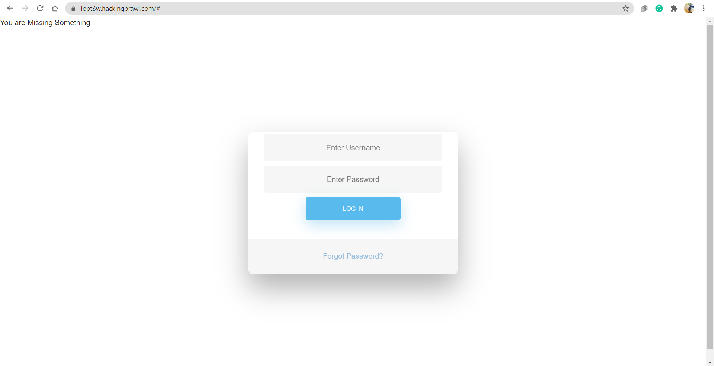
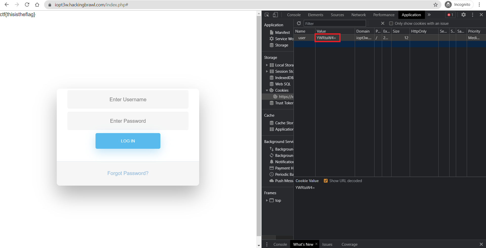

# Are You Web Expert?

**Date:** 03, July, 2021

**Author:** Dhilip Sanjay S

---

- The hacker is playing again with us but this time we need to be patient and logical. Are you ready? `https://iopt3w.hackingbrawl.com/`

### This part of web is often ignored but hackers love this most 
- **Answer:** ctf{thisistheflag}
- **Hint:** Looking for password? I'm weakest of 2019 and 2020
- **Steps to Reproduce:** 
    - The username and password - `admin:password`
    - Once you login, a cookie will be set `user=admin`
    - But still, the webpage says `You are missing something`
    - So, we need to add something to the cookie value:

- By base64 encoding `admin`, we get `YWRtaW4=`
- Change the cookie value and reload the page to get the flag

---