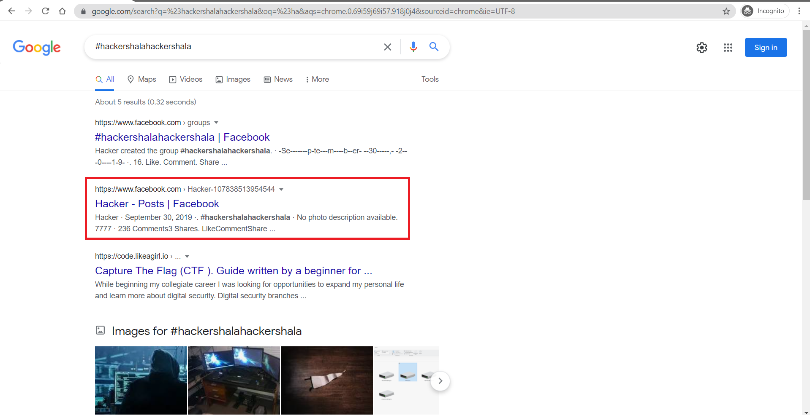
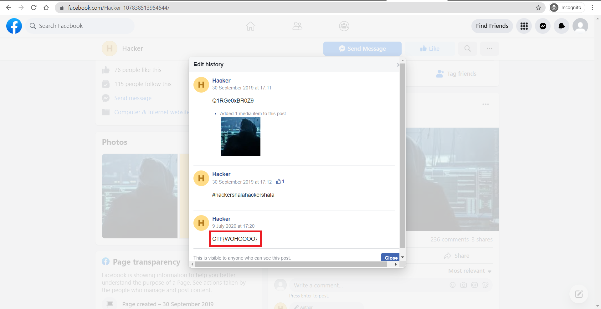

# Social Media Havoc

**Date:** 04, July, 2021

**Author:** Dhilip Sanjay S

---

- The heist has taken an interesting shape but reaching social media of the hacker is still unknown

### The way to reach hacker goes through `chall3.hackingbrawl.com`
- **Answer:** CTF{WOHOOOO}
- **Hint:** Twitter cannot do this

- **Steps to Reproduce:** 
    - Login using the credentials - `admin:admin`
    - You can get the following result:

    ```
    Our server has been taken over by a Hacker and we have appointed you as the cyber security expert to catch the Hacker. In our initial investigation we found that the Hacker is very fond of using hashtags and we got a clue about him. Follow #hackershalahackershala group to get to the Hacker. One interesting fact about this social media platform is that it can do what even twitter cannot.
    ```
    
    - Search for the hashtag `#hackershalahackershala` 
    

    
- Check the edit history of the facebook post (Twitter doesn't allow edit!)
- We can get the flag:




- On base64 decoding `Q1RGe0xBR0Z9` (the string in the top-most edit), we get `CTF{LAGF}`
- But this is just a rabbit hole! This isn't the original flag.


---