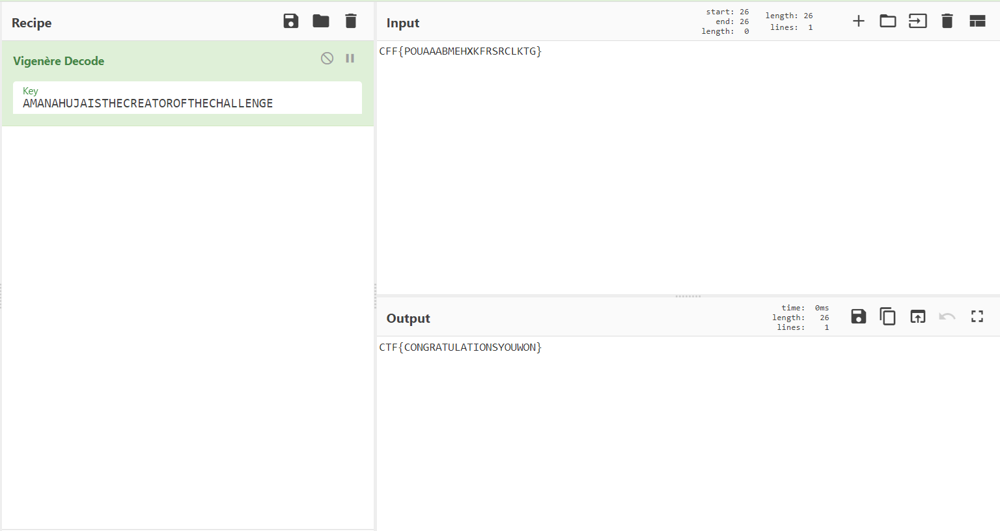

# The Last Step

**Date:** 03, July, 2021

**Author:** Dhilip Sanjay S

---

- This is the last step of the heist and some noobs will say it is difficult but mark my words its all about maths, numbers and a good programmer with a curious mindset

### CFF{POUAAABMEHXKFRSRCLKTG} 
- CFF{POUAAABMEHXKFRSRCLKTG} is the flag. Key to every locker is often not given but if you are still curious https://www.linkedin.com/in/amanjiofficial/ 
- **Hint:** If Aman Sir will ever get a chance, he will marry at Eiffel Tower.

- **Answer:** CTF{CONGRATULATIONSYOUWON}
- **Steps to Reproduce:**
    - It's using Vigenere Cipher
    - The key is `AMANAHUJAISTHECREATOROFTHECHALLENGE`
    - How did I find the key? Just enter the name of the creator `AMANAHUJA` and then you can easily figure out the rest of the key by using the [Vignere Square](https://en.wikipedia.org/wiki/Vigen%C3%A8re_cipher#/media/File:Vigen%C3%A8re_square_shading.svg).
    - Use cyberchef to get the flag:

---