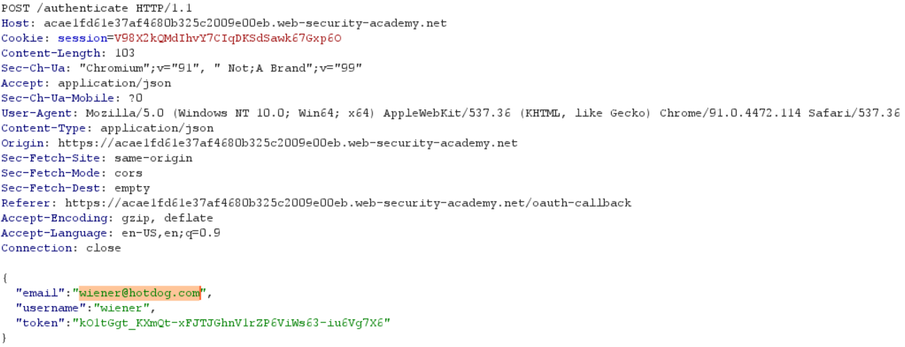

# Authenication bypass via OAuth implicit flow

**Date:** 27, July, 2021

**Author:** Dhilip Sanjay S

---

## Task

- This lab uses an OAuth service to allow users to log in with their social media account. Flawed validation by the client application makes it possible for an attacker to log in to other users' accounts without knowing their password.

- To solve the lab, log in to Carlos's account. His email address is `carlos@carlos-montoya.net`.

- You can log in with your own social media account using the following credentials: `wiener:peter`.

---

## Solution

- Modify the email address in the POST request to `/authenticate` endpoint:

- The application probably verifies the token, but doesn't verify that the token belongs to the corresponding **email**.
- If you go to `My account`, you can see that you are logged in as Carlos.

---