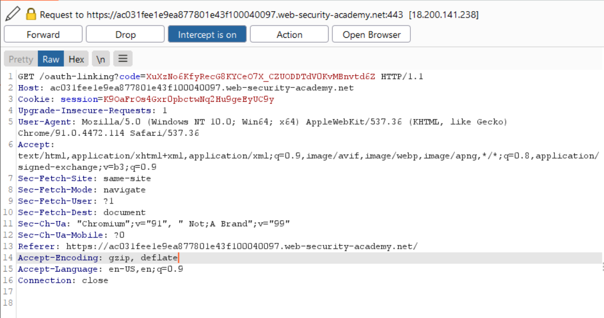
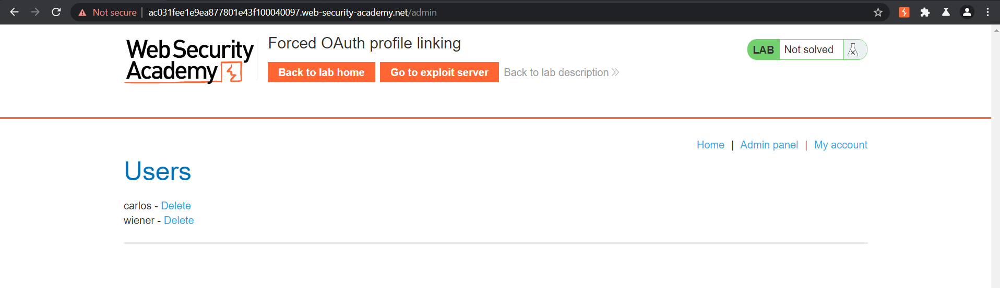

# Forced OAuth Profile linking

**Date:** 03, August, 2021

**Author:** Dhilip Sanjay S

---

## Task

- This lab gives you the option to attach a social media profile to your account so that you can log in via OAuth instead of using the normal username and password. 
- Due to the **insecure implementation of the OAuth flow** by the client application, an attacker can manipulate this functionality to obtain access to other users' accounts.

- To solve the lab, use a **CSRF attack** to attach your own social media profile to the **admin user's account** on the blog website, then *access the admin panel and delete Carlos*.

- The admin user will open anything you send from the exploit server and they always have an active session on the blog website.

- You can log in to your own accounts using the following credentials:

- Blog website account: `wiener:peter`
- Social media profile: `peter.wiener:hotdog`

## Solution
- Click on the `Add social media account` button.
- After the OAuth authenitication `/auth?...`, you can see a link `/oauth-linking?code=...` which links the user account with the social media profile:



- Copy the URL and drop the request.
- Note that there is no state parameter or any kind of CSRF token attached in this request.


- The code can be used only once. 
- So, make sure that you don't use the link before delivering to the victim.


### Exploit server
- The full OAuth flow must happen. 
- Hence you must use `iframe` or `window.location`.
    - **Note:** `fetch()` won't work!!
- The body of the HTML in exploit server:

```html
<script>
window.location = 'https://ac031fee1e9ea877801e43f100040097.web-security-academy.net/oauth-linking?code=...'
</script>
```

### Delete Carlos

- Now login to your account using the social media.
- In the mean time, the admin must have clicked the link and the wiener's social media account must have been linked with the admin.
- You can access the **Admin Panel**:



- Delete the `carlos` user to finish the lab!!

---

## Key Takeaway
- If the `code` or `key` value is usable only once, then make sure not to use it!