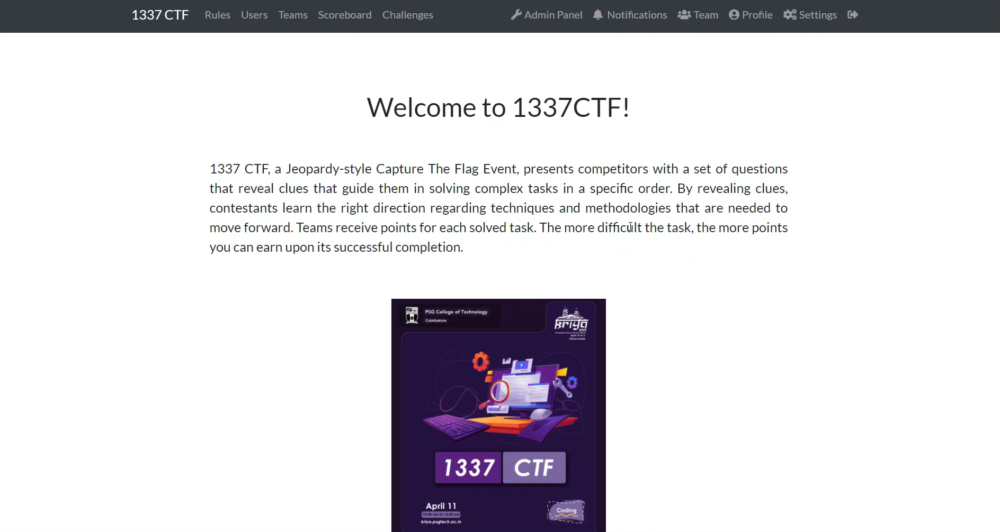

# CTF Writeups

Hi, I'm **Dhilip Sanjay**. Here you'll find my walkthrough of the various CTF challenges and boxes solved in the following platforms/CTFs:
- [Tryhackme](TryHackMe/README.md)
- [HackTheBox](HackTheBox/README.md)
- [HackTheBox Academy](HackTheBoxAcademy/README.md)
- [PortSwigger Academy](PortSwiggerAcademy/README.md)
- 2021 CTFs
  - [ZH3R0 CTF 2.0 2021](ZH3R0CTF2.0/README.md)
  - [NahamCon 2021](NahamCon2021/README.md)
- 2020 CTFs
  - [VulnCon 2020](VulnCon2020/README.md)

## Gitbook Link - [dhilipsanjay.gitbook.io/ctfs](https://dhilipsanjay.gitbook.io/ctfs)

## Social Links
- [Personal Website](https://dhilipsanjay.github.io/)
- [Twitter](https://twitter.com/DhilipSanjay)
- [Github](https://github.com/DhilipSanjay)

---

## CTFs Hosted
### 1337 CTF 
- Hosted for Kriya 2021, PSG Tech - (11/04/2021)
- Organized by a team of 4 people (Dhilip Sanjay, Indrajit, Swetha, Shivani)
- Almost 20+ teams, 60+ participants participated

