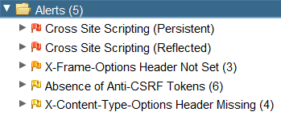

# Day 6 - Be careful with what you wish on a Christmas night

**Date:** 06, December, 2020

**Author:** Dhilip Sanjay S

---
## Fundamentals
- XSS
    - Stored XSS
    - Reflected XSS (commonly used for phishing)
    - DOM-based XSS

- Detecting XSS
    - [OWASP ZAP](https://owasp.org/www-project-zap/)

- Mitigating XSS
    - Input Sanitization on both client-side and server-side.
    - [OWASP Cheatsheet](https://github.com/OWASP/CheatSheetSeries)
---

## Solutions
### What vulnerability type was used to exploit the application?
 - **Answer:** stored cross-site scripting
 - By entering a wish, the payload is stored in the site.
---

### What query string can be abused to craft a reflected XSS?
- **Answer:** q
- By searching, you can see the query parameter `q` is vulnerable.
---

### Run a ZAP (zaproxy) automated scan on the target. How many alerts does it display?
- **Answer:** 5

---
### How many XSS alerts are in the scan?
- **Answer:** 2
    - Cross Site Scripting (Persistent/Stored)
    - Cross Site Scripting (Reflected)
---
[Back to Advent of Cyber 2](/TryHackMe/Advent%20of%20Cyber%202) 