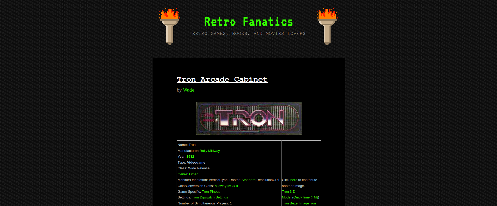

# Day 13 - Accumulate

**Date:** 03, June, 2021

**Author:** Dhilip Sanjay S

---

## Nmap Enumeration

```bash
$ nmap -Pn -sC -sV 10.10.13.75 -oN nmap.out
Host discovery disabled (-Pn). All addresses will be marked 'up' and scan times will be slower.
Starting Nmap 7.91 ( https://nmap.org ) at 2021-06-03 20:14 IST
Nmap scan report for 10.10.13.75
Host is up (0.16s latency).
Not shown: 998 filtered ports
PORT     STATE SERVICE       VERSION
80/tcp   open  http          Microsoft IIS httpd 10.0
| http-methods: 
|_  Potentially risky methods: TRACE
|_http-server-header: Microsoft-IIS/10.0
|_http-title: IIS Windows Server
3389/tcp open  ms-wbt-server Microsoft Terminal Services
| rdp-ntlm-info: 
|   Target_Name: RETROWEB
|   NetBIOS_Domain_Name: RETROWEB
|   NetBIOS_Computer_Name: RETROWEB
|   DNS_Domain_Name: RetroWeb
|   DNS_Computer_Name: RetroWeb
|   Product_Version: 10.0.14393
|_  System_Time: 2021-06-03T14:44:38+00:00
| ssl-cert: Subject: commonName=RetroWeb
| Not valid before: 2021-06-02T14:42:55
|_Not valid after:  2021-12-02T14:42:55
|_ssl-date: 2021-06-03T14:44:41+00:00; 0s from scanner time.
Service Info: OS: Windows; CPE: cpe:/o:microsoft:windows
```

## Gobuster Enumeration

```bash
gobuster dir -u http://10.10.16.245 -t 50 -w /usr/share/dirb/wordlists/big.txt | tee gobuster.out
===============================================================
Gobuster v3.1.0
by OJ Reeves (@TheColonial) & Christian Mehlmauer (@firefart)
===============================================================
[+] Url:                     http://10.10.16.245
[+] Method:                  GET
[+] Threads:                 50
[+] Wordlist:                /usr/share/dirb/wordlists/big.txt
[+] Negative Status codes:   404
[+] User Agent:              gobuster/3.1.0
[+] Timeout:                 10s
===============================================================
2021/06/03 00:18:30 Starting gobuster in directory enumeration mode
===============================================================
/retro                (Status: 301) [Size: 149] [--> http://10.10.16.245/retro/]
                                                                                
===============================================================
2021/06/03 00:19:33 Finished
===============================================================
```

### A web server is running on the target. What is the hidden directory which the website lives on?
- **Answer:** /retro


## Wpscan




```bash
 wpscan --url http://10.10.16.245/retro/ -t 20
_______________________________________________________________
         __          _______   _____
         \ \        / /  __ \ / ____|
          \ \  /\  / /| |__) | (___   ___  __ _ _ __ ®
           \ \/  \/ / |  ___/ \___ \ / __|/ _` | '_ \
            \  /\  /  | |     ____) | (__| (_| | | | |
             \/  \/   |_|    |_____/ \___|\__,_|_| |_|

         WordPress Security Scanner by the WPScan Team
                         Version 3.8.17
       Sponsored by Automattic - https://automattic.com/
       @_WPScan_, @ethicalhack3r, @erwan_lr, @firefart
_______________________________________________________________

[i] It seems like you have not updated the database for some time.
[?] Do you want to update now? [Y]es [N]o, default: [N]Y
[i] Updating the Database ...
[i] Update completed.

[+] URL: http://10.10.16.245/retro/ [10.10.16.245]
[+] Started: Thu Jun  3 00:27:31 2021

Interesting Finding(s):

[+] Headers
 | Interesting Entries:
 |  - Server: Microsoft-IIS/10.0
 |  - X-Powered-By: PHP/7.1.29
 | Found By: Headers (Passive Detection)
 | Confidence: 100%

[+] XML-RPC seems to be enabled: http://10.10.16.245/retro/xmlrpc.php
 | Found By: Direct Access (Aggressive Detection)
 | Confidence: 100%
 | References:
 |  - http://codex.wordpress.org/XML-RPC_Pingback_API
 |  - https://www.rapid7.com/db/modules/auxiliary/scanner/http/wordpress_ghost_scanner/
 |  - https://www.rapid7.com/db/modules/auxiliary/dos/http/wordpress_xmlrpc_dos/
 |  - https://www.rapid7.com/db/modules/auxiliary/scanner/http/wordpress_xmlrpc_login/
 |  - https://www.rapid7.com/db/modules/auxiliary/scanner/http/wordpress_pingback_access/

[+] WordPress readme found: http://10.10.16.245/retro/readme.html
 | Found By: Direct Access (Aggressive Detection)
 | Confidence: 100%

[+] The external WP-Cron seems to be enabled: http://10.10.16.245/retro/wp-cron.php
 | Found By: Direct Access (Aggressive Detection)
 | Confidence: 60%
 | References:
 |  - https://www.iplocation.net/defend-wordpress-from-ddos
 |  - https://github.com/wpscanteam/wpscan/issues/1299

[+] WordPress version 5.2.1 identified (Insecure, released on 2019-05-21).
 | Found By: Rss Generator (Passive Detection)
 |  - http://10.10.16.245/retro/index.php/feed/, <generator>https://wordpress.org/?v=5.2.1</generator>
 |  - http://10.10.16.245/retro/index.php/comments/feed/, <generator>https://wordpress.org/?v=5.2.1</generator>

[+] WordPress theme in use: 90s-retro
 | Location: http://10.10.16.245/retro/wp-content/themes/90s-retro/
 | Latest Version: 1.4.10 (up to date)
 | Last Updated: 2019-04-15T00:00:00.000Z
 | Readme: http://10.10.16.245/retro/wp-content/themes/90s-retro/readme.txt
 | Style URL: http://10.10.16.245/retro/wp-content/themes/90s-retro/style.css?ver=5.2.1
 | Style Name: 90s Retro
 | Style URI: https://organicthemes.com/retro-theme/
 | Description: Have you ever wished your WordPress blog looked like an old Geocities site from the 90s!? Probably n...
 | Author: Organic Themes
 | Author URI: https://organicthemes.com
 |
 | Found By: Css Style In Homepage (Passive Detection)
 |
 | Version: 1.4.10 (80% confidence)
 | Found By: Style (Passive Detection)
 |  - http://10.10.16.245/retro/wp-content/themes/90s-retro/style.css?ver=5.2.1, Match: 'Version: 1.4.10'

[+] Enumerating All Plugins (via Passive Methods)

[i] No plugins Found.

[+] Enumerating Config Backups (via Passive and Aggressive Methods)
 Checking Config Backups - Time: 00:00:01 <==================================================================> (137 / 137) 100.00% Time: 00:00:01

[i] No Config Backups Found.

[!] No WPScan API Token given, as a result vulnerability data has not been output.
[!] You can get a free API token with 25 daily requests by registering at https://wpscan.com/register

[+] Finished: Thu Jun  3 00:27:56 2021
[+] Requests Done: 180
[+] Cached Requests: 5
[+] Data Sent: 45.457 KB
[+] Data Received: 13.634 MB
[+] Memory used: 207.777 MB
[+] Elapsed time: 00:00:25
```

## Enumerating RSS feed

- Download the comment RSS Feed:

```html
<?xml version="1.0" encoding="UTF-8"?>
<rss version="2.0"
   xmlns:content="http://purl.org/rss/1.0/modules/content/"
   xmlns:dc="http://purl.org/dc/elements/1.1/"
   xmlns:atom="http://www.w3.org/2005/Atom"
   xmlns:sy="http://purl.org/rss/1.0/modules/syndication/"
   >
   <channel>
      <title>
         Comments for Retro Fanatics     
      </title>
      <atom:link href="/retro/index.php/comments/feed/" rel="self" type="application/rss+xml" />
      <link>
      http://localhost/retro</link>
      <description>Retro Games, Books, and Movies Lovers</description>
      <lastBuildDate>Mon, 09 Dec 2019 01:18:57 +0000</lastBuildDate>
      <sy:updatePeriod>
         hourly  
      </sy:updatePeriod>
      <sy:updateFrequency>
         1       
      </sy:updateFrequency>
      <generator>https://wordpress.org/?v=5.2.1</generator>
      <item>
         <title>
            Comment on Ready Player One by Wade                             
         </title>
         <link>
         /retro/index.php/2019/12/09/ready-player-one/#comment-2</link>
         <dc:creator>
            <![CDATA[Wade]]>
         </dc:creator>
         <pubDate>Mon, 09 Dec 2019 01:18:57 +0000</pubDate>
         <guid isPermaLink="false">/retro/?p=10#comment-2</guid>
         <description>
            <![CDATA[Leaving myself a note here just in case I forget how to spell it: parzival]]>
         </description>
         <content:encoded>
            <![CDATA[<p>Leaving myself a note here just in case I forget how to spell it: parzival</p>
               ]]>
         </content:encoded>
      </item>
   </channel>
</rss>
```

### WordPress Admin Panel
- Notice the line: `Leaving myself a note here just in case I forget how to spell it: parzival`
- This must be password of the user `Wade`.
- Login by visiting: `10.10.13.75/retro/wp-login.php`


## Gain initial access and read the contents of user.txt

- It turns out that the `Wade:parzival` is the credential for the **RDP**.
- Attacker can also create a malicious php page to get reverse shell
- So, connect using RDP: `xfreerdp /u:Wade /p:parzival /cert:ignore /v:10.10.13.75 /workarea`


---

##  Elevate privileges and read the content of root.txt

### CVE 2019-1388 (Retro Room)
- Found bookmark for `CVE 2019-1388` and also recycle bin had and executable `hhupd.exe`
- [CVE 2019-1388 Exploit](https://www.zerodayinitiative.com/blog/2019/11/19/thanksgiving-treat-easy-as-pie-windows-7-secure-desktop-escalation-of-privilege)


- By running the executable, we can see the follwoing:


- Now, in the browser - press `Ctrl + S` to open save dialog box.


- This instance is running as `SYSTEM` user.
- So, go to `C:\Windows\System32\*.*` and right click and open `cmd`


### CVE 2017-0213
- Check [Payload All the Things - Windows Priv Esc](https://github.com/swisskyrepo/PayloadsAllTheThings/blob/master/Methodology%20and%20Resources/Windows%20-%20Privilege%20Escalation.md)
- I downloaded the [CVE 2017-0213](https://github.com/SecWiki/windows-kernel-exploits/blob/master/CVE-2017-0213/CVE-2017-0213_x64.zip) exploit.
- Transfer the file to the victim machine.
- Run the exe to get `SYSTEM` access:


---

## References

- [CVE 2019-1388](https://nvd.nist.gov/vuln/detail/CVE-2019-1388)