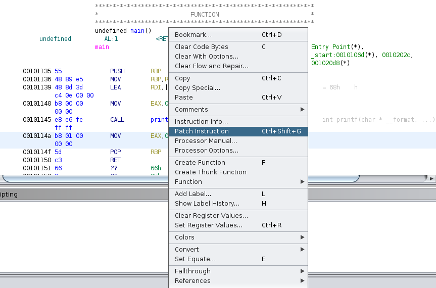

# CC: Ghidra

**Date:** 30, May, 2021

**Author:** Dhilip Sanjay S

---

## Introduction

- GHIDRA is a tool created by the NSA that allows the user to analyze binaries. It is well known for it's incredible de compiler which converts the assembly in the binary to C.
- [Ghidra Installation](https://ghidra-sre.org/)
- To install jdk and jre: `sudo apt install openjdk-13-jre openjdk-13-jdk`

---

## Create a New Project

- Use `File->New Project->Non-Shared-Project`
- Specify the destination folder.

---

## Analyze a binary

- Import a file: `File->Import File`
- Ghidra will automatically detect what type on binary the file.
- From there double click the binary, and you will be prompted to analyze the binary, click `Analyze->Yes`
- **Symbol Tree** - It allows you to view all of the files that were imported to create the binary, and view all user created functions.
- You are able to see both the `disassembly`, and the `decompilation`, on the same screen!


For general binary analysis, you won't be interested in functions that start with "_" as those are functions created during compilation.


---

## It's your turn!

### How many user created functions(including main) are there?
- **Answer:** 2
- **Steps to Reproduce:** 
    - Check the symbol table, the following two are the user defined functions:
        - main
        - fn1

### What is the first variable set to in the main function?
- **Answer:** 10
- **Steps to Reproduce:** 
    - `local_c` is the **iVar1**
    - Value `0xa` is being moved to the location pointed by `local_c`
    - Hex `a` -> Decimal `10`

```
 0010116f   c7 45 fc        MOV        dword ptr [RBP + local_c],0xa
            0a 00 00 00
```

### What is the first variable set to, in the function "fn1"?
- **Answer:** hello
- **Steps to Reproduce:** 
    - Inside the **fn1**:

```
00101160 48 89 45 f8     MOV        qword ptr [RBP + local_10],RAX=>s_hello_00102004   = "hello"
```

### If you provide the input "1", when you run the binary, what would the output be.(Note you can just run the binary to find this out, but that would defeat the whole purpose!).
- **Answer:** nice!
- **Steps to Reproduce:** 
    - When you press 1 and press Enter -> "1\n" will be the input
    - strcmp will compare the two strings and return 0 if true.
    - If true, then "nice!" will be printed

```cpp
undefined8 main(void)

{
  int iVar1;
  char *local_18;
  
  fgets(local_18,5,stdin);
  iVar1 = strcmp(local_18,"1\n");
  if (iVar1 == 0) {
    printf("nice!");
  }
  return 0;
}
```

---

## Miscellaneous Operations

### Section 1: Patching Binaries
- Occasionally there will be times when you want to patch(The art of changing assembly instructions) a binary. Ghidra offers support for this. 
- Right click the asm instruction, MOV EAX,0x0 and click "Patch Instruction". 
- From there you can change it to whatever you want, in this case let's change "MOV EAX,0x0" to MOV EAX,0x1"



- Modified code:

```cpp
undefined8 main(void)
{
  printf("hi!");
  return 1;
}
```

### Section 2: Searching
- Ghidra supports going to different portions of memory, when given a memory address. 
- Click `Navigation(At the top bar)->Go To` and input a `memory address`.

---

## Final Exam

### What outputs the good job message?    
- **Answer:** goodjob
- **Steps to Reproduce:** Analyze the main function

```cpp
undefined8 main(void)
{
  int iVar1;
  long in_FS_OFFSET;
  char local_1a [10];
  long local_10;
  
  local_10 = *(long *)(in_FS_OFFSET + 0x28);
  fgets(local_1a,10,stdin);
  iVar1 = strcmp(local_1a,"goodjob\n");
  if (iVar1 == 0) {
    printf("good job!!!");
  }
  if (local_10 != *(long *)(in_FS_OFFSET + 0x28)) {
                    /* WARNING: Subroutine does not return */
    __stack_chk_fail();
  }
  return 0;
}
```

---

## References

- [Ghidra Slides](https://ghidra.re/courses/GhidraClass/Beginner/Introduction_to_Ghidra_Student_Guide_withNotes.html#Introduction_to_Ghidra_Student_Guide.html)
- [Ghidra Cheatsheet](https://ghidra-sre.org/CheatSheet.html)