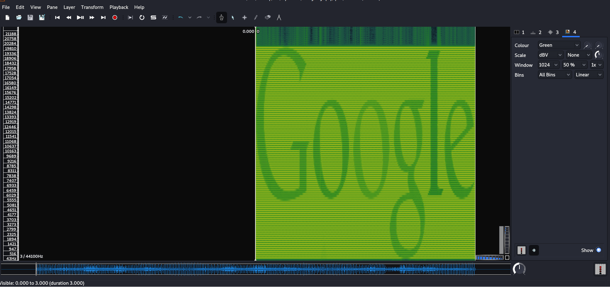
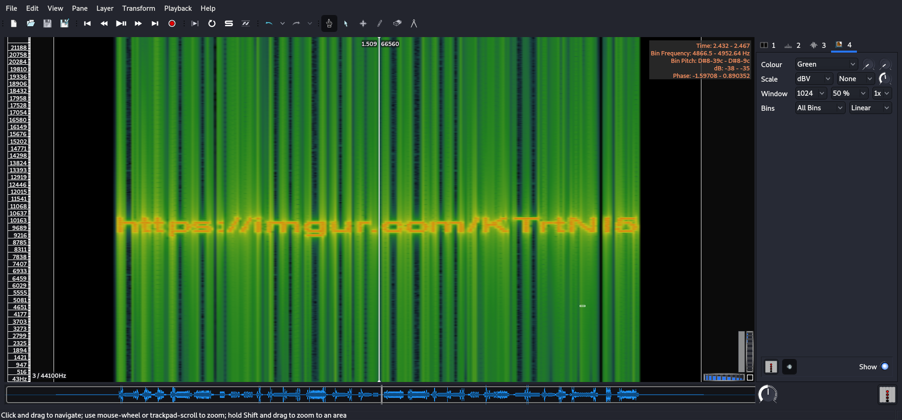

# CC: Steganography

**Date:** 19, May, 2021

**Author:** Dhilip Sanjay S

---

[Click Here](https://tryhackme.com/room/ccstego) to go to the TryHackMe room.

## Introduction

- **Steganography(Stego)** is the art of concealing something inside something else, for example: A message inside a jpg file, or a binary inside a png.
- All needed files can be found inside the included zip file

---

## StegHide

- **Steghide** is one of the most famous steganography tools.
- It is used for **hiding a message inside an image**.
- Works only for **jpg** image:
    - A downside of steghide is that it only works on jpgs; however, that means that if you believe there is a hidden message inside a jpg, then steghide is a probable option.
- Benefits of stegohide:
    - It can encrypt data with a passphrase.


### What argument allows you to embed data(such as files) into other files?
- **Answer:** embed

### What flag let's you set the file to embed?
- **Answer:** -ef

### What flag allows you to set the "cover file"?(i.e  the jpg)
- **Answer:** -cf

### How do you set the password to use for the cover file?
- **Answer:** -p

### What argument allows you to extract data from files?
- **Answer:** extract

### How do you select the file that you want to extract data from?
- **Answer:** -sf

### Given the passphrase "password123", what is the hidden message in the included "jpeg1" file.
- **Answer:** pinguftw
- **Steps to Reproduce:** 

```bash
$ steghide extract -sf jpeg1.jpeg 
Enter passphrase: 
wrote extracted data to "a.txt".

$ cat a.txt 
pinguftw
```

---

## zsteg

- **zsteg** is to png's what steghide is to jpg's. It supports various techniques to extract any and all data from **png files**.
- zsteg also supports **BMP files**, but it is primarily used for png's.

### How do you specify that the least significant bit comes first
- **Answer:** --lsb

### What about the most significant bit?
- **Answer:** --msb

### How do you specify verbose mode?
- **Answer:** -v

### How do you extract the data from a specific payload?
- **Answer:** -E

### In the included file "png1" what is the hidden message?
- **Answer:** nootnoot

### What about the payload used to encrypt it.
- **Answer:** b1,bgr,lsb,xy

```bash
$ zsteg png1.png -v
imagedata           .. file: DOS 2.0 backup id file, sequence 48
    00000000: 01 30 90 de 24 12 04 00  00 00 00 00 00 00 00 01  |.0..$...........|
    00000010: 01 00 ff 00 00 01 ff 01  00 01 00 ff 00 00 00 ff  |................|
    00000020: 00 01 00 00 00 01 00 00  00 ff 00 ff 01 00 00 ff  |................|
    00000030: 00 01 01 ff 00 00 00 ff  ff 01 00 01 00 01 00 00  |................|
    00000040: 00 ff 00 00 00 00 00 01  00 00 00 ff 00 ff 01 ff  |................|
    00000050: 00 ff 00 01 00 00 00 00  00 00 00 00 00 00 00 00  |................|
    00000060: 00 00 00 00 00 00 00 00  00 00 00 00 00 00 00 00  |................|
    *
    00000100: 
b1,bgr,lsb,xy       .. text: "nootnoot$"
    00000000: 00 08 6e 6f 6f 74 6e 6f  6f 74 24 92 49 24 92 49  |..nootnoot$.I$.I|
    00000010: 24 92 49 24 92 49 24 92  49 24 92 49 24 92 49 24  |$.I$.I$.I$.I$.I$|
    00000020: 92 49 24 92 49 24 92 49  24 92 49 24 92 49 24 92  |.I$.I$.I$.I$.I$.|
    00000030: 49 24 92 49 24 92 49 24  92 49 24 92 49 24 92 49  |I$.I$.I$.I$.I$.I|
    00000040: 24 92 49 24 92 49 24 92  49 24 92 49 24 92 49 24  |$.I$.I$.I$.I$.I$|
    00000050: 92 49 24 92 49 24 92 49  24 92 49 24 92 49 24 92  |.I$.I$.I$.I$.I$.|
    00000060: 49 24 92 49 24 92 49 24  92 49 24 92 49 24 92 49  |I$.I$.I$.I$.I$.I|
    00000070: 24 92 49 24 92 49 24 92  49 24 92 49 24 92 49 24  |$.I$.I$.I$.I$.I$|
    00000080: 92 49 24 92 49 24 92 49  24 92 49 24 92 49 24 92  |.I$.I$.I$.I$.I$.|
    00000090: 49 24 92 49 24 92 49 24  92 49 24 92 49 24 92 49  |I$.I$.I$.I$.I$.I|
    000000a0: 24 92 49 24 92 49 24 92  49 24 92 49 24 92 49 24  |$.I$.I$.I$.I$.I$|
    000000b0: 92 49 24 92 49 24 92 49  24 92 49 24 92 49 24 92  |.I$.I$.I$.I$.I$.|
    000000c0: 49 24 92 49 24 92 49 24  92 49 24 92 49 24 92 49  |I$.I$.I$.I$.I$.I|
    000000d0: 24 92 49 24 92 49 24 92  49 24 92 49 24 92 49 24  |$.I$.I$.I$.I$.I$|
    000000e0: 92 49 24 92 49 24 92 49  24 92 49 24 92 49 24 92  |.I$.I$.I$.I$.I$.|
    000000f0: 49 24 92 49 24 92 49 24  92 49 24 92 49 24 92 49  |I$.I$.I$.I$.I$.I|
.
.
.
```

---

## Exiftool

- Exiftool is a tool that allows you to view and edit image metadata. 

### In the included jpeg3 file, what is the document name
- **Answer:** Hello :)
- **Steps to Reproduce:** 

```bash
$ exiftool jpeg3.jpeg

ExifTool Version Number         : 12.16
File Name                       : jpeg3.jpeg
Directory                       : .
File Size                       : 8.3 KiB
File Modification Date/Time     : 2020:01:07 02:39:44+05:30
File Access Date/Time           : 2020:01:07 02:39:46+05:30
File Inode Change Date/Time     : 2021:05:19 00:50:34+05:30
File Permissions                : rw-r--r--
File Type                       : JPEG
File Type Extension             : jpg
MIME Type                       : image/jpeg
JFIF Version                    : 1.01
Exif Byte Order                 : Big-endian (Motorola, MM)
Document Name                   : Hello :)
X Resolution                    : 1
Y Resolution                    : 1
Resolution Unit                 : None
Y Cb Cr Positioning             : Centered
Image Width                     : 213
Image Height                    : 160
Encoding Process                : Baseline DCT, Huffman coding
Bits Per Sample                 : 8
Color Components                : 3
Y Cb Cr Sub Sampling            : YCbCr4:2:0 (2 2)
Image Size                      : 213x160
Megapixels                      : 0.034
```

---

## Stegoveritas

- **Stegoveritas** supports just about every image file, and is able to extract all types of data from it. 
- It is an incredibly useful tool if you don't know exactly what you're looking for, as it has a myriad of built in tests to extract any and all data.
- Stegoveritas has other features as well such as **color correcting images**.

### How do you check the file for metadata?
- **Answer:** -meta

### How do you check for steghide hidden information
- **Answer:** -steghide

### What flag allows you to extract LSB data from the image?
- **Answer:** -extractLSB

### In the included image jpeg2 what is the hidden message?
- **Answer:** kekekekek
- **Steps to Reproduce:** 

```bash
$ stegoveritas -steghide jpeg2.jpeg 

Running Module: SVImage
+------------------+------+
|   Image Format   | Mode |
+------------------+------+
| JPEG (ISO 10918) | RGB  |
+------------------+------+
Found something with StegHide: $(pwd)/results/steghide_d8cdce3ca233a852bffff1ccd1c03488.bin
Running Module: MultiHandler

$ ls
a.txt  jpeg1.jpeg  jpeg2.jpeg  jpeg3.jpeg  png1.png  results  wav1.wav  wav2.wav

$ cat results/steghide_d8cdce3ca233a852bffff1ccd1c03488.bin 
kekekekek
```

---

## Spectrograms

- **Spectrogram stegonography** is the art of hiding hidden an image inside in an audio file's spectogram. 
- Therefore when ever dealing with audio stego it is always worth analyzing the spectrogram of the audio.

### What is the hidden text in the included wav2 file?
- **Answer:** Google
- **Steps to Reproduce:** 



---

## Final Exam

### What is key 1?
- **Answer:** superkeykey
- **Steps to Reproduce:**
    - Since, it's a jpg image, the key must be hidden using **steghide**.
    - But we need a passphrase to extract the data.
    - So, let's try **exiftool** first to checkout some of the metadata.

    ```bash
    $ exiftool exam1.jpeg 
    ExifTool Version Number         : 12.16
    File Name                       : exam1.jpeg
    Directory                       : .
    File Size                       : 8.6 KiB
    File Modification Date/Time     : 2020:01:07 06:43:27+05:30
    File Access Date/Time           : 2021:05:19 12:16:10+05:30
    File Inode Change Date/Time     : 2021:05:19 12:15:53+05:30
    File Permissions                : rw-r--r--
    File Type                       : JPEG
    File Type Extension             : jpg
    MIME Type                       : image/jpeg
    JFIF Version                    : 1.01
    Exif Byte Order                 : Big-endian (Motorola, MM)
    Document Name                   : password=admin
    X Resolution                    : 1
    Y Resolution                    : 1
    Resolution Unit                 : None
    Y Cb Cr Positioning             : Centered
    Image Width                     : 213
    Image Height                    : 160
    Encoding Process                : Baseline DCT, Huffman coding
    Bits Per Sample                 : 8
    Color Components                : 3
    Y Cb Cr Sub Sampling            : YCbCr4:2:0 (2 2)
    Image Size                      : 213x160
    Megapixels                      : 0.034
    ```

    - The metadata contains `password=admin`.
    - Now we can run **steghide** to extract the data!

    ```bash
    $ steghide extract -sf exam1.jpeg
    Enter passphrase: 
    wrote extracted data to "a.txt".
    
    $ cat a.txt 
    the key is: superkeykey
    ```

### What is key 2?
- **Answer:** 
- **Steps to Reproduce:** 
    - We can see the link in the image after spectrogram analysis: `https://imgur.com/KTrtNI5`
    - We'll download the image file using `wget https://i.imgur.com/KTrtNI5.png` . 
    - It is a png file, hence we can use either **zsteg** and **stegoveritas** to find the hidden information.



```bash
$ wget https://i.imgur.com/KTrtNI5.png
--2021-05-19 12:52:01--  https://i.imgur.com/KTrtNI5.png
Resolving i.imgur.com (i.imgur.com)... 151.101.36.193
Connecting to i.imgur.com (i.imgur.com)|151.101.36.193|:443... connected.
HTTP request sent, awaiting response... 200 OK
Length: 14915 (15K) [image/png]
Saving to: ‘KTrtNI5.png’

KTrtNI5.png                 100%[===========================================>]  14.57K  17.7KB/s    in 0.8s    

2021-05-19 12:52:02 (17.7 KB/s) - ‘KTrtNI5.png’ saved [14915/14915]

$ stegoveritas KTrtNI5.png 
Running Module: SVImage
+---------------------------+------+
|        Image Format       | Mode |
+---------------------------+------+
| Portable network graphics | RGB  |
+---------------------------+------+

Running Module: MultiHandler

Exif
====
+---------------------+---------------------------------------------------------+
| key                 | value                                                   |
+---------------------+---------------------------------------------------------+
| SourceFile          | REDACTED/KTrtNI5.png                                    |
| ExifToolVersion     | 12.16                                                   |
| FileName            | KTrtNI5.png                                             |
| Directory           | REDACTED/ccsteganography                                |
| FileSize            | 15 KiB                                                  |
| FileModifyDate      | 2020:01:07 03:20:48+05:30                               |
| FileAccessDate      | 2021:05:19 12:52:56+05:30                               |
| FileInodeChangeDate | 2021:05:19 12:52:02+05:30                               |
| FilePermissions     | rw-r--r--                                               |
| FileType            | PNG                                                     |
| FileTypeExtension   | png                                                     |
| MIMEType            | image/png                                               |
| ImageWidth          | 205                                                     |
| ImageHeight         | 246                                                     |
| BitDepth            | 8                                                       |
| ColorType           | RGB                                                     |
| Compression         | Deflate/Inflate                                         |
| Filter              | Adaptive                                                |
| Interlace           | Noninterlaced                                           |
| ImageSize           | 205x246                                                 |
| Megapixels          | 0.05                                                    |
+---------------------+---------------------------------------------------------+
Found something worth keeping!
PNG image data, 205 x 246, 8-bit/color RGB, non-interlaced

$ zsteg KTrtNI5.png 
imagedata           .. text: ")))xxxLMO"
b1,bgr,lsb,xy       .. text: "\rKey: fatality"
b2,rgb,lsb,xy       .. file: SoftQuad DESC or font file binary
b2,rgb,msb,xy       .. file: VISX image file
b2,bgr,lsb,xy       .. file: SoftQuad DESC or font file binary
b2,bgr,msb,xy       .. file: VISX image file\
```

### What is key 3?
- **Answer:** killshot
- **Steps to Reproduce:** 
    - It seems like the qrcode cannot be scanned from this image.
    - Initially I tried to scan it using `zbarimg`, which gave the following error:
    
    ```bash
    $ zbarimg qrcode.png 
    scanned 0 barcode symbols from 1 images in 0.02 seconds

    WARNING: barcode data was not detected in some image(s)
    Things to check:
    - is the barcode type supported? Currently supported symbologies are:
        . EAN/UPC (EAN-13, EAN-8, EAN-2, EAN-5, UPC-A, UPC-E, ISBN-10, ISBN-13)
        . DataBar, DataBar Expanded
        . Code 128
        . Code 93
        . Code 39
        . Codabar
        . Interleaved 2 of 5
        . QR code
        . SQ code
    - is the barcode large enough in the image?
    - is the barcode mostly in focus?
    - is there sufficient contrast/illumination?
    - If the symbol is split in several barcodes, are they combined in one image?
    - Did you enable the barcode type?
        some EAN/UPC codes are disabled by default. To enable all, use:
        $ zbarimg -S*.enable <files>
        Please also notice that some variants take precedence over others.
        Due to that, if you want, for example, ISBN-10, you should do:
        $ zbarimg -Sisbn10.enable <files>
    ```

    - Remember that **stegoveritas** has color-correction features too?
    - So, we'll run stegoveritas for this final challenge:

    ```bash
    $ stegoveritas qrcode.png 
    ERROR:StegoVeritas:Missing the following required packages: foremost
    ERROR:StegoVeritas:Either install them manually or run 'stegoveritas_install_deps'.
    Running Module: SVImage
    +---------------------------+------+
    |        Image Format       | Mode |
    +---------------------------+------+
    | Portable network graphics | RGB  |
    +---------------------------+------+
    Found something worth keeping!
    International EBCDIC text, with very long lines, with no line terminators
    Found something worth keeping!
    Non-ISO extended-ASCII text, with very long lines, with no line terminators
    Found something worth keeping!
    ISO-8859 text, with very long lines, with no line terminators
    Found something worth keeping!
    Non-ISO extended-ASCII text, with very long lines, with no line terminators
    Found something worth keeping!
    ISO-8859 text, with very long lines, with no line terminators
    Running Module: MultiHandler

    Exif
    ====
    +---------------------+--------------------------------------------------------------+
    | key                 | value                                                        |
    +---------------------+--------------------------------------------------------------+
    | SourceFile          | REDACTED/qrcode.png                                          |
    | ExifToolVersion     | 12.16                                                        |
    | FileName            | qrcode.png                                                   |
    | Directory           | REDACTED/final                                               |
    | FileSize            | 2.3 KiB                                                      |
    | FileModifyDate      | 2020:01:07 06:32:58+05:30                                    |
    | FileAccessDate      | 2021:05:19 12:58:31+05:30                                    |
    | FileInodeChangeDate | 2021:05:19 12:58:22+05:30                                    |
    | FilePermissions     | rw-r--r--                                                    |
    | FileType            | PNG                                                          |
    | FileTypeExtension   | png                                                          |
    | MIMEType            | image/png                                                    |
    | ImageWidth          | 464                                                          |
    | ImageHeight         | 464                                                          |
    | BitDepth            | 8                                                            |
    | ColorType           | RGB                                                          |
    | Compression         | Deflate/Inflate                                              |
    | Filter              | Adaptive                                                     |
    | Interlace           | Noninterlaced                                                |
    | BackgroundColor     | 255 255 255                                                  |
    | ImageSize           | 464x464                                                      |
    | Megapixels          | 0.215                                                        |
    +---------------------+--------------------------------------------------------------+
    Found something worth keeping!
    PNG image data, 464 x 464, 8-bit/color RGB, non-interlaced
    +--------+------------------+-------------------------------------------+-----------+
    | Offset | Carved/Extracted | Description                               | File Name |
    +--------+------------------+-------------------------------------------+-----------+
    | 0x3b   | Carved           | Zlib compressed data, default compression | 3B.zlib   |
    | 0x3b   | Extracted        | Zlib compressed data, default compression | 3B        |
    +--------+------------------+-------------------------------------------+-----------+
    ```

    - It color corrected and gave out almost 50 images.
    - Only 5 out of 50 images were scannable using zbarimg.
    - We'll check the one with **inverted**:

    ```bash
    $ cd results/
    $ ls
    exif                                   qrcode.png_enhance_sharpness_-50.png  qrcode.png_Max.png
    keepers                                qrcode.png_enhance_sharpness_50.png   qrcode.png_Median.png
    qrcode.png_autocontrast.png            qrcode.png_enhance_sharpness_-75.png  qrcode.png_Min.png
    qrcode.png_Blue_0.png                  qrcode.png_enhance_sharpness_75.png   qrcode.png_Mode.png
    qrcode.png_Blue_1.png                  qrcode.png_equalize.png               qrcode.png_Red_0.png
    qrcode.png_Blue_2.png                  qrcode.png_Find_Edges.png             qrcode.png_Red_1.png
    qrcode.png_Blue_3.png                  qrcode.png_GaussianBlur.png           qrcode.png_Red_2.png
    qrcode.png_Blue_4.png                  qrcode.png_grayscale.png              qrcode.png_Red_3.png
    qrcode.png_Blue_5.png                  qrcode.png_Green_0.png                qrcode.png_Red_4.png
    qrcode.png_Blue_6.png                  qrcode.png_Green_1.png                qrcode.png_Red_5.png
    qrcode.png_Blue_7.png                  qrcode.png_Green_2.png                qrcode.png_Red_6.png
    qrcode.png_blue_plane.png              qrcode.png_Green_3.png                qrcode.png_Red_7.png
    qrcode.png_Edge-enhance_More.png       qrcode.png_Green_4.png                qrcode.png_red_plane.png
    qrcode.png_Edge-enhance.png            qrcode.png_Green_5.png                qrcode.png_Sharpen.png
    qrcode.png_enhance_sharpness_-100.png  qrcode.png_Green_6.png                qrcode.png_Smooth.png
    qrcode.png_enhance_sharpness_100.png   qrcode.png_Green_7.png                qrcode.png_solarized.png
    qrcode.png_enhance_sharpness_-25.png   qrcode.png_green_plane.png
    qrcode.png_enhance_sharpness_25.png    qrcode.png_inverted.png

    $ zbarimg qrcode.png_inverted.png 
    QR-Code:http://key=killshot
    scanned 1 barcode symbols from 1 images in 0.02 seconds
    ```

---

## References
- [Sonic visualizer](https://www.sonicvisualiser.org/download.html)