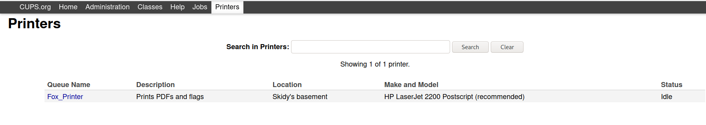
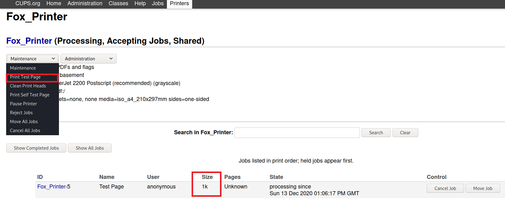

# Printer Hacking 101

**Date:** 13, December, 2020

**Author:** Dhilip Sanjay S

---

## Learning Objectives
- CUPS Server (Common UNIX Printing System)
- IPP (Internet Printing Protocol)
- [PRET - Printer Exploitation](https://github.com/RUB-NDS/PRET)
- [Printer Security Testing Cheat Sheet](http://hacking-printers.net/wiki/index.php/Printer_Security_Testing_Cheat_Sheet)

### Targeting and Exploiting
- Locating Printers
    - `python pret.py`
    - `nmap -p 631 <IP_RANGE>`
- Exploiting
    - Three options in PRET:
        - PS (PostScript)
        - PJL (Printer Job Language)
        - PCL (Printer Command Language)
    - Try out all the three languages, to check if the language will be understood by the printer
        ```bash
        python pret.py laserjet.lan ps
        python pret.py {IP} pjl
        python pret.py /dev/usb/lp0 pcl    
        ```
    - Once you get a shell-like output, type `help` to see the different commands available.
    

## Solutions
### What port does IPP run on?
- **Answer:** 631
- **Impact** 
    - An open IPP port can expose a lot of sensitive information such as *printer name, location, model, firmware version, or even printer wifi SSID.*

---

### How would a simple printer TCP DoS attack look as a one-line command?
- **Answer:** `while true; do nc printer 9100; done`
- **Explanation:** 
    - Replace `printer` with `<PRINTER_IP>`
    - Since it is an infinite loop, the printer will remain busy.

---

### Review the cheat sheet provided in the task reading above. What attack are printers often vulnerable to which involves sending more and more information until a pre-allocated buffer size is surpassed?
- **Answer:** Buffer Overflow

---

### Brute forcing SSH password
- [Null Byte Article](https://null-byte.wonderhowto.com/how-to/gain-ssh-access-servers-by-brute-forcing-credentials-0194263/)
- Use any of the following
    1. Metasploit
    2. Hydra
    3. Nmap

- Using nmap:
    - `nmap <MACHINE_IP> -p 22 --script ssh-brute --script-arg userdb=user.txt`
    - Since we know the username, `user.txt` must contain only `printer`

---

### Connect to the printer per the instructions above. Where's the Fox_Printer located?
- **Answer:** Skidy's basement
- **Steps to Reproduce:** Visit `http://<MACHINE_IP>:631/printers/`

 

---

### What is the size of a test sheet?
- **Answer:** 1k
- **Steps to Reproduce:**
    - Visit `http://<MACHINE_IP>:631/printers/Fox_Printer`
    - Select `Print Test Page` option from the Drop-down box.
    - The jobs will be listed at the bottom of the page.
    - Check the `size` column in that table.

     

---