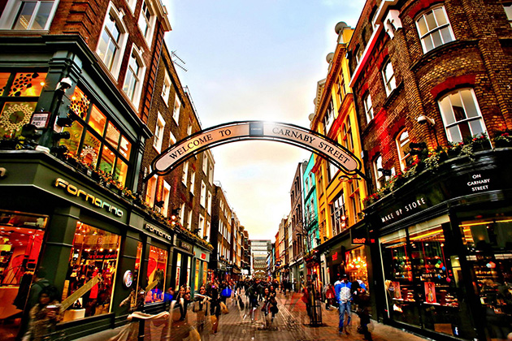
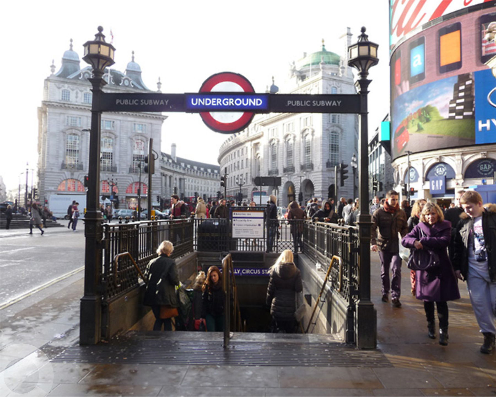
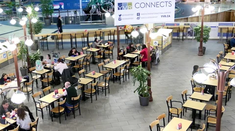
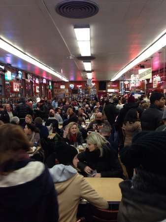
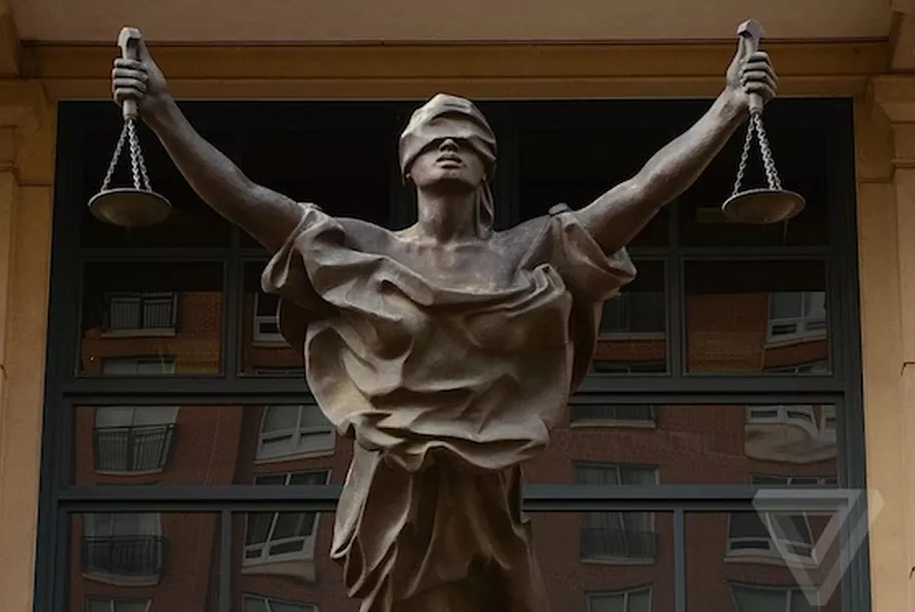

# Searchlight - IMINT

**Date:** 02, March, 2021

**Author:** Dhilip Sanjay S

---

[Click Here](https://tryhackme.com/room/searchlightosint) to go to the TryHackMe room.

## Fundamentals
- IMINT - Imagery Intelligence
- GEOINT - Geospatial Intelligence

## Welcome
### Did you understand the flag format?
- **Answer:** sl{ready}

---

## Your First Challenge
- Before using any tool or methodolody for finding the location of the image, scan the image with your eyes.
    - Extracting the key data points will help you to apply the right tool:
        - Google Search
        - EXIF tool
- Five elements of IMINT
    - Context
    - Foreground
    - Background
    - Map markings
    - Trial and error
- Look for signs such as:
    - Location (Street name, Storefront signs)
    - Determine the country or region (based on which side of road they drive, language or architectural characteristics)
    - Unique landmarks, building, bridges, statues or mountains.

### What is the name of the street where this image was taken?
- **Answer:** sl{carnaby street}

---

## Just Google it!
- Use google dorking or reverse image search

### Which city is the tube station located in?
- **Answer:** sl{London}

### Which tube station do these stairs lead to?
- **Answer:** sl{Piccadilly Circus}

### Which year did this station open?
- **Answer:** sl{1906}

### How many platforms are there in this station?
- **Answer:** sl{4}

---

## Keep at it!

### Which building is this photo taken in?
- **Answer:** sl{VANCOUVER INTERNATIONAL AIRPORT}
- **Clue:** `yvr.ca`

### Which country is this building located in?
- **Answer:** sl{Canada}

### Which city is this building located in?
- **Answer:** sl{Richmond}

---

## Coffee and a light lunch

### Which city is this coffee shop located in?
- **Answer:** sl{Blairgowrie}
- **Clue:** https://www.dailyrecord.co.uk/in-your-area/jobs-fear-perthshires-edinburgh-woollen-22870964

### Which street is this coffee shop located in?
- **Answer:** sl{allan street}
- **Steps to Reproduce:** Google Maps

### What is their phone number?
- **Answer:** sl{+447878 839128}

### What is their email address?
- **Answer:** sl{theweecoffeeshop@aol.com}

### What is the surname of the owners?
- **Answer:** sl{Cochrane}
- **Clue:** https://www.barba.org.uk/blairgowrie-and-rattray-businesses/the-wee-coffee-shop

---

## Reverse your thinking
- Reverse image search
- RevEye Reverse Image Search Extension

### Which restaurant was this picture taken at?
- **Answer:** sl{katz's deli}

### What is the name of the Bon Appétit editor that worked 24 hours at this restaurant?
- **Answer:** sl{andrew knowlton}

---
## Locate this sculpture

### What is the name of this statue?
- **Answer:** sl{Rudolph the Chrome Nosed Reindeer}
- **Clue:** Norwegian - Og når det er vind og sno Blir han så kald på nesen, Så den lyser som en glo

### Who took this image?
- **Answer:** sl{Kjersti Stensrud}
- **Clue:** visitoslo -> outdoor sculpture

---

## Justice for all
- Visual Intelligence

### What is the name of the character that the statue depicts?
- **Answer:** sl{Lady Justice}

### where is this statue located?
- **Answer:** sl{Alexandria, Virginia}
- **Clue:** 
    - Use bing reverse image search. Don't rely only on Google reverse image search! Also check out Yandex.
    - It's located in a district court. 

### What is the name of the building opposite from this statue?
- **Answer:** sl{The Westin Alexandria Old Town}
- **Clue:** Use google maps

---
##  The view from my hotel room
- [Using FFmpeg to grab stills and audio for OSINT](https://nixintel.info/osint-tools/using-ffmpeg-to-grab-stills-and-audio-for-osint/)
- [FFmpeg](https://ffmpeg.org/)

### What is the name of the hotel that my friend is staying in?
- **Answer:** sl{NOVOTEL SINGAPORE CLARKE QUAY}


Use google maps and look for `Clarke Quay Central`
 

---

## Reference Links
- [Guide To Using Reverse Image Search For Investigations](https://www.bellingcat.com/resources/how-tos/2019/12/26/guide-to-using-reverse-image-search-for-investigations/)
- [Tips and Tricks on Reverse Image Searches](https://osintcurio.us/2020/04/12/tips-and-tricks-on-reverse-image-searches/)
- [RevEye Reverse Image Search Extension](https://chrome.google.com/webstore/search/RevEye%20Reverse%20Image%20Search?hl=no)
- [A lesson on looking (Visual Intelligence)- Amy Herman](https://www.youtube.com/watch?v=_jHmjs2270A)

