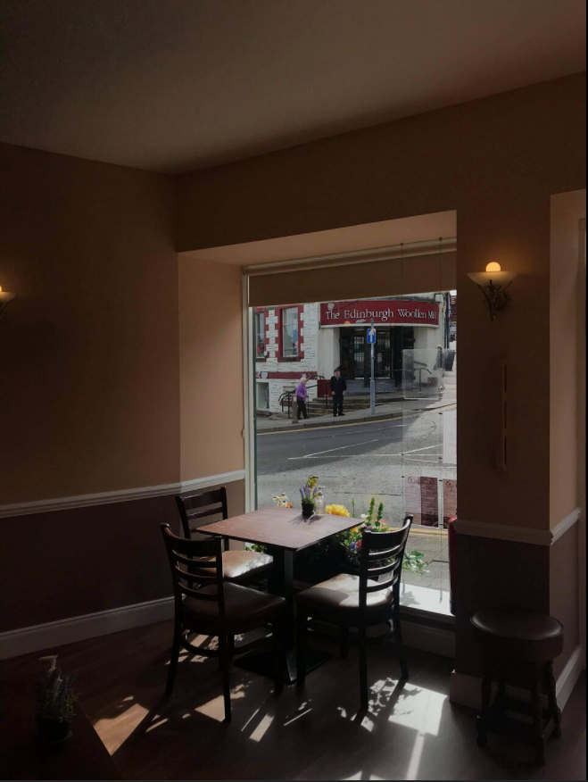

# Searchlight - IMINT

**Date:** 02, March, 2021

**Author:** Dhilip Sanjay S

---

## Fundamentals
- IMINT - Imagery Intelligence
- GEOINT - Geospatial Intelligence

## Welcome
### Did you understand the flag format?
- **Answer:** sl{ready}

---

## Your First Challenge
- Before using any tool or methodolody for finding the location of the image, scan the image with your eyes.
    - Extracting the key data points will help you to apply the right tool:
        - Google Search
        - EXIF tool
- Five elements of IMINT
    - Context
    - Foreground
    - Background
    - Map markings
    - Trial and error
- Look for signs such as:
    - Location (Street name, Storefront signs)
    - Determine the country or region (based on which side of road they drive, language or architectural characteristics)
    - Unique landmarks, building, bridges, statues or mountains.

### What is the name of the street where this image was taken?
- **Answer:** sl{carnaby street}

---

## Just Google it!
- Use google dorking or reverse image search

### Which city is the tube station located in?
- **Answer:** sl{London}

### Which tube station do these stairs lead to?
- **Answer:** sl{Piccadilly Circus}

### Which year did this station open?
- **Answer:** sl{1906}

### How many platforms are there in this station?
- **Answer:** sl{4}

---

## Keep at it!

### Which building is this photo taken in?
- **Answer:** sl{VANCOUVER INTERNATIONAL AIRPORT}
- **Clue:** `yvr.ca`

### Which country is this building located in?
- **Answer:** sl{Canada}

### Which city is this building located in?
- **Answer:** sl{Richmond}

---

## Coffee and a light lunch

### Which city is this coffee shop located in?
- **Answer:** sl{Blairgowrie}
- **Clue:** https://www.dailyrecord.co.uk/in-your-area/jobs-fear-perthshires-edinburgh-woollen-22870964

### Which street is this coffee shop located in?
- **Answer:** sl{allan street}
- **Steps to Reproduce:** Google Maps

### What is their phone number?
- **Answer:** sl{+447878 839128}

### What is their email address?
- **Answer:** sl{theweecoffeeshop@aol.com}

### What is the surname of the owners?
- **Answer:** sl{Cochrane}
- **Clue:** https://www.barba.org.uk/blairgowrie-and-rattray-businesses/the-wee-coffee-shop

---

## Reverse your thinking

