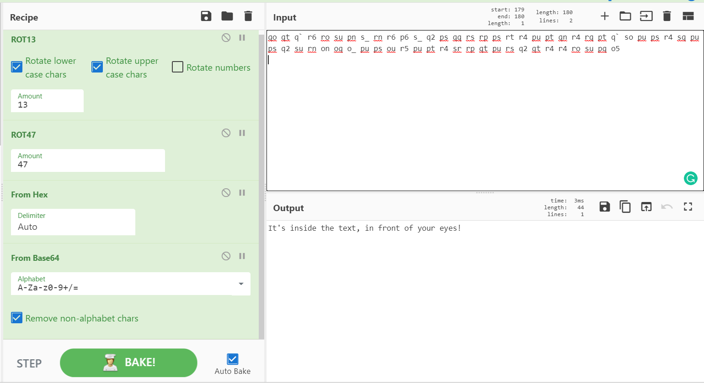
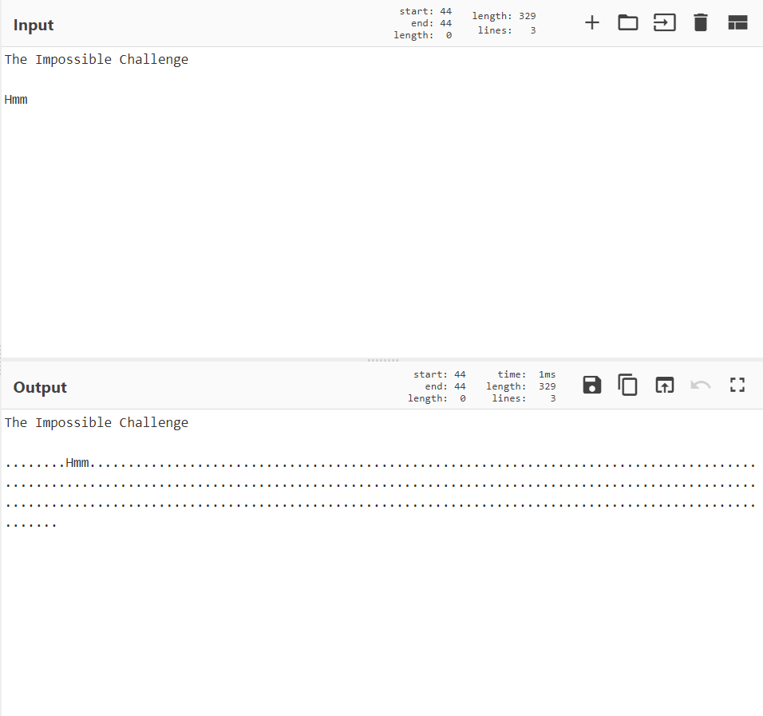
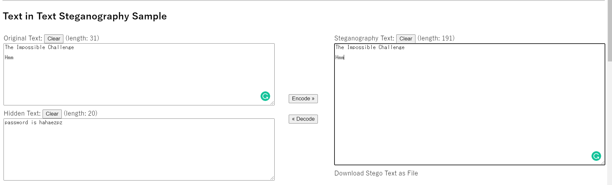

# The Impossible Challenge

**Date:** 21, June, 2021

**Author:** Dhilip Sanjay S

---

- We need a password to access the flag inside the zip file.
- So the password must be hidden. May be in that encoded text!
- **P.S:** Bruteforcing the password didn't work

## Decoding 

- Decode the text using Cyberchef:

```bash
qo qt q` r6 ro su pn s_ rn r6 p6 s_ q2 ps qq rs rp ps rt r4 pu pt qn r4 rq pt q` so pu ps r4 sq pu ps q2 su rn on oq o_ pu ps ou r5 pu pt r4 sr rp qt pu rs q2 qt r4 r4 ro su pq o5
```




- So, what's infront of our eyes???

## Zero Width Characters

- On pasting the title of the challenge in Cyberchef, we find some dotted characters. Those are called as **zero width characters**




- [Zero width Non-joiner](https://en.wikipedia.org/wiki/Zero-width_non-joiner)
- [Zero width Space](https://en.wikipedia.org/wiki/Zero-width_space)

### Zero width Identifiers
- Cyberchef
- Grammarly will underline the words even though if they have the right spelling!! (Because of those hidden characters)

### Zero width tools
- [Steganographr](https://neatnik.net/steganographr/)
- [Unicode Steganography](https://330k.github.io/misc_tools/unicode_steganography.html)
- [Zero width Fingerprinting](https://github.com/vedhavyas/zwfp)


## Flag



- Use the password to extract the zip:

```bash
$ unzip Impossible.zip 
Archive:  Impossible.zip
[Impossible.zip] flag.txt password: 
  inflating: flag.txt                
$ cat flag.txt 
You have solved the Impossible Challenge! Here is your flag THM{REDACTED}
```


---

## References
- [Null Byte Article](https://null-byte.wonderhowto.com/how-to/use-zero-width-characters-hide-secret-messages-text-even-reveal-leaks-0198692/)
