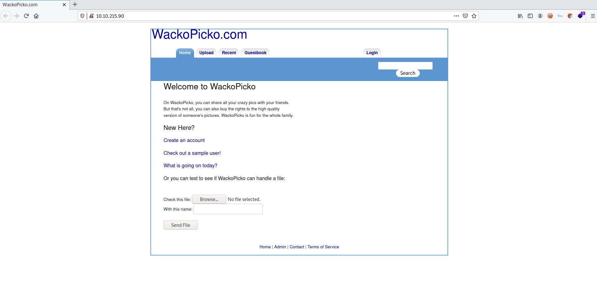
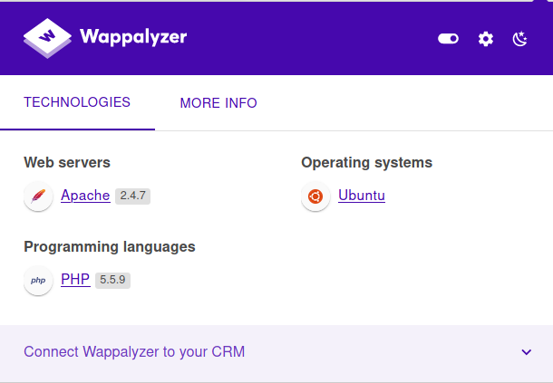
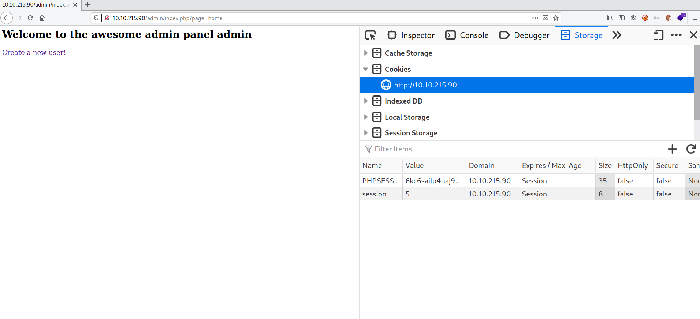
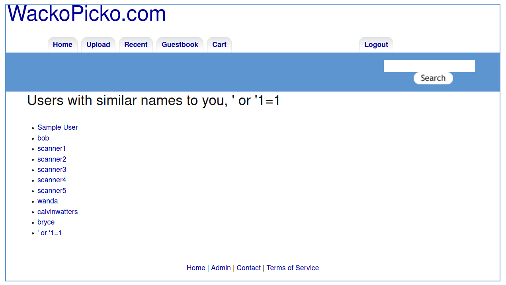

# WebAppSec 101

**Date:** 11, August, 2021

**Author:** Dhilip Sanjay S

---

[Click Here](https://tryhackme.com/room/webappsec101) to go to the TryHackMe room.

## Walking through the application



### Nmap 

```bash
$ nmap 10.10.215.90 -sC -sV -p- -oN nmap.out
Starting Nmap 7.91 ( https://nmap.org ) at 2021-08-11 11:21 IST
Nmap scan report for 10.10.215.90
Host is up (0.15s latency).
Not shown: 65531 closed ports
PORT      STATE SERVICE VERSION
22/tcp    open  ssh     OpenSSH 7.4 (protocol 2.0)
| ssh-hostkey: 
|   2048 95:21:1e:34:79:cd:23:1d:3b:57:75:59:c1:42:de:3b (RSA)
|   256 85:f8:4c:be:3d:50:d9:c0:96:87:bc:2a:5b:7d:8f:28 (ECDSA)
|_  256 ab:d3:11:21:54:fb:9b:04:e4:de:dc:f8:f4:de:b8:d7 (ED25519)
80/tcp    open  http    Apache httpd 2.4.7 ((Ubuntu))
| http-cookie-flags: 
|   /: 
|     PHPSESSID: 
|_      httponly flag not set
|_http-server-header: Apache/2.4.7 (Ubuntu)
|_http-title: WackoPicko.com
111/tcp   open  rpcbind 2-4 (RPC #100000)
| rpcinfo: 
|   program version    port/proto  service
|   100000  2,3,4        111/tcp   rpcbind
|   100000  2,3,4        111/udp   rpcbind
|   100000  3,4          111/tcp6  rpcbind
|   100000  3,4          111/udp6  rpcbind
|   100024  1          41477/tcp6  status
|   100024  1          42575/udp   status
|   100024  1          45015/tcp   status
|_  100024  1          47764/udp6  status
45015/tcp open  status  1 (RPC #100024)
```



### What version of Apache is being used?
- **Answer:** 2.4.7

### What language was used to create the website?
- **Answer:** PHP

### What version of this language is used? 
- **Answer:** 5.5.9

---

## Establishing a methodology

- Two wasy to test a wb application:
    1. Going through every page and testing all the functionality
    2. Breaking down the testing into different stages like:
        1. Authorization
        2. Authentication 
        3. Injection
        4. Client Side controls
        5. Application Logic

### Gobuster

```bash
$ gobuster dir -u http://10.10.215.90/ -w /usr/share/seclists/Discovery/Web-Content/directory-list-2.3-medium.txt | tee gobuster.out 
===============================================================
Gobuster v3.1.0
by OJ Reeves (@TheColonial) & Christian Mehlmauer (@firefart)
===============================================================
[+] Url:                     http://10.10.215.90/
[+] Method:                  GET
[+] Threads:                 10
[+] Wordlist:                /usr/share/seclists/Discovery/Web-Content/directory-list-2.3-medium.txt
[+] Negative Status codes:   404
[+] User Agent:              gobuster/3.1.0
[+] Timeout:                 10s
===============================================================
2021/08/11 11:32:18 Starting gobuster in directory enumeration mode
===============================================================
/images               (Status: 301) [Size: 312] [--> http://10.10.215.90/images/]
/comments             (Status: 301) [Size: 314] [--> http://10.10.215.90/comments/]
/users                (Status: 301) [Size: 311] [--> http://10.10.215.90/users/]   
/admin                (Status: 301) [Size: 311] [--> http://10.10.215.90/admin/]   
/upload               (Status: 301) [Size: 312] [--> http://10.10.215.90/upload/]  
/cart                 (Status: 301) [Size: 310] [--> http://10.10.215.90/cart/]    
/pictures             (Status: 301) [Size: 314] [--> http://10.10.215.90/pictures/]
/css                  (Status: 301) [Size: 309] [--> http://10.10.215.90/css/]     
/action               (Status: 200) [Size: 80668]                                  
/include              (Status: 500) [Size: 609]                                    
/server-status        (Status: 403) [Size: 292]
```

---

## Authentication

- Authentication can be tested in the following ways:
    1. **Brute Forcing/Weak Credentials**
    2. **Session Management**



### What is the admin username?
- **Answer:** admin

### What is the admin password?
- **Answer:** admin

### What is the name of the cookie that can be manipulated?
- **Answer:** session

### What is the username of a logged on user?
- **Answer:** bryce

```bash
wfuzz -u http://10.10.215.90/users/login.php -d "username=FUZZ&password=FUZZ" --hs "invalid" -t 20 -w /usr/share/seclists/Usernames/Names/names.txt
 
********************************************************
* Wfuzz 3.1.0 - The Web Fuzzer                         *
********************************************************

Target: http://10.10.215.90/users/login.php
Total requests: 10177

=====================================================================
ID           Response   Lines    Word       Chars       Payload                                                                         
=====================================================================

000001214:   303        0 L      0 W        0 Ch        "bob - bob"                                                                     
000001389:   303        0 L      0 W        0 Ch        "bryce - bryce"
[..snip..] 
```

### What is the corresponding password to the username?
- **Answer:** bryce

---

## XSS

- Types of XSS:
    - **Persistent/Non-Reflected** - Here the XSS payload has been stored in the database, and once the server/framework passes the data from the database into the webpage, the script/payload is executed
    -** Non-Persistent/Reflected** - Here the XSS payload is usually crafted using a malicious link. It is not stored. 

- Test for XSS on the search bar - `<script>alert(1)</script>` (Non Persistent)
- Test for XSS on the guestbook page - `<script>alert(1)</script>` (Persistent)
- Test for XSS behind the flash form on the home page

---

## Injection

- Common injection attacks include:
    1. SQL injection
    2. Command Injection

### Perform command injection on the check password field
- Entering a simple payload gives the error:

```html
The command "grep ^whomai$ /etc/dictionaries-common/words" was used to check if the password was in the dictionary.
whomai is a Bad Password 
```

- Use the payload `hi| rm -f ` to remove the `/etc/dictionaries-common/words` file from the server.
- This will disrupt the working of `passcheck.php`

### Check for SQLi on the application
- Register a user with username as `' or  '1=1`



---

## Misc & Logic Flaws

- Parameter Manipulation
    - In sample.php - `http://10.10.116.46/users/sample.php?userid=2`, change the userid parameter

- Directory Traversal
    - In `upload.php` page, use `../` in the tag field. 

- Forceful Browsing
    - Use gobuster to find hidden URLs.

- Logic flaw - try get an item for free.
    - Reuse the coupon - `SUPERYOU21`
    - The price will eventually reach zero

---