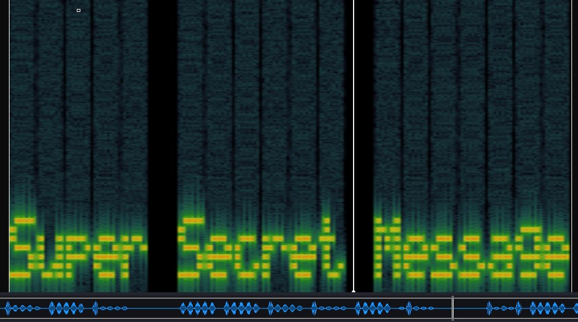

# c4ptur3-th3-fl4g

**Date:** 07, June, 2021

**Author:** Dhilip Sanjay S

---

[Click Here](https://tryhackme.com/room/c4ptur3th3fl4g) to go to the TryHackMe room.

## Translation & Shifting

### c4n y0u c4p7u23 7h3 f149?
- **Answer:** can you capture the flag?

### Binary to character
- **Answer:** lets try some binary out!

```py
>>> binary = '01101100 01100101 01110100 01110011 00100000 01110100 01110010 01111001 00100000 01110011 01101111 01101101 01100101 00100000 01100010 01101001 01101110 01100001 01110010 01111001 00100000 01101111 01110101 01110100 00100001'.split()
>>> [chr(int(x, 2)) for x in binary]
['l', 'e', 't', 's', ' ', 't', 'r', 'y', ' ', 's', 'o', 'm', 'e', ' ', 'b', 'i', 'n', 'a', 'r', 'y', ' ', 'o', 'u', 't', '!']
>>> ans = ''
>>> ans.join([chr(int(x, 2)) for x in binary])
'lets try some binary out!'
```

### Base32
- **Answer:** base32 is super common in CTF's
- **Steps to Reproduce:** 

```bash
$ echo MJQXGZJTGIQGS4ZAON2XAZLSEBRW63LNN5XCA2LOEBBVIRRHOM====== | base32 -d 
base32 is super common in CTF's
```

### Base64
- **Answer:** Each Base64 digit represents exactly 6 bits of data.
- **Steps to Reproduce:** 

```py
>>> b64decode('RWFjaCBCYXNlNjQgZGlnaXQgcmVwcmVzZW50cyBleGFjdGx5IDYgYml0cyBvZiBkYXRhLg==')
'Each Base64 digit represents exactly 6 bits of data.'
```

### Hexadecimal
- **Answer:** hexadecimal or base16?
- **Steps to Reproduce:** 

```bash
$ echo 68 65 78 61 64 65 63 69 6d 61 6c 20 6f 72 20 62 61 73 65 31 36 3f | xxd -r -p
hexadecimal or base16?
```

### ROT 13
- **Answer:** Rotate me 13 places!
- **Steps to Reproduce:** Use ROT - 13 decoder

```
Ebgngr zr 13 cynprf!
Rotate me 13 places!
```

### ROT 47
- **Answer:** You spin me right round baby right round (47 times)

```
*@F DA:? >6 C:89E C@F?5 323J C:89E C@F?5 Wcf E:>6DX
You spin me right round baby right round (47 times)
```


### Morse Code
- **Answer:** TELECOMMUNICATION ENCODING

```bash
- . .-.. . -.-. --- -- -- ..- -. .. -.-. .- - .. --- -.
. -. -.-. --- -.. .. -. --.

TELECOMMUNICATION ENCODING
```

### Binary Coded Decimal
- **Answer:** Unpack this BCDss
- **Steps to Reproduce:** 

```py
>>> text = '85 110 112 97 99 107 32 116 104 105 115 32 66 67 68'.split()
>>> text
['85', '110', '112', '97', '99', '107', '32', '116', '104', '105', '115', '32', '66', '67', '68']
>>> ans = ""
>>> ans.join([chr(int(x)) for x in text])
'Unpack this BCD'
```

### Multiple encoding & translations
- **Answer:** Let's make this a bit trickier...
- **Steps to Reproduce:** 
    - From Base64
    - From Morse Code
    - From binary to ASCII
    - ROT47
    - From Decimal to ASCII

---

## Spectograms

- Use **sonic visualizer** to find the data:



---

## Steganography

### Decode the image to reveal the answer.
- **Answer:** SpaghettiSteg
- **Steps to Reproduce:** 

```bash
$ steghide extract -sf stegosteg.jpg 
Enter passphrase: 
wrote extracted data to "steganopayload2248.txt".
     
$ cat steganopayload2248.txt 
SpaghettiSteg
```


---

## Security through obscurity

### Download and get 'inside' the file. What is the first filename & extension?
- **Answer:** hackerchat.png
- **Steps to Reproduce:** 
    - Use stegoveritas

```bash
$ stegoveritas meme.jpg 

Running Module: SVImage
+------------------+------+
|   Image Format   | Mode |
+------------------+------+
| JPEG (ISO 10918) | RGB  |
+------------------+------+
Trailing Data Discovered... Saving
b'Rar!\x1a\x07\x01\x00\xe4\xa7\xad\xc9\x0b\x01\x05\x07\x00\x06\x01\x01\xf9\xab\x80\x00\xd8\xf0\xbfA*\x02\x0
[..snip..]
\xe9\x17\xe1\x7f\x15d\x9a\xc6\x87\x16\x89d\xfa\xf0\x9a\xb9i\xfc\xd5a\x9aL\xd3\x982$Es\xd3\xffDn\x1a\x1f\x04\xd3\x9ai\x1aS\x86i2Mc\xca\xf0\x7f\xc5y\xf5\xcaj\x87\x00q\x00\x00\x00\x00IEND\xaeB`\x82"AHH_YOU_FOUND_ME!" \r\n\xa9\\\x8d?\x0e\x03\x06\xb8\x00\x00\xb8\x00\x00\x80\x00\x00\x02QO\xed\x1c\x96y3\x00\xe9+/\xd8\xf0\xbfA*\x02\x03\x0b\xba+\x04\xba+ \xe3\xf6\xb1\r\x80\x00\x00\x0ehackerchat.png\n\x03\x02\x98\x81\x1eU\xfd\x14\xd5\x01\x1dwVQ\x03\x05\x04\x00'
Found something worth keeping!
zlib compressed data
Found something worth keeping!
MPEG ADTS, layer III, v1, 224 kbps, Stereo

Running Module: MultiHandler

XMPP
====
+--------------------+-------+
|        key         | value |
+--------------------+-------+
| 'tiff:Orientation' |  '1'  |
+--------------------+-------+
Exif
====
+---------------------+-------------------------------------------------------+
| key                 | value                                                 |
+---------------------+-------------------------------------------------------+
| SourceFile          | meme.jpg                                              |
| ExifToolVersion     | 12.16                                                 |
| FileName            | meme.jpg                                              |
| Directory           | /                                                     |
| FileSize            | 78 KiB                                                |
| FileModifyDate      | 2021:06:07 12:35:44+05:30                             |
| FileAccessDate      | 2021:06:07 12:36:01+05:30                             |
| FileInodeChangeDate | 2021:06:07 12:35:55+05:30                             |
| FilePermissions     | rwxrwx---                                             |
| FileType            | JPEG                                                  |
| FileTypeExtension   | jpg                                                   |
| MIMEType            | image/jpeg                                            |
| JFIFVersion         | 1.01                                                  |
| ResolutionUnit      | inches                                                |
| XResolution         | 72                                                    |
| YResolution         | 72                                                    |
| ExifByteOrder       | Big-endian (Motorola, MM)                             |
| Orientation         | Horizontal (normal)                                   |
| ImageWidth          | 492                                                   |
| ImageHeight         | 471                                                   |
| EncodingProcess     | Baseline DCT, Huffman coding                          |
| BitsPerSample       | 8                                                     |
| ColorComponents     | 3                                                     |
| YCbCrSubSampling    | YCbCr4:2:0 (2 2)                                      |
| ImageSize           | 492x471                                               |
| Megapixels          | 0.232                                                 |
+---------------------+-------------------------------------------------------+
Found something worth keeping!
JPEG image data, JFIF standard 1.01, resolution (DPI), density 72x72, segment length 16, Exif Standard: [TIFF image data, big-endian, direntries=1, orientation=upper-left], baseline, precision 8, 492x471, components 3
+---------+------------------+-------------------------------------------+----------------+
| Offset  | Carved/Extracted | Description                               | File Name      |
+---------+------------------+-------------------------------------------+----------------+
| 0x122a7 | Carved           | RAR archive data, version 5.x             | 122A7.rar      |
| 0x122a7 | Extracted        | RAR archive data, version 5.x             | hackerchat.png |
| 0x12385 | Carved           | Zlib compressed data, default compression | 12385.zlib     |
| 0x12385 | Extracted        | Zlib compressed data, default compression | 12385          |
+---------+------------------+-------------------------------------------+----------------+
```

### Get inside the archive and inspect the file carefully. Find the hidden text.
- **Answer:** AHH_YOU_FOUND_ME!
- **Steps to Reproduce:** 
    - Use zsteg:

```bash
$ zsteg hackerchat.png 
[?] 22 bytes of extra data after image end (IEND), offset = 0x15a4
extradata:0         .. text: "\"AHH_YOU_FOUND_ME!\" \r\n"
meta Software       .. text: "gnome-screenshot"
meta Creation Time  .. text: "Wed 15 May 2019 09:09:10 PM CDT"
```

---