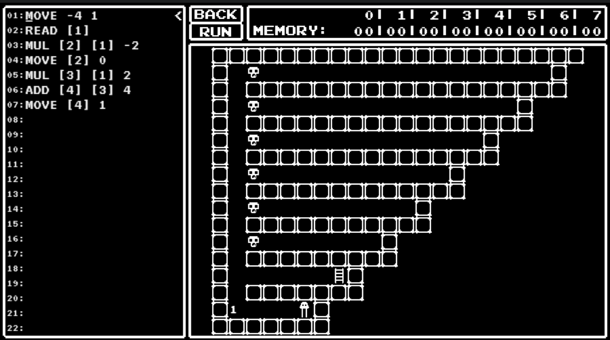

# Small Maniac's Game

**Date:** 05, June, 2021

**Author:** Dhilip Sanjay S

**Category:** Miscellaneous

---
- A game that zh3r0 guys asked for 😥
- **Note:** Solve all the levels and then click submit the solution button and wait for 40 seconds to get the flag.
- [Man Page](https://del.dog/asm-hell.txt)

```
Command	Description
MOVE A1 A2	A1 is the amount of steps (can be negative), A2 is the direction (0 for vertical, 1 for horizontal)
WAIT A1	A1 is the amount of cycles to wait
UNLOCK A1	A1 is the key
READ M1	M1 stores the result of tile read instruction
ADD M1 A1 A2	M1 stores the result of A1 + A2
SUB M1 A1 A2	M1 stores the result of A1 - A2
MUL M1 A1 A2	M1 stores the result of A1 * A2
JMP A1	A1 line in code to be jumped to
JMPZ A1 A2	jump to line A1 if A2 is zero
JMPN A1 A2	jump to line A1 if A2 is negative
CMP M1 A1 A2	M1 stores the result of A1 > A2 (B); A1 > A2: 1, A1 = A2: 0, A1 < A2: -1
```

## Level 0

- Get to the ladder as fast as you can.
- Cry. Debug. Suceed


---

## Level 1

- Practice. It's all about direction


---

## Level 2

- Sometimes your goal is locked behind a door.
- **Warning:** each door gives you only one attempt to unlocking it. Brute force will result in CPU halt.


---

## Level 3

- After you've loaded some values into registers you can do arithmetic operations on them, such as ADD, SUB, MUL.


---

## Level 4

- Sometimes you can't script everything. Use the instruction `JMP A1` to automate your walk.  


---

## Level 5

- Remember, to get a memory value from a register use eg. [4]



---

## Level 6

- It's time for branching!


---

## Level 7

- Elementary arithmetics..
- Take a,b,c clockwise starting from 9'o clock.


---

## Level 8

- You must have noticed that division was missing. Implement it.


---

## Level 9

- Ever heard of function calls?
- Try to be spacially modest with your code.


---

## Level 10

- The number just before the door indicates which loaded value to use.
- This calls for double dereference: `[[2]]`


---

## Level 11

- Every step you make increments the seventh register. 
- The key in this layer is the amount of steps till you hit a wall.


---

## Level 12

- This is it: the last layer, the greatest challenge.

- Basic idea:

```
- From 2 to INPUT-1:
    - Compare if any of the multiples of the number is equal to the INPUT
    - If the comparision value is zero, then NOT PRIME
    - Goto next number
- Finally if none of the comparisions succeeded -> then the INPUT is PRIME

P.S: Usually the for loop's range would be from 2 to SQRT(INPUT) [Less time complexity]. But it would have been difficult to implement SQRT in asm. And also there was no limit on time complexity!
```


---

## Flag

